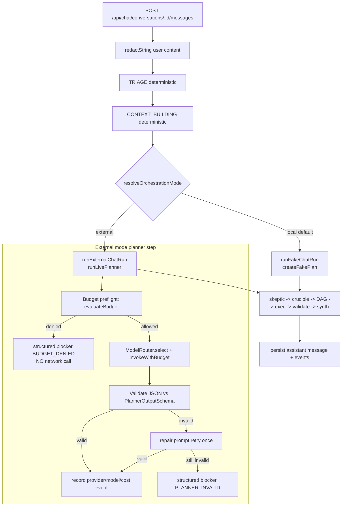
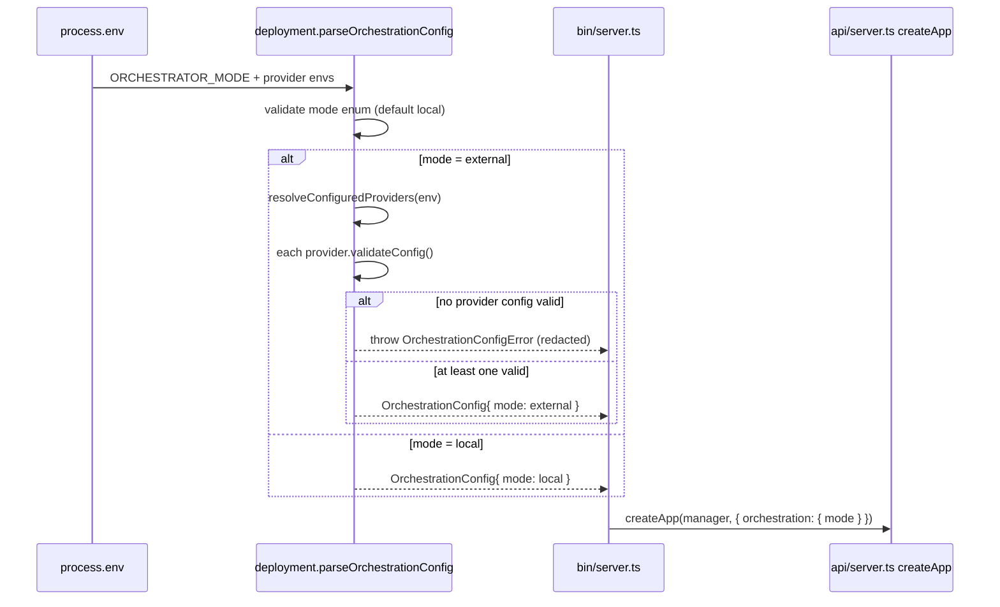
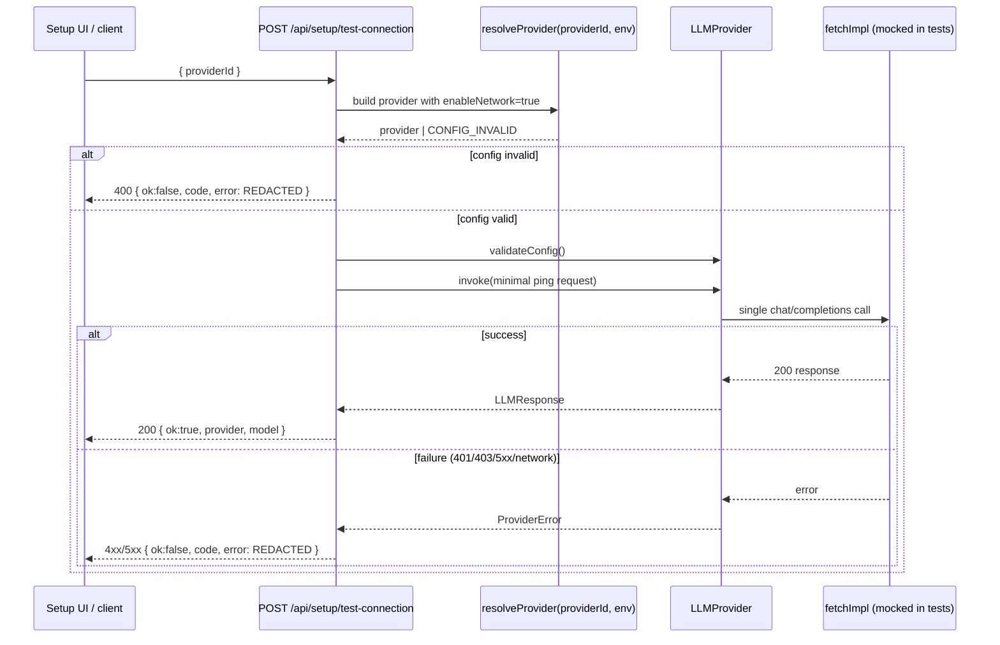

# Design Document: BYOK Alpha Phase 1 (ORN-31 → ORN-34)

## Overview

Rector's chat pipeline is currently a deterministic, provider-free brainstem: every run flows
through triage → context → planner → skeptic → crucible → DAG → executor → validation/healing →
synthesis using fake/local adapters, with zero network and zero cost. BYOK Alpha Phase 1 makes
this pipeline capable of using a real Bring-Your-Own-Key provider for the **PLANNING** phase only,
while keeping the existing provider-free local path as the **default** and as the regression
baseline that `npm test` exercises with no credentials.

The design introduces a single orchestration mode switch (`ORCHESTRATOR_MODE=local|external`), a
provider connection-test endpoint, a mode-aware chat runner that wraps the existing
`createFakeChatRun` logic, and a live planner agent that prompts a configured provider, validates
the returned JSON against the existing `PlannerOutputSchema`, retries once with a repair prompt on
malformed JSON, and otherwise emits a structured run failure/blocker. It builds entirely on the
existing primitives — `buildModelRouter`/`invokeWithBudget` in `src/providers/llm.ts`,
`evaluateBudget` in `src/security/budget.ts`, `redactSecrets`/`redactString` in
`src/security/redaction.ts`, the Zod planner schemas in `src/orchestration/planner.ts`, and the
run state machine — so no new fake systems, cloud dependencies, or schema rewrites are added.

The hard product constraint that shapes every decision: **the symbolic control plane stays in
charge.** The LLM only proposes a plan; Rector validates it, budgets it before any network call,
redacts everything that enters an event/trace/response, and refuses malformed or unsafe output
deterministically rather than crashing.

---

## Architecture

### Mode-aware chat pipeline

The chat endpoint keeps its current structure (persist message → triage → context → run the
brainstem → synthesize). The only structural change is that the single hard-coded call to
`createFakeChatRun` becomes a dispatch through a mode-aware runner. Local mode is byte-for-byte the
current path. External mode swaps only the **planner step** for a live provider-backed planner and
records provider/model/cost metadata in the run events; every other phase (skeptic, crucible, DAG,
executor, validation, synthesis) remains deterministic in Phase 1.



### Configuration and startup validation flow (ORN-31)

`ORCHESTRATOR_MODE` is parsed and validated as part of deployment config. `local` is the default
and requires nothing. `external` requires that at least one supported provider's config validates
(via the provider's existing `validateConfig()`), otherwise startup and the chat path fail with a
clear, redacted setup error.



### Connection test flow (ORN-32)



---

## Components and Interfaces

### Component 1: Orchestration mode config (ORN-31)

**Location**: `src/deployment/index.ts` (parse/validate), consumed by `src/bin/server.ts` and
`src/api/server.ts`. `src/setupChecklist.ts` gains a descriptive `ORCHESTRATOR_MODE` item.

**Purpose**: Single source of truth for whether the chat pipeline runs in `local` (default,
provider-free) or `external` (BYOK) mode, plus the safe list of providers configured for external
mode.

**Interface**:

```typescript
export const ORCHESTRATOR_MODES = ["local", "external"] as const;
export const OrchestratorModeSchema = z.enum(ORCHESTRATOR_MODES);
export type OrchestratorMode = z.infer<typeof OrchestratorModeSchema>;

export interface OrchestrationConfig {
  mode: OrchestratorMode;
  // Provider ids whose config validated for external mode (e.g. ["together", "azure-openai"]).
  // Empty in local mode.
  configuredProviders: string[];
}

// Parses ORCHESTRATOR_MODE (default "local"). In external mode, verifies at least one supported
// provider's validateConfig() passes; otherwise throws OrchestrationConfigError with a redacted,
// human-readable setup message. NEVER performs network I/O.
export function parseOrchestrationConfig(
  env?: Record<string, string | undefined>
): OrchestrationConfig;

export class OrchestrationConfigError extends Error {
  readonly code: "ORCHESTRATOR_MODE_INVALID" | "EXTERNAL_MODE_NO_PROVIDER";
  readonly setupHint: string; // redacted, safe to log/show
}
```

**Responsibilities**:
- Default to `local` when the variable is unset, empty, or whitespace.
- Reject unknown mode values with `ORCHESTRATOR_MODE_INVALID`.
- In `external` mode, collect providers whose `validateConfig()` succeeds; if none, throw
  `EXTERNAL_MODE_NO_PROVIDER` with a setup hint listing required env **key names** (never values).
- Run zero network calls (pure config + `validateConfig()`).

### Component 2: Connection test endpoint (ORN-32)

**Location**: `src/api/server.ts` route `POST /api/setup/test-connection`; provider resolution
helper alongside `buildModelRouter` (reusing `src/providers/llm.ts`).

**Purpose**: Let an operator verify a single provider's credentials by running one minimal ping
through the existing provider abstraction. This is the only place in Phase 1 where `enableNetwork`
is intentionally true outside the chat runner.

**Interface**:

```typescript
export const TestConnectionRequestSchema = z.object({
  providerId: z.string().min(1), // "together" | "cloudflare" | "azure-openai" | "perplexity"
});
export type TestConnectionRequest = z.infer<typeof TestConnectionRequestSchema>;

export const TestConnectionResponseSchema = z.object({
  ok: z.boolean(),
  providerId: z.string().min(1),
  model: z.string().optional(),     // present only on success
  code: z.string().optional(),      // ProviderErrorCode on failure
  error: z.string().optional(),     // redacted message on failure
  networkAttempted: z.boolean(),    // false when config invalid blocks before any call
});
export type TestConnectionResponse = z.infer<typeof TestConnectionResponseSchema>;

// Pure function so it is unit-testable with an injected fetch double.
export async function runConnectionTest(input: {
  providerId: string;
  env: Record<string, string | undefined>;
  fetchImpl: typeof fetch;
}): Promise<TestConnectionResponse>;
```

**Responsibilities**:
- Validate the request body with Zod; reject unknown/unsupported `providerId` with a 400.
- Build exactly one provider instance with `enableNetwork: true` and the injected `fetchImpl`.
- Call `validateConfig()` first; on `CONFIG_INVALID`, return `ok:false`, `networkAttempted:false`.
- Otherwise `invoke()` a minimal ping (1 short system+user message, small `maxOutputTokens`).
- Map any thrown `ProviderError`/exception to a safe response; **run every outgoing message
  through `redactString`** before returning.
- Never include the API key, Authorization header, or raw provider body in the response.

### Component 3: Mode-aware chat runner (ORN-33)

**Location**: `src/api/server.ts` (or extracted to `src/orchestration/chatRunner.ts` for
testability). Refactors the existing `createFakeChatRun` into a dispatcher plus two concrete
runners that share all non-planner phases.

**Purpose**: Route a chat run to the deterministic local path or the external path. The external
path differs from local **only** in the planner step and in the cost/provider metadata recorded.

**Interface**:

```typescript
export interface ChatRunnerDeps {
  mode: OrchestratorMode;
  router?: ModelRouter;          // injected; built once per app in external mode
  enableNetwork?: boolean;       // true only in external mode; tests inject mocked router
  now?: () => string;
}

export interface ChatRunResult {
  run: Run;
  synthesis: BrainstemSynthesis;
  observabilitySummary: ObservabilitySummary;
}

// Dispatches by mode. Local => existing deterministic run (unchanged outputs).
export async function runChat(
  store: InMemoryRectorStore,
  args: ChatRunArgs,        // conversationId, userMessageId, prompt, triage, contextPack, ...
  deps: ChatRunnerDeps
): Promise<ChatRunResult>;
```

**Responsibilities**:
- In `local` mode, produce results identical to today's `createFakeChatRun` (same phases, same
  budget of all-zeros, `createFakePlan`).
- In `external` mode, set a real (configurable) budget, run **budget preflight before any provider
  call**, obtain the plan via the live planner, and record provider/model/cost metadata on the
  `PLANNING` event and the run's `costEstimate`/`actualCost`/`tokenEstimate`/`actualTokens`.
- Keep skeptic/crucible/DAG/executor/validation/synthesis deterministic and shared.
- On a planner blocker (budget denial or invalid JSON after repair), transition the run to
  `NEEDS_DECISION` or `FAILED` via the existing run state machine — never throw past the route
  handler, never crash.

### Component 4: Live planner agent (ORN-34)

**Location**: `src/orchestration/planner.ts` (add `runLivePlanner`, keep `createFakePlan`); prompt
construction in a new `src/orchestration/prompts.ts`.

**Purpose**: Use a provider to generate a plan that conforms to the existing `PlannerOutputSchema`,
with deterministic validation, a single repair retry, and a structured blocker on persistent
failure.

**Interface**:

```typescript
export type LivePlannerStatus = "ok" | "blocked";

export interface LivePlannerResult {
  status: LivePlannerStatus;
  plan?: PlannerOutput;                 // present when status === "ok"
  blocker?: PlannerBlocker;             // present when status === "blocked"
  usage: LLMUsage;                      // accumulated across attempts (cost/tokens/calls)
  provider: string;
  model: string;
  attempts: number;                     // 1 or 2
}

export interface PlannerBlocker {
  code: "BUDGET_DENIED" | "PLANNER_INVALID" | "PROVIDER_ERROR";
  message: string;                      // redacted, human-readable
  details?: unknown;                    // redacted (e.g., Zod issue paths, never raw secrets)
}

export interface LivePlannerDeps {
  provider: LLMProvider;                // selected by ModelRouter; mocked in tests
  run: Run;                             // carries the budget for preflight
  buildPrompt?: typeof buildPlannerPrompt;
  buildRepairPrompt?: typeof buildPlannerRepairPrompt;
}

export async function runLivePlanner(
  input: PlannerInput,
  deps: LivePlannerDeps
): Promise<LivePlannerResult>;
```

**Responsibilities**:
- Validate `input` with `PlannerInputSchema` (reuse existing schema).
- Run budget preflight with `evaluateBudget`/`invokeWithBudget` **before** calling `provider.invoke`.
- Request `responseFormat: { type: "json_object" }` and parse the response content as JSON.
- Validate parsed JSON with `PlannerOutputSchema` **and** `validatePlannerOutput` (dependency +
  approval-gate invariants), so a live plan is held to the same safety bar as a fake plan.
- On malformed/invalid output, issue exactly one repair prompt that includes the validation error
  summary; re-validate. If still invalid, return a `PLANNER_INVALID` blocker.
- Accumulate `LLMUsage` across attempts for accurate cost/token recording.
- Redact the blocker `message`/`details` before returning.

---

## Data Models

Phase 1 adds **no new persisted top-level entities**. It records provider/model/cost metadata using
the existing `Run` estimate fields (`costEstimate`, `actualCost`, `tokenEstimate`, `actualTokens`)
and a typed payload on the `PLANNING` `RunEvent`. The existing `EstimateSchema` is
`z.record(z.unknown())`, so these are stored without schema changes; the design defines the
**shape** Phase 1 writes.

### Model 1: Provider call metadata (recorded on the PLANNING event)

```typescript
export const ProviderCallMetadataSchema = z.object({
  mode: OrchestratorModeSchema,          // "external" for live calls; "local" => omitted/none
  provider: z.string().min(1),           // e.g. "together"
  model: z.string().min(1),              // resolved model id
  modelRoute: ModelRouteSchema,          // "flagship" | "fast" | ...
  usage: LLMUsageSchema,                 // inputTokens, outputTokens, estimatedUsd, modelCalls
  attempts: z.number().int().min(1).max(2),
  repaired: z.boolean(),                 // true if a repair retry was used
});
export type ProviderCallMetadata = z.infer<typeof ProviderCallMetadataSchema>;
```

**Validation / invariant rules**:
- Recorded only in external mode. Local-mode events carry no provider metadata (or `provider:"fake"`
  with zero cost), preserving current event shapes.
- `usage.estimatedUsd` and token counts must be reflected into the run's
  `costEstimate.usd` / `tokenEstimate` so the cost dashboard (future phase) and budget see them.
- The whole payload passes through `redactSecrets` (already applied by `transitionRun` and
  `runEvent`) before persistence.

### Model 2: Run cost/budget fields used by external mode

```typescript
// From src/store/schemas.ts (existing) — Phase 1 populates these meaningfully in external mode:
//   costEstimate:  { usd, modelCalls?, runtimeMs?, provider? }
//   actualCost:    { usd, modelCalls?, runtimeMs?, provider? }
//   tokenEstimate: { input, output }
//   actualTokens:  { input, output }
//   budget: Budget  // maxUsd, maxModelCalls, allowedProviders, approvalRequiredAboveUsd, ...
```

**Validation / invariant rules**:
- In `local` mode the budget remains all-zeros and `provider`-free exactly as today.
- In `external` mode the budget must be non-trivial (`maxModelCalls >= 1`, `maxUsd > 0`) for a paid
  provider to be selected; otherwise `buildModelRouter` already falls back to the fake provider.
- `actualCost`/`actualTokens` are set from the accumulated `LLMUsage` after a successful live call.

### Model 3: Planner blocker (in-memory, surfaced via run failure event)

```typescript
export const PlannerBlockerSchema = z.object({
  code: z.enum(["BUDGET_DENIED", "PLANNER_INVALID", "PROVIDER_ERROR"]),
  message: z.string().min(1),
  details: z.unknown().optional(),
});
```

**Validation / invariant rules**:
- A blocker maps to a run transition: `BUDGET_DENIED`/`PROVIDER_ERROR` → `NEEDS_DECISION` (operator
  can adjust budget/keys), `PLANNER_INVALID` → `FAILED` (deterministic refusal of bad output).
- `message` and `details` are redacted; `details` for `PLANNER_INVALID` carries Zod issue
  **paths/messages**, never the raw model output or any header.

---

## Algorithmic Pseudocode

### Mode-aware dispatch (ORN-33)

```pascal
ALGORITHM runChat(store, args, deps)
INPUT: store, args (conversationId, userMessageId, prompt, triage, contextPack, observability), deps
OUTPUT: ChatRunResult

BEGIN
  ASSERT deps.mode IN {"local", "external"}

  IF deps.mode = "local" THEN
    RETURN runFakeChatRun(store, args)        // unchanged existing deterministic path
  END IF

  // external mode
  router  ← deps.router                        // built once at app init from env
  RETURN runExternalChatRun(store, args, router, deps.enableNetwork)
END
```

### External chat run with budget preflight (ORN-33 + ORN-34)

```pascal
ALGORITHM runExternalChatRun(store, args, router, enableNetwork)
PRECONDITION: orchestration mode is "external" and >= 1 provider config validated at startup
POSTCONDITION: a Run exists; on any planner failure the Run is in a terminal/decision phase,
               never an unhandled exception; no provider metadata contains secrets

BEGIN
  run ← store.createRun({ ...externalBudget, phase: "CHAT_RECEIVED", traceId })
  appendEvent(run, "RUN_CREATED", "CHAT_RECEIVED", redactedPromptPreview)

  // Select provider deterministically; budget=0 or no provider => fake fallback (still safe).
  selection ← router.select({ capability: "flagship", task: "planner", run })

  // --- PLANNER STEP (only divergence from local) ---
  plannerResult ← runLivePlanner({ triage, contextPack, messageContent: prompt },
                                  { provider: selection.provider, run })

  IF plannerResult.status = "blocked" THEN
    IF plannerResult.blocker.code = "PLANNER_INVALID" THEN
      transitionRun(store, run.id, "FAILED",
                    { lastError: plannerResult.blocker.message,
                      payload: { blocker: plannerResult.blocker } })
    ELSE
      createDecisionRequest(store, run.id,
                    { reason: plannerResult.blocker.code,
                      message: plannerResult.blocker.message })
    END IF
    RETURN structuredBlockerResult(run, plannerResult.blocker)   // no crash
  END IF

  plannerOutput ← plannerResult.plan
  recordProviderCostMetadata(store, run, plannerResult)          // cost/tokens/provider/model

  // --- Remaining phases are deterministic and shared with local mode ---
  skepticReview   ← reviewPlanWithSkeptic(plannerOutput, contextPack)
  crucibleDecision← arbitratePlanWithCrucible({ plannerOutput, skepticReview })
  ... DAG_COMPILATION → EXECUTING → VALIDATING → SYNTHESIZING → DONE  // unchanged

  RETURN { run, synthesis, observabilitySummary }
END
```

### Live planner with single repair retry (ORN-34)

```pascal
ALGORITHM runLivePlanner(input, deps)
INPUT: input (PlannerInput), deps (provider, run, buildPrompt, buildRepairPrompt)
OUTPUT: LivePlannerResult
PRECONDITION: input parses against PlannerInputSchema
POSTCONDITION: returns status "ok" with a schema-valid plan, OR status "blocked" with a
               redacted blocker; performs at most 2 provider calls; performs budget preflight
               BEFORE any provider call

BEGIN
  PlannerInputSchema.parse(input)
  totalUsage ← zeroUsage
  messages ← buildPlannerPrompt(input)           // system rules + JSON contract + context

  FOR attempt IN [1, 2] DO
    request ← { messages, modelRoute: "flagship",
                responseFormat: { type: "json_object" }, task: "planner" }

    // BUDGET PREFLIGHT — must precede provider.invoke / any network call
    estimate ← deps.provider.estimateRequest(request)
    decision ← evaluateBudget(deps.run, providerBudgetUsage(estimate, totalUsage))
    IF decision.status ≠ "allowed" THEN
      RETURN blocked("BUDGET_DENIED", redact(decision.reasons.join("; ")), totalUsage, attempt-1)
    END IF

    TRY
      response ← AWAIT invokeWithBudget(deps.provider, request, deps.run)  // double-gated
    CATCH ProviderError e
      RETURN blocked("PROVIDER_ERROR", redact(e.message), totalUsage, attempt)
    END TRY

    totalUsage ← addUsage(totalUsage, response.usage)
    parsed ← tryParseJson(response.content)

    IF parsed.ok THEN
      validation ← safeValidatePlannerOutput(parsed.value)  // schema + dependency/gate invariants
      IF validation.ok THEN
        RETURN ok(validation.plan, deps.provider, response.model, totalUsage, attempt)
      END IF
      errorSummary ← validation.errorSummary
    ELSE
      errorSummary ← "Response was not valid JSON: " + parsed.error
    END IF

    IF attempt = 1 THEN
      messages ← buildPlannerRepairPrompt(input, response.content, errorSummary)
      CONTINUE                                   // exactly one repair attempt
    END IF
  END FOR

  RETURN blocked("PLANNER_INVALID", redact("Planner output invalid after repair: " + errorSummary),
                 totalUsage, 2)
END
```

**Preconditions**: `input` is a valid `PlannerInput`; `deps.run.budget` reflects external-mode
limits; `deps.provider` is configured (or fake fallback).

**Postconditions**: result is either a schema-valid `PlannerOutput` or a redacted blocker; at most
two provider calls occur; budget preflight runs before every call; no exception escapes.

**Loop invariants**:
- At the start of each attempt, `totalUsage` equals the summed usage of all prior completed calls.
- `attempt ∈ {1, 2}`; the loop never runs a third provider call (single repair guarantee).
- No code path between budget-`denied` and `provider.invoke` performs network I/O.

### Connection test (ORN-32)

```pascal
ALGORITHM runConnectionTest({ providerId, env, fetchImpl })
OUTPUT: TestConnectionResponse
POSTCONDITION: at most one network call; response never contains secrets

BEGIN
  IF providerId NOT IN SUPPORTED_PROVIDER_IDS THEN
    RETURN { ok:false, providerId, code:"CONFIG_INVALID",
             error:"Unsupported providerId", networkAttempted:false }
  END IF

  provider ← buildProvider(providerId, env, { enableNetwork:true, fetchImpl })

  TRY
    provider.validateConfig()
  CATCH ProviderError e          // CONFIG_INVALID — missing key, bad URL, etc.
    RETURN { ok:false, providerId, code:e.code, error:redactString(e.message),
             networkAttempted:false }     // BLOCKED BEFORE NETWORK
  END TRY

  pingRequest ← { messages:[ system("ping"), user("reply with: pong") ],
                  maxOutputTokens: 8, task:"connection-test" }
  TRY
    response ← AWAIT provider.invoke(pingRequest)     // single network call
    RETURN { ok:true, providerId, model:response.model, networkAttempted:true }
  CATCH ProviderError e
    RETURN { ok:false, providerId, code:e.code, error:redactString(e.message),
             networkAttempted:true }
  CATCH error
    RETURN { ok:false, providerId, code:"PROVIDER_ERROR",
             error:redactString(String(error)), networkAttempted:true }
  END TRY
END
```

---

## Key Functions with Formal Specifications

### `parseOrchestrationConfig(env): OrchestrationConfig`

**Preconditions**: `env` is a string map (defaults to `process.env`).
**Postconditions**:
- Returns `{ mode:"local", configuredProviders:[] }` when `ORCHESTRATOR_MODE` is unset/empty.
- Returns `{ mode:"external", configuredProviders:[...] }` with ≥1 provider when external config
  is valid.
- Throws `OrchestrationConfigError` (redacted `setupHint`) for unknown mode or external-with-no-valid-provider.
- Performs **zero** network calls and reads no secret values into the returned object.

### `runLivePlanner(input, deps): Promise<LivePlannerResult>`

**Preconditions**: `input` parses against `PlannerInputSchema`; `deps.run.budget` is set.
**Postconditions**: `status:"ok"` ⟹ `plan` satisfies `PlannerOutputSchema` and
`validatePlannerOutput`; `status:"blocked"` ⟹ `blocker` is redacted and `plan` is undefined;
`attempts ∈ {1,2}`; budget preflight precedes every `provider.invoke`.
**Loop invariants**: see Live Planner pseudocode above.

### `runConnectionTest(args): Promise<TestConnectionResponse>`

**Preconditions**: `args.fetchImpl` is provided (real fetch in prod, mock in tests).
**Postconditions**: `networkAttempted:false` whenever config is invalid; at most one call to
`fetchImpl`; `error`/`model` fields never contain an API key, Authorization header, or raw body.

### `runChat(store, args, deps): Promise<ChatRunResult>`

**Preconditions**: `deps.mode` is valid; in external mode `deps.router` is provided.
**Postconditions**: local mode output is structurally identical to current `createFakeChatRun`;
external mode differs only by planner source and recorded provider/cost metadata; all failures end
in `FAILED`/`NEEDS_DECISION`, never an unhandled throw.

---

## Example Usage

```typescript
// Startup (src/bin/server.ts): validate mode before serving.
const orchestration = parseOrchestrationConfig(process.env); // throws clear error if misconfigured
const router = orchestration.mode === "external"
  ? buildModelRouter({ mode: "external", env: process.env })
  : buildModelRouter({ mode: "local" });
const app = createApp(manager, { orchestration: { mode: orchestration.mode, router } });

// Connection test endpoint (mocked fetch in tests, no real key required for npm test):
const result = await runConnectionTest({
  providerId: "together",
  env: { TOGETHER_API_KEY: "test-key" },
  fetchImpl: async () => new Response(JSON.stringify({
    choices: [{ message: { content: "pong" }, finish_reason: "stop" }],
    model: "Qwen/Qwen2.5-Coder-7B-Instruct",
  }), { status: 200 }),
});
// => { ok: true, providerId: "together", model: "Qwen/...", networkAttempted: true }

// Live planner with a mocked provider that returns a schema-valid plan:
const planner = await runLivePlanner(
  { triage, contextPack, messageContent: "Add pagination to /users" },
  { provider: mockFlagshipProvider, run: externalRun }
);
if (planner.status === "ok") {
  usePlan(planner.plan);
} else {
  // structured blocker, never a crash
  recordBlocker(planner.blocker);
}

// Budget denial blocks before any network call:
const denied = await runLivePlanner(input, { provider: spyProvider, run: zeroBudgetRun });
// denied.status === "blocked" && denied.blocker.code === "BUDGET_DENIED"
// spyProvider.invoke was never called
```

---

## Correctness Properties

These properties encode the hard constraints and are intended for property-based testing with
**fast-check** (the repo's first PBT dependency; add as a dev dependency). Deterministic
example-based tests cover the rest. All provider interactions use mocks/test doubles; no property
requires an API key or real network.

### Property 1: Local mode output is unchanged (regression baseline)

**Validates: Requirements 3.1, 3.2** (ORN-33 mode-aware runner; local path preserved)

```
∀ prompt p, conversation c:
  runChat(store, args(p, c), { mode: "local" })
    ≡ createFakeChatRun(store, args(p, c))
  (same phases visited, same plan source createFakePlan, same all-zero budget,
   same synthesis structure, zero model calls, zero cost)
```
Test approach: for arbitrary prompts, the local-mode run's phase sequence, `costEstimate.usd === 0`,
and `actualCost.modelCalls === 0` match the current deterministic baseline.

### Property 2: No API key appears in any event, trace, error, response, or snapshot

**Validates: Requirements 1.3, 2.3, 4.4** (redaction across ORN-31/32/34 boundaries)

```
∀ secret k (arbitrary key-like string), ∀ run r produced in external mode with provider configured with k:
  k ∉ serialize(events(r)) ∧ k ∉ serialize(run.decisionRequest)
  ∧ k ∉ serialize(synthesis) ∧ k ∉ serialize(connectionTestResponse)
  ∧ k ∉ message(anyThrownError)
```
Test approach: generate random API-key strings, inject via env/provider options, drive the full
external path with a mocked provider, then assert the generated key substring is absent from the
JSON of every persisted event, the run, the synthesis, the connection-test response, and any error
message.

### Property 3: Budget denial precedes the network call

**Validates: Requirements 3.3, 4.5** (ORN-33 budget preflight before any network call; ORN-34 planner-level preflight)

```
∀ budget b such that evaluateBudget(run(b), estimate) ≠ "allowed":
  runLivePlanner(input, { provider, run(b) }) is "blocked" with code "BUDGET_DENIED"
  ∧ provider.invoke was called 0 times
```
Test approach: with a spy provider whose `invoke` increments a counter (and `estimateRequest`
returns a positive cost), arbitrary sub-threshold budgets yield a `BUDGET_DENIED` blocker and an
invoke-count of exactly 0.

### Property 4: Invalid planner JSON after one repair yields a structured blocker, never a crash

**Validates: Requirements 4.2, 4.3, 3.5** (ORN-34 repair retry then structured blocker; ORN-33 run transition without crash)

```
∀ malformed model outputs (m1, m2) (non-JSON or schema-invalid):
  runLivePlanner(input, { provider returning [m1, m2] })
    resolves (never throws) with status "blocked", code "PLANNER_INVALID", attempts = 2
  ∧ exactly 2 provider.invoke calls occurred (one initial + one repair)
```
Test approach: generate arbitrary malformed strings and schema-violating JSON objects; assert the
function resolves to a redacted `PLANNER_INVALID` blocker, makes exactly two calls, and the run
transitions to `FAILED`.

### Property 5: Valid planner JSON (possibly after repair) passes the same safety bar as the fake plan

**Validates: Requirements 4.1, 4.6** (ORN-34 Zod validation parity with fake plan; planner input validation)

```
∀ provider output o such that JSON.parse(o) ⊨ PlannerOutputSchema:
  runLivePlanner(...) status "ok" ⟹ validatePlannerOutput(result.plan) succeeds
  ∧ result.plan satisfies all dependency-reference and approval-gate invariants
```
Test approach: for arbitrary schema-valid plans (generated from the Zod schema), the live planner
returns `ok` only when `validatePlannerOutput` would accept the plan; unsafe plans missing approval
gates are rejected identically to `createFakePlan` enforcement.

### Property 6: At most one repair (at most 2 provider calls)

**Validates: Requirements 4.2** (ORN-34 single repair retry bound)

```
∀ provider call sequences:
  count(provider.invoke) ≤ 2 over a single runLivePlanner invocation
```

### Property 7: External mode records provider/model/cost on the PLANNING event

**Validates: Requirements 3.4, 4.9** (ORN-33 provider/model/cost metadata in run events; ORN-34 usage accumulation)

```
∀ successful external run r:
  ∃ event e ∈ events(r): e.phase = "PLANNING"
    ∧ e.payload.providerCall ⊨ ProviderCallMetadataSchema
    ∧ e.payload.providerCall.usage.estimatedUsd = run.costEstimate.usd-contribution
```
Test approach: drive a successful external run with a mocked provider reporting arbitrary token
counts; assert the PLANNING event carries `ProviderCallMetadata` and the run's cost/token fields
reflect the reported usage.

### Property 8: External mode defaults safely and never requires keys for `npm test`

**Validates: Requirements 1.1, 1.2, 1.4, 1.5, 1.6** (ORN-31 default local; external config validation; invalid-mode rejection; zero network)

```
ORCHESTRATOR_MODE unset ⟹ parseOrchestrationConfig().mode = "local"
external mode with no valid provider ⟹ OrchestrationConfigError (no crash, redacted hint)
all provider tests inject fetch/router doubles ⟹ zero real network in npm test
```

### Property 9: Connection test never calls network when config is invalid

**Validates: Requirements 2.1, 2.2, 2.4** (ORN-32 config-invalid short-circuit before network; unsupported providerId rejection)

```
∀ env missing required provider credentials:
  runConnectionTest(...) ⟹ ok:false ∧ networkAttempted:false ∧ fetchImpl called 0 times
```

---

## Error Handling

### Scenario 1: `ORCHESTRATOR_MODE` invalid or external mode misconfigured
**Condition**: Unknown mode value, or `external` with no provider whose `validateConfig()` passes.
**Response**: `parseOrchestrationConfig` throws `OrchestrationConfigError` at startup with a
redacted `setupHint` naming required env **keys** (not values).
**Recovery**: Operator sets `ORCHESTRATOR_MODE=local` or supplies valid provider config; server
fails fast rather than serving a half-configured external pipeline.

### Scenario 2: Budget denies the planner call
**Condition**: `evaluateBudget` returns `denied`/`NEEDS_DECISION` during preflight.
**Response**: `runLivePlanner` returns a `BUDGET_DENIED` blocker; the runner transitions the run to
`NEEDS_DECISION` and records the reason (redacted). **No provider call is made.**
**Recovery**: Operator approves/raises budget via the existing decision flow.

### Scenario 3: Provider HTTP/network/credential failure
**Condition**: `provider.invoke` throws `ProviderError` (`PROVIDER_HTTP_ERROR`, `NETWORK_DISABLED`,
`CONFIG_INVALID`, `PROVIDER_RESPONSE_INVALID`).
**Response**: Mapped to a redacted `PROVIDER_ERROR` blocker (planner) or a redacted failure body
(connection test). The run goes to `NEEDS_DECISION`.
**Recovery**: Operator fixes credentials/connectivity; connection-test endpoint helps diagnose.

### Scenario 4: Malformed or schema-invalid planner output
**Condition**: Response content is not JSON or fails `PlannerOutputSchema`/`validatePlannerOutput`.
**Response**: One repair prompt with the error summary; if still invalid, `PLANNER_INVALID` blocker
→ run `FAILED`. Raw model output is never surfaced in events; only redacted Zod issue paths/messages.
**Recovery**: Deterministic refusal; the symbolic plane never executes an unvalidated plan.

### Scenario 5: Secret-bearing content anywhere in the flow
**Condition**: User prompt, provider error, or response contains secret-like substrings.
**Response**: `redactString` on inbound user content (already in place) and on all outbound blocker
messages; `redactSecrets` on every event payload (already applied by `transitionRun`/`runEvent`).
**Recovery**: N/A — redaction is mandatory at each boundary (see Redaction Points).

---

## Redaction Points

Redaction is applied at every trust boundary; the design adds no new logging of raw config:

1. **Inbound user message** → `redactString(content)` before persistence (existing).
2. **Every run event payload** → `redactSecrets(payload)` inside `runEvent`/`transitionRun`
   (existing); the new `ProviderCallMetadata` flows through this.
3. **Live planner blockers** → `redactString` on `message` and `redactSecrets` on `details` before
   returning, so Zod error details and provider messages cannot carry secrets.
4. **Connection-test responses** → `redactString` on every `error`/message field; `model` is a
   non-secret identifier; the API key/Authorization header is never copied into the response.
5. **Config errors** → `OrchestrationConfigError.setupHint` references env **key names** only; uses
   deployment redaction helpers if any config is logged.
6. **Provider request construction** → providers already place the key only in the
   `Authorization`/`api-key` header (in `src/providers/llm.ts`); headers are never serialized into
   events, traces, or responses.

---

## Testing Strategy

### Unit Testing Approach
- `parseOrchestrationConfig`: default-local, unknown-mode rejection, external-with/without valid
  provider, no-network assertion (`tests` extend deployment tests).
- `runConnectionTest`: invalid `providerId`, `CONFIG_INVALID` short-circuit (no fetch), success
  ping, HTTP failure, redaction of error bodies (`tests/connectionVerification.test.ts`).
- `runLivePlanner`: valid first try, valid after repair, invalid after repair (blocker), budget
  denial before call, provider error mapping, usage accumulation (`tests/livePlanner.test.ts`).
- `runChat`: local equivalence to baseline, external planner swap, metadata recording
  (`tests/chatApi.test.ts`).

### Property-Based Testing Approach
**Library**: `fast-check` (add to `devDependencies`; first PBT use in the repo). Properties P1–P9
above. Generators: arbitrary prompts, arbitrary key-like secret strings, arbitrary budgets,
arbitrary malformed/valid planner JSON (the valid arbitrary derived from `PlannerOutputSchema`).
All providers are spies/mocks; `fetch` is mocked; **no API key and no real network** in any test.

### Integration Testing Approach
- End-to-end external run through `createApp` with an injected mocked `ModelRouter`/provider:
  planner → skeptic → crucible → DAG → executor → validation → synthesis, asserting provider/cost
  metadata on events and no secret leakage in the HTTP response body (supertest).
- Local-mode integration remains the unchanged regression suite (keeps the 28-file/278-test
  baseline green and raises the count).

---

## Performance Considerations

- Phase 1 adds at most **two** provider calls per run (planner + one repair) and at most **one**
  call per connection test. All other phases stay in-memory and deterministic.
- Budget preflight is O(1) and runs before network, preventing runaway cost.
- Local mode performance is unchanged (zero network, zero model calls).

## Security Considerations

- External providers stay **disabled by default** (`ORCHESTRATOR_MODE` defaults to `local`;
  providers require `enableNetwork: true`, set only in the external runner and the connection-test
  endpoint).
- Budget gate runs before any provider invocation (double-gated via `invokeWithBudget`).
- Redaction is enforced at all six boundaries above; tests assert absence of injected secrets.
- No new network-exposed endpoint is unauthenticated beyond the existing local-only setup surface;
  `POST /api/setup/test-connection` follows the same local-only posture as `/api/setup` and must
  not be exposed beyond trusted local development (call out in docs if that changes).
- No cloud/server dependencies are added; persistence remains in-memory.
- Add an entry to `docs/plans/concerns-and-vulnerabilities.md` noting that external mode performs
  real network calls and that `test-connection` requires the same local-only protection.

## Dependencies

- **Runtime**: existing `zod`, `express` — no new runtime dependencies; reuses
  `src/providers/llm.ts` (`buildModelRouter`, `invokeWithBudget`, provider classes),
  `src/security/budget.ts` (`evaluateBudget`), `src/security/redaction.ts`
  (`redactString`/`redactSecrets`), `src/orchestration/planner.ts` schemas, and the run state
  machine.
- **Dev/test**: add `fast-check` for property-based tests. Existing `vitest` + `supertest` cover
  unit/integration. No API keys; all provider/network interactions mocked.
- **Verification (must pass)**: `npm test`, `npm run build`, `npm run check`,
  `node scripts/generate-roadmap-issues.js --check`, `node scripts/export-linear-issues.js --check`.
