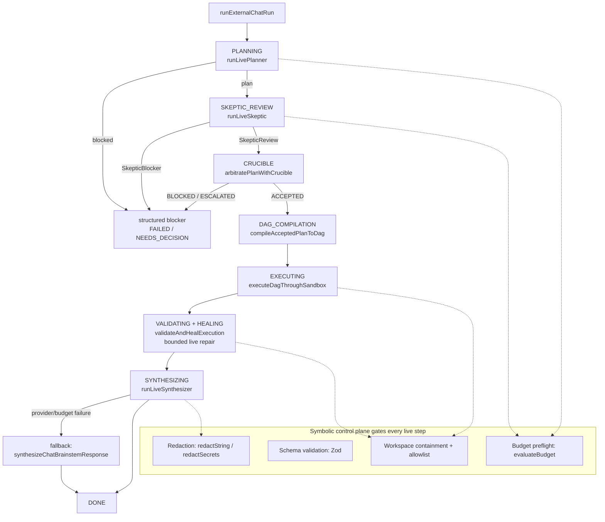
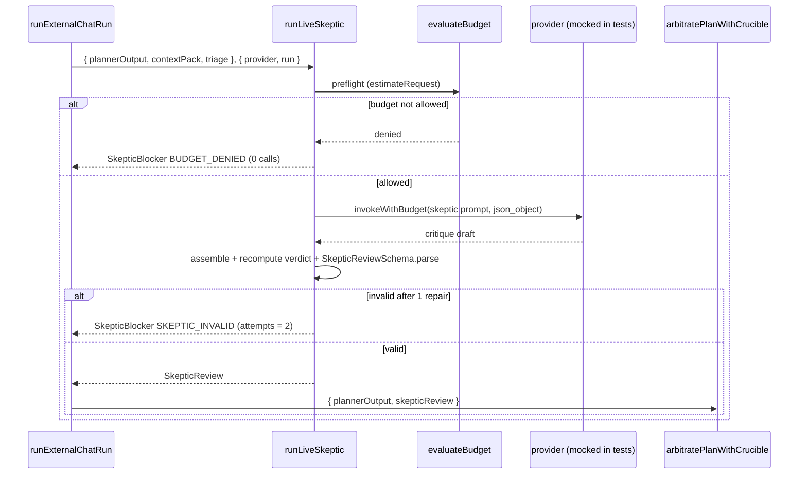
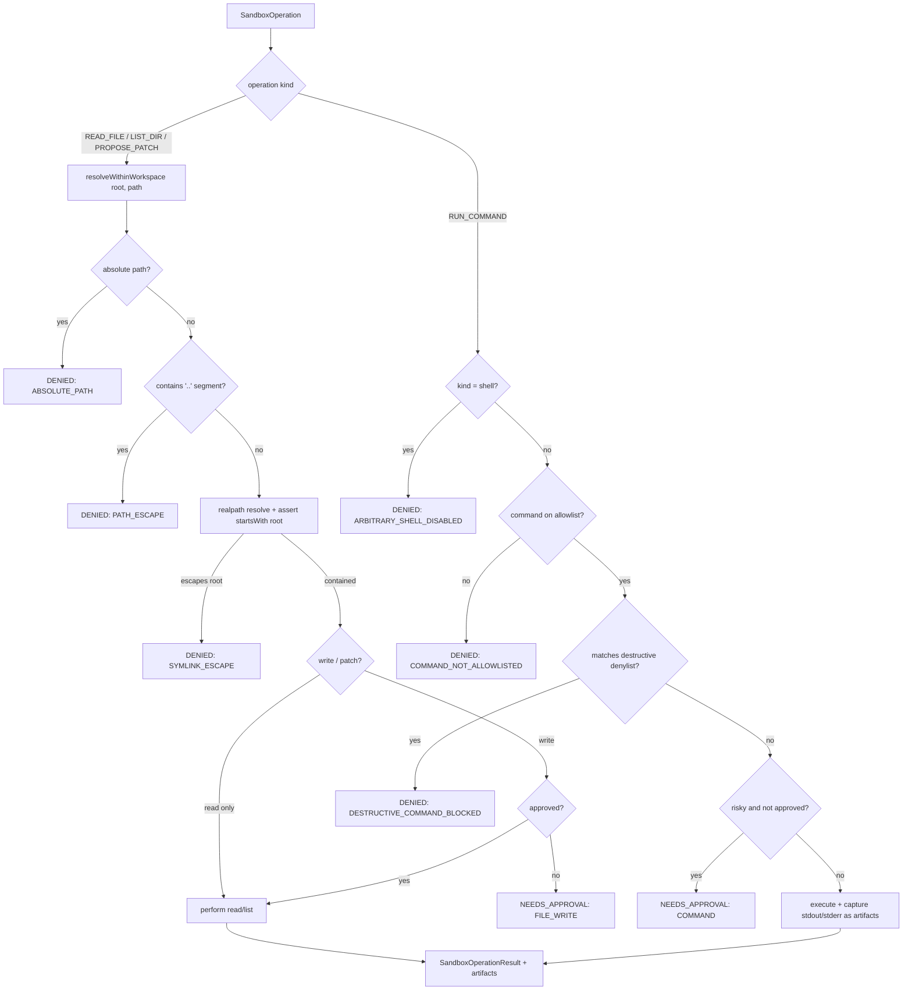
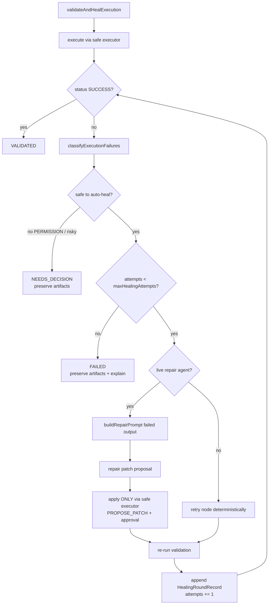

# Design Document: BYOK Alpha Phase 2 (ORN-35 → ORN-38)

## Overview

Phase 1 made Rector's **planning** phase BYOK-capable: in `external` mode the chat runner
(`src/orchestration/chatRunner.ts`) swaps the deterministic `createFakePlan` step for
`runLivePlanner`, which prompts a configured provider, validates the result against
`PlannerOutputSchema` + `validatePlannerOutput`, retries once on failure, and otherwise emits a
redacted `PlannerBlocker`. Every other phase (skeptic, crucible, DAG, executor, validation/healing,
synthesis) stayed deterministic and local. Phase 2 turns the rest of that loop into a real
neuro-symbolic coding agent: a **live skeptic** (ORN-35), a **live synthesizer** (ORN-36), a **safe
workspace executor** (ORN-37), and a **real validation/healing loop** over actual command failures
(ORN-38).

The design extends the existing primitives rather than replacing them. The live skeptic mirrors the
live planner's safety machinery exactly — `evaluateBudget` preflight before any call, a single
repair retry via new `buildSkepticPrompt`/`buildSkepticRepairPrompt` builders, a structured
`SkepticBlocker` on persistent failure, and `redactString`/`redactSecrets` at every boundary — and
emits output that conforms to the **existing** `SkepticReviewSchema`, so `arbitratePlanWithCrucible`
consumes it with zero special-casing. The live synthesizer reuses `BrainstemSynthesisInput` and
falls back to the deterministic `synthesizeChatBrainstemResponse` whenever a provider/budget/
validation failure occurs, so the user always gets a grounded, evidence-cited answer and the
symbolic plane stays in charge. The safe workspace executor builds on the `SandboxAdapter` contract
and the existing `isSafeRelativePath` containment logic in `src/sandbox/index.ts`, adding a
workspace-root-anchored path resolver, a command allowlist, a destructive-command denylist, and
artifact capture. The real healing loop extends `validateAndHealExecution` so a bounded number of
rounds can feed a failed command's output into a live repair prompt, apply the resulting patch
**only** through the safe executor, and re-run validation — reusing the loop's existing
`maxHealingAttempts` bound so healing can never run unbounded.

The hard product constraint that shaped Phase 1 shapes Phase 2 unchanged: **the symbolic control
plane stays in charge.** The LLM proposes a critique, a final answer, or a repair patch; Rector
budgets it before any network call, validates its structure deterministically, confines every file
and command operation to the workspace root, blocks destructive commands by default, bounds the
healing loop, redacts every trust boundary, and refuses unsafe output rather than crashing. Local
provider-free mode remains the default and the regression baseline that `npm test` exercises with no
credentials and zero real network.

---

## Architecture

### The external neuro-symbolic loop (Phase 2)

The chat pipeline keeps its Phase 1 shape (`runChat` dispatches by `ORCHESTRATOR_MODE` to
`runFakeChatRun` or `runExternalChatRun`). Phase 2 changes only the **external** path, and only by
replacing three deterministic-only steps with live, budgeted, validated agents plus a safe executor:

- **PLANNING** — unchanged from Phase 1 (`runLivePlanner`).
- **SKEPTIC_REVIEW** — `runLiveSkeptic` (new) replaces the heuristic `reviewPlanWithSkeptic` in
  external mode; output still conforms to `SkepticReviewSchema`.
- **EXECUTING / VALIDATING / HEALING** — DAG nodes are dispatched through the **safe workspace
  executor** (`executeDagThroughSandbox`), and `validateAndHealExecution` gains a bounded **live
  repair** capability.
- **SYNTHESIZING** — `runLiveSynthesizer` (new) produces the final, evidence-cited answer, falling
  back to the deterministic synthesizer on any failure.

Local mode is byte-for-byte the Phase 1 path: heuristic skeptic, simulated executor, deterministic
healing, deterministic synthesis, all-zero budget, zero provider calls.



### Live skeptic with budget preflight and single repair (ORN-35)

The live skeptic is structurally identical to the live planner. The model returns only a critique
draft (`verdict` + `findings`); the control plane stamps the deterministic fields
(`reviewedPlanId`/`planGoal` from the plan, `createdAt` from the clock), **recomputes** the verdict
from finding severities so a model can never claim `SOUND` while emitting a `BLOCKER`, and validates
the assembled object against `SkepticReviewSchema`.



### Safe workspace path resolution and command allowlist (ORN-37)

Every file and command operation is funneled through a single containment gate before any I/O
happens. A candidate path is rejected if it is absolute, contains a `..` segment, or — after
resolving real paths — escapes the configured workspace root via a symlink. Commands are checked
against an allowlist and a destructive-pattern denylist; arbitrary shell is denied by default; risky
writes and commands require an explicit, recorded approval.



### Bounded healing loop over real failures (ORN-38)

The healing loop reuses the Phase 1 classification and the `maxHealingAttempts` bound. The new path:
on a healable failure with a live repair agent configured, feed the failed command's captured output
into a repair prompt, apply the proposed patch **only** through the safe executor, re-run
validation, and record a `HealingRoundRecord`. The loop terminates when validation passes, when a
failure is unsafe to auto-heal (→ `NEEDS_DECISION`), or when the bound is reached (→ `FAILED`, with
all artifacts and a failure explanation preserved).



---

## Components and Interfaces

### Component 1: Live skeptic agent (ORN-35)

**Location**: `src/orchestration/skeptic.ts` (add `runLiveSkeptic`, keep `reviewPlanWithSkeptic`);
prompt builders added to `src/orchestration/prompts.ts`. Crucible glue in
`src/orchestration/crucible.ts` is **not** required — the live skeptic emits a `SkepticReview` that
`arbitratePlanWithCrucible` already accepts.

**Purpose**: In external mode, use a provider to critique the plan (safety, validation coverage,
missing dependencies, likely failure modes) and produce a review that conforms to the existing
`SkepticReviewSchema`, held to the same safety bar as the live planner.

**Interface**:

```typescript
// Mirrors LivePlannerStatus / LivePlannerResult / PlannerBlocker from planner.ts.
export type LiveSkepticStatus = "ok" | "blocked";

// The model returns ONLY this draft; the control plane supplies the deterministic fields
// (reviewedPlanId / planGoal / createdAt) and recomputes the verdict from finding severities.
export const SkepticReviewDraftSchema = z.object({
  verdict: SkepticReviewVerdictSchema,                 // advisory; recomputed by control plane
  findings: z.array(SkepticFindingSchema),
});
export type SkepticReviewDraft = z.infer<typeof SkepticReviewDraftSchema>;

export const SkepticBlockerSchema = z.object({
  code: z.enum(["BUDGET_DENIED", "SKEPTIC_INVALID", "PROVIDER_ERROR"]),
  message: z.string().min(1),                          // redacted, human-readable
  details: z.unknown().optional(),                     // redacted Zod issue paths; never raw output
});
export type SkepticBlocker = z.infer<typeof SkepticBlockerSchema>;

export interface LiveSkepticResult {
  status: LiveSkepticStatus;
  review?: SkepticReview;                              // present when status === "ok"
  blocker?: SkepticBlocker;                            // present when status === "blocked"
  usage: LLMUsage;                                     // accumulated across attempts
  provider: string;
  model: string;
  attempts: number;                                    // 1 or 2
}

export interface LiveSkepticInput {
  plannerOutput: PlannerOutput;
  contextPack: ContextPack;
  triage?: TriageResult;
  now?: () => string;
}

export interface LiveSkepticDeps {
  provider: LLMProvider;                               // selected by ModelRouter; mocked in tests
  run: Run;                                            // carries the budget for preflight
  buildPrompt?: typeof buildSkepticPrompt;
  buildRepairPrompt?: typeof buildSkepticRepairPrompt;
}

export async function runLiveSkeptic(
  input: LiveSkepticInput,
  deps: LiveSkepticDeps
): Promise<LiveSkepticResult>;
```

**Responsibilities**:
- Run budget preflight (`evaluateBudget`) **before** each `provider.invoke`; a denied budget yields
  a `BUDGET_DENIED` blocker with zero provider calls.
- Request `responseFormat: { type: "json_object" }`; parse content; validate against
  `SkepticReviewDraftSchema`.
- Assemble the full review: stamp `reviewedPlanId`/`planGoal` from `plannerOutput`, `createdAt` from
  the clock, then **recompute** `verdict` deterministically from finding severities (BLOCKER →
  `BLOCKED`, else any finding → `NEEDS_REVISION`, else `SOUND`), then `SkepticReviewSchema.parse`.
- On malformed/invalid output, issue exactly one repair prompt; if still invalid, return a
  `SKEPTIC_INVALID` blocker (no third call).
- Accumulate `LLMUsage`; redact `message`/`details` before returning.
- The returned `SkepticReview` is consumed by `arbitratePlanWithCrucible` exactly as the heuristic
  review is — no crucible changes.

### Component 2: Live synthesizer agent (ORN-36)

**Location**: `src/orchestration/synthesizer.ts` (add `runLiveSynthesizer`, keep
`synthesizeChatBrainstemResponse`); redaction via `src/security/redaction.ts`; prompt builder in
`src/orchestration/prompts.ts`.

**Purpose**: In external mode, produce a useful final answer from the full run state (plan,
execution logs, validation/healing results, artifact pointers) that **cites evidence** — files,
commands, tests, failures, and unresolved risks — and never leaks secrets.

**Interface**:

```typescript
export type LiveSynthesisStatus = "ok" | "fallback";

// Typed, schema-validated citations so evidence is structured, not free prose.
export const SynthesisCitationSchema = z.object({
  kind: z.enum(["file", "command", "test", "failure", "risk", "artifact"]),
  ref: z.string().min(1),                              // path, command name, node id, artifact id
  detail: z.string().min(1),                           // redacted human-readable evidence
});
export type SynthesisCitation = z.infer<typeof SynthesisCitationSchema>;

// The model returns ONLY { response, citations }; the control plane validates and assembles the
// BrainstemSynthesis. citations MUST be non-empty when execution/validation evidence exists.
export const SynthesisDraftSchema = z.object({
  response: z.string().min(1),
  citations: z.array(SynthesisCitationSchema),
});
export type SynthesisDraft = z.infer<typeof SynthesisDraftSchema>;

export interface LiveSynthesisResult {
  status: LiveSynthesisStatus;                         // "fallback" => deterministic answer used
  synthesis: BrainstemSynthesis;                       // always present; grounded either way
  citations: SynthesisCitation[];
  usage: LLMUsage;
  provider: string;
  model: string;
  attempts: number;                                    // 0 (fallback before any call) .. 2
}

export interface LiveSynthesizerDeps {
  provider: LLMProvider;
  run: Run;
  buildPrompt?: typeof buildSynthesizerPrompt;
  buildRepairPrompt?: typeof buildSynthesizerRepairPrompt;
}

// input reuses the existing BrainstemSynthesisInput unchanged.
export async function runLiveSynthesizer(
  input: BrainstemSynthesisInput,
  deps: LiveSynthesizerDeps
): Promise<LiveSynthesisResult>;
```

**Responsibilities**:
- **Redact before prompt construction**: every field of `BrainstemSynthesisInput` that reaches the
  prompt (execution stdout/stderr, failure messages, artifact summaries) passes through
  `redactSecrets`/`redactString` first.
- Budget preflight before each call; request `json_object`; parse and validate against
  `SynthesisDraftSchema`; one repair retry.
- Require non-empty `citations` whenever the run carried execution or validation evidence; reject a
  citation-free answer as invalid (triggers repair, then fallback).
- **Redact before returning**: the assembled `response`/`citations` pass through `redactString`/
  `redactSecrets` again so no secret survives even if the model echoed one.
- On any budget/provider/validation failure, set `status: "fallback"` and return the deterministic
  `synthesizeChatBrainstemResponse(input)` so the user always receives a grounded, never-crashing
  answer. The deterministic fallback never hides failed validation output.

### Component 3: Safe workspace executor (ORN-37)

**Location**: `src/sandbox/index.ts` (add a workspace-anchored adapter and `resolveWithinWorkspace`);
`src/orchestration/sandboxExecutor.ts` (new — maps DAG nodes to sandbox operations and is the only
bridge between the executor phase and real file/command I/O); mode split in
`src/orchestration/executorSimulator.ts` only if needed (the simulator stays the local default).

**Purpose**: Perform real, contained workspace operations — file read, directory listing, patch/
write proposal, and allowlisted command execution — with no path escape, no arbitrary shell, no
destructive commands by default, explicit approval for risky writes/commands, and stdout/stderr
captured as artifacts.

**Interface**:

```typescript
export const SandboxOperationKindSchema = z.enum([
  "READ_FILE",
  "LIST_DIR",
  "PROPOSE_PATCH",
  "RUN_COMMAND",
]);
export type SandboxOperationKind = z.infer<typeof SandboxOperationKindSchema>;

export const SandboxDenialReasonSchema = z.enum([
  "ABSOLUTE_PATH",
  "PATH_ESCAPE",                 // contains a ".." segment
  "SYMLINK_ESCAPE",              // realpath resolves outside the workspace root
  "ARBITRARY_SHELL_DISABLED",
  "COMMAND_NOT_ALLOWLISTED",
  "DESTRUCTIVE_COMMAND_BLOCKED",
  "NEEDS_APPROVAL",
]);
export type SandboxDenialReason = z.infer<typeof SandboxDenialReasonSchema>;

export interface WorkspaceSandboxOptions {
  workspaceRoot: string;         // absolute; the containment boundary
  allowlistedCommands?: string[];
  approvals?: SandboxApproval[]; // explicit approvals for risky writes/commands
  now?: () => string;
  fsImpl?: WorkspaceFs;          // injected in tests (no real disk required)
}

// Pure, side-effect-free containment check. Returns the resolved absolute path or a denial reason.
export function resolveWithinWorkspace(
  workspaceRoot: string,
  candidatePath: string,
  fsImpl?: Pick<WorkspaceFs, "realpathSync">
): { ok: true; absolutePath: string } | { ok: false; reason: SandboxDenialReason };

export class WorkspaceSandboxAdapter implements SandboxAdapter {
  readonly metadata: SandboxProviderMetadata;          // localOnly: true, networkAccess: false
  constructor(options: WorkspaceSandboxOptions);
  // Inherited SandboxAdapter.execute(command) stays available; the new entrypoint is operate().
  operate(operation: SandboxOperationInput): Promise<SandboxOperationResult>;
}
```

**Responsibilities**:
- Resolve every path through `resolveWithinWorkspace` **before** any I/O: reject absolute paths
  (`ABSOLUTE_PATH`), any `..` segment (`PATH_ESCAPE`), and any path whose real (symlink-resolved)
  location escapes the root (`SYMLINK_ESCAPE`). Reuse the existing `isSafeRelativePath` predicate as
  the first cheap gate.
- Support `READ_FILE`, `LIST_DIR`, `PROPOSE_PATCH` (emits a `PatchArtifact`, never writes without
  approval), and `RUN_COMMAND` (allowlisted, non-shell only).
- Deny `kind: "shell"` (`ARBITRARY_SHELL_DISABLED`), commands off the allowlist
  (`COMMAND_NOT_ALLOWLISTED`), and any command matching the destructive denylist
  (`DESTRUCTIVE_COMMAND_BLOCKED`) — denial takes precedence over the allowlist.
- Require an explicit recorded `SandboxApproval` for risky writes and commands; otherwise return
  `NEEDS_APPROVAL` (status `NEEDS_APPROVAL`, no mutation), matching the existing `FILE_WRITE`
  approval-gate pattern.
- Capture `stdout`/`stderr` as artifacts on every `RUN_COMMAND`; `networkCalls` is always `0`.

### Component 4: Real validation/healing loop (ORN-38)

**Location**: `src/orchestration/validationHealing.ts` (extend `validateAndHealExecution`);
`src/orchestration/sandboxExecutor.ts` (patches applied only here); repair prompt in
`src/orchestration/prompts.ts`.

**Purpose**: When execution fails, feed the failed command's captured output into a live repair
prompt, apply the proposed patch **only** through the safe executor, re-run validation, and bound
the number of rounds. Preserve artifacts and explain the failure if it remains unresolved.

**Interface**:

```typescript
// Extends the existing HealingActionTypeSchema enum with APPLY_PATCH (additive, backward-compatible).
export const HealingActionTypeSchema = z.enum([
  "RETRY_NODE",
  "MARK_SKIPPED",
  "REQUEST_DECISION",
  "FAIL_RUN",
  "NOOP",
  "APPLY_PATCH",                 // new: a live repair patch was applied via the safe executor
]);

export const HealingRoundRecordSchema = z.object({
  round: z.number().int().min(1),
  failureClassification: ValidationFailureClassificationSchema,
  nodeId: z.string().min(1).optional(),
  repairApplied: z.boolean(),                          // true if a patch was proposed and applied
  patchArtifactId: z.string().min(1).optional(),       // PatchArtifact.id from the safe executor
  revalidationStatus: DagExecutionStatusSchema,        // executor status after the round
  explanation: z.string().min(1),                      // redacted, human-readable
});
export type HealingRoundRecord = z.infer<typeof HealingRoundRecordSchema>;

// A repair agent proposes a patch from redacted failed output; it never touches disk itself.
export interface RepairPatchProposal {
  path: string;                  // safe relative path; validated by the safe executor
  operation: PatchOperation;     // "add" | "update" | "delete"
  content: string;
  rationale: string;             // redacted
}

export type LiveRepairAgent = (input: {
  failure: ValidationFailure;
  failedOutput: string;          // already redacted stdout/stderr
  contextPack: ContextPack;
  run: Run;
}) => Promise<RepairPatchProposal | undefined>;       // undefined => no safe repair available

// Existing input, extended with optional live-repair dependencies. Omitting them preserves the
// Phase 1 deterministic behaviour exactly.
export interface ValidateAndHealExecutionInput {
  compiledDag: Dag;
  executionResult?: DagExecutionResult;
  executor?: HealingExecutor;
  executorOptions?: ExecutorSimulatorOptions;
  maxHealingAttempts?: number;                          // the bound; reused unchanged
  repairAgent?: LiveRepairAgent;                        // new (ORN-38)
  sandbox?: WorkspaceSandboxAdapter;                    // new: patches applied only here
  contextPack?: ContextPack;                            // new: passed to the repair agent
  run?: Run;                                            // new: budget for the repair agent
}

// HealingLoopResult gains a `rounds: HealingRoundRecord[]` field (additive).
export async function validateAndHealExecution(
  input: ValidateAndHealExecutionInput
): Promise<HealingLoopResult>;
```

**Responsibilities**:
- Reuse the existing classification (`classifyExecutionFailures`) and the `boundedAttempts` bound;
  never exceed `maxHealingAttempts` rounds.
- When a `repairAgent` and `sandbox` are provided and a failure is safe to auto-heal, redact the
  failed output, call the repair agent, and apply the returned patch **only** via
  `sandbox.operate({ kind: "PROPOSE_PATCH", ... })` with an approval — never by writing files
  directly and never via shell.
- Re-run validation through the executor after each applied patch; append a `HealingRoundRecord`.
- On `PERMISSION` or otherwise unsafe-to-auto-heal failures, return `NEEDS_DECISION` without
  attempting a repair. On exhaustion, return `FAILED` with `finalExecutionResult` and all artifacts
  preserved and a redacted explanation — failed validation output is never hidden.

---

## Data Models

Phase 2 **reuses** the existing schemas wherever possible — `SkepticReviewSchema`/
`SkepticFindingSchema` (skeptic), `BrainstemSynthesis` (synthesis), `SandboxCommandSchema`/
`SandboxExecutionResultSchema`/`PatchArtifactSchema`/`ApprovalGateSchema` (sandbox),
`HealingLoopResultSchema`/`ValidationFailureSchema`/`HealingActionSchema` (healing), and
`LLMUsageSchema`/`PlannerOutputSchema`/`ContextPackSchema` (shared). It adds the new artifacts below
and makes three small, additive schema changes. As in Phase 1, no new persisted top-level store
entity is introduced: new payloads ride on existing `RunEvent` payloads and the `Run` cost/token
fields, all passed through `redactSecrets` by `runEvent`/`transitionRun` before persistence.

### Model 1: Sandbox operation and result (ORN-37)

```typescript
export const SandboxOperationSchema = z.object({
  kind: SandboxOperationKindSchema,
  path: z.string().min(1).optional(),       // required for READ_FILE / LIST_DIR / PROPOSE_PATCH
  operation: PatchOperationSchema.optional(),// required for PROPOSE_PATCH
  content: z.string().optional(),            // patch content for PROPOSE_PATCH
  command: z.string().min(1).optional(),     // required for RUN_COMMAND (allowlisted)
  args: z.array(z.string()).default([]),
  timeoutMs: z.number().int().min(1).max(3_600_000).optional(),
  approvalId: z.string().min(1).optional(),  // references an explicit SandboxApproval
  metadata: z.record(z.unknown()).default({}),
});
export type SandboxOperationInput = z.input<typeof SandboxOperationSchema>;

export const SandboxOperationResultSchema = z.object({
  kind: SandboxOperationKindSchema,
  status: SandboxExecutionStatusSchema,      // reuse: SUCCEEDED | FAILED | DENIED | NEEDS_APPROVAL
  denialReason: SandboxDenialReasonSchema.optional(),
  resolvedPath: z.string().min(1).optional(),// absolute, contained path (never returned on denial)
  stdout: z.string().default(""),
  stderr: z.string().default(""),
  entries: z.array(z.string()).optional(),   // for LIST_DIR
  fileContent: z.string().optional(),        // for READ_FILE (redacted)
  artifacts: z.array(SandboxArtifactSchema).default([]),   // PatchArtifact + captured stdio
  approvalGates: z.array(ApprovalGateSchema).default([]),
  networkCalls: z.literal(0),
  startedAt: z.string().datetime(),
  completedAt: z.string().datetime(),
});
export type SandboxOperationResult = z.infer<typeof SandboxOperationResultSchema>;

export const SandboxApprovalSchema = z.object({
  id: z.string().min(1),
  scope: z.enum(["FILE_WRITE", "COMMAND"]),
  target: z.string().min(1),                 // path or command the approval authorizes
  approvedBy: z.string().min(1),
});
export type SandboxApproval = z.infer<typeof SandboxApprovalSchema>;
```

**Validation / invariant rules**:
- `resolvedPath` is present only when `status !== "DENIED"`; on denial the absolute path is withheld
  and `denialReason` is set. The resolved path always satisfies
  `resolvedPath.startsWith(workspaceRoot)`.
- A `RUN_COMMAND` result always has `networkCalls: 0` and captures `stdout`/`stderr` as artifacts.
- A `PROPOSE_PATCH` without a matching `FILE_WRITE` approval yields `status: "NEEDS_APPROVAL"`, an
  unapproved `PatchArtifact` (`approval.approved === false`), and performs no write.
- Captured `stdout`/`stderr` and `fileContent` are redacted with `redactString` before being placed
  in the result or any artifact.

### Model 2: Execution artifacts recorded on run events (ORN-37/38)

```typescript
// Provider-free, secret-free record of a sandbox operation, recorded on the EXECUTING/VALIDATING
// RunEvent payloads. Reuses SandboxArtifactSchema (PatchArtifact) for patch evidence.
export const ExecutionArtifactSchema = z.object({
  source: z.enum(["sandbox-operation", "command-stdout", "command-stderr", "patch"]),
  nodeId: z.string().min(1).optional(),
  operationKind: SandboxOperationKindSchema.optional(),
  status: SandboxExecutionStatusSchema,
  artifactId: z.string().min(1).optional(),  // PatchArtifact.id when source === "patch"
  preview: z.string(),                        // redacted, truncated stdout/stderr preview
});
export type ExecutionArtifact = z.infer<typeof ExecutionArtifactSchema>;
```

**Validation / invariant rules**:
- `preview` is always redacted and length-bounded (mirrors the Phase 1 `promptPreview` convention).
- Recorded only in external mode; local simulated execution keeps its current event shapes.

### Model 3: Healing round record (ORN-38)

Defined in Component 4 (`HealingRoundRecordSchema`). The existing `HealingLoopResultSchema` gains an
additive `rounds: z.array(HealingRoundRecordSchema).default([])` field, and
`HealingActionTypeSchema` gains the additive `APPLY_PATCH` member.

**Validation / invariant rules**:
- `rounds.length <= maxHealingAttempts` (the bounded-healing invariant; see Key Functions).
- `repairApplied === true` ⟹ `patchArtifactId` is set and references a `PatchArtifact` emitted by
  the safe executor (patches never originate anywhere else).
- `explanation` is redacted; on `FAILED`/`NEEDS_DECISION` it describes the unresolved failure
  without hiding the validation output.

### Model 4: Skeptic and synthesis live results (ORN-35/36)

`SkepticBlockerSchema`, `LiveSkepticResult`, `SynthesisCitationSchema`, and `LiveSynthesisResult` are
defined in Components 1–2. The crucible-facing output remains the **unchanged** `SkepticReview`.
`ProviderCallMetadataSchema` (from `chatRunner.ts`, Phase 1) is reused to record provider/model/cost
on the `SKEPTIC_REVIEW` and `SYNTHESIZING` events, exactly as it is on `PLANNING`.

**Validation / invariant rules**:
- A live skeptic review, once assembled, satisfies `SkepticReviewSchema` and has a verdict
  recomputed from finding severities (the model's advisory verdict is never trusted directly).
- A live synthesis carries non-empty `citations` whenever execution/validation evidence exists; on
  fallback the deterministic `BrainstemSynthesis` is returned unchanged.

### Model 5: One synthesis schema relaxation

`BrainstemSynthesis.providerCalls` is currently the literal `0`. To record real provider usage in
external synthesis without breaking local mode, widen it to a non-negative integer
(`z.number().int().nonnegative()`); local mode continues to pass `0`. This is the only change to an
existing synthesis type and is backward compatible with every current caller.

---

## Algorithmic Pseudocode

### Live skeptic with single repair retry (ORN-35)

```pascal
ALGORITHM runLiveSkeptic(input, deps)
INPUT: input (plannerOutput, contextPack, triage?), deps (provider, run, buildPrompt, buildRepairPrompt)
OUTPUT: LiveSkepticResult
PRECONDITION: input.plannerOutput parses against PlannerOutputSchema
POSTCONDITION: status "ok" with a SkepticReviewSchema-valid review, OR status "blocked" with a
               redacted SkepticBlocker; at most 2 provider calls; budget preflight precedes each call

BEGIN
  PlannerOutputSchema.parse(input.plannerOutput)
  totalUsage ← zeroUsage
  messages ← buildSkepticPrompt(input)          // system rules + critique JSON contract + context

  FOR attempt IN [1, 2] DO
    request ← { messages, modelRoute: "flagship",
                responseFormat: { type: "json_object" }, task: "skeptic" }

    // BUDGET PREFLIGHT — must precede provider.invoke / any network call
    estimate ← deps.provider.estimateRequest(request)
    decision ← evaluateBudget(deps.run, providerBudgetUsage(estimate, totalUsage))
    IF decision.status ≠ "allowed" THEN
      RETURN blocked("BUDGET_DENIED", redact(decision.reasons.join("; ")), totalUsage, attempt-1)
    END IF

    TRY
      response ← AWAIT invokeWithBudget(deps.provider, request, deps.run)   // double-gated
    CATCH ProviderError e
      RETURN blocked("PROVIDER_ERROR", redact(e.message), totalUsage, attempt)
    END TRY

    totalUsage ← addUsage(totalUsage, response.usage)
    parsed ← tryParseJson(response.content)

    IF parsed.ok AND SkepticReviewDraftSchema.safeParse(parsed.value).success THEN
      draft ← SkepticReviewDraftSchema.parse(parsed.value)
      review ← assembleReview(draft, input.plannerOutput, input.contextPack, now())
      // verdict recomputed from severities; model cannot claim SOUND while emitting a BLOCKER
      validated ← SkepticReviewSchema.safeParse(review)
      IF validated.success THEN
        RETURN ok(validated.data, deps.provider, response.model, totalUsage, attempt)
      END IF
      errorSummary ← issuePaths(validated.error)
    ELSE
      errorSummary ← "Response was not a valid skeptic critique draft"
    END IF

    IF attempt = 1 THEN
      messages ← buildSkepticRepairPrompt(input, response.content, errorSummary)
      CONTINUE                                  // exactly one repair attempt
    END IF
  END FOR

  RETURN blocked("SKEPTIC_INVALID", redact("Skeptic output invalid after repair"),
                 totalUsage, 2, { issues: errorSummary })
END

PROCEDURE assembleReview(draft, plannerOutput, contextPack, createdAt)
BEGIN
  verdict ← IF any(draft.findings, severity = "BLOCKER") THEN "BLOCKED"
            ELSE IF draft.findings is non-empty THEN "NEEDS_REVISION"
            ELSE "SOUND"
  RETURN { verdict, findings: draft.findings,
           reviewedPlanId: plannerOutput.id?, planGoal: plannerOutput.goal, createdAt }
END
```

### Safe path resolution and command allowlist enforcement (ORN-37)

```pascal
ALGORITHM resolveWithinWorkspace(workspaceRoot, candidatePath, fsImpl)
OUTPUT: { ok: true, absolutePath } | { ok: false, reason }
INVARIANT: ok = true  ⟹  absolutePath.startsWith(normalize(workspaceRoot))

BEGIN
  IF isAbsolute(candidatePath) THEN RETURN denied("ABSOLUTE_PATH")
  normalized ← candidatePath with "\" replaced by "/"
  IF any segment of normalized = ".." THEN RETURN denied("PATH_ESCAPE")
  IF NOT isSafeRelativePath(candidatePath) THEN RETURN denied("PATH_ESCAPE")

  joined ← join(workspaceRoot, normalized)
  // Resolve symlinks on the deepest existing ancestor, then re-append the rest.
  real ← fsImpl.realpathSync(existingAncestorOf(joined)) + remainderOf(joined)
  rootReal ← fsImpl.realpathSync(workspaceRoot)

  IF NOT real.startsWith(rootReal + SEPARATOR) AND real ≠ rootReal THEN
    RETURN denied("SYMLINK_ESCAPE")
  END IF
  RETURN { ok: true, absolutePath: real }
END


ALGORITHM operate(operation)   // WorkspaceSandboxAdapter
OUTPUT: SandboxOperationResult
POSTCONDITION: no file/command I/O occurs outside workspaceRoot; networkCalls = 0

BEGIN
  op ← SandboxOperationSchema.parse(operation)
  startedAt ← now()

  IF op.kind IN { READ_FILE, LIST_DIR, PROPOSE_PATCH } THEN
    resolved ← resolveWithinWorkspace(this.workspaceRoot, op.path, this.fsImpl)
    IF NOT resolved.ok THEN RETURN denied(op, resolved.reason, startedAt)

    IF op.kind = READ_FILE THEN
      RETURN succeeded(op, fileContent ← redact(this.fsImpl.readFileSync(resolved.absolutePath)))
    IF op.kind = LIST_DIR THEN
      RETURN succeeded(op, entries ← this.fsImpl.readdirSync(resolved.absolutePath))

    // PROPOSE_PATCH — never writes without approval
    approved ← hasApproval(this.approvals, scope = "FILE_WRITE", target = op.path)
    artifact ← buildPatchArtifact(op.path, op.content, op.operation, approved)
    IF NOT approved THEN RETURN needsApproval(op, artifact, gate("FILE_WRITE", op.path))
    applyPatch(resolved.absolutePath, op.content, op.operation)     // contained write
    RETURN succeeded(op, artifacts ← [artifact])
  END IF

  // op.kind = RUN_COMMAND
  IF op.command.kind = "shell" THEN RETURN denied(op, "ARBITRARY_SHELL_DISABLED", startedAt)
  IF op.command NOT IN this.allowlistedCommands THEN
    RETURN denied(op, "COMMAND_NOT_ALLOWLISTED", startedAt)
  IF matchesDestructiveDenylist(op.command, op.args) THEN          // denylist beats allowlist
    RETURN denied(op, "DESTRUCTIVE_COMMAND_BLOCKED", startedAt)
  IF isRisky(op.command) AND NOT hasApproval(this.approvals, "COMMAND", op.command) THEN
    RETURN needsApproval(op, gate("COMMAND", op.command))
  END IF

  { code, out, err } ← runContained(op, cwd = this.workspaceRoot, timeout = op.timeoutMs)
  RETURN succeeded(op,
                   stdout ← redact(out), stderr ← redact(err),
                   artifacts ← [stdioArtifact(out), stdioArtifact(err)],
                   networkCalls = 0)
END
```

### Bounded healing loop with live repair (ORN-38)

```pascal
ALGORITHM validateAndHealExecution(input)
INPUT: input (compiledDag, executionResult?, executor?, maxHealingAttempts?, repairAgent?, sandbox?, ...)
OUTPUT: HealingLoopResult
POSTCONDITION: result.rounds.length ≤ boundedAttempts(maxHealingAttempts);
               every applied patch came from input.sandbox; artifacts preserved; never throws

BEGIN
  maxAttempts ← boundedAttempts(input.maxHealingAttempts ?? DEFAULT_MAX_HEALING_ATTEMPTS)
  executor ← input.executor ?? executeCompiledDag
  current ← input.executionResult ?? AWAIT executor(input.compiledDag, input.executorOptions)
  attempts ← 0
  rounds ← []
  actions ← []
  observedFailures ← []

  IF current.status = "SUCCESS" THEN
    RETURN result("VALIDATED", attempts, observedFailures, actions, rounds, current)
  END IF

  WHILE true DO
    failures ← classifyExecutionFailures(input.compiledDag, current)
    append(observedFailures, failures)

    IF current.status = "SUCCESS" THEN
      RETURN result(attempts > 0 ? "HEALED" : "VALIDATED", attempts, observedFailures, actions, rounds, current)
    END IF

    // Unsafe-to-auto-heal (PERMISSION, destructive, risky) -> human decision, artifacts preserved
    decisionFailures ← rootActionable(failures) WHERE classification = "PERMISSION" OR unsafeToAutoHeal(...)
    IF decisionFailures non-empty THEN
      append REQUEST_DECISION actions
      RETURN result("NEEDS_DECISION", attempts, observedFailures, actions, rounds, current)
    END IF

    // Bound check BEFORE attempting another round — guarantees termination
    IF attempts ≥ maxAttempts THEN
      append FAIL_RUN actions with explanation (failed output preserved, not hidden)
      RETURN result("FAILED", attempts, observedFailures, actions, rounds, current)
    END IF

    attempts ← attempts + 1
    target ← primaryFailure(rootActionable(failures))

    IF input.repairAgent ≠ NULL AND input.sandbox ≠ NULL AND isHealable(target) THEN
      failedOutput ← redact(stdoutStderrFor(target, current))
      proposal ← AWAIT input.repairAgent({ failure: target, failedOutput,
                                           contextPack: input.contextPack, run: input.run })
      IF proposal ≠ NULL THEN
        // Patch is applied ONLY through the safe executor (containment + approval enforced there)
        patchResult ← AWAIT input.sandbox.operate({ kind: "PROPOSE_PATCH",
                                                     path: proposal.path,
                                                     operation: proposal.operation,
                                                     content: proposal.content,
                                                     approvalId: healingApprovalId })
        append APPLY_PATCH action
        rounds.append(record(attempts, target, repairApplied ← (patchResult.status = "SUCCEEDED"),
                             patchArtifactId ← patchResult.artifacts[0]?.id))
      ELSE
        rounds.append(record(attempts, target, repairApplied ← false))
      END IF
    ELSE
      append RETRY_NODE action            // Phase 1 deterministic retry fallback
      rounds.append(record(attempts, target, repairApplied ← false))
    END IF

    // Re-run validation after the round
    current ← AWAIT executor(input.compiledDag, healingOptions(input.compiledDag, input.executorOptions, [target]))
  END WHILE
END
```

---

## Key Functions with Formal Specifications

### `runLiveSkeptic(input, deps): Promise<LiveSkepticResult>`

**Preconditions**: `input.plannerOutput` parses against `PlannerOutputSchema`; `deps.run.budget` is
set; `deps.provider` is configured (or the fake fallback).
**Postconditions**: `status:"ok"` ⟹ `review` satisfies `SkepticReviewSchema` and its `verdict` was
recomputed from finding severities; `status:"blocked"` ⟹ `blocker` is redacted and `review` is
undefined; `attempts ∈ {1,2}`; budget preflight precedes every `provider.invoke`; no exception
escapes for budget/provider/validation failures.
**Loop invariants**: at the start of each attempt `totalUsage` equals the summed usage of all prior
completed calls; `attempt ∈ {1,2}` (never a third call); no path between budget-`denied` and
`provider.invoke` performs network I/O.

### `runLiveSynthesizer(input, deps): Promise<LiveSynthesisResult>`

**Preconditions**: `input` is a valid `BrainstemSynthesisInput`; `deps.run.budget` is set.
**Postconditions**: `synthesis` is always a grounded `BrainstemSynthesis` (live when `status:"ok"`,
deterministic when `status:"fallback"`); every field reaching the prompt was redacted **before**
prompt construction and the returned `response`/`citations` are redacted **before** return;
`status:"ok"` ⟹ `citations` is non-empty whenever execution/validation evidence existed; the
function never throws and never hides failed validation output.

### `resolveWithinWorkspace(workspaceRoot, candidatePath, fsImpl)`

**Preconditions**: `workspaceRoot` is an absolute path to an existing directory.
**Postconditions**: returns `{ ok:true, absolutePath }` only when the symlink-resolved target is
contained in the root; otherwise returns `{ ok:false, reason }` with one of `ABSOLUTE_PATH`,
`PATH_ESCAPE`, `SYMLINK_ESCAPE`. Performs no writes and no command execution.
**Workspace-root containment invariant**:
```
∀ workspaceRoot w, ∀ candidate c:
  resolveWithinWorkspace(w, c).ok = true
    ⟹  realpath(result.absolutePath) = w  ∨  realpath(result.absolutePath).startsWith(w + SEP)
```

### `WorkspaceSandboxAdapter.operate(operation): Promise<SandboxOperationResult>`

**Preconditions**: `operation` parses against `SandboxOperationSchema`.
**Postconditions**: every file/command target passed `resolveWithinWorkspace` before any I/O;
`result.networkCalls === 0`; `kind:"shell"` ⟹ `DENIED/ARBITRARY_SHELL_DISABLED`; a command on the
destructive denylist ⟹ `DENIED/DESTRUCTIVE_COMMAND_BLOCKED` even if allowlisted; a risky write/
command without a recorded approval ⟹ `NEEDS_APPROVAL` with no mutation; `stdout`/`stderr`/
`fileContent` are redacted and captured as artifacts.
**No-secret-leak invariant**:
```
∀ secret k, ∀ operation o executed against a workspace configured with k:
  k ∉ serialize(result.stdout ∪ result.stderr ∪ result.fileContent ∪ result.artifacts)
```

### `validateAndHealExecution(input): Promise<HealingLoopResult>`

**Preconditions**: `input.compiledDag` is a valid `Dag`; when live repair is used, both
`input.repairAgent` and `input.sandbox` are provided.
**Postconditions**: terminates with status `VALIDATED`/`HEALED`/`NEEDS_DECISION`/`FAILED`; every
applied patch is a `PatchArtifact` emitted by `input.sandbox`; `finalExecutionResult` and all
artifacts are preserved; on `FAILED`/`NEEDS_DECISION` a redacted `explanation` describes the
unresolved failure without suppressing the validation output; never throws.
**Bounded-healing invariant**:
```
result.rounds.length ≤ boundedAttempts(maxHealingAttempts)
  ∧ count(executor invocations) ≤ boundedAttempts(maxHealingAttempts) + 1
  ∧ the loop performs the bound check before every new round (no unbounded recursion)
```

### `runChat(store, args, deps): Promise<ChatRunResult>` (external path, extended)

**Preconditions**: `deps.mode` is valid; in external mode `deps.router` is provided.
**Postconditions**: local-mode output is structurally identical to the Phase 1 baseline (heuristic
skeptic, simulated executor, deterministic healing/synthesis, zero cost/calls); external mode swaps
in the live skeptic, safe executor, live healing, and live synthesizer, recording
`ProviderCallMetadata` on the `SKEPTIC_REVIEW` and `SYNTHESIZING` events; every live-step blocker
ends in `FAILED`/`NEEDS_DECISION`, never an unhandled throw.

---

## Example Usage

```typescript
// Live skeptic with a mocked provider that returns a schema-valid critique draft:
const skeptic = await runLiveSkeptic(
  { plannerOutput, contextPack, triage },
  { provider: mockFlagshipProvider, run: externalRun }
);
if (skeptic.status === "ok") {
  // Consumed by the crucible exactly like the heuristic review — no special-casing.
  const decision = arbitratePlanWithCrucible({ plannerOutput, skepticReview: skeptic.review });
} else {
  recordBlocker(skeptic.blocker); // structured, redacted, never a crash
}

// Budget denial blocks the skeptic before any network call:
const denied = await runLiveSkeptic(input, { provider: spyProvider, run: zeroBudgetRun });
// denied.status === "blocked" && denied.blocker.code === "BUDGET_DENIED"
// spyProvider.invoke was never called

// Safe workspace executor: containment and allowlist are enforced before any I/O.
const sandbox = new WorkspaceSandboxAdapter({
  workspaceRoot: "/work/project",
  allowlistedCommands: ["npm:test", "npm:build"],
  approvals: [{ id: "a1", scope: "FILE_WRITE", target: "src/utils.ts", approvedBy: "operator" }],
  fsImpl: fakeFs, // injected; no real disk required for npm test
});

await sandbox.operate({ kind: "READ_FILE", path: "../../etc/passwd" });
// => { status: "DENIED", denialReason: "PATH_ESCAPE" } (no read performed)

await sandbox.operate({ kind: "RUN_COMMAND", command: "rm", args: ["-rf", "."] });
// => { status: "DENIED", denialReason: "DESTRUCTIVE_COMMAND_BLOCKED" }

await sandbox.operate({ kind: "RUN_COMMAND", command: "npm:test" });
// => { status: "SUCCEEDED", networkCalls: 0, artifacts: [stdout, stderr] }

// Bounded live healing: patches applied only through the safe executor, rounds bounded.
const healed = await validateAndHealExecution({
  compiledDag,
  maxHealingAttempts: 2,
  repairAgent: liveRepairAgent,   // proposes a patch from redacted failed output
  sandbox,
  contextPack,
  run: externalRun,
});
// healed.rounds.length <= 2; every healed.rounds[i].patchArtifactId came from the sandbox.

// Live synthesizer cites evidence and falls back safely:
const synth = await runLiveSynthesizer(synthesisInput, { provider: mockProvider, run: externalRun });
// synth.synthesis.response is grounded; synth.citations is non-empty when evidence exists.
// On any provider/budget failure: synth.status === "fallback" with the deterministic synthesis.
```

---

## Correctness Properties

These properties encode the Phase 2 hard constraints and are intended for property-based testing
with **fast-check** (already a dev dependency from Phase 1). All provider interactions use mocks/
test doubles, the workspace filesystem is injected (`fsImpl`), and **no property requires an API key
or real network**. Each property names the component it validates; in this design-first workflow
these properties seed the derived requirements.

### Property 1: Local mode output is unchanged (regression baseline)

**Validates: ORN-35/36/37/38 — local path preserved**

```
∀ prompt p, conversation c:
  runChat(store, args(p, c), { mode: "local" })
    ≡ Phase-1 baseline (heuristic skeptic, simulated executor, deterministic healing + synthesis,
      all-zero budget, zero provider calls, same phase sequence and synthesis structure)
```
Test approach: arbitrary prompts; assert the local-mode phase sequence, `costEstimate.usd === 0`,
`actualCost.modelCalls === 0`, and synthesis shape match the unchanged baseline.

### Property 2: No path escapes the workspace root

**Validates: ORN-37 — workspace-root containment invariant**

```
∀ workspaceRoot w, ∀ candidate path c (arbitrary relative, absolute, ".."-laden, or symlink target):
  resolveWithinWorkspace(w, c).ok = true
    ⟹ realpath(result.absolutePath) = w ∨ realpath(result.absolutePath).startsWith(w + SEP)
  ∧ sandbox.operate never performs I/O on a path that fails resolveWithinWorkspace
```
Test approach: generate adversarial paths (`../`, nested `a/../../b`, absolute `/etc/...` and
`C:\...`, and symlink entries in the injected `fsImpl` pointing outside the root); assert each is
denied with the correct `denialReason` and that no read/list/write touched an out-of-root path.

### Property 3: Destructive commands are always blocked

**Validates: ORN-37 — destructive denylist precedence**

```
∀ command cmd matching the destructive denylist (rm -rf, del /f, format, mkfs, dd, git clean -fdx, ...),
  ∀ allowlist configuration:
    sandbox.operate({ kind: "RUN_COMMAND", command: cmd, ... }).status = "DENIED"
    ∧ denialReason = "DESTRUCTIVE_COMMAND_BLOCKED"
    ∧ no command process was spawned
```
Test approach: generate destructive command/arg combinations (including ones also present on the
allowlist); assert denial always wins and the injected command runner was invoked 0 times.

### Property 4: Arbitrary shell is denied by default

**Validates: ORN-37 — arbitrary-shell disabled**

```
∀ operation o with command.kind = "shell":
  sandbox.operate(o).status = "DENIED" ∧ denialReason = "ARBITRARY_SHELL_DISABLED"
```

### Property 5: Healing rounds are always bounded

**Validates: ORN-38 — bounded-healing invariant**

```
∀ failing DAGs, ∀ maxHealingAttempts m ≥ 0, ∀ repair agents (including always-failing ones):
  validateAndHealExecution(...) terminates
    ∧ result.rounds.length ≤ boundedAttempts(m)
    ∧ executor invocations ≤ boundedAttempts(m) + 1
```
Test approach: with a repair agent that never fixes the failure (and an executor that keeps
failing), assert termination, `status === "FAILED"`, the round/executor-call bounds, and that all
artifacts are preserved.

### Property 6: No secret appears in any artifact, event, trace, response, or error

**Validates: ORN-35/36/37/38 — no-secret-leak invariant**

```
∀ secret k (arbitrary key-like string), ∀ external run r configured/executed with k:
  k ∉ serialize(events(r)) ∧ k ∉ serialize(execution artifacts ∪ sandbox results)
  ∧ k ∉ serialize(synthesis.response ∪ synthesis citations)
  ∧ k ∉ serialize(skepticReview) ∧ k ∉ message(any blocker) ∧ k ∉ message(any thrown error)
```
Test approach: inject a random secret into prompts, command output, file content, and failure
messages; drive the full external loop with mocked provider + injected `fsImpl`; assert the secret
substring is absent from every persisted event, artifact, sandbox result, skeptic review, synthesis,
blocker, and error.

### Property 7: Live skeptic output always conforms to the schema or yields a structured blocker

**Validates: ORN-35 — schema parity + structured refusal**

```
∀ provider outputs (o1, o2) (valid drafts, malformed JSON, or schema-invalid):
  runLiveSkeptic(...) resolves (never throws) to either
    status "ok" with review ⊨ SkepticReviewSchema (verdict recomputed from severities), OR
    status "blocked" with a redacted SkepticBlocker and attempts ∈ {1,2}
  ∧ count(provider.invoke) ≤ 2
```
Test approach: generate valid critique drafts and adversarial outputs; assert the resolved review
always passes `SkepticReviewSchema`, the verdict matches the severity-derived value, malformed cases
yield a `SKEPTIC_INVALID` blocker after exactly one repair, and the crucible accepts every `ok`
review without special-casing.

### Property 8: Budget denial precedes the network call (skeptic + synthesizer)

**Validates: ORN-35/36 — budget preflight before any provider call**

```
∀ budget b such that evaluateBudget(run(b), estimate) ≠ "allowed":
  runLiveSkeptic(input, { provider, run(b) }) is "blocked" with code "BUDGET_DENIED"
  ∧ runLiveSynthesizer(input, { provider, run(b) }) is "fallback"
  ∧ provider.invoke was called 0 times in both
```

### Property 9: Patches are applied only through the safe executor

**Validates: ORN-38 — patch provenance**

```
∀ healing runs that apply a repair:
  every HealingRoundRecord with repairApplied = true has a patchArtifactId
    that equals the id of a PatchArtifact emitted by input.sandbox
  ∧ no file write occurred outside sandbox.operate
```

---

## Error Handling

### Scenario 1: Budget denies the skeptic or synthesizer call
**Condition**: `evaluateBudget` returns `denied`/`NEEDS_DECISION` during preflight.
**Response**: `runLiveSkeptic` returns a `BUDGET_DENIED` blocker (run → `NEEDS_DECISION`);
`runLiveSynthesizer` returns `status:"fallback"` with the deterministic synthesis. **No provider
call is made.**
**Recovery**: Operator approves/raises budget via the existing decision flow.

### Scenario 2: Provider HTTP/network/credential failure during skeptic or synthesis
**Condition**: `provider.invoke` throws `ProviderError`.
**Response**: skeptic → redacted `PROVIDER_ERROR` blocker (run → `NEEDS_DECISION`); synthesizer →
`status:"fallback"` deterministic answer. No raw provider body is surfaced.
**Recovery**: Operator fixes credentials/connectivity; the connection-test endpoint (Phase 1) helps
diagnose.

### Scenario 3: Malformed or schema-invalid skeptic output
**Condition**: Response is not JSON, not a valid `SkepticReviewDraft`, or fails
`SkepticReviewSchema` after assembly.
**Response**: one repair prompt with the redacted error summary; if still invalid, `SKEPTIC_INVALID`
blocker (run → `NEEDS_DECISION`). Raw model output is never surfaced; only redacted Zod issue paths.
**Recovery**: Deterministic refusal; the crucible never arbitrates an unvalidated review.

### Scenario 4: Path escape or unsafe command in the executor
**Condition**: A DAG node requests an absolute/`..`/symlink path, a non-allowlisted command, a
destructive command, or `kind:"shell"`.
**Response**: `WorkspaceSandboxAdapter.operate` returns `DENIED` with the specific
`SandboxDenialReason` and performs no I/O. The healing loop treats this as unsafe-to-auto-heal and
routes to `NEEDS_DECISION`.
**Recovery**: Operator approves the specific write/command (recorded `SandboxApproval`) or revises
the plan.

### Scenario 5: Risky write/command without approval
**Condition**: A `PROPOSE_PATCH` or risky `RUN_COMMAND` lacks a matching `SandboxApproval`.
**Response**: `status:"NEEDS_APPROVAL"` with an unapproved `PatchArtifact`/approval gate; no mutation
occurs.
**Recovery**: Operator supplies the approval; the operation is re-run.

### Scenario 6: Healing cannot resolve the failure within the bound
**Condition**: Repair attempts are exhausted (`attempts ≥ maxHealingAttempts`) or no safe repair is
available.
**Response**: `validateAndHealExecution` returns `FAILED` (or `NEEDS_DECISION` for unsafe failures)
with `finalExecutionResult` and all artifacts preserved and a redacted `explanation`. **The failed
validation output is never hidden.**
**Recovery**: Operator inspects preserved artifacts; the synthesizer reports the unresolved risk as
a citation.

### Scenario 7: Secret-bearing content anywhere in the loop
**Condition**: A prompt, command output, file content, failure message, or model answer contains a
secret-like substring.
**Response**: `redactString`/`redactSecrets` applied at every boundary below.
**Recovery**: N/A — redaction is mandatory at each boundary.

---

## Redaction Points

Redaction is applied at every trust boundary; Phase 2 adds these to the Phase 1 set:

1. **Skeptic blockers** → `redactString` on `message`, `redactSecrets` on `details` before return.
2. **Synthesizer prompt inputs** → `redactSecrets`/`redactString` on every `BrainstemSynthesisInput`
   field (execution stdout/stderr, failure messages, artifact summaries) **before** prompt
   construction.
3. **Synthesizer output** → `redactString`/`redactSecrets` on `response` and `citations` **before**
   returning, even if the model echoed a secret.
4. **Sandbox results** → `redactString` on `stdout`, `stderr`, and `fileContent`, and on every
   captured stdio/patch artifact, before they enter a `SandboxOperationResult`.
5. **Healing records** → `redactString` on the failed output fed to the repair prompt and on every
   `HealingRoundRecord.explanation`.
6. **Run events** → `ProviderCallMetadata` (skeptic + synthesis), `ExecutionArtifact`, and
   `HealingRoundRecord` payloads all pass through `redactSecrets` inside `runEvent`/`transitionRun`
   (existing).

---

## Testing Strategy

### Unit Testing Approach
- `runLiveSkeptic`: valid first try, valid after repair, invalid after repair (`SKEPTIC_INVALID`
  blocker), budget denial before call, provider-error mapping, verdict recomputation from
  severities, usage accumulation, crucible consumes the review unchanged (`tests/liveSkeptic.test.ts`).
- `runLiveSynthesizer`: live answer with citations, citation-required rejection then repair, fallback
  on budget/provider failure, redaction before prompt and before return (`tests/liveSynthesizer.test.ts`).
- `WorkspaceSandboxAdapter` / `resolveWithinWorkspace`: path-escape denials (absolute, `..`,
  symlink), allowlist enforcement, destructive denylist precedence, shell denial, approval gating,
  stdio artifact capture, `networkCalls === 0` (`tests/sandboxExecutor.test.ts`).
- `validateAndHealExecution` (live): bounded rounds, patch-only-via-sandbox, re-validation after
  patch, `NEEDS_DECISION` on unsafe failures, artifact preservation on exhaustion
  (`tests/liveHealing.test.ts`).

### Property-Based Testing Approach
**Library**: `fast-check` (existing dev dependency). Properties P1–P9 above. Generators: arbitrary
prompts, arbitrary key-like secret strings, arbitrary budgets, adversarial paths (relative/absolute/
`..`/symlink), destructive command/arg combinations, valid and malformed skeptic drafts, and failing
DAGs with always-failing repair agents. All providers are spies/mocks; the workspace `fsImpl` and
command runner are injected; **no API key and no real network/disk** in any test.

### Integration Testing Approach
- End-to-end external run through `createApp` with an injected mocked `ModelRouter`/provider and an
  injected `fsImpl`: planner → live skeptic → crucible → DAG → safe executor → live healing → live
  synthesis, asserting provider/cost metadata on the `SKEPTIC_REVIEW`/`SYNTHESIZING` events,
  workspace containment, bounded healing, and no secret leakage in the HTTP response body (supertest).
- Local-mode integration remains the unchanged regression suite, keeping the Phase 1 baseline green.

---

## Performance Considerations

- Phase 2 adds at most **two** provider calls per live step (skeptic + one repair; synthesizer + one
  repair) plus the bounded healing rounds (each round at most one repair call). Total provider calls
  per external run stay `O(maxModelCalls)` and are gated by `evaluateBudget` before every call.
- Budget preflight is O(1) and runs before network, preventing runaway cost.
- Sandbox operations are local file/process I/O with no network; path resolution is O(path depth).
- The healing loop is bounded by `maxHealingAttempts`; executor invocations are
  `≤ maxHealingAttempts + 1`.
- Local mode performance is unchanged (zero network, zero model calls, simulated executor).

## Security Considerations

- External providers stay **disabled by default** (`ORCHESTRATOR_MODE` defaults to `local`;
  providers require `enableNetwork: true`, set only in the external runner). The safe executor is
  `localOnly` with `networkAccess: false` and `arbitraryShell: false`.
- **Workspace containment** is enforced before any file/command I/O: absolute paths, `..` segments,
  and symlink escapes are all denied. **Destructive commands are blocked by default** and denial
  takes precedence over the allowlist. Arbitrary shell is denied.
- **Risky writes/commands require explicit recorded approval** (`SandboxApproval`); without it the
  operation returns `NEEDS_APPROVAL` and performs no mutation.
- **Healing is bounded** — no infinite loops — and patches are applied **only** through the safe
  executor, so every mutation passes the same containment/approval gate.
- **Redaction is enforced at all six new boundaries** above plus the Phase 1 boundaries; tests
  assert absence of injected secrets across artifacts, events, traces, responses, and errors.
- No cloud/server dependencies are added (that is Phase 3); persistence remains in-memory and the
  sandbox is local-only. Update `docs/plans/concerns-and-vulnerabilities.md` to note that external
  mode now performs real local file/command operations confined to the workspace root.

## Dependencies

- **Runtime**: existing `zod`; Node's built-in `fs`/`path`/`child_process` for the safe executor
  (injected via `fsImpl`/command-runner so tests need no real disk or processes). No new third-party
  runtime dependency. Reuses `src/providers/llm.ts` (`invokeWithBudget`, `ModelRouter`),
  `src/security/budget.ts` (`evaluateBudget`), `src/security/redaction.ts`
  (`redactString`/`redactSecrets`), `src/orchestration/skeptic.ts`, `src/orchestration/crucible.ts`,
  `src/orchestration/synthesizer.ts`, `src/orchestration/validationHealing.ts`,
  `src/orchestration/executorSimulator.ts`, `src/sandbox/index.ts`, and the run state machine.
- **Dev/test**: existing `fast-check` (property tests), `vitest` + `supertest` (unit/integration).
  No API keys; all provider/network/disk interactions are mocked or injected.
- **Verification (must pass)**: `npm test`, `npm run build`, `npm run check`,
  `node scripts/generate-roadmap-issues.js --check`, `node scripts/export-linear-issues.js --check`.
