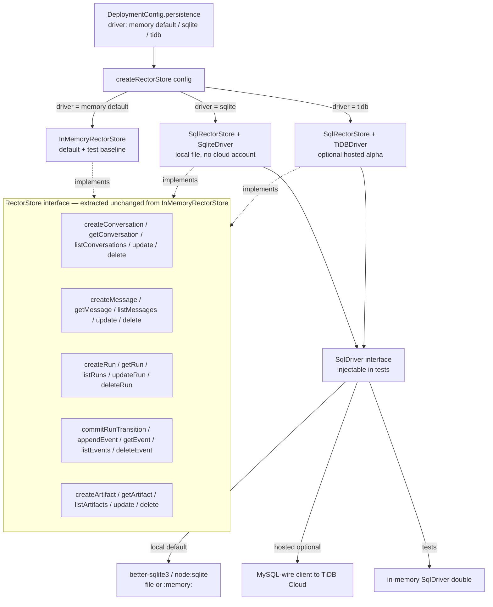
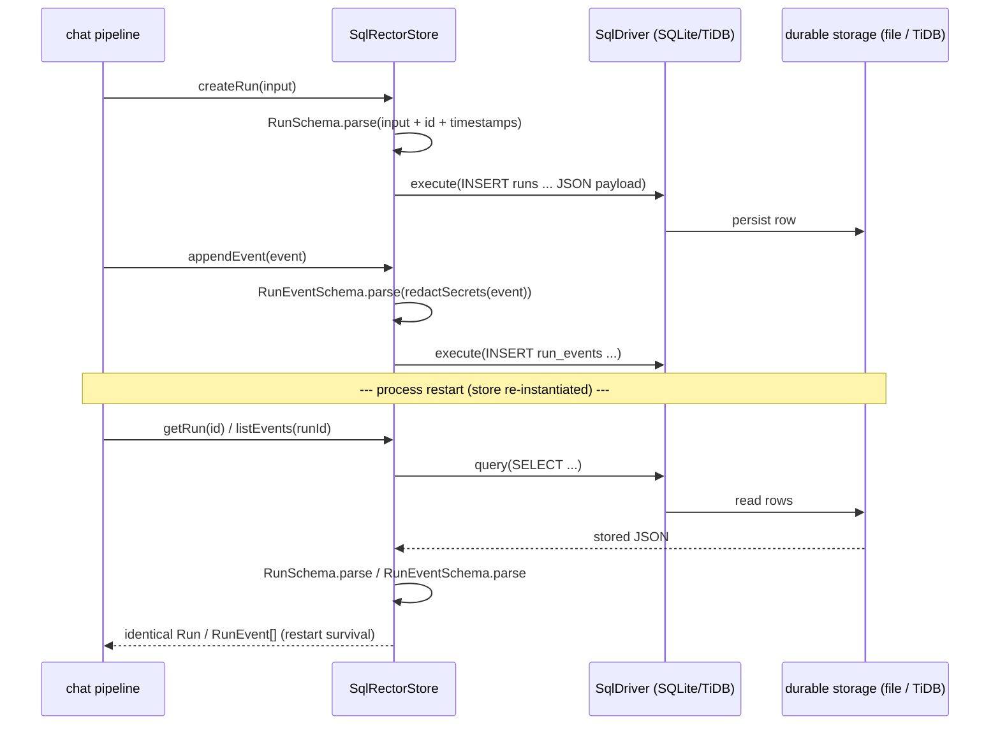
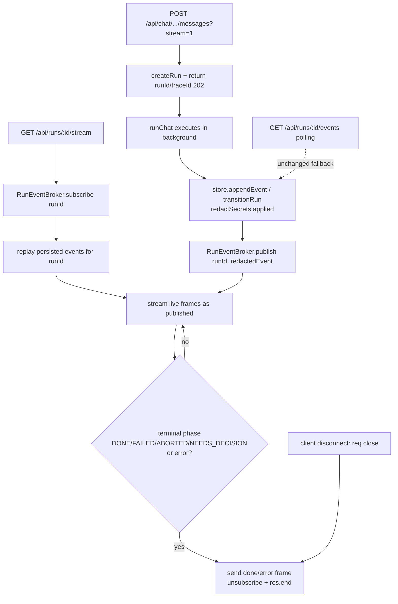
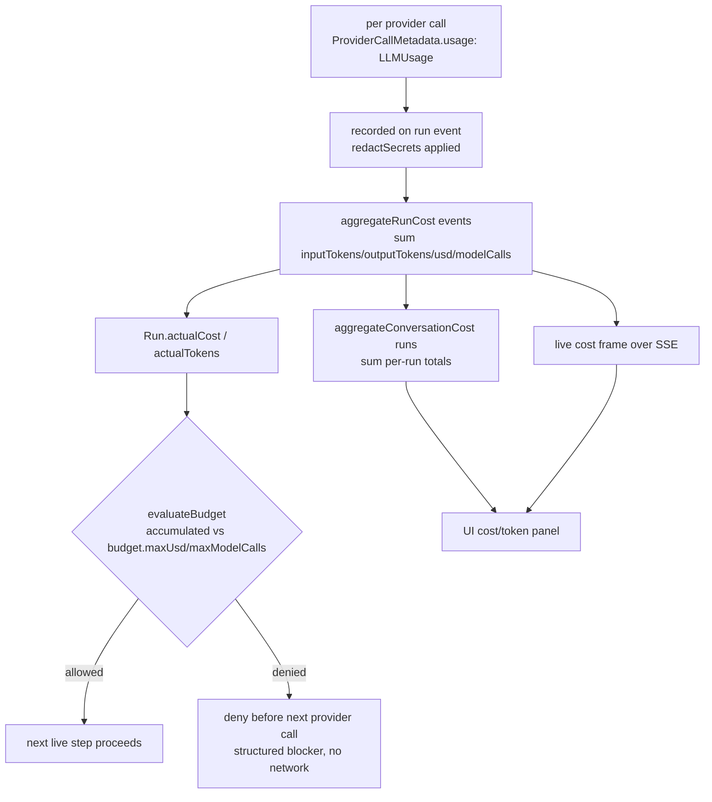

# Design Document: BYOK Alpha Phase 3 (ORN-39 → ORN-42)

## Overview

Phases 1 and 2 made Rector's chat pipeline BYOK-capable end to end: in `external` mode the chat
runner (`src/orchestration/chatRunner.ts`) drives a live planner, live skeptic, safe workspace
executor, bounded live healing loop, and live synthesizer, each budgeted by `evaluateBudget`,
schema-validated, redacted at every boundary, and falling back to the deterministic provider-free
path that `npm test` exercises with no credentials. What the alpha still lacks is the surface that
makes it usable as a real product: runs vanish on restart because everything lives in
`InMemoryRectorStore`, the trace UI only renders after a run has fully completed, cost and token
usage are recorded but never surfaced live, and there is no single document that tells an
implementing agent how to pick up the work. Phase 3 closes those four gaps: **local persistence with
a TiDB path** (ORN-39), an **SSE streaming trace UI** (ORN-40), a **cost and token dashboard**
(ORN-41), and a **Kiro implementor handoff guide** (ORN-42).

The design extends the existing primitives rather than replacing them. Persistence is introduced by
extracting a `RectorStore` interface from the **exact** public method surface of the current
`InMemoryRectorStore` — every signature is preserved, the in-memory store implements the interface
unchanged and stays the default and the test baseline — then adding a single `SqlRectorStore` that
talks to an injectable `SqlDriver`. A SQLite driver is the local/dev persistence default (a file on
disk, no cloud account, no network), and a TiDB Cloud driver is the optional hosted path, configured
through the existing deployment config rather than hard-wired. Mongo is deprioritized: the existing
`MONGO_URI` config field is left in place but unused, and no Mongo client dependency is added.
Streaming reuses the run events that `transitionRun`/`runEvent` already persist (already passed
through `redactSecrets`) by publishing each persisted event to an in-process `RunEventBroker` that an
SSE endpoint subscribes to; the existing synchronous POST and `GET /api/runs/:id/events` polling path
stay intact as the fallback. The cost dashboard aggregates the `ProviderCallMetadata`/`LLMUsage`
already recorded on run events into typed per-run and per-conversation totals, surfaces a live
estimate over the same SSE stream, and makes the per-run budget ceiling that `evaluateBudget` already
enforces explicit across every live step. The handoff guide is a single Markdown document.

The hard product constraint that shaped Phases 1 and 2 shapes Phase 3 unchanged: **the symbolic
control plane stays in charge, and local provider-free mode stays the default and the regression
baseline.** Persistence must work with zero cloud accounts; TiDB Cloud is preferred for hosted alpha
but never required for local use; no secret ever lands in a persisted row, event, artifact, SSE
frame, or UI payload; and `npm test` requires no API key and no real network — provider calls are
mocked and persistence tests run against a local file / in-memory SQLite or an injected driver, never
a real cloud database.

---

## Architecture

### Store interface and selection by configuration (ORN-39)

The current `InMemoryRectorStore` is a concrete class with no interface in front of it. Phase 3
extracts a `RectorStore` interface whose members are **byte-for-byte** the existing public async
method signatures of that class, so the in-memory store implements the interface without a single
signature change and remains the default. A new `SqlRectorStore` implements the same interface over
an injectable `SqlDriver`; the SQLite driver is the local persistence default and the TiDB driver is
the optional hosted path. A single `createRectorStore(config)` factory resolves which implementation
to construct from the deployment persistence config — defaulting to in-memory when nothing is
configured (and always in tests unless a driver is injected).



### Persistence round-trip and restart survival (ORN-39)

Every write goes through the existing Zod schema (`ConversationSchema`, `MessageSchema`, `RunSchema`,
`RunEventSchema`, `ArtifactSchema`) before it is serialized to a row, and every read re-parses the
stored JSON back through the same schema. Re-instantiating `SqlRectorStore` against the same
file/driver (a restart simulation) reloads identical entities, because the rows are the canonical,
schema-validated representation and ids/counters are derived from the persisted data, not from
in-process state.



### SSE streaming lifecycle with polling fallback (ORN-40)

Run events are already persisted by `transitionRun`/`runEvent` with `redactSecrets` applied. Phase 3
wraps the store so each persisted `RunEvent` is also published to an in-process `RunEventBroker`. When
a client asks to stream, the chat endpoint creates the run, returns its `runId`/`traceId`
immediately, and executes the run in the background while publishing events; an SSE endpoint replays
already-persisted events for that run (catch-up), then streams live events until a terminal phase or
error, and closes the connection cleanly. The synchronous POST and the `GET /api/runs/:id/events`
polling endpoint are untouched and serve as the fallback.



### Cost and token aggregation flow (ORN-41)

Each live step records `ProviderCallMetadata` (which carries `LLMUsage`) on its run event, and the
chat runner maps usage into the run's `costEstimate`/`actualCost`/`tokenEstimate`/`actualTokens`
fields. Phase 3 adds pure aggregation functions that fold those per-call records into a typed per-run
total and fold per-run totals into a per-conversation total, surfaces a live running estimate over
the SSE stream, and makes the per-run budget ceiling explicit so the next provider call is denied
once the accumulated cost would exceed `budget.maxUsd`/`maxModelCalls`.



---

## Components and Interfaces

### Component 1: Persistent store with SQLite and TiDB drivers (ORN-39)

**Location**: `src/store/index.ts` (export the extracted `RectorStore` interface and the
`createRectorStore` factory), `src/store/sqlRectorStore.ts` (new — `SqlRectorStore` + `SqlDriver`
contract + `SqliteDriver`), `src/store/tidbRectorStore.ts` (new — `TiDBDriver` factory),
`src/deployment/index.ts` (persistence config), `src/setupChecklist.ts` (env documentation); tests
in `tests/persistentStore.test.ts`.

**Purpose**: Persist conversations, messages, runs, events, artifacts, and provider usage/cost
metadata so runs survive a restart, while keeping the in-memory store the default and the test
baseline and changing no existing method signature.

**Interface**:

```typescript
// Extracted verbatim from the existing public surface of InMemoryRectorStore — every signature is
// unchanged, so InMemoryRectorStore implements RectorStore without modification and stays default.
export interface RectorStore {
  createConversation(input: CreateConversationInput): Promise<Conversation>;
  getConversation(id: string): Promise<Conversation | undefined>;
  listConversations(workspaceId?: string): Promise<Conversation[]>;
  updateConversation(id: string, patch: UpdateConversationInput): Promise<Conversation | undefined>;
  deleteConversation(id: string): Promise<boolean>;

  createMessage(input: CreateMessageInput): Promise<Message>;
  getMessage(id: string): Promise<Message | undefined>;
  listMessages(conversationId?: string): Promise<Message[]>;
  updateMessage(id: string, patch: UpdateMessageInput): Promise<Message | undefined>;
  deleteMessage(id: string): Promise<boolean>;

  createRun(input: CreateRunInput): Promise<Run>;
  getRun(id: string): Promise<Run | undefined>;
  listRuns(conversationId?: string): Promise<Run[]>;
  updateRun(id: string, patch: UpdateRunInput): Promise<Run | undefined>;
  deleteRun(id: string): Promise<boolean>;
  commitRunTransition(runId: string, patch: UpdateRunInput, event: RunEvent): Promise<{ run: Run; event: RunEvent }>;

  appendEvent(event: RunEvent): Promise<RunEvent>;
  getEvent(id: string): Promise<RunEvent | undefined>;
  listEvents(runId?: string): Promise<RunEvent[]>;
  deleteEvent(id: string): Promise<boolean>;

  createArtifact(input: CreateArtifactInput): Promise<Artifact>;
  getArtifact(id: string): Promise<Artifact | undefined>;
  listArtifacts(kind?: string): Promise<Artifact[]>;
  updateArtifact(id: string, patch: UpdateArtifactInput): Promise<Artifact | undefined>;
  deleteArtifact(id: string): Promise<boolean>;
}

// The minimal synchronous SQL surface SqlRectorStore depends on. Both the SQLite driver (local
// default) and the TiDB driver (hosted, MySQL wire) implement it, and tests inject an in-memory
// double — so npm test never touches a real cloud database.
export interface SqlDriver {
  readonly dialect: "sqlite" | "mysql";
  exec(sql: string): void;                                   // DDL / migrations
  run(sql: string, params?: unknown[]): void;                // INSERT / UPDATE / DELETE
  get<T = unknown>(sql: string, params?: unknown[]): T | undefined;
  all<T = unknown>(sql: string, params?: unknown[]): T[];
  close(): void;
}

export interface SqlRectorStoreOptions {
  driver: SqlDriver;
  now?: () => string;
}

export class SqlRectorStore implements RectorStore {
  constructor(options: SqlRectorStoreOptions);
  // ... full RectorStore implementation over options.driver (no signature changes) ...
}

// Local default: a file-backed (or :memory:) SQLite driver. No cloud account, no network.
export function createSqliteDriver(input: { path: string }): SqlDriver;        // src/store/sqlRectorStore.ts

// Optional hosted alpha: a TiDB Cloud (MySQL-compatible) driver. Never constructed for local use.
export function createTiDBDriver(input: {
  host: string; port: number; user: string; password: string; database: string; tls?: boolean;
}): SqlDriver;                                                                  // src/store/tidbRectorStore.ts

// Selection by config. Defaults to InMemoryRectorStore when nothing is configured (and in tests).
export function createRectorStore(
  config?: DeploymentConfig["persistence"],
  overrides?: { driver?: SqlDriver; now?: () => string }
): RectorStore;
```

**Responsibilities**:
- Extract `RectorStore` from `InMemoryRectorStore` with **no** signature changes; `InMemoryRectorStore`
  declares `implements RectorStore` and is otherwise untouched, so it stays the default and the test
  baseline.
- `SqlRectorStore` validates every write with the existing store schema before serialization and
  re-parses every read through the same schema, so reads are schema-identical to writes.
- Run the table DDL/migration on construction (idempotent `CREATE TABLE IF NOT EXISTS`), sharing one
  set of statements across SQLite and TiDB with only dialect-specific JSON column typing.
- Preserve `InMemoryRectorStore` semantics: insertion-order list results, duplicate-event-id
  rejection in `appendEvent`/`commitRunTransition`, and the atomic run-transition guarantee.
- `createRectorStore` returns `InMemoryRectorStore` when `persistence.driver` is `memory`/absent,
  `SqlRectorStore` + SQLite when `sqlite`, and `SqlRectorStore` + TiDB when `tidb`; an injected
  `overrides.driver` always wins so tests inject an in-memory `SqlDriver` double.
- Never persist a secret: rows carry only the already-redacted, schema-validated entities (run events
  are redacted by `runEvent`/`transitionRun` before `appendEvent`).

### Component 2: SSE streaming trace (ORN-40)

**Location**: `src/api/server.ts` (the `RunEventBroker`, the `GET /api/runs/:id/stream` route, and a
streaming branch on the chat-message route), `src/public/app.js` (live `EventSource` consumer with
polling fallback), `src/public/index.html` + `src/public/styles.css` (live indicator); tests in
`tests/chatStreaming.test.ts`.

**Purpose**: Stream run events live (planner/skeptic/executor/validation steps) to the UI over
Server-Sent Events, updating the trace as the run progresses, while preserving the completed-trace
drawer and the existing polling path as a fallback.

**Interface**:

```typescript
// In-process publish/subscribe over persisted (already-redacted) run events, keyed by runId. No
// secret can enter a frame because only persisted RunEvents are published.
export interface RunEventBroker {
  publish(runId: string, event: RunEvent): void;
  subscribe(runId: string, listener: (event: RunEvent) => void): () => void;   // returns unsubscribe
}
export function createRunEventBroker(): RunEventBroker;

// A store decorator that publishes every appended/committed event to the broker after it is
// persisted. Wraps any RectorStore (in-memory, SQLite, or TiDB) without changing its interface.
export function withEventBroadcast(store: RectorStore, broker: RunEventBroker): RectorStore;

// SSE frame contract. `event` is the SSE event name; `data` is the JSON-serialized payload.
export type SseFrameName = "run-event" | "cost" | "done" | "error";
export const SseRunEventFrameSchema = z.object({
  type: z.literal("run-event"),
  runId: z.string().min(1),
  event: RunEventSchema,                                     // already redacted
});
export const SseTerminalFrameSchema = z.object({
  type: z.enum(["done", "error"]),
  runId: z.string().min(1),
  phase: RunPhaseSchema.optional(),                          // terminal phase for "done"
  message: z.string().optional(),                            // redacted, for "error"
});

// Registers GET /api/runs/:id/stream. Replays persisted events (catch-up), then streams live frames
// until a terminal phase or error, then closes cleanly. Pure enough to test with a mock res/clock.
export function registerRunStreamRoute(input: {
  app: express.Application;
  store: RectorStore;
  broker: RunEventBroker;
  heartbeatMs?: number;
}): void;
```

**Responsibilities**:
- Publish each persisted event to the broker via the `withEventBroadcast` decorator, after redaction
  and persistence — never publish anything the store did not persist.
- On `GET /api/runs/:id/stream`: set SSE headers, subscribe, replay `listEvents(runId)` as `run-event`
  frames (catch-up for events that fired before the client connected), then stream live frames.
- Detect terminal state (`phase ∈ { DONE, FAILED, ABORTED, NEEDS_DECISION }`) and emit a `done` frame,
  or emit an `error` frame (redacted message) on a run failure; then unsubscribe, clear the heartbeat
  timer, and call `res.end()` exactly once.
- Close cleanly on client disconnect (`req.on("close")`): unsubscribe and clear timers so no listener
  or interval leaks.
- The streaming chat branch (`?stream=1`) returns `{ runId, traceId }` with status `202` and runs
  `runChat` in the background; the default (no `stream`) POST stays synchronous and unchanged, so
  existing tests and the polling fallback are preserved.
- The client (`app.js`) opens an `EventSource`, applies `run-event` frames to the live timeline and
  `cost` frames to the cost panel, closes on `done`/`error`, and falls back to the existing polling
  render when `EventSource` is unavailable or the stream errors.

### Component 3: Cost and token dashboard (ORN-41)

**Location**: `src/observability/index.ts` (aggregation functions + aggregate schemas),
`src/providers/llm.ts` (reuse `LLMUsage`/`LLMUsageSchema`), `src/security/budget.ts` (reuse
`evaluateBudget`), `src/api/server.ts` (cost endpoints + `cost` SSE frames), `src/public/app.js`
(live cost panel); tests in `tests/costTracking.test.ts`.

**Purpose**: Track estimated input/output tokens, provider, model, and cost per call; aggregate per
run and per conversation; show a live estimate in the UI; and enforce a max per-run budget — all
redaction-safe.

**Interface**:

```typescript
// Per-run total folded from the ProviderCallMetadata.usage recorded on a run's events. Numbers and
// non-secret identifiers only — safe to persist, stream, and render.
export const RunCostAggregateSchema = z.object({
  runId: z.string().min(1),
  inputTokens: z.number().int().nonnegative(),
  outputTokens: z.number().int().nonnegative(),
  totalTokens: z.number().int().nonnegative(),
  estimatedUsd: z.number().nonnegative(),
  modelCalls: z.number().int().nonnegative(),
  providers: z.array(z.string().min(1)),                    // distinct provider ids, never secrets
  models: z.array(z.string().min(1)),                       // distinct model ids
});
export type RunCostAggregate = z.infer<typeof RunCostAggregateSchema>;

export const ConversationCostAggregateSchema = z.object({
  conversationId: z.string().min(1),
  runCount: z.number().int().nonnegative(),
  inputTokens: z.number().int().nonnegative(),
  outputTokens: z.number().int().nonnegative(),
  totalTokens: z.number().int().nonnegative(),
  estimatedUsd: z.number().nonnegative(),
  modelCalls: z.number().int().nonnegative(),
  runs: z.array(RunCostAggregateSchema),
});
export type ConversationCostAggregate = z.infer<typeof ConversationCostAggregateSchema>;

// Pure folds over persisted events/runs. Sum every ProviderCallMetadata.usage (LLMUsage) on the
// run's events; conversation aggregate sums its runs' aggregates.
export function aggregateRunCost(runId: string, events: RunEvent[]): RunCostAggregate;
export function aggregateConversationCost(
  conversationId: string,
  runs: Run[],
  eventsByRun: Map<string, RunEvent[]>
): ConversationCostAggregate;

// Explicit per-run ceiling check, layered on the existing evaluateBudget. Given the accumulated
// run cost so far and the next call's estimate, returns whether the next provider call is allowed.
export function enforceMaxPerRunBudget(
  run: Run,
  accumulated: RunCostAggregate,
  nextEstimate: LLMUsage
): BudgetDecision;                                          // from src/security/budget.ts
```

**Responsibilities**:
- Reuse `LLMUsage`/`LLMUsageSchema` and the `ProviderCallMetadata` already recorded on run events; add
  no new per-call recording mechanism.
- `aggregateRunCost` sums input/output/total tokens, `estimatedUsd`, and `modelCalls` across every
  provider-call event and collects the distinct provider/model ids; `aggregateConversationCost` sums
  the per-run aggregates.
- Expose `GET /api/runs/:id/cost` and `GET /api/chat/conversations/:id/cost`, and emit a `cost` SSE
  frame (the current `RunCostAggregate`) after each provider-call event so the UI shows a live total.
- `enforceMaxPerRunBudget` wraps `evaluateBudget`: it feeds the accumulated run usage plus the next
  call's estimate so a run that would exceed `budget.maxUsd`/`maxModelCalls` is denied **before** the
  next provider call (no network), consistent with the Phase 1/2 preflight.
- Every aggregate and frame is numbers + non-secret ids only; no field can carry a key, header, or raw
  output, and aggregates are derived from already-redacted persisted events.

### Component 4: Kiro implementor handoff guide (ORN-42)

**Location**: `docs/implementation/byok-alpha-handoff.md` (new); `.kiro/steering/product.md` updated
**only if** a steering gap is found. No code; no tests.

**Purpose**: Give an implementing agent (Kiro/Opus) a single source-of-truth document to pick up the
BYOK alpha work without re-deriving context.

**Interface** (document section contract, not code):

```text
docs/implementation/byok-alpha-handoff.md
  1. Source-of-truth docs      — the phase 1/2/3 specs under .kiro/specs/byok-alpha-phase{1,2,3}/,
                                  the architecture doc, and the generated Linear issue chunks.
  2. Local vs external mode    — ORCHESTRATOR_MODE=local (default, provider-free, the test baseline)
                                  vs external (BYOK); how runChat dispatches by mode.
  3. Linear issue order        — ORN-39 → ORN-40 → ORN-41 → ORN-42, with the dependency rationale
                                  (persistence first, then streaming, then cost, then handoff).
  4. Verification commands     — npm test, npm run build, npm run check,
                                  node scripts/generate-roadmap-issues.js --check,
                                  node scripts/export-linear-issues.js --check.
  5. Local commit convention   — see "Implementation & Local Commit Convention" below.
  6. Explicit non-goals        — no more fake/filler systems; no cloud-first rewrite; no Mongo
                                  dependency unless access exists; do not reference deleted stale docs.
```

**Responsibilities**:
- State the source-of-truth documents and where they live; do not reference deleted/stale docs.
- Explain the local/external mode split and that local provider-free mode is the regression baseline.
- Lay out the ORN-39 → ORN-42 order and why.
- List the exact verification commands (below) that must pass before any commit.
- State the explicit non-goals verbatim: no more fake systems, no cloud-first rewrite, no Mongo
  dependency unless access exists.

---

## Data Models

Phase 3 **reuses** the existing entity schemas wherever possible — `ConversationSchema`,
`MessageSchema`, `RunSchema`, `RunEventSchema`, `ArtifactSchema`, and `BudgetSchema` from
`src/store/schemas.ts`, plus `LLMUsageSchema` (`src/providers/llm.ts`) and `ProviderCallMetadataSchema`
(`src/orchestration/chatRunner.ts`). It adds no new persisted top-level entity: persistence stores the
**same** entities the in-memory store holds, and the cost aggregates are derived (not stored) views.
The new shapes are the SQL row layout, the SSE frame schemas, and the cost aggregate schemas.

### Model 1: Persisted row layout (ORN-39)

Each store entity maps to one table. The schema-validated entity is stored as a JSON payload column,
with the columns needed for the existing list filters (`workspaceId`, `conversationId`, `runId`,
`kind`) and insertion order promoted to real columns for indexable queries. SQLite uses `TEXT` JSON;
TiDB uses `JSON`. No additional fields are invented — the JSON payload is exactly the existing entity.

```typescript
// Conceptual table shapes (shared DDL across SQLite and TiDB; only the JSON column type differs).
//
//   conversations(id PK, workspace_id, seq INTEGER, payload JSON)            -- Conversation
//   messages(id PK, conversation_id, seq INTEGER, payload JSON)              -- Message
//   runs(id PK, conversation_id, seq INTEGER, payload JSON)                  -- Run
//   run_events(id PK, run_id, seq INTEGER, payload JSON)                     -- RunEvent (redacted)
//   artifacts(id PK, kind, seq INTEGER, payload JSON)                        -- Artifact
//
// `seq` is a monotonic per-table counter that preserves the in-memory store's insertion-order list
// semantics. `payload` is the canonical entity: read = JSON.parse(payload) re-validated by its Zod
// schema, so a persisted-then-reloaded entity is identical to the one originally written.
//
// Provider usage / cost metadata is NOT a separate table: it already lives inside the persisted
// entities — on run_events.payload as ProviderCallMetadata, and on runs.payload as
// costEstimate/actualCost/tokenEstimate/actualTokens. The cost dashboard derives aggregates from
// those rows, so persistence and aggregation share one source of truth.
```

**Validation / invariant rules**:
- Every `payload` is produced by the entity's existing Zod schema before insert and re-parsed on read;
  the persisted representation is the single canonical form (round-trip identity).
- `run_events.payload` is always the redacted event (`runEvent`/`transitionRun` applied
  `redactSecrets` before `appendEvent`), so no secret reaches a row.
- `appendEvent`/`commitRunTransition` enforce duplicate-id rejection via the `id` primary key,
  matching `InMemoryRectorStore`.
- The Mongo path is intentionally absent: no `mongo`/Mongo-client table or driver exists; the
  `persistence.mongoUri` config field remains but is unused by `createRectorStore`.

### Model 2: SSE frame payloads (ORN-40)

```typescript
// A run-event frame carries the already-redacted persisted RunEvent. A cost frame carries the live
// RunCostAggregate. A terminal frame closes the stream. All are derived from persisted, redacted data.
export const SseFrameSchema = z.discriminatedUnion("type", [
  z.object({ type: z.literal("run-event"), runId: z.string().min(1), event: RunEventSchema }),
  z.object({ type: z.literal("cost"), runId: z.string().min(1), cost: RunCostAggregateSchema }),
  z.object({ type: z.literal("done"), runId: z.string().min(1), phase: RunPhaseSchema }),
  z.object({ type: z.literal("error"), runId: z.string().min(1), message: z.string() }),  // redacted
]);
export type SseFrame = z.infer<typeof SseFrameSchema>;
```

**Validation / invariant rules**:
- A `run-event` frame's `event` is exactly a persisted (redacted) `RunEvent` — frames never serialize
  un-persisted or un-redacted data.
- An `error` frame's `message` is passed through `redactString`.
- Exactly one terminal frame (`done` or `error`) is emitted per stream, after which the connection is
  closed; no further frames follow.

### Model 3: Cost/token aggregates (ORN-41)

`RunCostAggregateSchema` and `ConversationCostAggregateSchema` are defined in Component 3. They are
**derived** views over persisted run events and runs, not stored rows.

**Validation / invariant rules**:
- `totalTokens === inputTokens + outputTokens`, and every numeric field is the sum of the
  corresponding `LLMUsage` fields across the run's provider-call events (aggregation correctness).
- A conversation aggregate's totals equal the sum of its runs' aggregates.
- `providers`/`models` contain only the distinct non-secret identifiers from `ProviderCallMetadata`;
  no field can hold a key, header, or raw model output.

### Model 4: Persistence configuration (ORN-39)

```typescript
// Added to DeploymentConfig.persistence (src/deployment/index.ts). `driver` selects the store;
// `memory` is the default. `sqlitePath` defaults to a local file (e.g. ".rector/rector.db"); the
// TiDB block is optional and only read when driver === "tidb". Mongo fields remain but are unused.
export const PersistenceDriverSchema = z.enum(["memory", "sqlite", "tidb"]);
//   persistence: {
//     driver: PersistenceDriver;          // default "memory"
//     sqlitePath?: string;                // local default path when driver === "sqlite"
//     tidb?: { host; port; user; password; database; tls? };   // only when driver === "tidb"
//     mongoUri?: string; mongoDb?: string; redisUrl?: string;  // existing; unused by createRectorStore
//   }
```

**Validation / invariant rules**:
- `driver` defaults to `memory`; an unset/empty persistence config yields the in-memory store, so the
  default and the test baseline are unchanged.
- `driver === "sqlite"` requires only a local file path — never a cloud account or network.
- `driver === "tidb"` requires the TiDB connection block; a missing/invalid block is a clear config
  error, and TiDB is never auto-selected for local use.
- `mongoUri`/`mongoDb`/`redisUrl` are accepted for backward compatibility but ignored by store
  selection; no Mongo dependency is added.

---

## Algorithmic Pseudocode

### Store selection from deployment config (ORN-39)

```pascal
ALGORITHM createRectorStore(persistence, overrides)
INPUT: persistence (DeploymentConfig.persistence, optional), overrides (optional driver/now)
OUTPUT: RectorStore
POSTCONDITION: returns InMemoryRectorStore unless a SQL driver is configured/injected; performs no
               cloud network call for the memory/sqlite paths

BEGIN
  // An injected driver always wins (tests inject an in-memory SqlDriver double).
  IF overrides.driver ≠ NULL THEN
    RETURN new SqlRectorStore({ driver: overrides.driver, now: overrides.now })
  END IF

  driver ← persistence?.driver ?? "memory"

  IF driver = "memory" THEN
    RETURN new InMemoryRectorStore({ now: overrides.now })      // DEFAULT + test baseline, unchanged
  END IF

  IF driver = "sqlite" THEN
    path ← persistence.sqlitePath ?? DEFAULT_SQLITE_PATH        // local file; no cloud account
    RETURN new SqlRectorStore({ driver: createSqliteDriver({ path }), now: overrides.now })
  END IF

  IF driver = "tidb" THEN
    ASSERT persistence.tidb ≠ NULL                              // hosted path requires explicit config
    RETURN new SqlRectorStore({ driver: createTiDBDriver(persistence.tidb), now: overrides.now })
  END IF

  THROW ConfigError("unknown persistence driver")
END
```

### Persisted write/read round-trip (ORN-39)

```pascal
ALGORITHM SqlRectorStore.createRun(input)
POSTCONDITION: the stored row re-parses to a Run identical to the returned Run (restart survival)

BEGIN
  now ← this.now()
  run ← RunSchema.parse({ ...input, id: nextId("run"), createdAt: now, updatedAt: now })
  this.driver.run("INSERT INTO runs(id, conversation_id, seq, payload) VALUES(?,?,?,?)",
                  [run.id, run.conversationId, nextSeq("runs"), JSON.stringify(run)])
  RETURN clone(run)
END

ALGORITHM SqlRectorStore.getRun(id)
POSTCONDITION: returns the same Run that was written, or undefined

BEGIN
  row ← this.driver.get("SELECT payload FROM runs WHERE id = ?", [id])
  IF row = NULL THEN RETURN undefined
  RETURN RunSchema.parse(JSON.parse(row.payload))             // re-validate on read => round-trip identity
END

ALGORITHM SqlRectorStore.appendEvent(event)
PRECONDITION: event is already redacted by the caller (runEvent / transitionRun)
POSTCONDITION: duplicate ids are rejected exactly as InMemoryRectorStore does

BEGIN
  parsed ← RunEventSchema.parse(event)
  existing ← this.driver.get("SELECT id FROM run_events WHERE id = ?", [parsed.id])
  IF existing ≠ NULL THEN THROW Error("Duplicate event ID: " + parsed.id)
  this.driver.run("INSERT INTO run_events(id, run_id, seq, payload) VALUES(?,?,?,?)",
                  [parsed.id, parsed.runId, nextSeq("run_events"), JSON.stringify(parsed)])
  RETURN clone(parsed)
END
```

### SSE subscription, streaming, and clean close (ORN-40)

```pascal
ALGORITHM handleRunStream(req, res, store, broker, heartbeatMs)
INPUT: req (with runId param), res (SSE response), store, broker
POSTCONDITION: the connection is closed exactly once on terminal phase, error, or client disconnect;
               no listener or timer leaks; every frame is a persisted, redacted payload

BEGIN
  runId ← req.params.id
  writeSseHeaders(res)                       // text/event-stream, no-cache, keep-alive
  closed ← false

  closeOnce(frame) ≜
    IF closed THEN RETURN
    closed ← true
    IF frame ≠ NULL THEN writeFrame(res, frame)
    unsubscribe()
    clearInterval(heartbeat)
    res.end()                                // single clean close

  // Catch-up: replay events already persisted before the client connected.
  FOR each e IN store.listEvents(runId) DO
    writeFrame(res, { type: "run-event", runId, event: e })
    IF isTerminalPhase(e.phase) THEN
      closeOnce({ type: "done", runId, phase: e.phase })
      RETURN
    END IF
  END FOR

  // Live: stream new events as they are published.
  unsubscribe ← broker.subscribe(runId, (e) =>
    BEGIN
      writeFrame(res, { type: "run-event", runId, event: e })
      writeFrame(res, { type: "cost", runId, cost: aggregateRunCost(runId, store.listEvents(runId)) })
      IF isTerminalPhase(e.phase) THEN
        closeOnce({ type: "done", runId, phase: e.phase })
      END IF
    END)

  heartbeat ← setInterval(() => IF NOT closed THEN writeComment(res, "keep-alive"), heartbeatMs)
  req.on("close", () => closeOnce(NULL))     // client disconnect => clean teardown
END
```

### Per-run and per-conversation cost aggregation with budget enforcement (ORN-41)

```pascal
ALGORITHM aggregateRunCost(runId, events)
OUTPUT: RunCostAggregate
POSTCONDITION: each numeric total equals the sum of the corresponding LLMUsage field across the
               run's provider-call events; totalTokens = inputTokens + outputTokens

BEGIN
  acc ← { runId, inputTokens:0, outputTokens:0, totalTokens:0, estimatedUsd:0, modelCalls:0,
          providers:∅, models:∅ }
  FOR each ev IN events DO
    pc ← ev.payload.providerCall                          // ProviderCallMetadata, if present
    IF pc ≠ NULL THEN
      u ← pc.usage                                        // LLMUsage
      acc.inputTokens  += u.inputTokens
      acc.outputTokens += u.outputTokens
      acc.estimatedUsd += u.estimatedUsd
      acc.modelCalls   += u.modelCalls
      acc.providers    ← acc.providers ∪ { pc.provider }
      acc.models       ← acc.models ∪ { pc.model }
    END IF
  END FOR
  acc.totalTokens ← acc.inputTokens + acc.outputTokens
  RETURN RunCostAggregateSchema.parse(acc)
END

ALGORITHM aggregateConversationCost(conversationId, runs, eventsByRun)
OUTPUT: ConversationCostAggregate
POSTCONDITION: every total equals the sum of the per-run aggregates

BEGIN
  perRun ← [ aggregateRunCost(r.id, eventsByRun[r.id] ?? []) FOR r IN runs ]
  RETURN ConversationCostAggregateSchema.parse({
    conversationId,
    runCount: |runs|,
    inputTokens:  Σ perRun.inputTokens,
    outputTokens: Σ perRun.outputTokens,
    totalTokens:  Σ perRun.totalTokens,
    estimatedUsd: Σ perRun.estimatedUsd,
    modelCalls:   Σ perRun.modelCalls,
    runs: perRun,
  })
END

ALGORITHM enforceMaxPerRunBudget(run, accumulated, nextEstimate)
OUTPUT: BudgetDecision
POSTCONDITION: a run whose accumulated + next cost would exceed budget.maxUsd / maxModelCalls is
               denied BEFORE the next provider call (no network)

BEGIN
  usage ← {
    estimatedUsd: accumulated.estimatedUsd + nextEstimate.estimatedUsd,
    inputTokens:  accumulated.inputTokens  + nextEstimate.inputTokens,
    outputTokens: accumulated.outputTokens + nextEstimate.outputTokens,
    modelCalls:   accumulated.modelCalls   + nextEstimate.modelCalls,
  }
  RETURN evaluateBudget(run, usage)          // reuse existing gate; "denied" stops the next call
END
```

---

## Key Functions with Formal Specifications

### `createRectorStore(persistence, overrides): RectorStore`

**Preconditions**: `persistence` is the parsed deployment persistence config (or absent); an injected
`overrides.driver` is a valid `SqlDriver`.
**Postconditions**: returns `InMemoryRectorStore` when `driver` is `memory`/absent and no driver is
injected (default + test baseline unchanged); returns `SqlRectorStore` over SQLite for `sqlite` and
over TiDB for `tidb`; the `memory`/`sqlite` paths perform no cloud network call.
**Invariants**: an injected driver always takes precedence; TiDB is never auto-selected for local use.

### `SqlRectorStore` round-trip (`createRun`/`getRun`, `appendEvent`/`listEvents`, …)

**Preconditions**: inputs satisfy the existing create/update schemas; events passed to `appendEvent`
are already redacted by the caller.
**Postconditions** (persistence round-trip / restart survival): for any sequence of writes, a store
re-instantiated against the same driver/file returns entities equal to those written; reads re-parse
the stored payload through the entity schema, so reads are schema-identical to writes.
**Invariants**: insertion order is preserved via `seq`; duplicate event ids are rejected; the
in-memory store's method signatures are unchanged (`InMemoryRectorStore implements RectorStore`).

### `withEventBroadcast(store, broker)` + `handleRunStream(...)`

**Preconditions**: `store` is any `RectorStore`; events reach the broker only after they are persisted
and redacted.
**Postconditions** (SSE-closes-cleanly): the stream emits catch-up frames then live frames and closes
exactly once on the first terminal phase, on an `error`, or on client disconnect; after close no
further frame is written and no listener/timer remains registered.
**Invariants** (no-secret-in-frame): every `run-event`/`cost` frame is derived from persisted,
redacted data; `error` messages pass through `redactString`.

### `aggregateRunCost` / `aggregateConversationCost` / `enforceMaxPerRunBudget`

**Preconditions**: `events`/`runs` are persisted entities; `nextEstimate` is a valid `LLMUsage`.
**Postconditions** (cost-aggregation correctness): each aggregate total equals the sum of the
corresponding `LLMUsage` fields across provider-call events (run level) or across per-run aggregates
(conversation level), and `totalTokens === inputTokens + outputTokens`.
**Postconditions** (max-per-run-budget enforcement): `enforceMaxPerRunBudget` returns a non-`allowed`
`BudgetDecision` whenever accumulated + next cost would exceed `budget.maxUsd`/`maxModelCalls`, so the
next provider call is denied before any network I/O.
**Invariants** (no-secret-in-data): aggregates carry only numbers and non-secret provider/model ids.

### In-memory default unchanged

**Preconditions**: no persistence configured (or a test constructing `InMemoryRectorStore` directly).
**Postconditions**: behavior, method signatures, and outputs are byte-for-byte identical to today; the
existing in-memory store tests pass without modification.

---

## Example Usage

```typescript
// 1) Store selection (src/bin/server.ts): in-memory by default, SQLite for local persistence, TiDB
//    only when explicitly configured. No cloud account is needed for memory/sqlite.
const config = parseDeploymentEnvironment(process.env);
const store = createRectorStore(config.persistence);
//   RECTOR_PERSISTENCE unset      => InMemoryRectorStore (default, test baseline)
//   RECTOR_PERSISTENCE=sqlite     => SqlRectorStore over a local file (.rector/rector.db)
//   RECTOR_PERSISTENCE=tidb       => SqlRectorStore over TiDB Cloud (hosted alpha)

// 2) Restart survival (the core ORN-39 guarantee), proven with a local SQLite file or :memory: driver.
const driver = createSqliteDriver({ path: tmpFile });        // tests may use ":memory:" or an injected double
const first = new SqlRectorStore({ driver });
const conv = await first.createConversation({ title: "t", workspaceId: "w", retentionPolicy: "session" });
const run = await first.createRun({ /* ...CreateRunInput... */ });
// ... simulate restart: re-instantiate against the same driver/file ...
const reopened = new SqlRectorStore({ driver: createSqliteDriver({ path: tmpFile }) });
const reloaded = await reopened.getRun(run.id);
// reloaded deep-equals run; reopened.listEvents(run.id) deep-equals the originally appended events.

// 3) Live streaming (src/api/server.ts wiring + client). The broker-wrapped store publishes each
//    persisted event; the SSE route replays catch-up then streams live, and closes on DONE.
const broker = createRunEventBroker();
const broadcastStore = withEventBroadcast(store, broker);
registerRunStreamRoute({ app, store: broadcastStore, broker });
// client (app.js):
const es = new EventSource(`/api/runs/${runId}/stream`);
es.addEventListener("run-event", (m) => applyEventToTimeline(JSON.parse(m.data).event));
es.addEventListener("cost", (m) => renderCost(JSON.parse(m.data).cost));
es.addEventListener("done", () => es.close());               // clean close on completion
es.addEventListener("error", () => { es.close(); pollEventsFallback(runId); });  // polling fallback

// 4) Cost dashboard. Aggregates are pure folds over persisted events; the budget gate denies the
//    next call before any network when the per-run ceiling would be exceeded.
const events = await store.listEvents(runId);
const runCost = aggregateRunCost(runId, events);             // { totalTokens, estimatedUsd, modelCalls, ... }
const decision = enforceMaxPerRunBudget(run, runCost, nextCallEstimate);
if (decision.status !== "allowed") {
  // structured denial; no provider.invoke is attempted
}
```

---

## Correctness Properties

These properties encode the Phase 3 hard constraints and are intended for property-based testing with
**fast-check** (already a dev dependency). All provider interactions are mocked and persistence uses a
local file / in-memory SQLite or an injected `SqlDriver` double — no property requires an API key, a
real network, or a real cloud database. Deterministic example-based tests cover the rest.

### Property 1: In-memory store behavior and existing tests are unchanged (regression baseline)

**Validates: Requirements 1.1, 1.2** (ORN-39 — in-memory stays the default and the test baseline)

```
∀ operation sequences ops:
  applyAll(new InMemoryRectorStore(), ops) ≡ today's InMemoryRectorStore behavior
  (same returned entities, same insertion-order lists, same duplicate-id rejection,
   same atomic commitRunTransition semantics; method signatures unchanged)
```
Test approach: the existing in-memory store suite runs unmodified; a property generates arbitrary
create/update/list/delete sequences and asserts the in-memory store still satisfies its current
invariants (`tests/persistentStore.test.ts` reuses the same operation generator for parity).

### Property 2: Persisted-then-reloaded store returns identical entities (restart survival)

**Validates: Requirements 1.3, 1.4** (ORN-39 — persistence survives a restart simulation)

```
∀ operation sequences ops:
  let s1 = new SqlRectorStore({ driver: d }); applyAll(s1, ops)
  let s2 = new SqlRectorStore({ driver: reopen(d) })          // restart simulation
  ∀ conversation/message/run/event/artifact id i written by ops:
    s2.getX(i) deepEquals s1.getX(i)
    ∧ s2.listX(filter) deepEquals s1.listX(filter)            // including insertion order
```
Test approach: generate arbitrary operation sequences against a SQLite (`:memory:` or temp-file) or
injected driver, snapshot all reads, re-instantiate the store against the same driver, and assert the
reads are deep-equal — covering conversations, messages, runs, events, and artifacts.

### Property 3: No secret appears in any persisted row, event, artifact, SSE frame, or UI payload

**Validates: Requirements 1.5, 2.5, 3.5** (ORN-39/40/41 — redaction at every persistence and surface boundary)

```
∀ secret-like string k, ∀ run r driven (external mode, mocked provider configured with k):
  k ∉ serialize(any persisted row)         ∧ k ∉ serialize(listEvents(r))
  ∧ k ∉ serialize(any persisted artifact)  ∧ k ∉ serialize(any SSE frame for r)
  ∧ k ∉ serialize(aggregateRunCost(r))     ∧ k ∉ serialize(aggregateConversationCost(...))
```
Test approach: inject a random key-like string via provider options/env, drive the full external path
with a mocked provider against a persistent store, then assert the substring is absent from every
stored payload, every replayed/live SSE frame, every cost aggregate, and the connection-test response.

### Property 4: The SSE stream always terminates (closes cleanly) on completion or error

**Validates: Requirements 2.3, 2.4** (ORN-40 — SSE connection closes cleanly on run completion or error)

```
∀ runs r reaching a terminal phase ∈ { DONE, FAILED, ABORTED, NEEDS_DECISION } or raising an error:
  the stream for r emits exactly one terminal frame ({ done } or { error }), then res.end() is
  called exactly once, the broker subscription is removed, and the heartbeat timer is cleared
  ∧ a client disconnect mid-stream produces the same clean teardown (no leaked listener/timer)
```
Test approach: with a mock SSE `res` and clock, drive runs to each terminal phase and to an error, and
assert a single terminal frame, a single `end()` call, zero remaining subscribers on the broker, and a
cleared interval; repeat with a simulated `req` `close` event.

### Property 5: Aggregated per-run/per-conversation cost equals the sum of per-call usage

**Validates: Requirements 3.2, 3.3** (ORN-41 — cost aggregation correctness)

```
∀ lists of provider-call usages U recorded on a run's events:
  aggregateRunCost(runId, events).inputTokens  = Σ u.inputTokens
  ∧ .outputTokens = Σ u.outputTokens ∧ .estimatedUsd = Σ u.estimatedUsd ∧ .modelCalls = Σ u.modelCalls
  ∧ .totalTokens = .inputTokens + .outputTokens
∀ sets of runs R in a conversation:
  aggregateConversationCost(c, R, eventsByRun).estimatedUsd = Σ aggregateRunCost(rᵢ).estimatedUsd  (and likewise per field)
```
Test approach: generate arbitrary `LLMUsage` lists, synthesize run events carrying them as
`ProviderCallMetadata`, and assert the aggregates equal the independently computed sums at both the run
and conversation level.

### Property 6: A run exceeding its max per-run budget is denied before the next provider call

**Validates: Requirements 3.4** (ORN-41 — max-per-run budget enforcement)

```
∀ run r, accumulated cost a, next estimate e such that a.estimatedUsd + e.estimatedUsd > r.budget.maxUsd
  (or a.modelCalls + e.modelCalls > r.budget.maxModelCalls):
    enforceMaxPerRunBudget(r, a, e).status ≠ "allowed"
    ∧ the next provider.invoke is never reached (zero network calls)
```
Test approach: generate arbitrary budgets, accumulated costs, and next estimates; assert
`enforceMaxPerRunBudget` returns a non-`allowed` decision exactly when the sum would breach the
ceiling, and that a spy provider's `invoke` is called zero times on a denied decision.

---

## Error Handling

### Scenario 1: Unknown or invalid persistence driver configured
**Condition**: `persistence.driver` is set to a value outside `{ memory, sqlite, tidb }` (or the
config block is otherwise malformed).
**Response**: `createRectorStore` throws a clear `ConfigError("unknown persistence driver")` at
startup, before any store is constructed or any I/O occurs. No partial/inconsistent store is
returned.
**Recovery**: Operator corrects `RECTOR_PERSISTENCE`/the persistence block; an unset/empty config
falls back to the in-memory default.

### Scenario 2: TiDB selected without a valid connection block
**Condition**: `persistence.driver === "tidb"` but the `tidb` connection block is missing or
incomplete (host/port/user/password/database).
**Response**: `createRectorStore` fails fast with a clear config error and never auto-selects TiDB
for local use; no SQL driver is constructed and no network connection is attempted.
**Recovery**: Operator supplies the full TiDB block, or switches to `sqlite`/`memory` for local use.

### Scenario 3: SQLite file unwritable or locked
**Condition**: The configured `sqlitePath` cannot be opened/created or is locked by another process
during DDL or a write.
**Response**: The SQLite driver surfaces a redacted, structured I/O error; the failed write is not
silently dropped and no half-written entity is reported as persisted.
**Recovery**: Operator fixes permissions/path or releases the lock; the idempotent
`CREATE TABLE IF NOT EXISTS` DDL re-runs safely on the next construction.

### Scenario 4: Corrupt or unparseable stored payload on read
**Condition**: A persisted `payload` row fails its entity Zod schema on read (manual edit,
truncation, or a schema mismatch).
**Response**: The read re-parses through the entity schema and raises a redacted parse error
identifying the entity/id (never the raw payload), rather than returning a malformed entity.
**Recovery**: Operator repairs/removes the offending row; the round-trip-identity invariant means a
re-write through the store restores the canonical form.

### Scenario 5: Duplicate event id on append/commit
**Condition**: `appendEvent`/`commitRunTransition` receives a `RunEvent` whose `id` already exists.
**Response**: The `id` primary key rejects the insert and the store throws
`Error("Duplicate event ID: <id>")`, exactly matching `InMemoryRectorStore`; the run transition is
not partially applied.
**Recovery**: Caller uses a fresh event id; the atomic-transition guarantee leaves prior state
intact.

### Scenario 6: Client disconnects mid-stream
**Condition**: The SSE client closes the connection (`req.on("close")`) before the run reaches a
terminal phase.
**Response**: `handleRunStream` runs its single `closeOnce` teardown — unsubscribe from the broker,
clear the heartbeat timer, and `res.end()` — so no listener or timer leaks. The background run
continues and its events remain persisted.
**Recovery**: The client reconnects; catch-up replay from `listEvents(runId)` restores the full
timeline.

### Scenario 7: Run errors mid-stream
**Condition**: The background `runChat` fails or a live step emits a blocker while a client is
streaming.
**Response**: The stream emits exactly one `error` terminal frame with a `redactString`-ed message,
then performs the single clean close; the run is recorded as `FAILED`/`NEEDS_DECISION`. No raw
provider/stack content reaches the frame.
**Recovery**: Client falls back to the polling endpoint or inspects the persisted events; the
operator diagnoses from the redacted blocker.

### Scenario 8: Terminal phase reached (clean close)
**Condition**: The run reaches a terminal phase ∈ `{ DONE, FAILED, ABORTED, NEEDS_DECISION }`,
detected during catch-up or live streaming.
**Response**: The stream emits exactly one `done` frame carrying the terminal `phase`, then
unsubscribes, clears the heartbeat, and calls `res.end()` exactly once; no further frames follow.
**Recovery**: N/A — this is the normal completion path; the completed-trace drawer renders from the
persisted events.

### Scenario 9: Stream requested for a non-existent runId
**Condition**: `GET /api/runs/:id/stream` is opened for a `runId` that has no persisted run/events.
**Response**: Catch-up replay yields no events; the route subscribes for live events without
fabricating data and the connection stays valid (it will receive events only if that id ever
publishes). No error is thrown and no secret-bearing default payload is emitted.
**Recovery**: Client uses a valid `runId` (returned `202` from the streaming chat branch); the
polling endpoint behaves identically as the fallback.

### Scenario 10: Run would exceed its max per-run budget
**Condition**: `enforceMaxPerRunBudget` finds that accumulated cost + the next call's estimate would
breach `budget.maxUsd`/`maxModelCalls`.
**Response**: A non-`allowed` `BudgetDecision` is returned and the **next provider call is denied
before any network I/O**, consistent with the Phase 1/2 preflight; the run is routed to
`NEEDS_DECISION`.
**Recovery**: Operator raises/approves the per-run budget via the existing decision flow, then the
run resumes.

### Scenario 11: Missing or partial usage metadata on an event
**Condition**: A run event carries no `ProviderCallMetadata`, or its `LLMUsage` fields are partially
absent.
**Response**: `aggregateRunCost`/`aggregateConversationCost` treat absent contributions as zero and
fold only the events that carry usage; aggregation **never throws** and always returns a
schema-valid aggregate with `totalTokens === inputTokens + outputTokens`.
**Recovery**: N/A — partial data degrades the total gracefully rather than failing the dashboard.

### Scenario 12: Secret-bearing content at any persistence, SSE, or UI boundary
**Condition**: A persisted entity, run event, artifact, SSE frame, cost aggregate, or UI payload
could otherwise carry a secret-like substring.
**Response**: Redaction is applied at every boundary — events are redacted by
`runEvent`/`transitionRun` before `appendEvent`, frames serialize only persisted (redacted) data,
`error` messages pass through `redactString`, and aggregates carry only numbers and non-secret
provider/model ids. Failures never expose secrets in a message or stack.
**Recovery**: N/A — redaction is mandatory at each boundary, and the in-memory default path is
unaffected (no new persistence/streaming surface changes its behavior).

---

## Testing Strategy

### Unit Testing Approach
- `SqlRectorStore` / `createRectorStore` (`tests/persistentStore.test.ts`): driver selection by
  config (memory/sqlite/tidb, injected-driver precedence, unknown-driver and missing-TiDB-block
  config errors), write/read round-trip identity per entity, insertion-order list semantics via
  `seq`, duplicate-event-id rejection, atomic `commitRunTransition`, corrupt-payload parse error on
  read, and the in-memory store remaining byte-for-byte unchanged (`implements RectorStore`).
- SSE broker and stream route (`tests/chatStreaming.test.ts`): `withEventBroadcast` publishes only
  persisted events, catch-up replay then live frames, terminal `done`/`error` frame emitted exactly
  once, single `res.end()` with broker unsubscribe and heartbeat cleared, client-disconnect
  teardown, and the non-existent-`runId` path (no throw, no fabricated payload).
- Cost aggregation and budget enforcement (`tests/costTracking.test.ts`): `aggregateRunCost`/
  `aggregateConversationCost` sums and `totalTokens === inputTokens + outputTokens`, missing/partial
  usage treated as zero without throwing, distinct provider/model id collection, and
  `enforceMaxPerRunBudget` denying before any provider call when the ceiling would be breached.

### Property-Based Testing Approach
**Library**: `fast-check` (existing dev dependency). Properties P1–P6 above. Generators: arbitrary
create/update/list/delete operation sequences (parity + restart survival), arbitrary key-like secret
strings, arbitrary `LLMUsage` lists synthesized as `ProviderCallMetadata` on run events, runs driven
to each terminal phase plus an error, and arbitrary budgets/accumulated costs/next estimates.
Persistence runs against an injected `SqlDriver` double or a `:memory:`/temp-file SQLite driver,
providers are spies/mocks, and the SSE route is exercised with a mock `res`/clock — **no API key, no
real network, and no real cloud database** in any test.

### Integration Testing Approach
- End-to-end external run through `createApp` against a persistent store (injected mocked
  `ModelRouter`/provider): drive the full pipeline, then simulate a restart by re-instantiating the
  store against the same driver/file and assert conversations, messages, runs, and events reload
  identically (supertest).
- Live SSE streaming over the broker-wrapped store: open an `EventSource`-style stream, assert
  catch-up + live `run-event`/`cost` frames and a single clean terminal close, and assert the
  existing `GET /api/runs/:id/events` polling path still serves as the fallback.
- Cost endpoints (`GET /api/runs/:id/cost`, `GET /api/chat/conversations/:id/cost`) report aggregates
  derived from the persisted events, and no injected secret appears in any HTTP response body.
- The local in-memory regression suite stays green: with no persistence configured the in-memory
  default path is unchanged and the Phase 1/2 baseline tests pass without modification.

---

## Implementation & Local Commit Convention

Implementing agents/subagents execute this spec inside the existing git worktree at
`c:\Users\MharSky\Dev\Projects\Rector\.worktrees\rector-0.1.0`, which is checked out on branch
`rector-0.1.0` (the working tree is currently clean). All Phase 3 work is committed **locally to that
worktree branch** — there is no remote push and no pull request unless the operator explicitly asks.

**When to commit**: after completing each Linear issue (ORN-39 → ORN-42) — or each logically complete
task group within an issue — and **only after the full verification set passes**. Use one focused
local commit per issue (or per complete task group). Do not batch unrelated issues into one commit.

**Verification set (must all pass before committing)**:

```bash
npm test                                          # vitest run — provider-free baseline + mocked external
npm run build                                     # tsc + dist ESM import fixups
npm run check                                     # tsc --noEmit
node scripts/generate-roadmap-issues.js --check   # roadmap issue generation is in sync
node scripts/export-linear-issues.js --check      # exported Linear issues are in sync
```

**Commit mechanics**:
- Reference each commit to its issue id, prefixing the message with the ORN issue — e.g.
  `ORN-39: add SQLite/TiDB-backed RectorStore behind the existing interface`.
- Stage **specific files** for the change (never `git add .`); leave git config unchanged; preserve
  hooks (do not pass `--no-verify`).
- Before committing, flag any file that may contain secrets (e.g. `.env`) and exclude it — only
  `.env.example` and non-secret files belong in a commit.
- Prefer new commits over amending; do not use destructive git operations (`reset --hard`, force
  push, `clean -f`) without explicit operator permission.

**After committing** (per issue):
- Comment on the corresponding ORN issue with a short summary, the list of changed files, and the
  verification output (the five commands above and their pass/fail).
- Mark the issue **Done only if** its acceptance criteria are met; otherwise leave it in progress with
  a note on what remains.

---

## Dependencies

- **Existing, reused (no new dependency)**: `zod` (all schemas), the store schemas and
  `InMemoryRectorStore` (`src/store/*`), `LLMUsage`/`ProviderCallMetadata`
  (`src/providers/llm.ts`, `src/orchestration/chatRunner.ts`), `evaluateBudget`
  (`src/security/budget.ts`), `redactString`/`redactSecrets` (`src/security/redaction.ts`),
  the deployment config (`src/deployment/index.ts`), the setup checklist (`src/setupChecklist.ts`),
  observability summaries (`src/observability/index.ts`), the Express app and run-event route
  (`src/api/server.ts`), and the trace UI (`src/public/{app.js,index.html,styles.css}`). SSE uses
  the Node/Express response stream and the browser `EventSource` — no library.
- **fast-check** (already a dev dependency): property-based tests for all six correctness properties,
  fully mocked/local.
- **Local SQLite driver**: a single, well-known SQLite binding (e.g. `better-sqlite3`, or Node's
  built-in `node:sqlite` where available) behind the `SqlDriver` interface, pinned to an exact
  version. It is only loaded when `driver === "sqlite"`; tests use `:memory:` or an injected driver,
  so `npm test` needs no native build for the default path.
- **TiDB (optional, hosted only)**: a MySQL-wire client behind the `SqlDriver` interface, pinned to an
  exact version, loaded only when `driver === "tidb"`. Never required for local use and never loaded
  in tests.
- **Explicitly NOT added**: no Mongo client/driver (Mongo is deprioritized; `MONGO_URI` stays as an
  unused config field), and no cloud-first or network-required default. Local provider-free mode with
  the in-memory store remains the default and the regression baseline.
