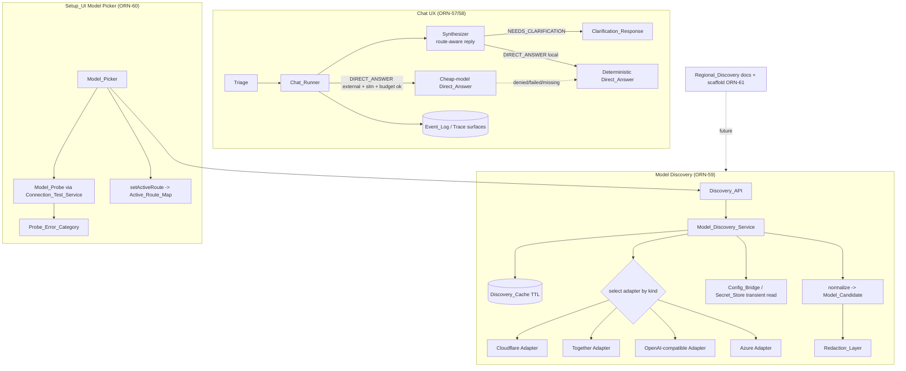
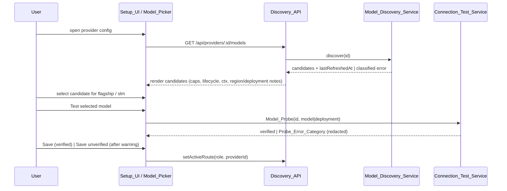

# Design Document: BYOK Chat UX and Model Discovery (ORN-56 → ORN-61)

## Overview

This effort improves two user-facing surfaces of Rector without disturbing the provider-free
**Local_Mode** baseline:

1. **Chat UX (ORN-57, ORN-58).** Today the `Synthesizer` returns a single internal-status string
   (`"Status: … Route: … Trace: … Evidence: …"`) as the `Main_Assistant_Message` for every route,
   including the `NEEDS_CLARIFICATION` and `DIRECT_ANSWER` routes where that prose leaks into the
   chat as the user's actual answer. This design makes the synthesizer **route-aware for those two
   routes only**: vague messages receive a short `Clarification_Response`, simple queries receive a
   short `Direct_Answer_Response`. All internal detail (status, route, trace id, evidence, phase
   events, provider/cost/fallback metadata) stays recorded on run events and is unchanged behind the
   `Trace_Event_Endpoints` and `Trace_Drawer`. Local_Mode answers are deterministic and make zero
   provider calls. External_Mode may upgrade a direct answer with a cheap (`slm`) model when one is
   configured and the `Budget_Gate` allows it, always falling back to the deterministic local text
   on denial, failure, or a missing provider.

2. **Model discovery and selection (ORN-59, ORN-60, ORN-61).** A new backend
   `Model_Discovery_Service` enumerates available models for configured BYOK providers through one
   service interface, delegating to per-kind `Discovery_Adapter`s, normalizing every result into a
   single `Model_Candidate` shape, and caching results with a TTL and config/secret/scope-driven
   invalidation. Two new `Discovery_API` endpoints expose read and refresh. The `Setup_UI` gains a
   `Model_Picker` that discovers, displays, selects, and probes candidates per role
   (`flagship`/`slm`) before saving an `Active_Route_Map` entry, reusing the existing
   `Connection_Test_Service` for a model-and-deployment-aware `Model_Probe`. Cloud-provider
   `Regional_Discovery` (Azure management-plane deployment enumeration, AWS Bedrock region-scoped
   availability) is delivered as documentation plus optional, mockable scaffolding that does not
   block the foundation.

### Design Principles (carried constraints)

- **Local_Mode is the default and the regression baseline.** Every change is additive; the existing
  Local_Mode output for every route other than `NEEDS_CLARIFICATION` and `DIRECT_ANSWER` is
  preserved byte-for-byte (Req 27.3).
- **No secrets across any boundary.** Discovery, the API, the probe, and the UI read secret values
  only transiently through the `Secret_Store` at request time and route every outbound message
  through the `Redaction_Layer` (Req 18, 24, 28).
- **Hermetic tests.** Every adapter, probe, and provider call is exercised against a mocked `fetch`
  or mocked provider; no live network or cloud call occurs in the suite (Req 29).
- **Verification gates.** `npm test` and `npm run build` must continue to pass, preserving the
  existing test-count lower bound (Req 30).

### Research notes informing the design

- **Provider discovery endpoints** were confirmed against the requirement-specified shapes:
  Cloudflare account-scoped catalog `GET /accounts/{account_id}/ai/models/search`; Together native
  `GET /models` with an OpenAI-compatible `GET /v1/models` fallback; OpenAI-compatible `GET
  /v1/models`; Azure data-plane `GET {endpoint}/openai/models?api-version=2024-10-21`. Azure
  deployment enumeration requires the **management plane** (ARM) and therefore cannot be discovered
  from an endpoint + key alone — the Azure adapter reports this honestly rather than fabricating
  deployment ids (Req 15).
- **Existing extension points** the design reuses rather than rebuilds: `runConnectionTest` and
  `resolveTestProvider` (model probe), `buildConfiguredRouter` / `resolveProviderEnv`
  (`Config_Bridge` secret resolution), `ProviderConfigStore` + `SecretStore` (config/secret
  separation), `redactString` / `redactSecrets` (`Redaction_Layer`), and the `synthesizer` /
  `chatRunner` / `triage` modules (chat UX).
- **Testing stack** is Vitest (`vitest run`) with `fast-check` 4.x already a dev dependency, so
  property-based tests use `fast-check` and unit/integration tests use Vitest with a mocked `fetch`.

## Architecture

The effort touches three slices: the chat reply path (Area A/B), the new discovery subsystem (Area
C), and the setup UI / probe path (Area D), plus a documentation/scaffolding deliverable (Area E).



### Chat reply path (ORN-57 / ORN-58)

The only functional change to chat is **where the `Main_Assistant_Message` text comes from for two
routes**. The orchestration phases (planner → skeptic → crucible → DAG → executor → validation) and
all event recording are unchanged.

- `synthesizeChatBrainstemResponse(input)` becomes **route-aware**. It still computes `status`,
  `route`, `traceId`, and `evidence` exactly as today (so trace surfaces are unaffected), but the
  `response` field is selected by `input.triage.route`:
  - `NEEDS_CLARIFICATION` → `buildClarificationResponse(input)` (≤ 3 sentences, no internal prose).
  - `DIRECT_ANSWER` → `buildDeterministicDirectAnswer(input)` (≤ 6 sentences, deterministic, no
    provider content).
  - any other route → the existing `"Status: … Route: … Trace: … Evidence: …"` string, **unchanged**.
- The clarification/direct-answer builders are **pure deterministic functions** of the input so
  Local_Mode stays reproducible (Req 6.2) and provider-free (Req 6.3, 27.2).
- In External_Mode, the `Chat_Runner`, for the `DIRECT_ANSWER` route only, attempts a cheap-model
  answer through the `slm` route via a new `runLiveDirectAnswer` step that mirrors the existing
  `runLiveSynthesizer` discipline: budget preflight before any call, deterministic fallback on
  denial / provider error / missing provider, redaction of the assembled message, and recording of
  route, provider call attempt, cost, and fallback status on the relevant run event.

### Discovery subsystem (ORN-59)

A new `src/providers/discovery/` module:

```
src/providers/discovery/
  types.ts        # Model_Candidate, DiscoveryResult, DiscoveryErrorCategory schemas
  service.ts      # Model_Discovery_Service interface + createModelDiscoveryService
  cache.ts        # Discovery_Cache (TTL + invalidation)
  adapters/
    index.ts          # adapter registry keyed by ProviderKind
    cloudflare.ts      # Req 12
    together.ts        # Req 13
    openaiCompatible.ts# Req 14
    azure.ts           # Req 15
    regional.ts        # Req 25/26 scaffold (no live calls)
```

Request flow for `discover(providerId, options)`:

1. Resolve the `Provider_Config_Record` from the `Provider_Config_Store`. **No record → classified
   `not_found` result, no network call** (Req 10.3, 17.4).
2. If `options.refresh` is false and a live cache entry exists, return the cached result (Req 16.2).
3. Resolve the provider's `baseUrl`/`scope` and read its secret **transiently** through the
   `Secret_Store` (Req 18.4). Select the `Discovery_Adapter` by `record.kind` (Req 10.2).
4. Run the adapter against an injected `fetchImpl`. Normalize each returned entry into a
   `Model_Candidate` (Req 10.4, 11). Route every error message through the `Redaction_Layer` (Req
   18.2).
5. Store the result in the `Discovery_Cache` — a successful result with the full TTL, an error/empty
   result with a shorter TTL (Req 16.1, 16.4). Return the result.

### Discovery cache and invalidation

The `Discovery_Cache` is an in-memory, per-provider map of `{ result, expiresAt }`. A successful
result uses `SUCCESS_TTL_MS`; an error/empty result uses `ERROR_TTL_MS < SUCCESS_TTL_MS`. Cache
invalidation is wired into the `Provider_Config_Store` mutations and secret writes: any
`upsertProvider`, `removeProvider`, `setActiveRoute`, or secret change for a provider id evicts that
provider's cache entry (Req 16.3). The `refresh` endpoint bypasses and overwrites the entry (Req
17.2).

### Setup UI and probe path (ORN-60)



The `Model_Probe` extends `runConnectionTest` with optional `model` and `deployment` inputs so the
single ping targets the selected candidate, and adds a classifier mapping provider failures to a
`Probe_Error_Category` (Req 22, 23). Manual model entry remains available for each role at all times
(Req 21.2, 21.3).

### Regional discovery follow-up (ORN-61)

Area E is primarily a documentation deliverable (`docs/architecture/regional-discovery.md`) plus an
optional `adapters/regional.ts` scaffold whose runtime code (if present) distinguishes
key/region/deployment/model failures and calls only mocked cloud APIs in tests. It does not block
Req 10–24 (Req 26.1).

## Components and Interfaces

This effort adds and extends components across four slices. Existing modules are extended
additively; new modules live under `src/providers/discovery/`. Every signature below is expressed in
terms of the types in the Data Models section.

### Chat UX components (Area A / B)

#### Synthesizer — route-aware reply (`src/orchestration/synthesizer.ts`, extended)

`synthesizeChatBrainstemResponse(input: BrainstemSynthesisInput): BrainstemSynthesis` keeps its
existing signature and still computes `status`, `route`, `traceId`, `evidence`, and
`observability` exactly as today. Only the `response` field becomes route-selected:

```ts
function selectResponseText(input: BrainstemSynthesisInput): string {
  switch (input.triage.route) {
    case "NEEDS_CLARIFICATION":
      return buildClarificationResponse(input);   // <= 3 sentences, no internal prose
    case "DIRECT_ANSWER":
      return buildDeterministicDirectAnswer(input); // <= 6 sentences, deterministic
    default:
      return legacyStatusResponse(input);           // existing "Status: ... Evidence: ..." string
  }
}

// Pure, deterministic builders (no I/O, no provider, no randomness).
export function buildClarificationResponse(input: BrainstemSynthesisInput): string;
export function buildDeterministicDirectAnswer(input: BrainstemSynthesisInput): string;
```

- `buildClarificationResponse` derives a missing-detail hint from the triage `reasons`/message when
  possible, otherwise returns the fixed default text (Req 1.3). It is bounded to ≤ 3 sentences
  (Req 1.4) and never contains the substrings `"Status:"`, `"Route: NEEDS_CLARIFICATION"`,
  `"Trace:"`, `"Evidence:"` (Req 2).
- `buildDeterministicDirectAnswer` is bounded to ≤ 6 sentences (Req 5.3), contains no provider
  content, and is a pure function of `input` so identical input yields identical text (Req 6).
- `legacyStatusResponse` is the current code path, preserved byte-for-byte for every other route
  (Req 27.3).

#### Live direct-answer step (`src/orchestration/synthesizer.ts` or `chatRunner.ts`, new)

A new `runLiveDirectAnswer` mirrors the discipline of the existing `runLiveSynthesizer`
(budget preflight → invoke → validate → redact → fallback):

```ts
export interface LiveDirectAnswerDeps {
  provider?: LLMProvider;            // resolved slm-role provider, if any
  evaluateBudget: typeof evaluateBudget;
  redactOutbound: typeof redactOutbound;
}

export interface LiveDirectAnswerResult {
  response: string;        // cheap-model text on success, deterministic local text on fallback
  providerCalls: number;   // 0 on every fallback path
  fallback?: "denied" | "provider_error" | "no_provider";
  cost?: { estimatedUsd: number; modelCalls: number };
}

export async function runLiveDirectAnswer(
  input: BrainstemSynthesisInput,
  deps: LiveDirectAnswerDeps
): Promise<LiveDirectAnswerResult>;
```

Behavior: if `provider` is absent → `no_provider` fallback with `providerCalls === 0` (Req 8.2);
budget is evaluated before any call (Req 7.2); a denial → `denied` fallback, zero calls (Req 7.3);
a provider error → `provider_error` fallback (Req 8.1); the assembled message is routed through
`redactOutbound` so raw provider error text and secret values never appear (Req 8.3). On every
fallback the deterministic `buildDeterministicDirectAnswer(input)` text is returned.

#### Chat_Runner (`src/orchestration/chatRunner.ts`, extended)

`runExternalChatRun` / `runExternalPostPlanningPhases` invoke `runLiveDirectAnswer` only for the
`DIRECT_ANSWER` route and record route, run id, provider call attempt, cost, and fallback status on
the relevant run event via the existing `runEvent` / `buildProviderCallMetadata` /
`addProviderUsageToRun` helpers (Req 8.4, 9). Local_Mode (`runFakeChatRun`) is unchanged except that
its synthesis text now flows through the route-aware selector, and it continues to make zero
provider/network calls (Req 6.3, 27.2).

### Discovery subsystem (Area C) — `src/providers/discovery/`

#### Model_Discovery_Service (`service.ts`, new)

```ts
export interface DiscoverOptions {
  refresh?: boolean;            // bypass cache (Req 17.2)
  includeDeprecated?: boolean;  // Req 12.4
  fetchImpl?: typeof fetch;     // injected for hermetic tests (Req 29)
}

export interface ModelDiscoveryService {
  discover(providerId: string, options?: DiscoverOptions): Promise<DiscoveryResult>;
}

export function createModelDiscoveryService(deps: {
  configStore: ProviderConfigStore;
  secrets: SecretStore;
  cache: DiscoveryCache;
  adapters: DiscoveryAdapterRegistry;
  clock?: () => number;
}): ModelDiscoveryService;
```

Request flow (matches the Architecture section): resolve record → `not_found` short-circuit with no
network call (Req 10.3) → cache hit within TTL (Req 16.2) → transient secret read (Req 18.4) →
adapter dispatch by `record.kind` (Req 10.2) → normalize to `Model_Candidate` (Req 10.4) →
redact (Req 18.2) → cache write with success/error TTL (Req 16.1, 16.4).

#### Discovery_Adapter (`adapters/index.ts`, new)

```ts
export interface DiscoveryAdapter {
  readonly kind: ProviderKind;
  discover(ctx: AdapterContext): Promise<AdapterResult>;
}

export interface AdapterContext {
  record: ProviderConfigRecord;        // non-secret config
  secret?: string;                     // transient, never persisted/logged
  fetchImpl: typeof fetch;
  includeDeprecated: boolean;
}

export type AdapterResult =
  | { ok: true; candidates: ModelCandidate[] }
  | { ok: false; error: DiscoveryError };

export type DiscoveryAdapterRegistry = Record<ProviderKind, DiscoveryAdapter>;
```

Concrete adapters: `cloudflare.ts` (Req 12), `together.ts` (Req 13), `openaiCompatible.ts`
(Req 14), `azure.ts` (Req 15), and `regional.ts` scaffold (Req 25/26). Each builds its request URL
from `record` + `scope`, parses defensively, and returns a classified `DiscoveryError` rather than
throwing on a malformed payload (Req 14.2, 14.3).

#### Discovery_Cache (`cache.ts`, new)

```ts
export interface DiscoveryCache {
  get(providerId: string, now: number): DiscoveryResult | undefined;
  set(providerId: string, result: DiscoveryResult, now: number): void;
  invalidate(providerId: string): void;
}

export const SUCCESS_TTL_MS: number;
export const ERROR_TTL_MS: number; // strictly < SUCCESS_TTL_MS (Req 16.4)
```

Invalidation hooks are wired into `ProviderConfigStore.upsertProvider` / `removeProvider` /
`setActiveRoute` and every secret write for a provider id (Req 16.3).

#### Discovery_API (`src/api/server.ts`, extended)

- `GET /api/providers/:id/models` → `discover(id)`; returns candidates + `lastRefreshedAt`
  (Req 17.1) or a classified, redacted error (Req 17.3); unknown id → redacted not-found, no network
  (Req 17.4).
- `POST /api/providers/:id/models/refresh` → `discover(id, { refresh: true })`, overwriting the
  cache (Req 17.2).

### Setup UI and probe path (Area D)

#### Connection_Test_Service / Model_Probe (`src/providers/configBridge.ts` + API, extended)

`resolveTestProvider` and the existing `/api/setup/test-connection` path gain optional `model` and
`deployment` inputs so a single ping targets the selected candidate (Req 22.1, 22.2). A new
classifier maps a failed probe to a `ProbeErrorCategory`:

```ts
export function classifyProbeError(signal: ProbeFailureSignal): ProbeErrorCategory;
export interface ProbeResult {
  ok: boolean;
  category?: ProbeErrorCategory;  // present on failure (Req 23.1, 23.2)
  message: string;                // redacted (Req 23.3)
}
```

#### Model_Picker (`src/public/app.js`, `index.html`, `styles/`, extended)

A pure render helper plus DOM wiring: `renderCandidate(candidate: ModelCandidate): string` produces
markup that includes capability tags, lifecycle (with a deprecated indicator), context/pricing when
present, and a region/deployment note when required (Req 20). Role selectors for `flagship`/`slm`
keep a manual override input at all times (Req 21), surface the `lastRefreshedAt` (Req 19.3), show a
redacted error while keeping manual entry on discovery failure (Req 19.4), gate "save unverified"
behind a warning (Req 22.5), and represent secret presence as a boolean only — never a value
(Req 24.1, 24.3). For Azure providers it renders the deployment-name explanation (Req 24.2).

### Regional discovery scaffold (Area E)

`docs/architecture/regional-discovery.md` (documentation, Req 25) plus an optional
`adapters/regional.ts` whose runtime code — if present — distinguishes invalid-key from
region/deployment/model-unavailability failures (Req 26.2) and calls only mocked cloud APIs in
tests (Req 26.3). It does not block Req 10–24 (Req 26.1).

## Data Models

All shapes are Zod schemas with `z.infer` types, consistent with the existing codebase
(`src/providers/config.ts`, `src/store/schemas.ts`).

### Model_Candidate (new, `discovery/types.ts`) — Req 11

```ts
export const ModelCandidateScopeSchema = z
  .object({
    accountId: z.string().optional(),
    region: z.string().optional(),
    endpoint: z.string().optional(),
    azureResource: z.string().optional(),
    subscriptionId: z.string().optional(),
    resourceGroup: z.string().optional(),
  })
  .strict();

export const ModelLifecycleSchema = z.union([
  z.enum(["active", "preview", "deprecated"]),
  z.string().min(1), // another provider-reported string (Req 11.4)
]);

export const ModelCandidateSchema = z
  .object({
    // Required (Req 11.1)
    providerId: z.string().min(1),
    kind: ProviderKindSchema,
    scope: ModelCandidateScopeSchema,            // sub-fields optional (Req 11.2)
    displayName: z.string().min(1),
    capabilities: z.array(z.string().min(1)),    // capability tags (Req 11.5)
    requiresDeployment: z.boolean(),
    requiresRegion: z.boolean(),
    source: z.string().min(1),                   // adapter/source label
    lastRefreshedAt: z.string().datetime(),
    // Optional (Req 11.3)
    modelId: z.string().optional(),
    deploymentId: z.string().optional(),
    contextWindow: z.number().int().positive().optional(),
    pricing: z
      .object({ inputPer1k: z.number().optional(), outputPer1k: z.number().optional(), currency: z.string().optional() })
      .optional(),
    lifecycle: ModelLifecycleSchema.optional(),
  })
  .strict();
export type ModelCandidate = z.infer<typeof ModelCandidateSchema>;
```

### DiscoveryResult / DiscoveryError (new) — Req 10, 17, 18

```ts
export const DiscoveryErrorCategorySchema = z.enum([
  "not_found",          // no Provider_Config_Record (Req 10.3, 17.4)
  "auth_invalid",
  "endpoint_invalid",
  "unsupported_response",
  "network_error",
  "rate_limited",
  "requires_management_plane", // Azure deployment enumeration (Req 15.4)
  "unknown",
]);

export const DiscoveryErrorSchema = z.object({
  category: DiscoveryErrorCategorySchema,
  message: z.string(), // redacted (Req 18.2)
});

export const DiscoveryResultSchema = z.discriminatedUnion("ok", [
  z.object({ ok: z.literal(true), providerId: z.string(), candidates: z.array(ModelCandidateSchema), lastRefreshedAt: z.string().datetime() }),
  z.object({ ok: z.literal(false), providerId: z.string(), error: DiscoveryErrorSchema, lastRefreshedAt: z.string().datetime() }),
]);
export type DiscoveryResult = z.infer<typeof DiscoveryResultSchema>;
```

### Cache entry (new) — Req 16

```ts
interface DiscoveryCacheEntry {
  result: DiscoveryResult;
  expiresAt: number; // now + (result.ok ? SUCCESS_TTL_MS : ERROR_TTL_MS)
}
```

### Probe_Error_Category (new) — Req 23.2

```ts
export const ProbeErrorCategorySchema = z.enum([
  "auth_invalid",
  "endpoint_invalid",
  "region_unsupported",
  "deployment_not_found",
  "model_access_missing",
  "quota_exceeded",
  "parameter_incompatible",
  "content_rejected",
  "unknown",
]);
export type ProbeErrorCategory = z.infer<typeof ProbeErrorCategorySchema>;
```

### Reused existing models (unchanged)

- `BrainstemSynthesisInput` / `BrainstemSynthesis` (`synthesizer.ts`) — route-aware `response`.
- `TriageResult` / `TriageRoute` (`triage.ts`).
- `ProviderConfigRecord`, `ActiveRouteMap`, `ProviderKind`, `ProviderModelRole`
  (`providers/config.ts`) — discovery reads these; the record carries `secretRef`, never a secret
  value (Req 18.4, 28.2).
- `SecretStore` (`security/secretStore.ts`) — transient `getSecret` reads only.

## Correctness Properties

*A property is a characteristic or behavior that should hold true across all valid executions of a
system — essentially, a formal statement about what the system should do. Properties serve as the
bridge between human-readable specifications and machine-verifiable correctness guarantees.*

These properties are suitable for property-based testing because the core logic is made of pure
functions with large input spaces: the deterministic reply builders, the discovery normalizer, the
cache, and the error/redaction layers. UI rendering, API wiring, documentation, and CI gates are
covered by example, integration, and smoke tests instead (see Testing Strategy).

### Property 1: Clarification replies carry no internal prose and stay short

*For any* `BrainstemSynthesisInput` whose triage route is `NEEDS_CLARIFICATION`, the synthesized
`response` SHALL contain none of the substrings `"Status:"`, `"Route: NEEDS_CLARIFICATION"`,
`"Trace:"`, or `"Evidence:"`, and SHALL consist of at most 3 sentences.

**Validates: Requirements 1.1, 1.4, 2.1, 2.2, 2.3, 2.4, 3.3**

### Property 2: Direct answers carry no internal prose and stay bounded

*For any* `BrainstemSynthesisInput` whose triage route is `DIRECT_ANSWER`, the synthesized
`response` SHALL contain none of the substrings `"Status:"`, `"Route:"`, `"Trace:"`, or
`"Evidence:"`, and SHALL consist of at most 6 sentences.

**Validates: Requirements 5.1, 5.2, 5.3**

### Property 3: Local_Mode replies are deterministic and provider-free

*For any* `BrainstemSynthesisInput` evaluated in Local_Mode, two evaluations SHALL produce identical
`response` text, the result SHALL contain no provider-specific content, and `providerCalls` SHALL
equal 0.

**Validates: Requirements 6.1, 6.2, 6.3, 27.2**

### Property 4: Non-target routes preserve legacy output

*For any* `BrainstemSynthesisInput` whose triage route is neither `NEEDS_CLARIFICATION` nor
`DIRECT_ANSWER`, the synthesized `response` SHALL equal the existing legacy
`"Status: … Route: … Trace: … Evidence: …"` text byte-for-byte.

**Validates: Requirements 27.3**

### Property 5: Empty or whitespace input routes to clarification

*For any* string consisting solely of whitespace (including the empty string, spaces, tabs, and
newlines), `triageUserMessage` SHALL assign the `NEEDS_CLARIFICATION` route.

**Validates: Requirements 3.2**

### Property 6: Direct-answer external failures fall back to deterministic local text

*For any* `DIRECT_ANSWER` input in External_Mode where the budget denies the call, the provider
errors, or no provider is configured, `runLiveDirectAnswer` SHALL return the deterministic
Local_Mode direct-answer text and SHALL report `providerCalls === 0` for that step.

**Validates: Requirements 7.3, 8.1, 8.2**

### Property 7: Discovery dispatches to the adapter for the provider kind

*For any* configured `ProviderConfigRecord`, the `Model_Discovery_Service` SHALL invoke exactly the
`Discovery_Adapter` registered for that record's `kind`.

**Validates: Requirements 10.2**

### Property 8: Unknown provider id short-circuits with no network call

*For any* provider id that has no `Provider_Config_Record`, the `Model_Discovery_Service` and
`Discovery_API` SHALL return a classified, redacted `not_found` result and SHALL make zero network
calls.

**Validates: Requirements 10.3, 17.4**

### Property 9: Every adapter entry normalizes to a valid Model_Candidate

*For any* raw provider model list (including entries with arbitrary missing optional fields), every
normalized entry SHALL parse successfully against `ModelCandidateSchema` with all required fields
present, and normalization SHALL NOT throw.

**Validates: Requirements 10.4, 11.1, 11.2, 11.3, 11.4, 11.5, 14.2**

### Property 10: Cloudflare default and deprecated filtering

*For any* Cloudflare account catalog, the default result SHALL contain only text-generation, chat,
or embedding candidates; when deprecated models are not requested the result SHALL exclude every
candidate marked deprecated, and when requested it SHALL include them, while non-deprecated
candidates SHALL always be present.

**Validates: Requirements 12.2, 12.3, 12.4**

### Property 11: Azure candidates always require a deployment and never expose deployment ids

*For any* Azure data-plane model list discovered from an endpoint plus API key, every returned
`Model_Candidate` SHALL have `requiresDeployment === true` and SHALL carry no `deploymentId`.

**Validates: Requirements 15.2, 15.3**

### Property 12: Failures yield a classified category, never a raw body

*For any* discovery or probe failure (network error, unrecognizable response, or simulated cloud
failure), the result SHALL be one of the defined error categories rather than the raw provider error
body, and a scaffold cloud failure SHALL distinguish an invalid key from region, deployment, or
model unavailability.

**Validates: Requirements 14.3, 17.3, 18.1, 23.1, 26.2**

### Property 13: Cache serves within TTL, invalidates on change, and refresh bypasses

*For any* provider with a cached result: a discover within the TTL without `refresh` SHALL return
the cached value with zero network calls; a config, secret, or scope change SHALL evict the entry; a
`refresh` SHALL always re-run discovery and overwrite the entry; and an error/empty result SHALL be
stored with a strictly shorter TTL than a successful result.

**Validates: Requirements 16.1, 16.2, 16.3, 16.4, 17.2**

### Property 14: No secret value crosses any boundary

*For any* discovery result, probe result, error message, or rendered config/candidate view that is
derived from input containing a secret value, the produced output SHALL exclude that secret value.

**Validates: Requirements 8.3, 18.2, 18.3, 23.3, 24.1, 28.1, 28.3**

### Property 15: Config records hold a reference, never a secret value

*For any* persisted `ProviderConfigRecord`, the record SHALL carry a `secretRef` and SHALL NOT
contain the secret value itself.

**Validates: Requirements 18.4, 28.2**

### Property 16: Rendered candidates include their present detail

*For any* `Model_Candidate`, the rendered Model_Picker markup SHALL include the candidate's
capability tags, and SHALL include the lifecycle status (with a deprecated indicator when the
lifecycle is `deprecated`), context window or pricing, and region or deployment note whenever those
fields are present.

**Validates: Requirements 20.1, 20.2, 20.3, 20.4**

### Property 17: Secret presence is exposed only as a boolean

*For any* provider configuration view model, the secret SHALL be represented as a boolean presence
state only and never as a value.

**Validates: Requirements 24.3**

## Error Handling

The design treats errors as classified, redacted values rather than thrown exceptions or raw
provider text. The boundaries:

- **Chat reply fallback.** Any failure in the External_Mode direct-answer path (budget denial,
  provider error, missing provider, redaction failure) resolves to the deterministic Local_Mode
  text. `runLiveDirectAnswer` never propagates a provider exception to the chat reply; it records
  the fallback reason on the run event and returns usable text (Req 7.3, 8.1–8.4). Local_Mode has no
  external failure surface.
- **Discovery errors.** Adapters never throw on a malformed or unexpected payload; they return
  `{ ok: false, error: { category, message } }` (Req 14.3, 18.1). The service maps transport
  failures, auth failures, and unrecognizable responses to a `DiscoveryErrorCategory`. The unknown
  provider id case returns `not_found` without any network call (Req 10.3, 17.4). Azure deployment
  enumeration requests return `requires_management_plane` rather than fabricating ids (Req 15.4).
- **Probe errors.** A failed `Model_Probe` is classified into a `ProbeErrorCategory` so the UI can
  tell the user whether to fix their key, region, deployment, or model access (Req 23).
- **Redaction at every boundary.** Every outbound error message — discovery, probe, API, streamed,
  and UI — is routed through `redactString` / `redactOutbound` / `redactSecrets`
  (`src/security/redaction.ts`). If redaction itself fails, `redactOutbound` suppresses the raw
  content and returns the fixed `REDACTION_FAILED_ERROR` so no unredacted substring escapes
  (Req 8.3, 18.2, 18.3, 23.3, 28).
- **Cache degradation.** Error and empty results are cached with the shorter `ERROR_TTL_MS` so a
  transient failure is retried sooner than a successful result is refreshed (Req 16.4).
- **UI resilience.** A discovery error renders the redacted message while keeping manual model entry
  available, so a failing provider never blocks configuration (Req 19.4, 21.3).

## Testing Strategy

The suite stays hermetic: every adapter, probe, and provider call runs against a mocked `fetch` or a
mocked provider, with no live provider, network, or cloud call (Req 29). Tooling is Vitest
(`vitest run`) with `fast-check` 4.x for property tests.

### Property-based tests

- Implemented with `fast-check`; each of Properties 1–17 above is implemented by a **single**
  property-based test.
- Each test runs a **minimum of 100 iterations**.
- Each test is tagged with a comment referencing its design property, in the format:
  **Feature: byok-chat-ux-and-model-discovery, Property {number}: {property_text}**.
- Generators include: arbitrary `BrainstemSynthesisInput` across all triage routes; whitespace-only
  strings; arbitrary raw provider model lists with randomly present/absent optional fields; secret
  strings embedded in error/config inputs to exercise redaction; and clock/TTL values for the cache.
- We do **not** implement property-based testing from scratch; we use `fast-check`.

### Unit (example) tests

Cover specific phrasing and branch behavior that is not universal: the default clarification text
(Req 1.3) and missing-detail phrasing (Req 1.2); the greeting set routing (Req 3.1); adapter request
URLs (Req 12.1, 13.1, 14.1, 15.1); the Together `/v1/models` fallback edge (Req 13.2); the Azure
management-plane message (Req 15.4); the `Probe_Error_Category` mapping table covering each category
(Req 23.2); default-mode selection (Req 27.1); and event-recording fields for clarification and
direct-answer turns (Req 4.1, 8.4, 9).

### Integration tests

Exercise the API wiring with 1–3 representative examples each: `GET /api/providers/:id/models` and
`POST /api/providers/:id/models/refresh` happy-path and error/not-found responses (Req 17); the
`Trace_Event_Endpoints` returning recorded internal detail for a clarification run (Req 4.2); and the
`Model_Probe` end-to-end through the existing connection-test path with a mocked provider
(Req 22.1, 22.2).

### UI / DOM tests

Cover Setup_UI behavior that is not a pure render: Discover/Refresh controls and rendered
`lastRefreshedAt` (Req 19); role selection with manual override retained when there are no
candidates (Req 21); verified/unverified save flow with the warning gate (Req 22.3–22.5); and the
Azure deployment explanation (Req 24.2). The pure `renderCandidate` content is covered by
Property 16.

### Smoke / documentation checks

- `docs/architecture/regional-discovery.md` includes the required Azure management-plane fields, the
  AWS Bedrock notes, the data-residency/IAM warning, and the separate-adapter note (Req 25).
- Snapshots and fixtures are scrubbed of secret values (Req 28.4).
- The Verification_Gates run `npm test` and `npm run build`, preserving the baseline lower bound of
  106 test files and 951 passing tests (Req 30).
