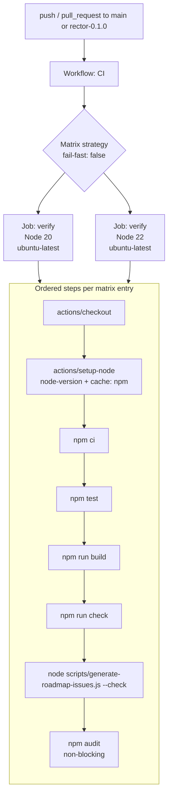

# Design Document

## Overview

This design specifies a single GitHub Actions continuous integration (CI) workflow,
committed at `.github/workflows/ci.yml`, that reproduces Rector's known-good local
verification gates on every push and pull request to the protected branches (`main` and
`rector-0.1.0`). The workflow enforces the `Verification_Baseline` (`npm test`,
`npm run build`, `npm run check`), the deterministic `Drift_Check`
(`node scripts/generate-roadmap-issues.js --check`), and a non-blocking dependency
`Audit_Step` (`npm audit`) across a Node version matrix of Node 20 and Node 22.

The workflow is intentionally minimal and self-contained:

- **Provider-free and secret-free.** It references no repository secret, no API key, and
  performs no real network access beyond the npm package registry. This mirrors Rector's
  default `Provider_Free_Mode` so automation matches local developer behavior. (Req 8)
- **Deterministic.** Dependencies install with `npm ci` against the committed
  `package-lock.json`, and the `Drift_Check` is a local-only filesystem comparison with no
  network calls. (Req 3, Req 5)
- **Release-neutral.** The workflow never publishes, tags, or pushes. Release tagging stays a
  manual, maintainer-gated action. The job is structured so a separate release workflow can be
  added later without touching the `verify` job. (Req 12)

This document also covers how the workflow will be validated (without adding a YAML-parser
dependency to the repo) and a documentation-update plan so contributors know which gates must
pass before merge.

### Goals

- Catch regressions in test, build, and type-check before merge on every supported Node
  version.
- Keep the issue catalog in sync via the drift check.
- Surface dependency advisories without blocking alpha work.
- Preserve the provider-free, no-secrets, no-network guarantees in automation.

### Non-Goals

- Publishing to any registry, creating/pushing git tags, or pushing commits (out of scope per
  Req 12).
- Running live-provider or network-dependent tests.
- Adding a YAML-parsing dependency to the project solely to validate the workflow file.
- Adding `npm audit fix --force` or any auto-remediation of the deferred advisories.

### Requirements Coverage Map

| Requirement | Addressed By |
|---|---|
| 1 — Valid CI workflow file | Architecture → Workflow File Layout; Components → Workflow / Job |
| 2 — Trigger on push and PR | Components → Trigger Configuration |
| 3 — Deterministic install | Components → Steps (checkout, setup-node, `npm ci`) |
| 4 — Verification baseline | Components → Steps (`npm test`, `npm run build`, `npm run check`) |
| 5 — Drift check | Components → Steps (drift check); Design Decisions → Drift Check |
| 6 — Node version matrix | Architecture → Matrix Strategy |
| 7 — Non-blocking audit | Components → Steps (audit); Design Decisions → Non-Blocking Audit |
| 8 — No secrets / provider-free | Architecture → Permissions & Provider-Free Guarantees |
| 9 — npm cache | Components → Steps (setup-node cache) |
| 10 — Document CI gates | Documentation Update Plan |
| 11 — Local-equivalent commands pass | Testing Strategy → Local Validation |
| 12 — Release out of scope | Architecture → Release Boundary |

## Architecture

The CI surface is a single declarative workflow file consumed by the `CI_Provider` (GitHub
Actions). There is no application code in this spec — the deliverable is configuration plus
documentation. The conceptual structure is:



### Workflow File Layout

The file lives at `.github/workflows/ci.yml` (Req 1.1) and is structured top-down as:

1. `name:` — a human-readable workflow name, `CI`, identifying it as continuous integration
   (Req 1.4).
2. `on:` — explicit `push` and `pull_request` triggers scoped to protected branches (Req 2.3).
3. `permissions:` — least-privilege, `contents: read` only (Req 8, Req 12).
4. `jobs:` — a single `verify` job (Req 1.3) running the matrix and the ordered steps.

The `.github/workflows/` directory does not yet exist in the repo (only `.github/ISSUE_TEMPLATE`
and `.github/pull_request_template.md` are present), so creating the workflow file also creates
the `workflows/` directory.

### Matrix Strategy

The `verify` job uses a `CI_Provider` matrix strategy over `node-version: [20, 22]` (Req 6.1,
6.2, 6.3). Key choices:

- `runs-on: ubuntu-latest` — Linux is the cheapest, fastest GitHub-hosted runner and matches the
  project's development assumptions; no OS-specific behavior is under test.
- `strategy.fail-fast: false` — a failure on one Node version does not cancel the other, so
  maintainers see results for both Node 20 and Node 22 in a single run (supports Req 6.4 by
  reporting per-entry failures independently).
- The job display name is `Verify / Node ${{ matrix.node-version }}` so each matrix leg is
  individually identifiable in the checks UI and in branch-protection required-check lists.

Because every step (install, baseline, drift check, audit) runs inside the matrixed job, each
Node version independently exercises the full gate set (Req 6.1, 6.2, 6.4).

### Permissions and Provider-Free Guarantees

- `permissions: contents: read` at the workflow level grants the `GITHUB_TOKEN` read-only
  access. The workflow cannot push commits, create tags, or write releases even if a step
  attempted to, which structurally enforces Req 12.1–12.3 and supports Req 8.
- No `secrets.*` references appear anywhere in the file (Req 8.1). No `env:` block injects
  credentials.
- No step sets provider flags or supplies API keys, so the run executes in `Provider_Free_Mode`
  (Req 8.2). The test suite already mocks `fetch` and requires no credentials (per the testing
  steering policy), so `npm test` stays green with zero real network/model calls.
- The only outbound network is to the npm registry during `npm ci` and `npm audit` (Req 8.3,
  Req 5.3). The `Drift_Check` is pure local filesystem I/O (see Design Decisions).
- Req 8.4 is satisfied by construction: no step in scope requires a secret, API key, or provider
  network access, so none is included.

### Release Boundary

This workflow performs no `Release_Action`. There are no publish, tag, or push steps (Req 12.1–
12.3). The single-job design with a read-only token means a future release workflow can be added
as a *separate* file (e.g. `.github/workflows/release.yml`) triggered by tag events, without
modifying the `verify` job (Req 12.4). Release tagging remains a manual, maintainer-gated step
outside this spec (Req 12.5).

## Components and Interfaces

The "components" here are the logical sections of the workflow file and the external Actions it
composes. Each subsection notes the requirement(s) it satisfies.

### Workflow Metadata

- `name: CI` — identifies the workflow as continuous integration (Req 1.4).

### Trigger Configuration

Triggers are declared explicitly (Req 2.3):

- `on.push.branches: [main, rector-0.1.0]` — a push to either protected branch starts the
  workflow (Req 2.1).
- `on.pull_request.branches: [main, rector-0.1.0]` — a pull request targeting either protected
  branch starts the workflow (Req 2.2).

Scoping both events to the protected branch set keeps CI focused on the branches that gate
merges while still covering PRs from feature branches that *target* those branches (PR events
filter on the base branch).

### Job: `verify`

A single named job (Req 1.3) with:

- `name: Verify / Node ${{ matrix.node-version }}`
- `runs-on: ubuntu-latest`
- `strategy.fail-fast: false`
- `strategy.matrix.node-version: [20, 22]`

### Step Interfaces (ordered)

The step order is contractual: install must precede all verification, and verification must
precede the audit. Ordering satisfies Req 3.2 (install before baseline/drift) and the implicit
"build before check is not required but baseline order is stable" expectation.

1. **Checkout** — `actions/checkout@v4`
   - Interface: clones the repository at the triggering ref into the runner workspace.
   - Rationale: all subsequent steps need the source tree and the committed lockfile.

2. **Setup Node + cache** — `actions/setup-node@v4`
   - Inputs: `node-version: ${{ matrix.node-version }}`, `cache: npm`.
   - Interface: installs the requested Node major version and enables `NPM_Cache` keyed on the
     committed `package-lock.json` (Req 9.1, 9.2). On a cache hit the npm download cache is
     restored before install, and reused during `npm ci` (Req 9.3). The cache automatically
     invalidates when the lockfile hash changes.
   - Note: `cache: npm` caches the npm *download* cache (`~/.npm`), not `node_modules`, which is
     the correct and supported pairing with `npm ci`.

3. **Install** — `run: npm ci`
   - Interface: deterministic install from `package-lock.json` (Req 3.1). Runs before any
     baseline command or the drift check (Req 3.2). A non-zero exit fails the job and, because
     it is an earlier step, GitHub Actions stops the remaining steps in that matrix leg
     (Req 3.3).

4. **Test** — `run: npm test`
   - Interface: runs `vitest run` once (Req 4.1). Non-zero exit fails the job (Req 4.4).

5. **Build** — `run: npm run build`
   - Interface: runs `tsc && node scripts/fix-dist-esm-imports.js` (Req 4.2). Non-zero exit
     fails the job (Req 4.4).

6. **Type check** — `run: npm run check`
   - Interface: runs `tsc --noEmit` (Req 4.3). Non-zero exit fails the job (Req 4.4).

7. **Drift check** — `run: node scripts/generate-roadmap-issues.js --check`
   - Interface: validates the canonical catalog and compares generated issue docs against the
     committed `docs/issues/generated/` files (Req 5.1). Non-zero exit (stale/missing/extra
     files or catalog validation errors) fails the job (Req 5.2). Pure filesystem I/O — no
     network beyond what install already used (Req 5.3).

8. **Audit (non-blocking)** — `run: npm audit` with `continue-on-error: true`
   - Interface: runs `npm audit` and prints the advisory report to the run logs (Req 7.1,
     7.4). `continue-on-error: true` makes the step `Non_Blocking` so an audit failure (exit
     code from found advisories) does not fail the job (Req 7.2). When only `Deferred_Advisory`
     findings are present and the baseline plus drift check pass, the overall job still reports
     success (Req 7.3).

### External Action Versions

| Action | Pinned tag | Purpose |
|---|---|---|
| `actions/checkout` | `@v4` | Clone repo source |
| `actions/setup-node` | `@v4` | Install Node + enable npm cache |

Major-version tags (`@v4`) are used for readability and routine maintainability in an alpha
preview. A future hardening pass may pin to commit SHAs; that trade-off is noted in Design
Decisions.

## Data Models

This feature has no runtime data model. The relevant "data" is the static structure of the
workflow file and the configuration values it carries. The conceptual schema:

```yaml
# .github/workflows/ci.yml (shape, not final content)
name: <string>                       # "CI"                       (Req 1.4)
on:
  push:
    branches: [<string>, ...]        # [main, rector-0.1.0]       (Req 2.1, 2.3)
  pull_request:
    branches: [<string>, ...]        # [main, rector-0.1.0]       (Req 2.2, 2.3)
permissions:
  contents: read                     # least privilege            (Req 8, Req 12)
jobs:
  verify:
    name: <string>                   # "Verify / Node ${{ matrix.node-version }}"
    runs-on: ubuntu-latest
    strategy:
      fail-fast: <bool>              # false                      (Req 6.4)
      matrix:
        node-version: [<int>, ...]   # [20, 22]                   (Req 6.1, 6.2, 6.3)
    steps:
      - uses: actions/checkout@v4
      - uses: actions/setup-node@v4
        with:
          node-version: ${{ matrix.node-version }}
          cache: npm                 # NPM_Cache on lockfile      (Req 9)
      - run: npm ci                   # Deterministic_Install      (Req 3)
      - run: npm test                 # Verification_Baseline      (Req 4.1)
      - run: npm run build            # Verification_Baseline      (Req 4.2)
      - run: npm run check            # Verification_Baseline      (Req 4.3)
      - run: node scripts/generate-roadmap-issues.js --check  # Drift_Check (Req 5)
      - run: npm audit                # Audit_Step (non-blocking)  (Req 7)
        continue-on-error: true
```

Key configuration values (treated as the authoritative "data"):

| Field | Value | Source requirement |
|---|---|---|
| Workflow name | `CI` | Req 1.4 |
| Trigger events | `push`, `pull_request` | Req 2 |
| Trigger branches | `main`, `rector-0.1.0` | Req 2.1, 2.2 |
| Permissions | `contents: read` | Req 8, Req 12 |
| Node matrix | `[20, 22]` | Req 6 |
| `fail-fast` | `false` | Req 6.4 |
| Install command | `npm ci` | Req 3.1 |
| Baseline commands | `npm test`, `npm run build`, `npm run check` | Req 4 |
| Drift command | `node scripts/generate-roadmap-issues.js --check` | Req 5.1 |
| Audit command | `npm audit` (`continue-on-error: true`) | Req 7 |

## Design Decisions and Rationale

### Decision 1: Single matrixed `verify` job vs. multiple jobs

**Decision:** Use one `verify` job parameterized by a Node-version matrix rather than separate
jobs per gate or per Node version.

**Rationale:** The gates are sequential and share the same installed dependency tree, so one job
per matrix entry minimizes redundant `npm ci`/cache work while still exercising every gate on
every Node version (Req 6). It also produces a small, stable set of named checks
(`Verify / Node 20`, `Verify / Node 22`) suitable for branch protection. A future release
workflow stays a separate file, keeping this job untouched (Req 12.4).

### Decision 2: `fail-fast: false`

**Decision:** Disable fail-fast on the matrix.

**Rationale:** Maintainers benefit from seeing whether a failure is Node-version-specific. With
fail-fast enabled, a Node 20 failure would cancel the Node 22 leg and hide whether the problem
reproduces there. Disabling it gives complete per-entry results (Req 6.4).

### Decision 3: Non-blocking audit via `continue-on-error: true`

**Decision:** Run `npm audit` as a visible-but-non-blocking step using `continue-on-error: true`
rather than `npm audit || true`.

**Rationale:** The dependency-security-triage spec intentionally defers the remaining Vitest/Vite
dev-tooling advisories pending maintainer approval; failing CI on them would block all alpha work
(Req 7.2, 7.3). `continue-on-error: true` is preferred over `npm audit || true` because GitHub
Actions renders the step with a distinct "failed but continued" annotation, keeping the advisory
*visible* in the run summary (Req 7.4) instead of silently swallowing the non-zero exit. The
project already pins `overrides.esbuild: ">=0.25.0"`, so the audit surface is the known deferred
set. We explicitly do **not** run `npm audit fix --force`, which could introduce breaking major
upgrades without review.

### Decision 4: Drift check runs in CI and is network-free

**Decision:** Include `node scripts/generate-roadmap-issues.js --check` as a first-class gate.

**Rationale:** Inspection of the script confirms it only reads the canonical catalog
(`docs/issues/roadmap-issues.json`), validates it, regenerates the expected file set in memory,
and compares it to the committed `docs/issues/generated/` files — no network, no writes in
`--check` mode (Req 5.3). It exits non-zero on any missing/changed/extra file or catalog
validation error, which correctly fails the job on drift (Req 5.2). Running it under the matrix
also confirms it behaves identically on Node 20 and Node 22.

### Decision 5: `cache: npm` keyed on the lockfile

**Decision:** Enable caching via `actions/setup-node`'s built-in `cache: npm` rather than a
hand-rolled `actions/cache` step.

**Rationale:** `setup-node`'s integrated cache keys automatically on the detected
`package-lock.json` hash (Req 9.2), restores on hit, and saves on completion with no extra
configuration. This is the least-error-prone way to satisfy Req 9 and pairs correctly with
`npm ci` (it caches `~/.npm`, not `node_modules`).

### Decision 6: `contents: read` least-privilege permissions

**Decision:** Set `permissions: contents: read` at the workflow level.

**Rationale:** CI only needs to read the source to verify it. A read-only token cannot push,
tag, or publish, structurally guaranteeing the release boundary (Req 12.1–12.3) and reinforcing
the no-secrets posture (Req 8). Declaring permissions explicitly also overrides any
broader repository default.

### Decision 7: Major-version action tags (`@v4`)

**Decision:** Pin `actions/checkout` and `actions/setup-node` to `@v4`.

**Trade-off:** Major-version tags receive security/patch updates automatically but are mutable.
For an Apache-2.0 alpha preview running provider-free with a read-only token and no secrets, the
supply-chain blast radius is minimal and readability/maintainability win. A later hardening pass
can pin to immutable commit SHAs if the threat model changes. This trade-off is documented rather
than silently chosen.

### Decision 8: No YAML-parser dependency added for validation

**Decision:** Validate the workflow file by structured inspection and by GitHub Actions itself,
not by adding a YAML library to `package.json`.

**Rationale:** The repo currently has no YAML dependency, and adding one solely to lint a single
CI file would expand the dependency/audit surface this spec is trying to keep small. Validation
relies on (a) careful manual/structured review against this design, (b) GitHub's own parser at
run time (Req 1.2 is ultimately enforced by the `CI_Provider`), and (c) optional ad-hoc local
checks using already-available tooling (see Testing Strategy). See that section for the full
rationale and alternatives.

## Property-Based Testing Applicability

Property-based testing is **not applicable** to this feature. The deliverable is a declarative
GitHub Actions workflow file (Infrastructure-as-Code/CI configuration) plus documentation, not a
function with inputs and outputs. There is no code under test for which a meaningful "for all
inputs X, property P(X) holds" statement can be written. Per the project's testing guidance, IaC
and CI configuration should be validated with structural/snapshot inspection and integration
(actual CI execution), not PBT. Accordingly, the **Correctness Properties** section is
intentionally omitted, and the `prework` tool was not run.

## Error Handling

Error handling for a CI workflow means: which conditions must fail the job, which must not, and
how failures are surfaced.

| Condition | Behavior | Requirement |
|---|---|---|
| `npm ci` fails (e.g. lockfile mismatch, registry error) | Job fails; later steps do not run | Req 3.3 |
| `npm test` exits non-zero | Job fails | Req 4.4 |
| `npm run build` exits non-zero | Job fails | Req 4.4 |
| `npm run check` exits non-zero | Job fails | Req 4.4 |
| Drift check exits non-zero (stale/missing/extra docs, invalid catalog) | Job fails | Req 5.2 |
| `npm audit` finds advisories (non-zero exit) | Step marked failed-but-continued; job **not** failed | Req 7.2, 7.3 |
| Failure on one Node-matrix entry | That entry fails; other entry still runs (`fail-fast: false`) | Req 6.4 |
| A step would require a secret / API key / provider network | Excluded from the workflow by design | Req 8.4 |

Surfacing:

- All step stdout/stderr (including the full `npm audit` report) appears in the per-step logs
  (Req 7.4).
- Failed required steps annotate the run summary and propagate to the named check
  (`Verify / Node N`) used by branch protection.
- The non-blocking audit produces a distinct "continued on error" annotation, keeping the
  advisory visible without blocking (Req 7.2, 7.4).

GitHub Actions runs `run:` steps with a fail-fast shell (`bash -e` on Linux) by default, so any
non-zero command exit halts that step and, unless `continue-on-error` is set, fails the job and
skips subsequent steps. This default is exactly what Req 3.3 and Req 4.4 require; no custom error
handling is needed beyond correct step ordering and the single `continue-on-error` on the audit.

## Testing Strategy

Because this is CI configuration rather than application code, validation is done through
structural inspection, local-equivalent command runs, and real execution on GitHub Actions —
not through unit or property-based tests. There is no source module to import and assert on.

### Local Validation (Req 11)

Before the CI gates are treated as authoritative, the maintainer runs the local-equivalent
commands in a clean checkout and confirms each passes (Req 11.1):

```bash
npm ci
npm test
npm run build
npm run check
node scripts/generate-roadmap-issues.js --check
```

- `npm test` must report at least 29 test files and 280 passing tests (Req 11.2). (Note: the
  steering baseline docs cite 28/278; the requirements set the CI bar at the current 29/280
  baseline. The maintainer confirms the actual count locally before relying on CI.)
- If any local-equivalent command fails, the workflow is corrected before the CI gates are
  treated as authoritative (Req 11.3).
- `npm audit` is run locally for awareness only; its non-zero exit is expected (deferred
  advisories) and does not gate anything.

### Workflow File Validation (no new dependency)

Validate `.github/workflows/ci.yml` without adding a YAML parser to the project (Decision 8):

1. **Structured review against this design.** Confirm the file contains: `name: CI`; explicit
   `push` and `pull_request` triggers on `[main, rector-0.1.0]`; `permissions: contents: read`;
   a `verify` job with `runs-on: ubuntu-latest`, `fail-fast: false`, and
   `matrix.node-version: [20, 22]`; and the eight ordered steps with the exact commands from the
   Data Models table.
2. **Optional ad-hoc YAML well-formedness check using already-available tooling**, e.g. a
   one-off Node command using a transient parser via `npx` (not added to `package.json`), or a
   Python `python -c "import yaml,sys; yaml.safe_load(open('.github/workflows/ci.yml'))"` if a
   local interpreter is available. These are developer conveniences, not committed dependencies.
3. **Authoritative validation by the CI_Provider.** GitHub Actions parses the file when the
   workflow is pushed; a syntactically invalid file is reported in the Actions UI. This is the
   ultimate enforcement of Req 1.2.

### Integration Validation (real execution)

After committing the workflow on a branch and opening a pull request against a protected branch:

- Confirm the workflow triggers on the `pull_request` event (Req 2.2) and, after merge/push,
  on the `push` event (Req 2.1).
- Confirm two matrix legs appear (`Verify / Node 20`, `Verify / Node 22`) and both run the full
  gate set (Req 6).
- Confirm the cache is populated on the first run and restored on a subsequent run (Req 9).
- Confirm a green run reports overall success even though the non-blocking audit step shows the
  deferred advisories (Req 7.3).
- Confirm no step references secrets and no provider network calls occur (Req 8) — verifiable by
  inspecting logs.

### What is intentionally NOT tested here

- No publish/tag/push behavior exists to test (Req 12) — its absence is verified by review.
- No property-based or unit tests are added for the workflow file itself (see Property-Based
  Testing Applicability).

## Documentation Update Plan (Req 10)

Update `CI_Documentation` so contributors know which checks gate a merge. The primary target is
the project `README.md`, with a supporting reference in the contributor docs.

Planned edits:

1. **README.md — replace/expand the "Running Tests" section into a "CI / Verification Gates"
   section** that states:
   - The CI gates enforced by the workflow: `npm test`, `npm run build`, `npm run check`, and
     the drift check `node scripts/generate-roadmap-issues.js --check` (Req 10.1).
   - That CI runs on Node 20 and Node 22 (Req 10.2).
   - That the `npm audit` step is **non-blocking** and exists to surface deferred dev-tooling
     advisories (Req 10.3).
   - The location of the workflow file: `.github/workflows/ci.yml` (Req 10.4).
2. **CONTRIBUTING.md (supporting reference)** — add a short "Before you open a PR" note pointing
   to the same gates and the workflow file, so the contributor flow and CI stay aligned. This is
   optional reinforcement; the README carries the authoritative `CI_Documentation` content.

The documentation update is part of this feature's task scope but is described here only at the
plan level; the exact wording is produced during implementation.

## Open Questions / Notes for Implementation

- **Baseline count drift between docs and requirements.** Steering docs cite 28 files / 278
  tests; requirements set the bar at 29 / 280. Implementation should confirm the actual local
  count and, if it differs, the maintainer reconciles the steering docs — but CI itself does not
  assert a specific count (it relies on `npm test`'s own pass/fail).
- **Action SHA pinning** is deferred (Decision 7); revisit if the threat model changes.
- **Concurrency control** (e.g. `concurrency:` to cancel superseded PR runs) is not required by
  any acceptance criterion and is omitted to keep the file minimal; it can be added later without
  affecting the gates.
