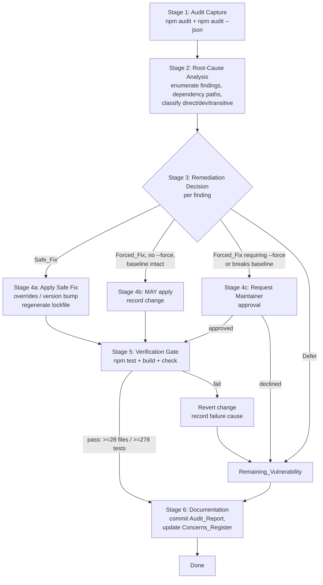

# Design Document

## Overview

This design defines the **Triage_Process** that hardens Rector's dependency security posture
for the `v0.1.0-alpha` local developer preview. The deliverable is not new runtime code; it is
a repeatable, low-risk **workflow** that captures `npm audit` findings, analyzes their root
causes, applies only safe remediations, verifies them against the known-good baseline, and
records the outcome in the documentation tree and the Concerns_Register.

The primary in-scope finding is the **Esbuild_Advisory** (GHSA-67mh-4wv8-2f99), which affects
`esbuild <=0.24.2` and reaches Rector transitively through the `vitest` and `tsx` development
tooling. The preferred mitigation is an npm `overrides` entry forcing `esbuild >=0.25.0`,
followed by a lockfile regeneration and a full baseline verification.

The design is deliberately conservative. It honors the project's hard constraints:

- **Provider-free, no-network, no-API-key defaults** stay intact (steering: `security.md`).
- **No `npm audit fix --force`** without explicit Maintainer approval (requirements 4,
  steering: `security.md`).
- **The known-good baseline must never regress**: `npm test` (>= 28 files / >= 278 tests),
  `npm run build`, `npm run check` all pass (steering: `testing.md`).
- **The Concerns_Register is the source of truth** for risk state and must be updated
  (steering: `docs.md`).

Because the artifacts are configuration (`package.json`, lockfile) and documentation (audit
report, Concerns_Register), the correctness guarantee comes from the existing 278-test
regression suite plus `build`/`check` acting as a verification gate, not from new
property-based tests. See the Testing Strategy section for the rationale.

### Goals

1. Produce a committed, structured **Audit_Report** that records the current dependency risk
   state with reproducible metadata.
2. Resolve the Esbuild_Advisory via a **Safe_Fix** (npm `overrides`) where it keeps the
   baseline green.
3. Route any **Forced_Fix** through an explicit Maintainer approval gate.
4. Keep the Concerns_Register accurate: move the Dependency_Audit_Item to mitigated when
   resolved, and track every Remaining_Vulnerability with severity, root cause, and rationale.

### Non-Goals

- Adding any runtime dependency, network call, or required API key.
- Refactoring `vitest`/`tsx` usage beyond what a version bump or override requires.
- Implementing automated CI enforcement of `npm audit` (may be a future follow-up).
- Presenting Rector as production-hardened; this remains an alpha developer preview.

## Architecture

The Triage_Process is a linear pipeline with two decision gates (Safe vs. Forced, and
verification pass vs. fail). Each stage produces an artifact or a decision that feeds the next
stage. The process is idempotent: re-running it on an already-remediated tree reproduces the
same audit/classification and makes no further changes.



### Stage Responsibilities

| Stage | Input | Action | Output | Requirements |
|-------|-------|--------|--------|--------------|
| 1. Audit Capture | clean install tree | run `npm audit` and `npm audit --json` | Audit_Report file + metadata | 1.1–1.6 |
| 2. Root-Cause Analysis | Audit_Report | enumerate findings, resolve dependency paths, classify scope | per-finding analysis records | 2.1–2.5 |
| 3. Remediation Decision | analysis records | map each finding to a remediation category via the decision matrix | categorized decisions | 3.x, 4.x, 6.4 |
| 4. Apply Fix | categorized decisions | edit `package.json`, regenerate lockfile (Safe/approved only) | modified config + lockfile | 3.1–3.7, 4.1–4.4 |
| 5. Verification Gate | modified tree | run `npm test`, `npm run build`, `npm run check`; revert on failure | pass/fail + revert log | 5.1–5.5, 6.1–6.4 |
| 6. Documentation | verified result | commit Audit_Report; update Concerns_Register | tracked docs | 7.1–7.5 |

### Decision Gates

The two gates encode the safety policy that distinguishes this spec from a blind `npm audit
fix`:

1. **Remediation classification gate (Stage 3).** Each finding is categorized before any change
   is made. Only Safe_Fix and the narrow non-`--force`/non-breaking Forced_Fix path may proceed
   without approval. Everything requiring `npm audit fix --force` or that breaks the baseline is
   escalated.
2. **Verification gate (Stage 5).** Any applied change is provisional until the full baseline
   passes. A regression triggers an automatic revert and reclassification as a
   Remaining_Vulnerability.

## Components and Interfaces

The "components" here are concrete repository artifacts and the npm tooling commands that act
on them. There is no new TypeScript module surface; the interfaces are file formats and command
contracts.

### Component 1: npm `overrides` Strategy (`package.json`)

npm `overrides` (npm v8.3+) let a top-level package force a specific version for a transitive
dependency anywhere in the tree, regardless of what intermediate packages request. This is the
mechanism for resolving the Esbuild_Advisory without waiting for `vitest`/`tsx` to publish
upgraded releases.

How it resolves transitive dependencies:

- During `npm install`, npm builds the dependency tree, then applies `overrides` as a
  post-resolution constraint. Any resolved spec for the named package that does not satisfy the
  override is replaced by a version satisfying the override.
- A targeted, top-level override pins the package everywhere it appears in the tree. This is
  the simplest form and is appropriate here because `esbuild` should be `>=0.25.0` wherever it
  is pulled in.

Proposed `package.json` change (additive; runtime `dependencies`/`devDependencies` unchanged):

```json
{
  "overrides": {
    "esbuild": ">=0.25.0"
  }
}
```

Notes and constraints:

- The override is additive and touches no runtime dependency. `express` and `zod` remain
  untouched, preserving Provider_Free_Mode and the no-network test policy (requirements 6).
- The lockfile **must be regenerated** so the resolved `esbuild` version reflects the override.
  Regenerate with a fresh install (`npm install`) rather than hand-editing the lockfile.
- If a more specific scoping is later required (for example, an override only under `vitest`),
  npm supports nested overrides:
  ```json
  { "overrides": { "vitest": { "esbuild": ">=0.25.0" } } }
  ```
  The flat form is preferred unless the verification gate reveals a conflict that requires
  narrower scoping.
- `>=0.25.0` is used rather than a pinned exact version so future patch releases are accepted;
  if reproducibility concerns arise, the lockfile already pins the concrete resolved version.

### Component 2: Audit Capture Commands

The Triage_Process captures both human-readable and machine-readable audit output so the
report can include per-finding detail (package, range, severity, advisory ID, path).

| Purpose | Command | Used for |
|---------|---------|----------|
| Human-readable summary | `npm audit` | report body, severity counts |
| Machine-readable detail | `npm audit --json` | per-finding package/range/severity/advisory/path extraction |
| Resolved-version check | `npm ls esbuild` | confirm post-fix `esbuild >=0.25.0` resolution |

These commands read the local dependency tree and lockfile only. `npm audit` contacts the npm
registry advisory endpoint to evaluate the installed tree against the advisory database; this is
package-manager metadata traffic, not Rector application network access, and it does not affect
the Provider_Free_Mode / no-network-in-tests guarantee (which governs the `npm test` runtime,
not the package manager). The captured report is committed so reviewers do not need to re-run
the registry call to see the recorded state.

### Component 3: Audit_Report File (`docs/security/`)

**Location decision: `docs/security/` (new committed directory).**

The requirements allow `docs/issues/` or `docs/security/`. `docs/issues/` is already the home of
the contributor issue catalog (`roadmap-issues.json` + `generated/` drafts) and is governed by
the deterministic issue generator described in `docs.md`. Placing security audit reports there
would mix two unrelated concerns and risk confusing the generator's `--check` workflow. A
dedicated `docs/security/` directory:

- gives dependency/security audit artifacts a clear, discoverable home,
- aligns with the existing `security.md` steering theme,
- keeps the issue catalog directory single-purpose,
- scales to future audit snapshots (one file per audit date) without polluting other trees.

Proposed initial file: `docs/security/dependency-audit-2026-06-03.md` (date in the filename so
successive audits are individually traceable). The Concerns_Register and the spec records
reference this path for traceability (requirement 7.3).

### Component 4: Concerns_Register (`docs/plans/concerns-and-vulnerabilities.md`)

Existing tracked file. The Triage_Process interacts with it through documented edits:

- Move the **Dependency_Audit_Item** ("Dependency audit reports vulnerabilities") from `## Open`
  to `## Closed / Mitigated` when a Safe_Fix resolves the Esbuild_Advisory, including the
  applied fix and a reference to the Audit_Report path.
- For each Remaining_Vulnerability, keep or add an `## Open` entry with severity, root cause,
  and deferral rationale.

This file is plain Markdown under version control; "retain records" means the edit preserves
prior history through the commit and does not delete unresolved entries. If the file cannot be
written or an edit would drop unresolved records, the process halts (requirement 7.5; see Error
Handling).

## Data Models

These are documentation/data **schemas** expressed as Markdown structures, not code types. They
define the shape of the artifacts the process produces so they are consistent and reviewable.

### Audit_Report Structure

```markdown
# Dependency Audit Report

- **Date:** YYYY-MM-DD
- **Command(s):** `npm audit`, `npm audit --json`
- **npm version:** <npm --version>
- **Node version:** <node --version>
- **Summary:** N vulnerabilities (X critical, Y high, Z moderate, W low)
- **Metadata capture status:** complete | partial (see note)

## Findings

### Finding 1: <package>
- **Package:** <name>
- **Vulnerable range:** <range, e.g. <=0.24.2>
- **Severity:** critical | high | moderate | low
- **Advisory ID:** <GHSA-xxxx-xxxx-xxxx or "none provided">
- **Dependency path:** <root> > <intermediate> > <package>
- **Classification:** direct | dev | transitive
- **Runtime exposure:** <note; e.g. "dev tooling only, not in dist runtime">
- **Root cause:** <why the vulnerable version is present>
- **Remediation category:** Safe_Fix | Forced_Fix (non-breaking) | Forced_Fix (approval) | deferral
- **Action taken / planned:** <override entry, version bump, deferral rationale>

### Finding 2: ...
```

Per-finding fields map directly to requirements 1.3 (package, range, severity, advisory),
2.1–2.2 (path, classification), and 2.4–2.5 (root cause, remediation category, runtime
exposure).

### Finding Classification Model

| Field | Values | Source | Requirement |
|-------|--------|--------|-------------|
| `classification` | `direct` \| `dev` \| `transitive` | dependency tree position | 2.2 |
| `severity` | `critical` \| `high` \| `moderate` \| `low` | npm audit | 1.3 |
| `runtimeExposure` | free-text note | analysis (is it in `dist`?) | 2.5 |
| `remediationCategory` | see Remediation Decision Matrix | decision gate | 2.4, 3.x, 4.x |

### Remediation Decision Matrix

This matrix is the heart of the safety policy. It maps a candidate remediation to an action.

| # | Candidate remediation characteristics | Category | Action | Requirement |
|---|----------------------------------------|----------|--------|-------------|
| 1 | Version bump or `overrides` entry; keeps baseline green; no `--force` | **Safe_Fix** | Apply automatically; record change | 3.1, 3.2, 3.5 |
| 2 | npm classifies as breaking (Forced_Fix), but does **not** require `--force` **and** does **not** break the baseline | **Forced_Fix (non-breaking)** | **MAY** apply after recording the change | 3.6 |
| 3 | Requires `npm audit fix --force` (regardless of baseline impact) | **Forced_Fix (approval required)** | Request explicit Maintainer approval; do not run until approved | 3.7, 4.1, 4.2 |
| 4 | Breaks the baseline and does not require `--force` | **Escalation / defer** | Do not auto-apply; record as Remaining_Vulnerability requiring approval | 3.4 |
| 5 | Would require real network in tests or a required API key | **Defer (policy)** | Do not apply; record as Remaining_Vulnerability | 6.4 |
| 6 | Maintainer approves a specific Forced_Fix | **Approved Forced_Fix** | Apply approved change; verify against baseline | 4.4 |
| 7 | Maintainer declines a Forced_Fix | **Deferral** | Record as Remaining_Vulnerability with deferral rationale | 4.3 |
| 8 | No safe remediation available within spec scope | **Deferral** | Record as Remaining_Vulnerability with rationale | 4.3, 7.2 |

Key distinction (requirement 3.7 vs 3.6): the trigger for the approval gate is whether the
remediation **requires `npm audit fix --force`**, not merely whether npm labels it "breaking".
A Forced_Fix that does not need `--force` and does not break the baseline is allowed under the
MAY clause (row 2); anything needing `--force` is always escalated (row 3), even if it would not
break the baseline.

### Verification Result Model

```
VerificationResult = {
  testFiles: number        // must be >= 28
  testsPassed: number      // must be >= 278
  buildPassed: boolean     // npm run build exit 0
  checkPassed: boolean     // npm run check exit 0
  outcome: "pass" | "fail"
  failureCause?: string    // recorded on fail, before revert
}
```

A change is accepted only when `testFiles >= 28 && testsPassed >= 278 && buildPassed &&
checkPassed`. Otherwise the change is reverted and `failureCause` is recorded
(requirements 5.1–5.5).

### Expected Esbuild_Advisory Resolution (worked example)

| Attribute | Value |
|-----------|-------|
| Package | `esbuild` |
| Vulnerable range | `<=0.24.2` |
| Advisory | GHSA-67mh-4wv8-2f99 (DNS rebinding / dev server exposure) |
| Dependency path | `rector` > `vitest` > `vite` > `esbuild`; and `rector` > `tsx` > `esbuild` |
| Classification | transitive (via dev tooling) |
| Runtime exposure | none in `dist` runtime; dev/test tooling only |
| Remediation | Safe_Fix: `overrides.esbuild = ">=0.25.0"` + lockfile regeneration |
| Verification | full baseline must remain green; `npm ls esbuild` shows `>=0.25.0` |

The exact dependency path and the full set of findings are confirmed at runtime from
`npm audit --json` during Stage 1; the table above is the expected shape based on the documented
advisory and current `devDependencies`.

## Error Handling

The process is conservative by default: when in doubt, it preserves existing artifacts, reverts
provisional changes, and surfaces the situation to the Maintainer rather than proceeding.

### EH-1: Audit metadata capture fails (Requirement 1.6)

If the Audit_Report file is written successfully but recording its metadata (date, command, tool
versions) fails, the process **retains the Audit_Report file** and records that metadata capture
failed. The report is not discarded or rewritten. The report's `Metadata capture status` field
is set to `partial` with a note describing what could not be captured. This guarantees the
captured findings are never lost due to a metadata bookkeeping failure.

### EH-2: Forced fix requires `--force` (Requirements 3.7, 4.1, 4.2)

Any candidate remediation that requires `npm audit fix --force` is **never executed
automatically**, regardless of whether it would break the baseline. The process requests
explicit Maintainer approval and refrains from running the command while approval is absent. On
decline, the finding becomes a Remaining_Vulnerability with a deferral rationale (4.3). On
approval, the specific approved change is applied and then verified against the full baseline
(4.4).

### EH-3: Forced fix that does not need `--force` (Requirement 3.6)

A remediation npm labels "breaking" but that does **not** require `--force` and does **not**
break the baseline MAY be applied. When applied, the change and affected dependency are recorded
in the spec records and the Audit_Report. It still passes through the Stage 5 verification gate.

### EH-4: Verification baseline regresses (Requirement 5.5)

If `npm test`, `npm run build`, or `npm run check` fails after a change — including `npm test`
reporting fewer than 28 files or fewer than 278 tests — the process **reverts that change**
(restores `package.json` and the lockfile to their pre-change state) and records the failure
cause. The finding the change addressed is reclassified as a Remaining_Vulnerability. No
partially verified change is left in the tree.

### EH-5: Remediation would break the no-network / no-key policy (Requirement 6.4)

If a remediation would require real network access during normal `npm test` runs or would
introduce a required API key, it is **not applied** and is recorded as a Remaining_Vulnerability.
This protects Provider_Free_Mode and the no-network test guarantee (requirements 6.1–6.3).

### EH-6: Concerns_Register cannot retain records (Requirement 7.5)

If the Concerns_Register cannot be updated or cannot retain its records (file unwritable, an
edit would drop unresolved entries, or the file is missing), the process **halts** and surfaces
the failure to the Maintainer rather than silently proceeding. Because the register is the
source-of-truth risk record, losing it is treated as a stop condition, not a warning.

### EH-7: Lockfile regeneration anomaly

If regenerating the lockfile after an `overrides` change produces an unexpected tree (for
example, `npm ls esbuild` still reports a vulnerable version, or install reports peer/resolution
conflicts), the change is treated as failed verification (EH-4): revert and record the cause.
This prevents committing an override that did not actually take effect.

## Testing Strategy

### Why Property-Based Testing Does Not Apply

This spec changes **configuration and documentation** — an npm `overrides` entry, a regenerated
lockfile, a committed Markdown audit report, and edits to the Concerns_Register. It introduces
no pure function, parser, serializer, or data transformation with a meaningful "for all inputs"
property. Per the PBT applicability guidance, configuration validation and one-shot
documentation/process changes are explicitly **not** appropriate for property-based testing.
Accordingly, this design **omits the Correctness Properties section** and relies on the
project's existing regression gate plus lightweight, targeted assertions.

### Primary Gate: The Existing Regression Suite

The known-good baseline is the verification mechanism for every change in this spec:

```bash
npm test        # vitest run — must report >= 28 files / >= 278 tests passing
npm run build   # tsc && node scripts/fix-dist-esm-imports.js — must exit 0
npm run check   # tsc --noEmit — must exit 0
```

Rationale: the Esbuild_Advisory is resolved by forcing a newer `esbuild` that `vitest` (via
`vite`) and `tsx` consume internally. If forcing `esbuild >=0.25.0` were incompatible with the
current tooling, the failure would surface precisely as a `npm test` or `npm run build`
regression — exactly what the gate catches. The 278-test suite already exercises the full
product surface (protocol, state machine, DAG, validation/healing, chat/operator APIs,
security/redaction, providers, integration contracts), so a green run after the override is
strong evidence the change is safe. This is consistent with `testing.md`: changes must not lower
the baseline count.

### Secondary: Targeted Configuration Assertions (optional, low-cost)

A small example-based test can lock the override in place and document intent, following the
existing `tests/releasePackaging.test.ts` pattern of asserting against imported `package.json`.
This is an EXAMPLE/SMOKE-style check, not a property test:

```typescript
// tests/dependencySecurity.test.ts (illustrative)
import { describe, expect, it } from "vitest";
import packageJson from "../package.json";

describe("dependency security overrides", () => {
  it("forces esbuild to a non-vulnerable range via npm overrides", () => {
    expect(packageJson.overrides).toBeDefined();
    expect(packageJson.overrides.esbuild).toBe(">=0.25.0");
  });
});
```

This test is deterministic, uses no network, requires no API keys, and runs in-process —
satisfying every rule in `testing.md`. It raises the baseline test count rather than lowering
it. It is optional because the override's real-world effect is already proven by the build/test
gate; its value is regression protection against an accidental removal of the override.

### Tertiary: Manual / Command-Level Verification

These are run by the Maintainer as part of the Triage_Process and recorded in the Audit_Report;
they are not part of the automated suite because they invoke the package manager or the registry
advisory endpoint:

| Check | Command | Expectation |
|-------|---------|-------------|
| Resolved version | `npm ls esbuild` | all resolved `esbuild` entries `>=0.25.0` |
| Advisory cleared | `npm audit` | Esbuild_Advisory no longer reported |
| Override applied | inspect lockfile | resolved `esbuild` satisfies the override |

### Test Quality Constraints (inherited from steering)

- **No real network** in `npm test`; the optional config assertion reads local files only.
- **No API keys**; nothing in this spec adds credentials.
- **Deterministic**; the config assertion has no wall-clock or ordering dependence.
- **In-process**; no child processes are introduced.
- The default `npm test` run stays provider-free and model-call-free.

### Coverage Mapping

| Requirement area | Verified by |
|------------------|-------------|
| 1.x Capture/commit Audit_Report | Manual command-level capture + committed file review |
| 2.x Root-cause/classification | Audit_Report content review (structured schema) |
| 3.x Safe fixes only | Decision matrix + Stage 5 regression gate + optional config assertion |
| 4.x No forced fixes without approval | Process approval gate (EH-2); no automated test can grant approval |
| 5.x Preserve baseline | `npm test` / `npm run build` / `npm run check` gate |
| 6.x Provider-free/no-network | Steering compliance + green provider-free `npm test` |
| 7.x Concerns_Register update | Register edit review + Audit_Report path reference |

Requirements 4.x and 7.5 are process/human-approval and halt-condition behaviors; they are
enforced by the workflow's decision gates and error handling rather than by an automated test,
which is the appropriate verification level for an approval policy and a stop condition.
