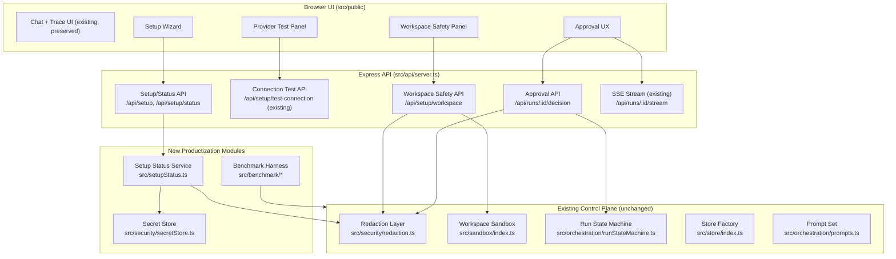

# Design Document

## Overview

Rector Productization Alpha layers a hassle-free product surface on top of the already-complete local-first BYOK neuro-symbolic control plane. The core (triage → context → planner → skeptic → crucible → DAG → executor → validation/healing → synthesis, plus persistence, SSE streaming, cost dashboard, budgets, redaction, and the safe workspace sandbox) is finished and must not be rebuilt. This design adds ten productization deliverables plus cross-cutting non-functional guarantees **around** that core without changing its behavior.

The governing constraints from the requirements shape every decision here:

- **Local_Mode is the regression baseline.** The provider-free deterministic mode (`ORCHESTRATOR_MODE=local`, `RECTOR_PERSISTENCE=memory`) must produce byte-for-byte identical output before and after this work. Every new module is additive and inert in local mode unless explicitly configured.
- **No real provider or network calls in the automated test suite.** All new tests use deterministic test doubles, injected `fetchImpl`, injected `WorkspaceFs`/`CommandRunner`, and in-memory stores. This mirrors the existing pattern already present in `runConnectionTest`, `WorkspaceSandboxAdapter`, and `createRectorStore`.
- **Redaction at every boundary.** New API responses, UI surfaces, streamed frames, and error messages route through the existing `Redaction_Layer` (`src/security/redaction.ts`) so no secret substring escapes.
- **Sandbox safety is preserved.** The `Workspace_Safety_Panel` and `Approval_Flow` are read/decision surfaces over the existing sandbox; they add no new execution capability.

Three deliverables are **design-only documents** (Desktop Shell Spike, parts of TiDB smoke test path, Mobile Companion Design) and one is a **manual script** (TiDB smoke test). The rest are code: setup/status APIs, three UI panels, a benchmark harness, a secret store abstraction, the approval API/UI flow, and prompt hardening backed by regression tests.

## Architecture

### System context



### Design principles applied

1. **Additive, inert-by-default.** Every new server route and module is registered alongside existing ones. None mutate the local-mode chat pipeline. The store factory already defaults to in-memory; the secret store defaults to a no-op/empty backing in tests.
2. **Status, not control.** Per Requirements 1.6, 3.6, and 3.8, the productization UI presents redacted *status* and *decisions* only. It exposes no environment-mutation or arbitrary-command controls.
3. **Reuse the redaction boundary.** Rather than inventing new scrubbing, all new surfaces call `redactSecrets`/`redactString`. The setup checklist already classifies sensitive keys (`SENSITIVE_KEYS` in `setupChecklist.ts`); the status service reuses that classification.
4. **Reuse the run event/decision spine.** The `Approval_Flow` is built on the existing `transitionRun` / `createDecisionRequest` / `resumeFromDecision` state machine and the existing `RunEvent` log and SSE broker, not a new persistence path.
5. **Deterministic doubles everywhere.** The benchmark harness, connection test, secret store, and approval flow all accept injected clocks, filesystems, command runners, and fetch implementations so the suite stays network-free and reproducible.

### Mode and configuration boundaries

| Concern | Local_Mode default | External_Mode / opt-in |
|---|---|---|
| Orchestration | `ORCHESTRATOR_MODE=local` (provider-free) | `ORCHESTRATOR_MODE=external` (BYOK router) |
| Persistence | `RECTOR_PERSISTENCE=memory` | `sqlite` (local file) / `tidb` (hosted) |
| Secret backing | in-memory/empty | local encrypted file store; OS keychain later |
| Benchmark | deterministic test doubles | manual live-provider flag |
| Provider test | n/a (no providers) | live ping via injected `fetch` |

## Components and Interfaces

### 1. Setup Status Service (`src/setupStatus.ts`) — Requirement 1

A new pure service that composes the existing `getSetupChecklist()` output into category readiness and mode, applying redaction. It does not read raw secrets into responses.

```typescript
export type SetupMode = "local" | "external";
export type ReadinessStatus = "Ready" | "Incomplete" | "Error";
export type SetupCategory = "provider" | "persistence" | "workspace" | "budget";

export interface CategoryReadiness {
  category: SetupCategory;
  status: ReadinessStatus;        // exactly one of Ready | Incomplete | Error
  detail: string;                 // redacted human-language explanation
}

export interface SetupStatusResponse {
  mode: SetupMode;                // Local_Mode or External_Mode
  categories: CategoryReadiness[]; // one entry per SetupCategory, no duplicates
  secretPresence: Record<string, boolean>; // presence booleans only, never values
}

export function computeSetupStatus(
  env: Record<string, string | undefined>,
  secretStore: SecretStore
): SetupStatusResponse;
```

Rules enforced: mode derived from `ORCHESTRATOR_MODE` (default `local`); exactly one readiness per category (Req 1.2); the assembled response runs through `redactSecrets` before return (Req 1.3); secret values are excluded and only presence booleans appear (Req 1.4, 7.5); if redaction of any value fails, that value is omitted rather than returned (Req 1.10).

#### Setup API routes

- `GET /api/setup/status` → `SetupStatusResponse`, redacted. Wrapped in a try/catch that returns a structured error (Req 1.8). The handler is bounded so the client can apply a 10s timeout (Req 1.9 is enforced client-side; the server stays fast and non-blocking).
- `GET /api/setup` (existing) remains for the raw redacted checklist.

### 2. Setup Wizard UI (`src/public`) — Requirement 1

A new panel rendered alongside the existing chat/trace UI (never replacing it). It fetches `/api/setup/status`, renders mode + four category pills, and shows an error state on failure or a 10s client timeout. It stores nothing in `localStorage`/`sessionStorage` (Req 1.5) and renders no configuration-mutation controls (Req 1.6).

### 3. Provider Key Test Panel (`src/public`) — Requirement 2

A UI panel over the **existing** `runConnectionTest` service and its route. Behaviors:

- Lists configured providers from `SUPPORTED_PROVIDER_IDS`; enables the test action only when exactly one is selected (Req 2.1).
- On trigger, calls the Connection_Test_API promptly (Req 2.2), shows a loading indicator and disables the action while in flight (Req 2.6).
- On success, renders a redacted readiness message (Req 2.3); on failure, renders a redacted reason and retains the selection (Req 2.4); a 30s client-side timeout aborts and shows a redacted timeout message (Req 2.7).
- Every displayed message passes through `redactString` (Req 2.5) — already guaranteed server-side because `runConnectionTest` redacts every error.

### 4. Workspace Safety API + Panel (`src/api`, `src/public`) — Requirement 3

A new read-only endpoint exposes sandbox policy derived from the configured `WorkspaceSandboxAdapter` construction parameters.

```typescript
export interface WorkspaceSafetyResponse {
  workspaceRoot: string;          // redacted per redaction policy (Req 3.7)
  allowlistedCommands: string[];  // from adapter config (Req 3.2)
  destructiveProtection: "enabled" | "disabled"; // (Req 3.3)
  approvalRequiredCategories: string[]; // operation categories needing approval (Req 3.4)
  available: boolean;             // false → panel shows unavailable state (Req 3.8)
}

export function buildWorkspaceSafetyResponse(
  config: WorkspaceSafetyConfig
): WorkspaceSafetyResponse;
```

The panel renders these values and exposes no command-execution control (Req 3.6). The endpoint preserves all sandbox containment constraints because it only reads configuration, never executes (Req 3.5). When the workspace root or policy can't be retrieved, `available` is `false` and the panel shows an error with no action controls (Req 3.8).

### 5. Benchmark Harness (`src/benchmark/`) — Requirement 4

A repeatable suite over version-controlled fixture tasks, runnable via a script entry point.

```typescript
export type BenchmarkFinalStatus = "passed" | "failed" | "timeout";

export interface BenchmarkTask {
  id: string;
  description: string;
  setupFixture(tmpDir: string): Promise<void>; // builds an isolated Fixture_Workspace
}

export interface BenchmarkResult {
  taskId: string;
  finalStatus: BenchmarkFinalStatus;
  patch?: string;
  commands: string[];
  costEstimateUsd: number;
  durationMs: number;
  outputDir: string;            // temp dir; retained on failure (Req 4.5)
}

export interface BenchmarkSummary {
  totalTasks: number;
  countsByStatus: Record<BenchmarkFinalStatus, number>;
  results: BenchmarkResult[];
}

export interface BenchmarkOptions {
  mode: "deterministic" | "live"; // default deterministic (Req 4.2)
  taskTimeoutMs?: number;          // default 300_000 (Req 4.7)
  now?: () => string;
  tmpRoot?: string;                // all output under temp (Req 4.4)
}

export function runBenchmark(
  tasks: BenchmarkTask[],
  options: BenchmarkOptions
): Promise<BenchmarkSummary>;
```

- At least three tasks, each in its own isolated `Fixture_Workspace` (Req 4.1).
- Default mode uses deterministic test doubles, no network (Req 4.2), and produces identical final statuses across repeated runs (Req 4.9).
- Each result captures result/patch/commands/cost/duration/status (Req 4.3).
- All output goes to temp dirs; tracked repo files are never modified (Req 4.4).
- On failure, artifacts and logs are retained and a `failed` status recorded (Req 4.5).
- A task exceeding 300s is terminated and recorded as `timeout` (Req 4.7).
- A run produces a summary with total count and per-status counts (Req 4.8).
- A manual live mode runs the same task set against configured providers (Req 4.6).

### 6. Prompt Hardening (`src/orchestration/prompts.ts` + regression tests) — Requirement 5

Prompt hardening is a **process plus regression-test harness**, not a new runtime module. The existing `PLANNER_SYSTEM_RULES`, `SKEPTIC_SYSTEM_RULES`, `SYNTHESIZER_SYSTEM_RULES`, and `REPAIR_SYSTEM_RULES` already encode safety constraints (notably "Never include secrets..." lines and approval-gate invariants). Hardening adds:

- A **safety constraint test suite** asserting each safety line/invariant remains present after any prompt edit (Req 5.2, 5.3).
- A **regression case** per fixed failure mode that reproduces the failure and asserts corrected behavior (Req 5.1, 5.4).
- A **Local_Mode baseline pass-rate guard**: a test comparing the local-mode regression pass rate before/after; a drop rejects the update (Req 5.5, 5.6).
- The existing `redactSecrets` applied to all prompt payloads guarantees zero secrets in prompt outputs (Req 5.7).

"Reject the update" is realized as a failing CI gate: if the safety suite or baseline guard fails, the change does not merge and the previous prompt set stands.

### 7. Secret Store (`src/security/secretStore.ts`) — Requirement 7

A new abstraction with a swappable backing implementation.

```typescript
export type SecretStoreResult<T> =
  | { ok: true; value: T }
  | { ok: false; error: string }; // redacted message (Req 7.8)

export interface SecretStore {
  setSecret(providerId: string, value: string): Promise<SecretStoreResult<void>>;
  getSecret(providerId: string): Promise<SecretStoreResult<string>>;
  hasSecret(providerId: string): Promise<boolean>;
}

// Local development implementation: persists across restarts in a non-plaintext form.
export interface LocalSecretStoreOptions {
  filePath: string;            // e.g. .rector/secrets.enc
  encryptionKey: Buffer;       // derived locally; never logged
  fsImpl?: SecretFs;           // injectable for tests
  now?: () => string;
}
export function createLocalSecretStore(options: LocalSecretStoreOptions): SecretStore;
```

- The interface exposes store/retrieve/has operations (Req 7.1).
- The local dev implementation persists across restarts (Req 7.2).
- The interface is consumer-agnostic so an OS-keychain backing can be added without changing consumers (Req 7.3) — consumers depend only on `SecretStore`.
- Stored values are non-plaintext by default (authenticated encryption); the stored representation is not readable as plain text or unencoded JSON (Req 7.4).
- `hasSecret` returns presence-only booleans; `getSecret` value never enters API/UI responses (Req 7.5, 7.6).
- A failed store/retrieve returns a failure indicator without persisting a partial/corrupted value (Req 7.7).
- Error messages are redacted (Req 7.8).

### 8. TiDB Cloud Smoke Test Path (`scripts/`, `docs/`) — Requirement 8

The store factory already enforces the critical safety properties (`createRectorStore` + `assertCompleteTiDBConfig` + `StoreConfigError`): TiDB config is validated before any connection, SQLite is the default, and missing config produces a descriptive error with no I/O. This deliverable adds:

- A manual script performing a write-then-read-back cycle that passes only on a field-for-field match (Req 8.1, 8.2).
- Documentation of required env vars; the script never runs in CI (Req 8.3).
- Reuse of the existing `StoreConfigError` path so missing/incomplete config terminates before a network connection (Req 8.4) and credential values in errors are redacted (Req 8.5).
- The existing SQLite default is documented and unchanged (Req 8.6).

### 9. Run Approval UX (`src/api`, `src/public`) — Requirement 9

The approval flow binds the existing sandbox `NEEDS_APPROVAL` / run `NEEDS_DECISION` states to a UI decision and the existing event log.

```typescript
export type ApprovalDecision = "approve" | "deny";

export interface ApprovalRequestView {
  runId: string;
  operationId: string;
  diff: string;        // redacted (Req 9.6)
  command?: string;    // redacted
  targetPath: string;  // redacted
}

export interface ApprovalDecisionRecord {
  runId: string;
  operationId: string;
  decision: ApprovalDecision | "timeout-denied";
  decidedBy: string;
  decidedAt: string;
}

// Decision endpoint: POST /api/runs/:id/decision
export function recordApprovalDecision(
  store: RectorStore,
  input: { runId: string; operationId: string; decision: ApprovalDecision; decidedBy: string },
  options: { now?: () => string }
): Promise<ApprovalDecisionRecord>;
```

- A pending operation is presented over the existing SSE stream within the responsiveness target (Req 9.1).
- The diff/command/target path are shown before any decision is submittable (Req 9.2), all redacted (Req 9.6).
- The decision, deciding identity, and timestamp are recorded in the `Event_Log` via `createDecisionRequest`/`resumeFromDecision` **before** executing or cancelling (Req 9.3).
- Risky shell commands require explicit approval and never run without a recorded approval — enforced by the existing sandbox `COMMAND` approval gate combined with this recorded decision (Req 9.4).
- A denial halts the operation and continues the run to a final answer excluding it, leaving affected files unchanged — realized via the existing `resumeFromDecision` path and the sandbox never applying an unapproved patch (Req 9.5).
- If the flow cannot present the operation or record the decision, the operation does not execute, the run stays pending, and an indication is surfaced (Req 9.7).
- A 30-minute no-decision timeout is treated as a denial, recorded as a timeout-based denial, and the run continues per the denial rule (Req 9.8).

### 10. Mobile Companion Design (`docs/`) — Requirement 10

A design-only document. It describes the control-surface capabilities (instruct, monitor, approve/deny, completion notifications, run summaries) (Req 10.1); asserts the mobile client executes no local workspace code (Req 10.2); specifies it talks only to the desktop app or hosted relay, never directly to the workspace (Req 10.3); documents each named risk (stolen device, relay compromise, prompt injection, approval spoofing) with a mitigation or explicit residual-risk statement (Req 10.4); routes approvals through the `Approval_Flow` and `Event_Log` (Req 10.5); and enumerates non-goals (Req 10.6).

### 11. Cross-Cutting Redaction (reuse `src/security/redaction.ts`) — Requirement 11

No new redaction engine. Every new API response, UI surface, streamed frame, and error routes through `redactSecrets`/`redactString` at the boundary, matching the existing SSE and event-log pattern (`SseFrameSchema`, `withEventBroadcast`, `transitionRun`). If redaction of an outbound response cannot complete, the boundary suppresses unredacted content and returns a redaction-failure error (Req 11.5).

### 12. Preserve Existing Experience (cross-cutting) — Requirement 12

A guard suite asserts: existing chat/trace tests still pass (Req 12.1); sandbox constraints unchanged (Req 12.2); local-mode output identical to baseline for identical inputs (Req 12.3, 12.4); all five verification gates pass (Req 12.5); and the suite makes zero real provider/network calls (Req 12.6).

## Data Models

### Setup status (new)

```typescript
interface CategoryReadiness { category: SetupCategory; status: ReadinessStatus; detail: string; }
interface SetupStatusResponse { mode: SetupMode; categories: CategoryReadiness[]; secretPresence: Record<string, boolean>; }
```

`ReadinessStatus` is a closed set `{Ready, Incomplete, Error}`; `categories` contains exactly one entry per `SetupCategory` value with no duplicates.

### Benchmark records (new)

```typescript
interface BenchmarkResult { taskId; finalStatus: "passed"|"failed"|"timeout"; patch?; commands: string[]; costEstimateUsd; durationMs; outputDir; }
interface BenchmarkSummary { totalTasks; countsByStatus: Record<BenchmarkFinalStatus, number>; results: BenchmarkResult[]; }
```

Invariant: `totalTasks === results.length` and `sum(countsByStatus values) === totalTasks`.

### Secret store representation (new)

Stored form is an authenticated-encryption envelope (e.g. nonce + ciphertext + tag), never plaintext or unencoded JSON. In-memory API/UI representation carries only `Record<providerId, boolean>` presence.

### Approval decision record (new)

```typescript
interface ApprovalDecisionRecord { runId; operationId; decision: "approve"|"deny"|"timeout-denied"; decidedBy; decidedAt; }
```

Persisted as a `RunEvent` payload through the existing state machine (already redacted by `transitionRun`).

### Reused existing models (unchanged)

- `SetupItem` / `getSetupChecklist()` (`src/setupChecklist.ts`) — sensitive-key classification source.
- `SandboxOperation` / `SandboxOperationResult` / `SandboxApproval` / `ApprovalGate` (`src/sandbox/index.ts`).
- `RectorStore`, `Run`, `RunEvent`, `PersistenceConfig`, `StoreConfigError` (`src/store`).
- `TestConnectionResponse` (`src/api/server.ts`).
- `RunPhase` transitions and `decisionRequest` (`src/orchestration/runStateMachine.ts`).

## Correctness Properties

*A property is a characteristic or behavior that should hold true across all valid executions of a system — essentially, a formal statement about what the system should do. Properties serve as the bridge between human-readable specifications and machine-verifiable correctness guarantees.*

This feature applies property-based testing to the **pure-logic layer**: the redaction boundary, the setup-status composer, the secret store, the benchmark harness, the store-config validator, and the approval-decision logic. It does **not** apply to the UI rendering panels, the design-only documents (Desktop Shell, Mobile Companion), or the CI/verification gates — those are covered by example, snapshot, doc-structure, and smoke tests described in the Testing Strategy. All property tests run with deterministic doubles and zero network calls.

The properties below were consolidated from the prework: the many redaction criteria collapse into one comprehensive boundary property, and the presence/exclusion criteria collapse into one secret-presence property.

### Property 1: Boundary redaction leaves no secret substring

*For any* value or structure (API response, UI string, error object including nested metadata/stack content, or streamed frame) that crosses a productization boundary and contains provider or environment secret material, the redacted output SHALL contain no substring of any original secret value and SHALL use the fixed redaction placeholder.

**Validates: Requirements 1.3, 1.4, 2.3, 2.5, 3.7, 5.7, 7.8, 8.5, 9.6, 11.1, 11.2, 11.3, 11.4**

### Property 2: Secret presence is reported without value exposure

*For any* provider id and any sequence of secret store operations, `hasSecret` SHALL return true exactly when a secret value is currently stored, and no secret value SHALL appear in any setup-status, presence, or other API/UI response (only presence booleans).

**Validates: Requirements 1.4, 7.5, 7.6**

### Property 3: Setup status mode derivation

*For any* environment map, `computeSetupStatus().mode` SHALL be `External_Mode` when `ORCHESTRATOR_MODE` equals `external` and `Local_Mode` otherwise.

**Validates: Requirements 1.1**

### Property 4: Setup status readiness is well-formed

*For any* environment map, the setup status response SHALL contain exactly one readiness entry per category (provider, persistence, workspace, budget) with no duplicate categories, and each entry's status SHALL be exactly one member of {Ready, Incomplete, Error}.

**Validates: Requirements 1.2**

### Property 5: Connection-test action enablement

*For any* subset of configured providers marked as selected, the connection-test action SHALL be enabled if and only if exactly one provider is selected.

**Validates: Requirements 2.1**

### Property 6: Benchmark result completeness

*For any* completed benchmark task, the produced `BenchmarkResult` SHALL contain a result, the executed commands, a cost estimate, a duration, and a final status (and a patch when the task produced one).

**Validates: Requirements 4.3**

### Property 7: Benchmark output containment

*For any* benchmark run in default mode, every filesystem write SHALL occur under the configured temporary output root, and no tracked repository file SHALL be modified.

**Validates: Requirements 4.4**

### Property 8: Benchmark summary counts are consistent

*For any* benchmark run, the summary's total task count SHALL equal the number of results, and the sum of the per-status counts SHALL equal the total task count.

**Validates: Requirements 4.8**

### Property 9: Benchmark determinism in default mode

*For any* fixed task set executed twice in default deterministic mode, the per-task final status values SHALL be identical across both executions.

**Validates: Requirements 4.9**

### Property 10: Secret store persists across restart (round-trip)

*For any* provider id and secret value, storing the value and then constructing a fresh secret store over the same backing and retrieving it SHALL return the original value.

**Validates: Requirements 7.2**

### Property 11: Secret store representation is non-plaintext

*For any* secret value, the persisted stored representation SHALL NOT contain the plaintext value as a substring and SHALL NOT be parseable as plain (unencoded) JSON that exposes the value.

**Validates: Requirements 7.4**

### Property 12: Store write-then-read-back round-trip

*For any* persisted record written through the SQL-backed store (exercised over an injected in-memory driver, no network), reading the record back SHALL yield a record equal to the written record field-for-field.

**Validates: Requirements 8.1**

### Property 13: Incomplete persistence config is rejected before I/O

*For any* incomplete subset of the required TiDB connection fields, `createRectorStore` SHALL raise a `StoreConfigError` that names the missing fields, SHALL open no network connection, and SHALL persist no records.

**Validates: Requirements 8.4**

### Property 14: A decision is recorded before the operation acts

*For any* approve or deny decision, a decision record carrying the decision, the deciding user identity, and a timestamp SHALL be appended to the Event_Log before the operation is executed or cancelled.

**Validates: Requirements 9.3**

### Property 15: Risky commands never run without recorded approval

*For any* risky shell command lacking a recorded approval, the command runner SHALL be invoked zero times and the operation result SHALL be `NEEDS_APPROVAL`.

**Validates: Requirements 9.4**

### Property 16: Denial leaves targets unchanged and continues the run

*For any* operation that is denied (explicitly or by decision timeout), no file write SHALL occur for that operation, the affected targets SHALL remain unchanged, and the run SHALL continue to a final answer that excludes the denied operation.

**Validates: Requirements 9.5, 9.8**

### Property 17: Local_Mode is deterministic against the baseline

*For any* chat input, two Local_Mode runs SHALL produce identical phase sequences and outputs, and that output SHALL equal the recorded pre-productization Local_Mode baseline.

**Validates: Requirements 12.3**

## Error Handling

The error strategy reuses the codebase's established patterns: structured results over thrown exceptions at boundaries, redaction of every outbound error, and "fail before I/O" for configuration errors.

| Failure | Handling | Requirement |
|---|---|---|
| Setup_API internal error | Catch, return structured error state; UI keeps chat/trace accessible | 1.8 |
| Setup_API no response in 10s | Client-side abort + error state; chat/trace preserved | 1.9 |
| Redaction of a setup value fails | Omit that value rather than return it | 1.10 |
| Connection test config invalid | `runConnectionTest` returns `{ok:false, code:"CONFIG_INVALID", networkAttempted:false}` (existing) | 2.4 |
| Connection test no result in 30s | Client aborts, clears loading, shows redacted timeout message | 2.7 |
| Workspace safety policy unavailable | `available:false`; panel shows unavailable state, no action controls | 3.8 |
| Benchmark task fails | Retain artifacts/logs in temp dir; record `failed` status | 4.5 |
| Benchmark task exceeds 300s | Terminate task; record `timeout` status | 4.7 |
| Prompt update breaks safety/baseline | CI gate fails → update rejected, previous prompt set retained | 5.3, 5.6 |
| Secret store read/write fails | Return `{ok:false, error}` (redacted); no partial/corrupted value persisted | 7.7, 7.8 |
| TiDB config missing/incomplete | `StoreConfigError` naming missing fields, before any connection | 8.4 |
| TiDB smoke read-back mismatch | Report failure | 8.2 |
| Approval cannot be presented/recorded | Do not execute; keep run pending; surface indication | 9.7 |
| Approval decision times out (30 min) | Treat as denial; record timeout-denial; continue run | 9.8 |
| Outbound redaction cannot complete | Suppress unredacted content; return redaction-failed error | 11.5 |

Cross-cutting rule: every error message, metadata field, and stack-trace fragment that leaves the process is passed through `redactString`/`redactSecrets` first (Requirement 11.3), exactly as `runConnectionTest`, `transitionRun`, and the SSE error frame already do.

## Testing Strategy

### Dual approach

- **Property tests** verify the universal properties above across generated inputs (the pure-logic layer).
- **Unit/example tests** cover specific scenarios, UI rendering states, error paths, and edge cases (timeouts, failure branches).
- **Snapshot/structure tests** cover UI panels and the design-only documents.
- **Smoke tests** cover one-time configuration and the verification gates.

Together they give comprehensive coverage: property tests catch general correctness across inputs; example/edge tests pin concrete behaviors; smoke tests confirm setup.

### Property-based testing

PBT **is** applicable to the redaction boundary, setup-status composer, secret store, benchmark harness, store-config validator, and approval-decision logic. It is **not** applicable to the UI rendering panels (snapshot/DOM tests instead), the Desktop Shell and Mobile Companion documents (doc-structure checks instead), the TiDB live network path (manual smoke), or the verification gates (smoke).

Requirements:

- Use the existing project test stack with a property-based testing library for TypeScript (fast-check). Do not hand-roll property testing.
- Each property test runs a **minimum of 100 iterations**.
- Each property test is tagged with a comment referencing its design property in the form: `// Feature: productization-alpha, Property {number}: {property_text}`.
- Each correctness property (1–17) is implemented by a **single** property-based test.
- Generators must cover edge cases folded in during prework: whitespace/empty inputs, non-ASCII and partial-secret strings, nested/circular structures (redaction), empty and large task sets (benchmark), every incomplete subset of TiDB fields (config rejection), and the decision-timeout case (denial).
- All property tests use injected doubles (`fetchImpl`, `WorkspaceFs`, `CommandRunner`, in-memory `SqlDriver`, fake clocks) so no real network or disk is touched (Requirement 12.6).

### Example, edge, and smoke tests (selected)

- **UI panels (examples/snapshots):** wizard renders mode + four pills and preserves chat/trace (1.5–1.8); provider panel loading/disabled/timeout states (2.2, 2.6, 2.7); safety panel renders policy and exposes no exec control (3.1–3.6); approval UI presents details before allowing submit (9.1, 9.2).
- **Edge cases:** redaction-failure omission (1.10, 11.5); benchmark failure-retention and 300s timeout (4.5, 4.7); secret store mid-write failure (7.7); TiDB read-back mismatch (8.2); approval record-failure keeps run pending (9.7).
- **Smoke/config:** benchmark default mode makes zero network calls (4.2); gates run without TiDB creds (8.3); SQLite default selection (8.6); all five verification gates pass (12.5); suite-wide zero outbound calls (12.6).
- **Doc-structure:** Desktop_Shell_Decision sections, recommendation, rationale, prototype path (6.1–6.6); Mobile_Companion_Design capabilities, no-local-exec statement, comms boundary, risk/mitigations, approval routing, non-goals (10.1–10.6).
- **Regression guards:** existing chat/trace and sandbox suites unchanged and passing (12.1, 12.2); local-mode baseline divergence fails a gate (12.4).

### Verification gates

All five established gates must pass with zero failures before this work is considered complete (Requirement 12.5): `npm test`, `npm run build`, `npm run check`, `node scripts/generate-roadmap-issues.js --check`, and `node scripts/export-linear-issues.js --check`.
