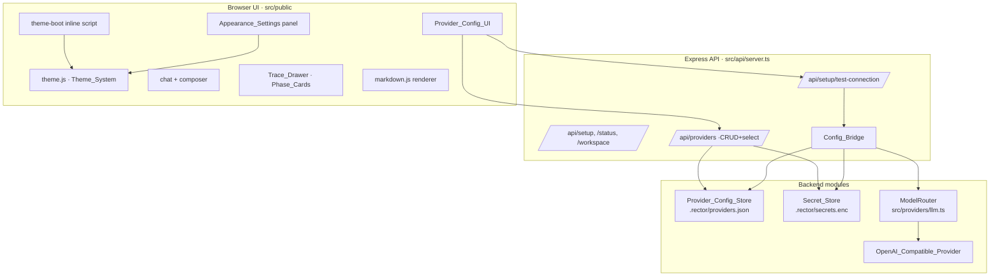

# Design Document

## Overview

This design delivers two coordinated workstreams against the requirements:

1. **Themed UI overhaul** — a runtime, build-step-free **Theme_System** layered on CSS custom properties, shipping five themes (Halo, Aether, Cairn, Penumbra, Vellum Tessera), each with its own fonts, palette, radii, accent, and ornament, plus user customization (accent, density, font-size, reduced motion). The existing chat column, sidebar, and Trace_Drawer are restyled into a calmer supervision surface without changing their behavior.
2. **In-app BYOK provider configuration** — a two-tier Provider_Config_UI, a new non-secret **Provider_Config_Store**, reuse of the existing encrypted **Secret_Store**, a new **OpenAI_Compatible_Provider** adapter, a **Config_Bridge** that makes persisted configuration and secrets drive provider construction and the connection test, and per-role active provider selection. Perplexity is removed.

The design is deliberately conservative about the backend control plane: it adds a configuration/secret resolution layer *above* the existing `ModelRouter` and provider adapters rather than rewriting them, preserves `Local_Mode` as the provider-free baseline, keeps all redaction boundaries, and adds no client runtime dependency.

### Design principles

- **No build step, no remote origins.** Everything is static under `src/public/`, served by the existing `express.static(publicDir)`. Fonts are self-hosted WOFF2.
- **Tokens over hardcoded values.** All themeable visual values are CSS custom properties. Components reference tokens; themes and user overrides only redefine tokens.
- **Additive backend.** New stores and the adapter plug into existing interfaces (`LLMProvider`, `SecretStore`-style abstraction). The env-only paths keep working; persisted config is layered on top with documented precedence.
- **Redaction-first.** Secrets flow in once via the Secret_Store and never flow back out; all config/status responses expose presence booleans and masked displays only.

## Architecture



## Components and Interfaces

The sections below (Parts A–C) define the components and their interfaces: Part A the Theme_System and front-end appearance components, Part B the restyled chat/sidebar/Trace_Drawer components, and Part C the BYOK backend components (Provider_Config_Store, Secret_Store reuse, OpenAI_Compatible_Provider, Config_Bridge, ModelRouter integration, and the Provider_Config_API).

## Part A — Theme System

### A1. Token architecture (three layers)

A single `:root` cascade with three layered sources, applied in order so the later layer wins:

1. **Base layer** (`styles/base.css`): structural, non-themeable rules (reset, layout grid, component geometry that never changes) and the *contract* of token names every theme must define.
2. **Theme layer** (`styles/themes/<name>.css`): each theme sets the full Theme_Token_Set scoped to `:root[data-theme="<name>"]`. Selecting a theme sets `document.documentElement.dataset.theme`.
3. **Override layer**: user customizations are written as inline custom properties on `:root` (e.g. `--accent`, `--density-scale`, `--font-scale`), which override the theme's values because inline styles beat stylesheet `:root` rules. Clearing an override removes the inline property and the theme value re-applies.

Token contract (names are stable; values differ per theme):

```css
/* color tiers */    --bg --surface --elevated --overlay
/* borders */        --border --border-strong --border-soft
/* foreground */     --text --text-dim --text-faint --text-inverse
/* accent */         --accent --accent-hover --accent-pressed --accent-soft
/* signal */         --ok --warn --info --err (+ *-soft)
/* type */           --font-display --font-body --font-mono
                     --fs-base (scaled by --font-scale)
/* geometry */       --radius-sm --radius-md --radius-lg --radius-xl --radius-full
/* space */          --space-1..--space-20 (scaled by --density-scale)
/* elevation */      --shadow-sm --shadow-md --shadow-lg --focus-ring
/* motion */         --motion-fast --motion-base --motion-slow --easing-standard
```

The existing `styles.css` is refactored: its hardcoded `#0f1115`-style values become token references; the file splits into `base.css` + per-theme files. Halo's tokens are taken verbatim from the supplied `docs/specs/UI-Ideas/halo/css/system.css`; the other four themes are authored from their reverse-engineered briefs.

### A2. Theme definitions

| Theme | Mode | `--bg` | Accent | Display font | Mono/secondary | Ornament |
|---|---|---|---|---|---|---|
| Halo | dark | `#0A0B0F` | indigo `#5B6BFF` | Inter | JetBrains Mono | hairline tiers, stat tiles |
| Aether | dark | `#06070A` | prism gradient (cyan→magenta→amber) | grotesk (Inter) + italic serif (Fraunces) | JetBrains Mono labels | crop-mark corners, single gradient rule |
| Cairn | dark | near-black | mint `#9FE7C7`-range | Cormorant (serif) | Inter + JetBrains Mono | surgical hairlines, cream CTAs |
| Penumbra | dark | obsidian | none (grayscale only) | serif (Fraunces) | tracked mono | dot-matrix medallion, soft radial glow |
| Vellum Tessera | light | cream `#F4EEDD`-range | teal→iris→blue gradient | Fraunces (serif) | Inter + mono | soft shadows, gradient-active pills |

Notes:
- A **gradient accent** (Aether, Vellum Tessera) is expressed as a `--accent-gradient` token used for emphasis surfaces (send button, active pill, focus glow), while a solid `--accent` fallback is still defined for borders/focus rings where a gradient is inappropriate.
- **Penumbra has no chromatic accent**: its `--accent` resolves to a light gray; status signals still use the shared `--ok/--warn/--err` semantic tokens (paired with icons per Req 9.4) so failure/decision states remain legible.
- Inferred token values (all themes except Halo) are authored to meet the 4.5:1 body-contrast requirement (Req 9.1) and verified during implementation.

### A3. Runtime switching and no-flash boot

- `index.html` `<head>` contains a tiny **inline boot script** (no external fetch) that reads the persisted appearance from `localStorage` and sets `data-theme` + override custom properties on `<html>` *before* body render, satisfying the no-flash requirement (Req 3.2).
- `theme.js` exposes `applyTheme(name)`, `setAccent(value)`, `setDensity(value)`, `setFontScale(value)`, `setReducedMotion(bool)`, and `resetCustomizations()`. Each updates `<html>` attributes/inline props and writes to `localStorage`.
- Switching themes only swaps `data-theme` and (lazily) ensures the theme's font faces are requested — a pure attribute change, well within the 200ms budget (Req 4.3).

### A4. Font loading (self-hosted, per-theme)

- Fonts live in `src/public/fonts/<family>/*.woff2` with each family's `OFL.txt` alongside (Req 5.2). Families: Inter, JetBrains Mono, Fraunces, Cormorant — all SIL OFL, which permits app bundling.
- `@font-face` blocks use `font-display: swap` and a system fallback stack (Req 5.4). To honor "only the active theme's fonts load" (Req 4.4), each theme CSS file declares only the `@font-face` rules it needs, and theme CSS files are attached via `<link rel="stylesheet">` whose `disabled` flag (or dynamic insertion) is toggled so non-active theme stylesheets — and therefore their font URLs — are not fetched. Inter + JetBrains Mono (shared by several themes) load by default.

### A5. Appearance settings + persistence

- `localStorage` key `rector.appearance` holds `{ theme, accent, density, fontScale, reducedMotion }`. No secret is ever written here (Req 3.3, 11.5).
- Accent options are a curated per-theme-safe palette; density ∈ {comfortable, compact} mapping to `--density-scale` (1.0 / 0.85); font-scale ∈ {small, default, large} mapping to `--font-scale`.
- Reset clears the override inline props and the customization keys, reverting to theme defaults (Req 3.8/3.10).

## Part B — UI overhaul

### B1. Chat column
- Messages constrained to a max measure (~`72ch`) centered in wide windows (Req 6.2).
- Assistant content rendered through a new **`markdown.js`** — a small, self-contained, dependency-free renderer covering headings, bold/italic, inline code, fenced code blocks, lists, links, and paragraphs, with HTML-escaping of all text nodes before insertion (XSS-safe). User messages remain plain text.
- Run-status and live indicators restyled with theme status tokens + icon/text (Req 6.4, 9.4). In-progress state driven by the existing phase events (Req 6.5).

### B2. Sidebar
- Action buttons grouped into a "System" cluster (Setup status, Provider configuration, Workspace safety, Pending approvals) with a count badge for pending approvals (Req 6.6). Sidebar luminance dimmed relative to the work area.

### B3. Trace_Drawer → Phase_Cards
- The existing phase timeline is upgraded to a **Phase_Card list**: one card per pipeline phase (triage → synthesis), each with header (status icon + name + duration) and an expand/collapse body holding that phase's evidence built from real event payloads (Req 7.1–7.3, 7.5).
- Status mapping reuses the existing `RUN_PHASES`/`PHASE_STATUS_LABELS` and event-derived `reachedPhases`/`finalPhase` logic already in `app.js`; only the rendering/markup changes. Observability, cost panel, decision section, and raw-events view are preserved (Req 7.4). Non-success terminal phases are visually distinct (Req 7.6).

### B4. Theme-aware panels
- All modals (setup, provider test/config, workspace safety, approval) consume tokens for surface/elevation/backdrop/focus (Req 8). Approval flow markup and gating behavior are unchanged (Req 8.4).

## Part C — BYOK provider configuration

### C1. Provider config data model

New module `src/providers/config.ts`:

```ts
type ProviderKind = "together" | "cloudflare" | "azure-openai" | "openai-compatible";

interface ProviderConfigRecord {
  id: string;                 // stable id, e.g. "openai-compatible:my-proxy"
  kind: ProviderKind;         // selects the adapter
  label: string;              // user-facing display name
  baseUrl?: string;           // openai-compatible / together / azure
  model?: string;             // model id (openai-compatible) or flagship model
  models?: Partial<Record<"flagship" | "slm", string>>;
  azure?: { endpoint?: string; apiVersion?: string; deployment?: string };
  cloudflare?: { accountId?: string };
  headers?: Record<string, string>; // optional, non-secret custom headers
  secretRef: string;          // SecretStore key (e.g. provider id); NEVER the value
  createdAt: string; updatedAt: string;
}

interface ProviderConfigState {
  version: 1;
  providers: ProviderConfigRecord[];
  activeRoutes: Partial<Record<"flagship" | "slm", string>>; // role -> provider id
}
```

The record holds a **`secretRef`**, never a secret. Any field named with a secret keyword would be auto-redacted by `redactSecrets`, so secrets are physically kept out of this store.

### C2. Provider_Config_Store

New `src/providers/configStore.ts`, mirroring `secretStore.ts`'s injectable-fs pattern:

```ts
interface ProviderConfigStore {
  getState(): Promise<ProviderConfigState>;
  upsertProvider(rec: ProviderConfigRecord): Promise<ProviderConfigResult<ProviderConfigRecord>>;
  removeProvider(id: string): Promise<ProviderConfigResult<void>>;
  setActiveRoute(role: "flagship" | "slm", providerId: string | null): Promise<ProviderConfigResult<void>>;
}
```

- **Local backing** `createLocalProviderConfigStore({ filePath: ".rector/providers.json", fsImpl })` — atomic temp+rename write (same durability technique as Secret_Store), JSON (non-secret only).
- **In-memory backing** for tests. This store is independent of `RectorStore` (which owns conversations/runs/events) so the existing schema is untouched.

### C3. Secret handling (reuse Secret_Store)
- API keys persist via the existing `createLocalSecretStore` (`.rector/secrets.enc`, AES-256-GCM), keyed by the provider record id. `setSecret`/`getSecret`/`hasSecret` already exist.
- The server constructs one shared `SecretStore` and passes it to both `computeSetupStatus` (already supported via `securityOptions.secretStore`) and the new Provider_Config_API, replacing the current `createEmptySecretStore()` default for the real (non-test) app.

### C4. OpenAI_Compatible_Provider adapter

New class in `src/providers/llm.ts` implementing `LLMProvider`, closely modeled on `TogetherAIProvider` (which is already an OpenAI-compatible `/chat/completions` client):

- Options: `{ apiKey?, baseUrl?, model?, headers?, enableNetwork?, fetchImpl? }`.
- `metadata`: id `openai-compatible`, routes `["cheap","fast","flagship","research"]`, models default to the configured `model` for every route; conservative token/cost estimates.
- `validateConfig()`: requires non-empty `apiKey`, an absolute http(s) `baseUrl`, and a non-empty `model` (Req 12.3).
- `invoke()`: POST `${baseUrl}/chat/completions` with `Authorization: Bearer`, merging optional non-secret `headers`; `enableNetwork` defaults false (Req 12.4); reuses `parseOpenAICompatibleResponse`; errors via `ProviderError` and redaction (Req 12.5, 12.6).

### C5. Config_Bridge

New `src/providers/configBridge.ts`. Resolves persisted config + secrets into provider construction inputs and the connection-test input.

```ts
async function resolveProviderEnv(
  store: ProviderConfigStore, secrets: SecretStore, base: Record<string,string|undefined>
): Promise<Record<string,string|undefined>>;

async function buildConfiguredRouter(deps): Promise<ModelRouter>;          // for External_Mode
async function resolveTestProvider(providerId, store, secrets, opts): Promise<LLMProvider|undefined>;
```

- **Precedence (Req 13.4):** persisted UI configuration takes precedence over `process.env` for a given provider, because the user explicitly set it in-app on a local-first product. The bridge produces an effective env/options map by overlaying resolved record fields + injected secret onto a copy of `process.env`; `process.env` is the fallback for any field the user did not set. This precedence is documented in code and in `docs/architecture`.
- The bridge **only** feeds provider construction and the test path. It never writes secrets into the sandbox executor environment (Req 13.5) — sandbox construction does not consume the bridge output.
- Secret presence is surfaced as booleans via `hasSecret` (Req 13.6); values are read only at provider-construction time and never serialized to a response.

### C6. ModelRouter integration
- `buildModelRouter` gains an optional injected `providers` list (it already accepts one). In External_Mode the server builds the provider list via the Config_Bridge (env overlaid with persisted config + secrets), including an `OpenAI_Compatible_Provider` per configured openai-compatible record.
- **Active_Route_Map (Req 14):** `ModelRouterInput`/`select()` honors the persisted `activeRoutes` for `flagship`/`slm` roles when a designated provider is configured and valid; otherwise it falls back to the existing capability-priority selection (Req 14.4). `slm` maps to the existing `fast`/`cheap` capability tier; `flagship` to `flagship`.

### C7. Provider_Config_API (new routes)

Added in `src/api/server.ts`, all responses routed through `sendRedacted`/`redactOutbound`:

| Method & path | Purpose |
|---|---|
| `GET /api/providers` | List Provider_Config_Records (non-secret) + `activeRoutes` + per-provider `secretPresent` boolean |
| `POST /api/providers` | Create/update a record; optional `apiKey` field persisted to Secret_Store, then stripped |
| `DELETE /api/providers/:id` | Remove record + its stored secret |
| `POST /api/providers/:id/secret` | Set/replace only the secret (write-once UX) |
| `POST /api/providers/active` | Set `activeRoutes[role] = providerId` |
| `POST /api/setup/test-connection` | **Upgraded**: resolves provider via Config_Bridge (persisted config+secret) instead of env-only |

Request bodies validated with Zod. The `apiKey` is accepted on input, persisted via Secret_Store, and never echoed; responses expose `secretPresent` only (Req 11.2, 11.4, 11.6). Unsupported provider ids rejected with 400 before any provider build (Req 15.6).

### C8. Connection test upgrade
`runConnectionTest` is generalized to accept a resolved `LLMProvider` (or a `(providerId, configState, secrets)` triple) rather than reading `process.env` directly. `resolveConnectionTestProvider` is replaced by the Config_Bridge resolver, which builds the provider with `enableNetwork: true` from persisted config+secret, then runs the existing validate→single-ping flow. Behavior, timeouts, and redaction are otherwise unchanged.

### C9. Perplexity removal
Remove all Perplexity wiring (Req 16):
- `src/providers/llm.ts`: delete `PerplexityResearchProvider*` and its entry in `buildModelRouter` defaults; remove `perplexity` from the `research` priority list.
- `src/deployment/index.ts`: remove the import and the `perplexity` `EXTERNAL_PROVIDER_DESCRIPTORS` entry.
- `src/api/server.ts`: remove the import, the `perplexity` `SUPPORTED_PROVIDER_IDS` member, the `resolveConnectionTestProvider` case, and the schema comment.
- `src/setupStatus.ts`: remove the `perplexity` `PROVIDER_ENV_REQUIREMENTS` entry.
- `src/setupChecklist.ts`: remove the `PERPLEXITY_API_KEY` SETUP_ITEM and its `SENSITIVE_KEYS` entry.
- `.env.example` and `docs/architecture/current-rector-byok-architecture.md` (class diagram + provider list): remove Perplexity references.
- Update/replace any tests asserting Perplexity support.

## Data Models

- **ProviderConfigRecord / ProviderConfigState** — non-secret, persisted in `.rector/providers.json` (Part C1/C2).
- **Secret envelope** — unchanged, `.rector/secrets.enc` (Secret_Store).
- **Appearance preference** — `localStorage["rector.appearance"]`, browser-only, non-secret.
- **Theme_Token_Set** — CSS custom properties per theme file.

## Error Handling

- **Theme/appearance:** unreadable or missing `localStorage` → default theme + default customizations, no throw (Req 3.5). Font load failure → system fallback (Req 5.4).
- **Provider config:** Secret_Store/Provider_Config_Store failures return redacted `{ ok:false, error }` and leave prior state intact via atomic write (Req 11.7). API validation failures return redacted 400s.
- **Connection test:** config-invalid short-circuits before network; network/HTTP errors and 30s client timeout produce redacted, key-free messages (Req 15.3, 15.5).
- **Redaction is fail-closed** at every outbound boundary via `redactOutbound`/`sendRedacted` (Req 11.4, 17.3).

## Correctness Properties

These invariants must hold for any implementation and are the basis for the property/leak tests.

### Property 1: No secret egress

For every API response, SSE frame, persisted event, and log line, the count of detected secret substrings is zero. Secret values exist only inside the Secret_Store envelope and transiently at provider-construction time.

**Validates: Requirements 11.4, 11.6, 13.6, 17.3**

### Property 2: Config/secret separation

No Provider_Config_Record field (in `.rector/providers.json`) ever contains a secret value; secrets are referenced by `secretRef` only.

**Validates: Requirements 11.6, 13.6**

### Property 3: Write-once secret retention

Saving non-secret provider fields without supplying a new key never clears or alters the previously stored secret.

**Validates: Requirements 11.3**

### Property 4: Atomic persistence

A failed write to the Provider_Config_Store or Secret_Store leaves the prior persisted state fully intact (no partial/corrupt file).

**Validates: Requirements 11.7**

### Property 5: Single active theme

Exactly one `data-theme` is applied at any time, and user overrides never mutate a theme's own token definitions (switching themes preserves customizations).

**Validates: Requirements 1.5, 3.9**

### Property 6: Deterministic precedence

For a given provider/field, the effective value is resolved by the documented precedence (persisted UI config over `process.env`) identically on every resolution.

**Validates: Requirements 13.4**

### Property 7: Local_Mode invariance

With `ORCHESTRATOR_MODE=local`, no provider/network call occurs regardless of any persisted configuration or secret.

**Validates: Requirements 17.1, 17.2**

### Property 8: Sandbox secret isolation

No provider secret is ever present in the sandbox executor environment or any command it can run.

**Validates: Requirements 13.5, 17.4**

### Property 9: Trace fidelity

Every value rendered in a Phase_Card derives from a real persisted run event; no phase/cost/event value is fabricated.

**Validates: Requirements 7.5**

## Testing Strategy

- **Theme_System (unit/DOM):** token contract presence per theme; `applyTheme`/override functions set the right attributes/props; persistence round-trip; reduced-motion behavior. Contrast checks for body text per theme.
- **Provider_Config_Store:** round-trip, atomic-write failure path (injected fs double), no-secret-in-config invariant.
- **OpenAI_Compatible_Provider:** validateConfig matrix; `enableNetwork=false` blocks network; response parse + error mapping with an injected `fetchImpl`; redaction of errors.
- **Config_Bridge:** precedence (UI over env), secret never in output, secret never injected into sandbox env, fallback when active-route provider missing.
- **Provider_Config_API:** CRUD + secret write-once + `secretPresent`-only responses; property-based secret-leak test over generated keys (reuse existing redaction test approach).
- **Connection test:** parity with prior behavior using resolved providers; unsupported id rejected pre-build.
- **Perplexity removal:** grep-style absence assertions; Local_Mode regression unaffected.
- All tests use deterministic doubles, **no real network** (Req 17.2). Verification_Gates (`npm test`, `npm run build`, `npm run check`) must pass.

## Security Considerations

- Secrets persist only in the encrypted Secret_Store; non-secret config is physically separated.
- API never returns secret values — presence booleans + masked UI only.
- Config_Bridge keeps secrets out of the sandbox executor environment.
- No client dependency and no remote origin removes a supply-chain/exfiltration surface.
- All new outbound responses pass the fail-closed redaction boundary.

## Performance Considerations

- Theme switch is an attribute swap (no reflow-heavy work); only compositor-friendly properties animate, ≤300ms (Req 4.5).
- Only the active theme's stylesheet/fonts are fetched (Req 4.4); shared Inter/JetBrains Mono preloaded.
- Markdown renderer is small and synchronous; no streaming-latency regression (Req 4.6).
