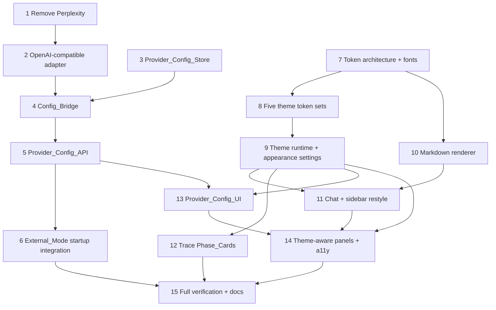

# Implementation Plan

## Overview

This plan is incremental and test-backed. Backend tasks land behind the existing interfaces first (stores, adapter, bridge) so they are unit-testable without the UI; the UI overhaul and theme system land next; integration wires persisted config into the router and connection test last. Every task preserves Local_Mode and the redaction boundaries, and the Verification_Gates (`npm test`, `npm run build`, `npm run check`) must pass after each parent task.

## Tasks

### Part C — BYOK backend foundation

- [x] 1. Remove Perplexity provider across the codebase
  - Delete `PerplexityResearchProvider` and `PerplexityResearchProviderOptions` from `src/providers/llm.ts`; remove its entry from `buildModelRouter` defaults and from the `research` priority list in `prioritizeProvidersForRoute`.
  - Remove the import and `perplexity` descriptor from `EXTERNAL_PROVIDER_DESCRIPTORS` in `src/deployment/index.ts`.
  - Remove the import, the `perplexity` member of `SUPPORTED_PROVIDER_IDS`, the `resolveConnectionTestProvider` `case "perplexity"`, and the schema comment in `src/api/server.ts`.
  - Remove the `perplexity` entry from `PROVIDER_ENV_REQUIREMENTS` in `src/setupStatus.ts` and the `PERPLEXITY_API_KEY` SETUP_ITEM + `SENSITIVE_KEYS` entry in `src/setupChecklist.ts`.
  - Remove Perplexity lines from `.env.example` and the provider list + class diagram in `docs/architecture/current-rector-byok-architecture.md`.
  - Update or remove any test asserting Perplexity support; run the suite to confirm no dangling references.
  - _Requirements: 16.1, 16.2, 16.3, 16.4, 16.5_

- [x] 2. Add the OpenAI-compatible provider adapter
- [x] 2.1 Implement `OpenAICompatibleProvider` in `src/providers/llm.ts`
  - Model it on `TogetherAIProvider`: options `{ apiKey, baseUrl, model, headers?, enableNetwork?, fetchImpl? }`; metadata id `openai-compatible` with routes and a configured-model map.
  - `validateConfig()` requires non-empty `apiKey`, absolute http(s) `baseUrl`, and non-empty `model`; default `enableNetwork` false; reuse `parseOpenAICompatibleResponse`; throw `ProviderError` on HTTP/parse failure.
  - Merge optional non-secret `headers` into the request without overriding `Authorization`/`Content-Type`.
  - _Requirements: 12.1, 12.2, 12.3, 12.4, 12.5, 12.6_
- [x] 2.2 Unit-test the adapter
  - validateConfig matrix (missing key/baseUrl/model, bad URL); `enableNetwork=false` blocks the network; response parse + error mapping with an injected `fetchImpl`; assert errors are redacted and key-free.
  - _Requirements: 12.3, 12.4, 12.5, 12.6_

- [x] 3. Add the Provider_Config_Store (non-secret config)
- [x] 3.1 Define config types and the store interface in `src/providers/config.ts` and `src/providers/configStore.ts`
  - `ProviderConfigRecord`, `ProviderConfigState`, `ProviderConfigStore` per design; secrets referenced via `secretRef` only.
  - Implement `createLocalProviderConfigStore({ filePath: ".rector/providers.json", fsImpl })` with atomic temp+rename writes, and an in-memory backing for tests; mirror the injectable-fs pattern from `secretStore.ts`.
  - _Requirements: 10.5, 14.2_
- [x] 3.2 Unit-test the store
  - Round-trip upsert/remove/setActiveRoute; atomic-write failure leaves prior state intact (injected fs double); invariant test that no stored record field contains a secret value.
  - _Requirements: 11.6, 11.7, 14.2_

- [x] 4. Add the Config_Bridge
- [x] 4.1 Implement `src/providers/configBridge.ts`
  - `resolveProviderEnv(store, secrets, baseEnv)` overlays resolved record fields + injected secret onto a copy of `process.env`, with persisted UI config taking precedence over env (documented precedence).
  - `resolveTestProvider(providerId, store, secrets, { enableNetwork, fetchImpl })` builds exactly one provider (including `openai-compatible`) from persisted config+secret.
  - `buildConfiguredRouter(...)` builds the External_Mode provider list (incl. one `OpenAICompatibleProvider` per configured record) and honors `activeRoutes` for flagship/SLM with fallback to existing priority selection.
  - Ensure the bridge output is never used to construct the sandbox executor environment.
  - _Requirements: 13.1, 13.2, 13.3, 13.4, 13.5, 14.1, 14.3, 14.4_
- [x] 4.2 Unit-test the bridge
  - Precedence (UI over env); secret never present in any serialized output; active-route honored, with fallback when the designated provider is missing/invalid; property test that no secret leaks; assert no secret reaches a sandbox-env shape.
  - _Requirements: 13.4, 13.5, 13.6, 14.3, 14.4_

### Part C — BYOK API

- [x] 5. Provider_Config_API endpoints in `src/api/server.ts`
- [x] 5.1 Wire a shared real `SecretStore` and `ProviderConfigStore` into `createApp`
  - Replace the `createEmptySecretStore()` default for the non-test app with the local encrypted Secret_Store; construct the local Provider_Config_Store; pass both via `securityOptions`.
  - _Requirements: 10.5, 11.6_
- [x] 5.2 Implement CRUD + selection routes
  - `GET /api/providers` (records + `activeRoutes` + per-provider `secretPresent` boolean, no values); `POST /api/providers` (upsert; optional `apiKey` persisted to Secret_Store then stripped); `DELETE /api/providers/:id` (record + secret); `POST /api/providers/:id/secret` (write/replace secret only); `POST /api/providers/active` (set role→provider).
  - Validate bodies with Zod; route all responses through `sendRedacted`/`redactOutbound`; never echo secret values.
  - _Requirements: 10.4, 10.5, 10.6, 11.2, 11.3, 11.4, 11.6, 11.7, 14.1, 14.2_
- [x] 5.3 Upgrade `POST /api/setup/test-connection` to use the Config_Bridge
  - Resolve the provider from persisted config+secret instead of env-only; keep validate→single-ping flow, 400 on unsupported id before any build, and redacted errors.
  - _Requirements: 13.2, 15.1, 15.6_
- [x] 5.4 API tests
  - CRUD + write-once secret + `secretPresent`-only responses; property-based secret-leak test over generated keys; unsupported-id rejection pre-build; test-connection parity using resolved providers.
  - _Requirements: 11.2, 11.4, 11.6, 15.1, 15.6, 17.3_

- [x] 6. Integrate persisted config into External_Mode startup
  - In `src/bin/server.ts`/`createApp`, build the External_Mode router via `buildConfiguredRouter` so persisted providers (incl. openai-compatible) participate in selection; keep Local_Mode using the fake router unchanged.
  - Confirm Local_Mode makes no provider/network call regardless of persisted config (regression test).
  - _Requirements: 13.3, 14.3, 17.1, 17.2_

### Part A — Theme system foundation

- [x] 7. Establish the token architecture
- [x] 7.1 Split `src/public/styles.css` into `styles/base.css` + token contract
  - Move structural/non-themeable rules to `base.css`; replace hardcoded colors/spacing/radii/type with token references; define the full token-name contract and a `--density-scale`/`--font-scale` mechanism on spacing/type tokens.
  - _Requirements: 1.1, 1.7, 4.1_
- [x] 7.2 Self-host fonts
  - Add `src/public/fonts/<family>/*.woff2` for Inter, JetBrains Mono, Fraunces, Cormorant with each family's `OFL.txt`; author `@font-face` with `font-display: swap` and system fallback stacks.
  - _Requirements: 5.1, 5.2, 5.3, 5.4, 5.5_

- [x] 8. Author the five theme token sets in `src/public/styles/themes/`
- [x] 8.1 Halo (default) — port verbatim from `docs/specs/UI-Ideas/halo/css/system.css` into the token contract.
  - _Requirements: 2.1, 2.7_
- [x] 8.2 Aether, Cairn, Penumbra, Vellum Tessera — author token sets from the reverse-engineered briefs (gradient accents for Aether/Vellum, grayscale-only accent for Penumbra, light polarity for Vellum); verify body contrast ≥ 4.5:1 each.
  - _Requirements: 2.2, 2.3, 2.4, 2.5, 2.6, 2.7, 9.1_

- [x] 9. Theme runtime + appearance settings
- [x] 9.1 Inline no-flash boot script + `theme.js`
  - Inline `<head>` script reads `localStorage["rector.appearance"]` and sets `data-theme` + override props before first paint; `theme.js` exposes `applyTheme/setAccent/setDensity/setFontScale/setReducedMotion/resetCustomizations` and persists each.
  - Lazy per-theme stylesheet/font attachment so only the active theme's fonts are fetched.
  - _Requirements: 1.3, 1.5, 1.6, 3.1, 3.2, 3.5, 4.3, 4.4_
- [x] 9.2 Appearance_Settings panel
  - Theme picker; accent override from a curated palette; density (comfortable/compact); font-size scale; reduced-motion toggle; reset control; persist all; store no secrets.
  - _Requirements: 1.2, 1.4, 3.3, 3.4, 3.6, 3.7, 3.8, 3.9, 3.10_
- [x] 9.3 Theme system tests (DOM)
  - Token-contract presence per theme; apply/override functions set correct attributes/props; persistence round-trip + fallback on unreadable prefs; reduced-motion disables non-essential animation; switching theme preserves customizations.
  - _Requirements: 1.5, 3.2, 3.5, 3.9, 9.2_

### Part B — UI overhaul

- [x] 10. Self-contained Markdown renderer
  - Add `src/public/markdown.js` covering headings, bold/italic, inline + fenced code, lists, links, paragraphs; escape all text before insertion (XSS-safe); render assistant messages through it, user messages stay plain.
  - Unit-test rendering + escaping.
  - _Requirements: 4.2, 6.3_

- [x] 11. Chat column + sidebar restyle
  - Constrain message measure; restyle status/live indicators with theme status tokens + icon/text; group sidebar system actions with a pending-approvals count badge; dim sidebar luminance. Preserve all send/stream/history behavior.
  - _Requirements: 6.1, 6.2, 6.4, 6.5, 6.6, 9.4_

- [x] 12. Trace_Drawer Phase_Cards
  - Convert the phase timeline into collapsible Phase_Cards driven by real run events (reuse existing `RUN_PHASES`/event-derived status); preserve observability, cost panel, decision section, raw-events view; distinct non-success terminal styling; values only from real data.
  - _Requirements: 7.1, 7.2, 7.3, 7.4, 7.5, 7.6_

- [x] 13. Provider_Config_UI
  - Two-tier UI (preset cards + advanced openai-compatible form: base URL/key/model); per-provider status (not configured/configured/active); masked key inputs with show/hide and write-once behavior; save/remove; active-provider-per-role selection with clear active indication; Test connection button with loading/disabled, success/failure/timeout (30s) messages, all redacted; keep chat/trace accessible.
  - _Requirements: 10.1, 10.2, 10.3, 10.4, 10.6, 10.7, 11.1, 11.2, 11.5, 14.5, 15.2, 15.3, 15.4, 15.5_

- [x] 14. Theme-aware existing panels + accessibility pass
  - Ensure setup status, provider test/config, workspace safety, and approval modals consume theme surface/elevation/backdrop/focus tokens; apply focus-ring token to all interactive controls; verify never-color-only status, visible focus, preserved ARIA roles, and reduced-motion across themes. Approval gating behavior unchanged.
  - _Requirements: 8.1, 8.2, 8.3, 8.4, 9.2, 9.3, 9.4, 9.5_

### Verification

- [x] 15. Full verification and docs
  - Run `npm test`, `npm run build`, `npm run check` and fix any failures; add a Local_Mode regression assertion that persisted config never triggers network in local mode; update `.env.example` and `docs/architecture` to document the new provider config flow and the Config_Bridge precedence; confirm no remote origins or client dependencies were introduced.
  - _Requirements: 4.2, 4.6, 13.4, 17.1, 17.2, 17.3, 17.4, 17.5, 17.6_

## Task Dependency Graph

```json
{
  "waves": [
    { "wave": 1, "tasks": ["1", "3", "7"], "rationale": "Independent starting points: Perplexity removal, the non-secret config store, and the token/font foundation." },
    { "wave": 2, "tasks": ["2", "8", "10"], "rationale": "Adapter after Perplexity removal; theme token sets after the contract; markdown renderer after base tokens." },
    { "wave": 3, "tasks": ["4", "9"], "rationale": "Config_Bridge needs the adapter (2) and config store (3); theme runtime needs the theme sets (8)." },
    { "wave": 4, "tasks": ["5", "11", "12"], "rationale": "Provider API needs the bridge (4); chat/sidebar and Phase_Cards need the theme runtime (9) and markdown (10)." },
    { "wave": 5, "tasks": ["6", "13"], "rationale": "External_Mode integration after the API/bridge; Provider_Config_UI needs both the API (5) and theme runtime (9)." },
    { "wave": 6, "tasks": ["14"], "rationale": "Theme-aware panels + accessibility after chat (11) and the provider UI (13) exist." },
    { "wave": 7, "tasks": ["15"], "rationale": "Full verification and docs after all backend and UI work lands." }
  ]
}
```



## Notes

- **Two independent tracks.** Backend (tasks 1–6) and front-end theming (tasks 7–12, 14) can proceed in parallel; they converge at task 13 (Provider_Config_UI needs the API from task 5) and task 15 (verification).
- **Start with Perplexity removal (task 1)** so the supported-provider surface is final before the adapter, bridge, and UI are built against it.
- **Local_Mode is sacrosanct.** Tasks 4, 6, and 15 each assert that persisted configuration and secrets never cause a provider/network call in Local_Mode.
- **No new client dependency / no remote origin** is a standing constraint checked in task 15; fonts and the Markdown renderer are bundled locally.
- **Redaction parity:** every new API response (task 5) and bridge output (task 4) is covered by a secret-leak test reusing the existing property-based redaction approach.
- Run the Verification_Gates after each parent task, not only at the end.
