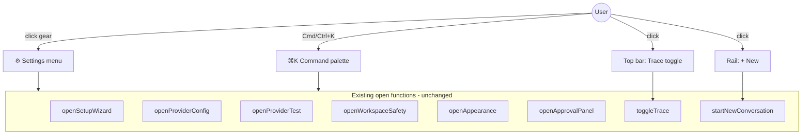
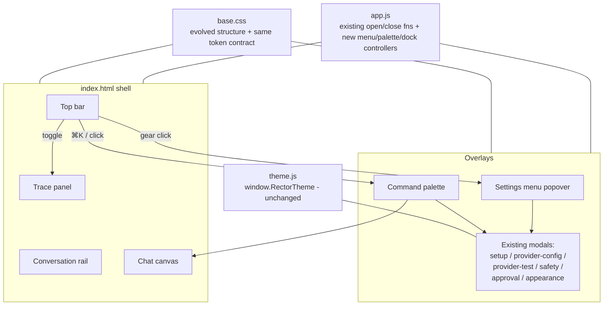

# Design Document: UI Structural Redesign

## Overview

This effort replaces Rector's browser UI **structure** — not its color — with a fresh, modern layout
inspired by current agent IDEs (Cursor, Codex, Antigravity 2.0). The previous effort
(`ui-overhaul-and-byok-config`) shipped a runtime theming system (five palettes, fonts, density)
but deliberately preserved the existing layout, so the result reads as a recolor rather than the
"overhaul" the user asked for. This redesign delivers the missing half: a **slim top bar**, a
**de-cluttered conversation rail**, a **focused chat canvas**, and **dockable/overlay panels** for
trace and settings, with the six stacked sidebar "system" buttons consolidated into a single
**settings (gear) menu** plus a **Cmd/Ctrl+K command palette**.

The hard constraints from the existing architecture are non-negotiable and front-and-center here:
the client stays **dependency-free vanilla HTML/CSS/JS** served statically from `src/public/`, with
**no client build step**, **no CDN or remote fonts/assets**, and **zero external network calls**.
The existing CSS custom-property token contract in `base.css` and the five theme stylesheets are
**reused and evolved**, not rebuilt. Every existing element ID and JS handler in `app.js` /
`theme.js` either keeps its current ID or is migrated through an explicit, documented mapping so
nothing breaks.

This is a **structure + visual-language** change. It is explicitly **not** a rewrite of the BYOK
provider-config logic, the deterministic local pipeline, the SSE/polling transport, or the
theme-token system — those are consumed as-is and merely re-homed in the new shell.

---

## High-Level Design

### Design Goals (traceable)

| # | Goal | How this design meets it |
|---|------|--------------------------|
| G1 | De-clutter the left rail | Rail holds only brand, New action, and the conversation list. The six system buttons leave the rail. |
| G2 | Consolidate system actions | A single top-bar gear menu + a Cmd/Ctrl+K command palette expose all six actions. |
| G3 | Genuinely fresh, modern layout | Slim top bar, focused chat canvas, dockable/overlay panels, refined spacing/elevation/motion/iconography layered on the token system. |
| G4 | Preserve ALL behavior + wiring | SSE/polling, trace, cost panel, approval, provider config, setup, safety, appearance, conversation list keep working; IDs/handlers preserved or explicitly migrated. |
| G5 | Keep dependency-free / no-build / offline | Pure HTML/CSS/JS edits to existing files; no new deps, no build, no remote origins, self-hosted fonts only. |

### Region Model

The new shell is a **three-row, region-based layout** rather than the current three-column grid.
The top bar spans full width; below it, a content row holds the conversation rail, the chat canvas,
and the dockable trace panel. Settings and the command palette are **overlay surfaces** that float
above the shell rather than occupying permanent columns.

```
┌──────────────────────────────────────────────────────────────────────────┐
│  TOP BAR  (slim, full-width)                                               │
│  ◇ RECTOR  ·  <conversation title>   <status pill> <live badge>            │
│                                   [⌘K]  [Trace ▸]  [⚙ Settings ▾]          │
├───────────────┬──────────────────────────────────────────┬───────────────┤
│ CONVERSATION  │            CHAT CANVAS                     │  TRACE PANEL  │
│ RAIL          │  ┌──────────────────────────────────┐     │  (dockable /  │
│               │  │  messages (centered, max-measure) │     │   overlay)    │
│ ◇ RECTOR      │  │                                   │     │               │
│ [+ New]       │  │                                   │     │  phase cards  │
│ ───────────   │  │                                   │     │  cost/tokens  │
│ conversation  │  └──────────────────────────────────┘     │  obs / events │
│ list (fills)  │  ┌──────────────────────────────────┐     │               │
│               │  │  composer                         │     │               │
│ v0.1.0 online │  └──────────────────────────────────┘     │               │
└───────────────┴──────────────────────────────────────────┴───────────────┘

       ⚙ Settings menu (anchored popover, top-right)        ⌘K Command palette (centered overlay)
       ┌───────────────────────────┐                        ┌──────────────────────────────────┐
       │ Setup status              │                        │  > type a command…               │
       │ Provider configuration    │                        │  ─────────────────────────────── │
       │ Test provider connection  │                        │  Setup status                     │
       │ Workspace safety          │                        │  Provider configuration           │
       │ Appearance                │                        │  Test provider connection         │
       │ ───────────────────────── │                        │  Workspace safety                 │
       │ Pending approvals    (2)  │                        │  Appearance                       │
       │ Toggle trace panel        │                        │  Pending approvals            (2) │
       └───────────────────────────┘                        │  Toggle trace panel               │
                                                             │  New conversation                 │
                                                             └──────────────────────────────────┘
```

### Region responsibilities

- **Top bar** (new region): brand mark, the active conversation title, the run status pill, and the
  live-connection badge on the left/center; the command-palette launcher (`⌘K`), the Trace toggle,
  and the Settings gear on the right. The title/status/badge **move here** from the old chat header,
  which is removed.
- **Conversation rail** (slimmed): brand (small), the New action, the conversation list (now the
  dominant element, filling the available height), and a compact footer (version + health). The
  mode banner and the entire system cluster **leave the rail**.
- **Chat canvas** (focused): the messages region (content constrained to `--measure`) and the
  composer. Visually the primary surface — brightest tier, most horizontal breathing room.
- **Trace panel** (dockable/overlay): same content as today (run summary, observability, cost
  panel, phase cards, decision, raw events) but presented as a panel that **docks** on wide windows
  and **overlays** on narrow ones, instead of being a permanent third column.
- **Settings menu** (new overlay): an anchored popover from the gear that lists the five
  configuration actions plus pending approvals and the trace toggle. Each item opens the existing
  modal it always opened.
- **Command palette** (new overlay): a centered, keyboard-driven launcher (Cmd/Ctrl+K) listing the
  same actions plus "New conversation" and "Toggle trace panel". Filter-as-you-type, arrow-key
  navigation, Enter to invoke, Escape to dismiss.

### Navigation / Interaction Model

There are now **three coordinated entry points** to system actions, all invoking the **same
underlying open functions** that the sidebar buttons call today:

1. **Settings gear menu** — mouse-first. Click the gear → popover → click an action → existing modal
   opens.
2. **Command palette** — keyboard-first. `Cmd/Ctrl+K` (or click `⌘K`) → palette → filter → Enter →
   existing modal opens.
3. **Direct affordances** — the New action and Trace toggle remain as visible controls (New in the
   rail, Trace in the top bar) because they are high-frequency.



### Reorganizing the six system actions

The six actions currently stacked in `.sidebar__cluster` are re-homed without changing what they do:

| Action (current sidebar button id) | New home(s) |
|---|---|
| Setup status (`open-setup-wizard`) | Settings menu + command palette |
| Provider configuration (`open-provider-config`) | Settings menu + command palette |
| Test provider connection (`open-provider-test`) | Settings menu + command palette |
| Workspace safety (`open-workspace-safety`) | Settings menu + command palette |
| Appearance (`open-appearance`) | Settings menu + command palette |
| Pending approvals (`open-approval` + `approval-badge`) | Settings menu (with count) + command palette (with count) |

The pending-approvals **count badge** (`approval-badge`) moves onto its Settings-menu item and is
mirrored as a small count indicator on the gear itself, so a waiting approval is visible without
opening the menu.

### Visual Language (layered on the existing token system)

The redesign **adds a small set of structural tokens** to `base.css` and uses the existing color /
type / radius / elevation / motion tokens unchanged, so all five themes continue to drive the look.
No theme stylesheet needs editing for structure; structural tokens have sensible defaults and may be
optionally overridden by a theme later.

- **Spacing rhythm**: reuse the existing `--space-*` 4px scale. New layout uses a consistent
  vertical rhythm — top bar `--space-3` block padding, canvas gutters `--space-6`, rail padding
  `--space-3`. Add `--topbar-h: 48px`, `--rail-w: 248px`, `--trace-w: 380px` as structural tokens.
- **Elevation**: reuse `--shadow-sm/md/lg`. The top bar uses a hairline bottom border (no shadow);
  overlay surfaces (settings popover, command palette, docked-as-overlay trace) use `--shadow-lg`.
  Add `--z-topbar: 30`, `--z-overlay-panel: 45`, `--z-menu: 50`, `--z-palette: 60` to formalize
  stacking (modals already use `z-index: 40`).
- **Motion**: reuse `--motion-fast/base/slow` and `--easing-standard`; animate only `transform` /
  `opacity` (compositor-friendly), all under 300ms. Menu and palette fade+scale in; trace panel
  slides via `transform`. All motion respects the existing `[data-reduced-motion="true"]` hook.
- **Iconography**: inline SVG sprite (no icon font, no remote fetch) defined once in `index.html`,
  referenced via `<use>`. Provides gear, command (`⌘`), trace, plus, and chevron glyphs. Falls back
  to text labels (icons are decorative; controls keep accessible names).
- **Type rhythm**: reuse `--font-display/body/mono` and `--fs-base`. Top bar title uses
  display weight 600; menu/palette items use body; status/labels keep mono where already used.

### Before / After

```
BEFORE (current)                                AFTER (this redesign)
────────────────────────────────────           ────────────────────────────────────
.app grid: 260px | 1fr | 0|380px                .app: rows = [topbar][content]
                                                 content grid: rail | canvas | trace
┌──────────┬───────────────┬───────┐            ┌──────────────────────────────────┐
│ SIDEBAR  │ CHAT          │ TRACE │            │ TOP BAR  title·status  ⌘K Trace ⚙ │
│ brand +N │ head:title    │       │            ├────────┬──────────────────┬───────┤
│ mode ban │  status·trace │ phase │            │ RAIL   │ CHAT CANVAS      │ TRACE │
│ ┌SYSTEM┐ │  ───────────  │ cards │            │ brand  │  messages        │ panel │
│ │setup │ │  messages     │ cost  │            │ +New   │  (centered)      │ docks │
│ │prov  │ │               │ obs   │            │ convo  │  ───────────     │  or   │
│ │test  │ │  ───────────  │ events│            │ list   │  composer        │ over- │
│ │safety│ │  composer     │       │            │ (fills)│                  │ lays  │
│ │appear│ │               │       │            │ v· on  │                  │       │
│ │appr 1│ │               │       │            └────────┴──────────────────┴───────┘
│ └──────┘ │               │       │             system actions → ⚙ menu + ⌘K palette
│ convo    │               │       │
│ list     │               │       │             Six stacked buttons: GONE from rail.
│ v· on    │               │       │             Mode banner: GONE from rail (moved to
└──────────┴───────────────┴───────┘               setup status / first-run hint).
```

Key structural deltas:
- A dedicated **top bar row** is introduced; the old `.chat__head` is dissolved into it.
- The sidebar's **system cluster and mode banner are removed**; the rail becomes conversation-first.
- The trace column becomes a **dockable/overlay panel** with explicit open/close affordances rather
  than a permanent grid track.
- Two new overlay surfaces — **settings menu** and **command palette** — are added.

---

## Architecture

The shell is a region-based, two-row layout (top bar + content row). The content row hosts three
panes — conversation rail, chat canvas, and a dockable trace panel — while the settings menu and
command palette are overlay surfaces layered above the shell. All regions and overlays read their
color, type, radius, elevation, and motion from the existing theme-token contract; only structural
geometry tokens are added.



---

## Components and Interfaces

This section names each UI region and the JS controller that drives it. The provider-config, setup,
safety, approval, and appearance modal components are existing and unchanged; only their entry point
(the menu/palette) is new. Function signatures below are the public surface added or preserved in
`app.js`.

### Region: Top bar (`.topbar`, new)

**Purpose**: house the active conversation title, run status, live-connection badge, and the global
action launchers (command palette, trace toggle, settings gear).

**Hosts (moved, ids preserved)**: `chat-title`, `run-status`, `live-indicator`, `toggle-trace`.
**Adds (new ids)**: `open-command-palette`, `open-settings-menu`, `settings-menu`, `settings-menu-wrap`,
`settings-approval-dot`.

### Region: Conversation rail (`.rail`, slimmed from `.sidebar`)

**Purpose**: brand + New action + conversation list + footer only. No system buttons, no mode banner.
**Hosts (ids preserved)**: `new-conversation`, `conversation-list`, `conversation-empty`, `health-indicator`.

### Region: Chat canvas (`.chat`, header removed)

**Purpose**: messages region and composer; the per-column header is gone (its content moved to the top bar).
**Hosts (ids preserved)**: `messages`, `empty-state`, `suggestions`, `composer`, `composer-input`, `composer-send`.

### Region: Trace panel (`.trace`, now dockable/overlay)

**Purpose**: identical content (summary, observability, cost panel, phase cards, decision, events);
docks as a column on wide windows, overlays on narrow windows.
**Hosts (ids preserved)**: `trace-drawer`, `close-trace`, `trace-empty`, `trace-body`, all `trace-*`,
`obs-*`, `cost-*`, `phase-cards`, `decision-*`, `events`.

### Controller: Settings menu

```js
function openSettingsMenu(): void   // show popover, set aria-expanded, attach outside-click + Escape listeners
function closeSettingsMenu(): void  // hide popover, clear aria-expanded, detach listeners
function bindSettingsMenu(): void   // wire gear toggle + close-on-item-click
```

### Controller: Command palette

```js
function commandRegistry(): Array<{ id: string, label: string, run: () => void, badge?: () => number }>
function openCommandPalette(): void
function closeCommandPalette(): void
function renderPaletteList(query: string): void   // filter-as-you-type, sets aria-selected
function invokePaletteCommand(cmd): void           // close palette, call cmd.run()
function onPaletteKeydown(e): void                 // Arrow/Enter/Escape navigation
function bindCommandPalette(): void                // wire launcher, input, backdrop, global Cmd/Ctrl+K
```

### Preserved controllers (unchanged signatures)

`openSetupWizard`/`bindSetupWizard`, `openProviderConfig`/`bindProviderConfig`,
`openProviderTest`/`bindProviderTest`, `openWorkspaceSafety`/`bindWorkspaceSafety`,
`openApprovalPanel`/`closeApprovalPanel`/`bindApproval`, `openAppearance`/`closeAppearance`/`bindAppearance`,
`openTrace`/`closeTrace`/`toggleTrace`, `startNewConversation`, `setApprovalBadge`.

---

## Data Models

The redesign is structural, so its "data models" are the small client-side shapes the new
controllers and tokens rely on. No server data model changes.

### Command descriptor (command palette registry)

```js
// One entry per launchable action. `run` always points at an EXISTING open/toggle function.
{
  id: string,           // stable command key, e.g. "provider"
  label: string,        // display + filter text, e.g. "Provider configuration"
  run: () => void,      // invokes the existing handler; palette never re-implements behavior
  badge?: () => number  // optional count (used by "Pending approvals")
}
```

**Validation rules**: `id` unique; `label` non-empty; `run` references a function defined in `app.js`;
`badge`, when present, returns a non-negative integer.

### Structural tokens (added to `:root` in `base.css`)

```css
--topbar-h: 48px;     /* top bar height row */
--rail-w: 248px;      /* conversation rail width */
--trace-w: 380px;     /* trace panel width when docked/overlaid */
--z-topbar: 30;       /* below modals (40) */
--z-overlay-panel: 45;/* docked-as-overlay trace */
--z-menu: 50;         /* settings popover */
--z-palette: 60;      /* command palette (topmost) */
```

**Validation rules**: all are additive; defaults render correctly with no theme override; themes
*may* override but are not required to. Existing color/type/radius/elevation/motion tokens are unchanged.

### Persisted appearance preference (existing, unchanged — for reference)

```js
// localStorage["rector.appearance"], owned by theme.js / the no-flash boot script.
{ theme, accents: { <theme>: <accent> }, density, fontScale, reducedMotion }
```

No secret is ever written here; the redesign neither reads nor changes this shape.

---

## Low-Level Design

The redesign touches four served files only: `src/public/index.html`, `src/public/styles/base.css`,
`src/public/app.js`, and (minimally) `src/public/theme.js`. No new files are required, though an
optional `src/public/styles/shell.css` could hold the new structural rules if separation is
preferred; this design keeps everything in `base.css` to avoid an extra `<link>`.

### HTML markup restructure (`index.html`)

The `<head>` (fonts link, base.css link, lazy theme `<link id="theme-stylesheet">`, and the inline
no-flash boot script) is **unchanged** — the no-flash guarantee and theme contract are preserved.
The `<body>` is restructured from a three-column `.app` into a top-bar + content shell.

**New top-level structure (replacing the current `.app` inner layout):**

```html
<body>
  <!-- Inline SVG icon sprite: defined once, referenced via <use>. No remote fetch. -->
  <svg width="0" height="0" aria-hidden="true" style="position:absolute">
    <symbol id="i-gear" viewBox="0 0 24 24"><!-- gear path --></symbol>
    <symbol id="i-cmd" viewBox="0 0 24 24"><!-- command path --></symbol>
    <symbol id="i-trace" viewBox="0 0 24 24"><!-- trace path --></symbol>
    <symbol id="i-plus" viewBox="0 0 24 24"><!-- plus path --></symbol>
    <symbol id="i-chevron" viewBox="0 0 24 24"><!-- chevron path --></symbol>
  </svg>

  <div class="app">
    <!-- TOP BAR (new region; absorbs old .chat__head title/status/live badge) -->
    <header class="topbar" aria-label="Application bar">
      <div class="topbar__lead">
        <span class="brand__mark" aria-hidden="true"></span>
        <h1 class="topbar__title" id="chat-title">New conversation</h1>
        <span class="status-pill status-pill--idle" id="run-status" title="Current run phase">Idle</span>
        <span class="live-badge" id="live-indicator" data-mode="off" aria-live="polite" hidden>
          <span class="live-badge__dot" aria-hidden="true"></span>
          <span class="live-badge__text">LIVE</span>
        </span>
      </div>
      <div class="topbar__actions">
        <button class="btn btn--ghost btn--sm" id="open-command-palette" type="button"
                aria-haspopup="dialog" title="Command palette (Ctrl/Cmd+K)">
          <svg class="icon" aria-hidden="true"><use href="#i-cmd" /></svg>
          <span class="topbar__kbd">⌘K</span>
        </button>
        <button class="btn btn--ghost btn--sm" id="toggle-trace" type="button" aria-pressed="false">
          <svg class="icon" aria-hidden="true"><use href="#i-trace" /></svg> Trace
        </button>
        <div class="menu" id="settings-menu-wrap">
          <button class="btn btn--ghost btn--sm" id="open-settings-menu" type="button"
                  aria-haspopup="menu" aria-expanded="false" aria-controls="settings-menu">
            <svg class="icon" aria-hidden="true"><use href="#i-gear" /></svg> Settings
            <span class="topbar__approval-dot" id="settings-approval-dot" hidden></span>
          </button>
          <!-- Anchored popover; hidden by default -->
          <div class="menu__popover" id="settings-menu" role="menu"
               aria-label="System actions" hidden>
            <button class="menu__item" id="open-setup-wizard"     role="menuitem" type="button">Setup status</button>
            <button class="menu__item" id="open-provider-config"  role="menuitem" type="button">Provider configuration</button>
            <button class="menu__item" id="open-provider-test"    role="menuitem" type="button">Test provider connection</button>
            <button class="menu__item" id="open-workspace-safety" role="menuitem" type="button">Workspace safety</button>
            <button class="menu__item" id="open-appearance"       role="menuitem" type="button">Appearance</button>
            <div class="menu__sep" role="separator"></div>
            <button class="menu__item menu__item--badged" id="open-approval" role="menuitem" type="button">
              <span>Pending approvals</span>
              <span class="menu__badge" id="approval-badge" hidden>1</span>
            </button>
          </div>
        </div>
      </div>
    </header>

    <!-- CONTENT ROW: rail | canvas | trace -->
    <div class="content">
      <!-- CONVERSATION RAIL (slimmed: brand + New + list + foot only) -->
      <aside class="rail" aria-label="Conversations">
        <div class="rail__head">
          <div class="brand">
            <span class="brand__mark" aria-hidden="true"></span>
            <span class="brand__name">RECTOR</span>
            <span class="brand__tag">local</span>
          </div>
          <button class="btn btn--ghost btn--sm" id="new-conversation" type="button" title="New conversation">
            <svg class="icon" aria-hidden="true"><use href="#i-plus" /></svg> New
          </button>
        </div>
        <nav class="conversation-list" id="conversation-list" aria-live="polite">
          <p class="conversation-list__empty" id="conversation-empty">No conversations yet. Send a message to start one.</p>
        </nav>
        <div class="rail__foot">
          <span class="t-mono">v0.1.0-alpha</span>
          <span class="t-mono muted" id="health-indicator">checking…</span>
        </div>
      </aside>

      <!-- CHAT CANVAS (messages + composer; no per-column header anymore) -->
      <main class="chat" aria-label="Chat">
        <section class="messages" id="messages" aria-live="polite">
          <div class="empty-state" id="empty-state"><!-- unchanged empty state --></div>
        </section>
        <form class="composer" id="composer"><!-- unchanged composer + send --></form>
        <p class="composer__hint">Local developer preview…</p>
      </main>

      <!-- TRACE PANEL (same inner content; now a dockable/overlay panel) -->
      <aside class="trace" id="trace-drawer" aria-label="Run trace" data-open="false">
        <!-- trace__head + trace__empty + trace__body unchanged (all ids preserved) -->
      </aside>
    </div>

    <!-- COMMAND PALETTE (new overlay) -->
    <div class="palette" id="command-palette" hidden role="dialog" aria-modal="true"
         aria-label="Command palette">
      <div class="palette__backdrop" id="command-palette-backdrop"></div>
      <div class="palette__panel" role="document">
        <input class="palette__input" id="command-palette-input" type="text"
               role="combobox" aria-expanded="true" aria-controls="command-palette-list"
               aria-autocomplete="list" placeholder="Type a command…" autocomplete="off" />
        <ul class="palette__list" id="command-palette-list" role="listbox"></ul>
      </div>
    </div>
  </div>

  <!-- Existing modals: setup-wizard, provider-test, workspace-safety, approval,
       provider-config, appearance — markup UNCHANGED, all ids preserved. -->
  ...

  <script src="theme.js"></script>
  <script src="markdown.js"></script>
  <script src="app.js"></script>
</body>
```

**What is removed from the old markup:** the `.sidebar__head` New button stays (moves to `.rail__head`),
but the `.mode-banner` and the entire `.sidebar__section.sidebar__cluster` (the six stacked buttons)
are deleted from the rail. The old `.chat__head` is deleted; its three children (`chat-title`,
`run-status`, `live-indicator`) move into `.topbar__lead`. The five `open-*` system buttons and the
`open-approval` button move into `#settings-menu` (same ids).

### CSS architecture changes (`base.css`)

`base.css` remains the base layer of the Theme_System: it keeps the **full token-name contract**,
the **default token values**, and the `--density-scale`/`--font-scale` mechanism. The change is
confined to the **structural / non-themeable rules** section (the app-shell grid and component
geometry), which already "reference tokens — never hardcoded literals." New structural tokens are
added to `:root` with defaults; all color/type/radius/motion continue to come from the theme layer.

**New structural tokens (added to `:root`, defaults only — themes may override):**

```css
:root {
  /* ... existing tokens unchanged ... */
  --topbar-h: 48px;
  --rail-w: 248px;
  --trace-w: 380px;
  /* Formalized stacking (modals already use z-index:40) */
  --z-topbar: 30;
  --z-overlay-panel: 45;
  --z-menu: 50;
  --z-palette: 60;
}
```

**Shell grid (replaces `.app { grid-template-columns: 260px 1fr 0 }`):**

```css
/* Two rows: slim top bar + content. */
.app {
  display: grid;
  grid-template-rows: var(--topbar-h) 1fr;
  height: 100vh;
}

.topbar {
  display: flex;
  align-items: center;
  justify-content: space-between;
  gap: var(--space-3);
  padding: 0 var(--space-4);
  border-bottom: 1px solid var(--border);
  background: var(--surface);
  z-index: var(--z-topbar);
}
.topbar__lead { display: flex; align-items: center; gap: var(--space-3); min-width: 0; }
.topbar__actions { display: flex; align-items: center; gap: var(--space-2); }

/* Content row: rail | canvas | (trace docks in/out). */
.content {
  display: grid;
  grid-template-columns: var(--rail-w) 1fr 0;
  min-height: 0;                 /* allow inner scroll regions */
  transition: grid-template-columns var(--motion-base) var(--easing-standard);
}
.app.trace-open .content { grid-template-columns: var(--rail-w) 1fr var(--trace-w); }

/* Narrow windows: trace overlays the canvas instead of taking a column. */
@media (max-width: 900px) {
  .app.trace-open .content { grid-template-columns: var(--rail-w) 1fr 0; }
  .app.trace-open .trace {
    position: fixed; top: var(--topbar-h); right: 0; bottom: 0;
    width: min(var(--trace-w), 100%);
    box-shadow: var(--shadow-lg);
    z-index: var(--z-overlay-panel);
  }
}
```

The `.sidebar` rules are renamed to `.rail` (conversation-first); the `.sidebar__cluster*`,
`.sidebar__action*`, and `.mode-banner` rules are **deleted** (their markup is gone). The `.chat`
rules drop the `.chat__head` block. `.trace` keeps its rules and gains the responsive overlay
behavior above. New rule blocks are added for `.topbar`, `.menu`/`.menu__popover`/`.menu__item`,
and `.palette`/`.palette__panel`/`.palette__list`/`.palette__option`.

**Settings menu + command palette (new, token-driven):**

```css
.menu { position: relative; }
.menu__popover {
  position: absolute; top: calc(100% + var(--space-2)); right: 0;
  min-width: 240px; padding: var(--space-2);
  background: var(--elevated); border: 1px solid var(--border-strong);
  border-radius: var(--radius-md); box-shadow: var(--shadow-lg);
  z-index: var(--z-menu);
  display: flex; flex-direction: column; gap: 2px;
}
.menu__popover[hidden] { display: none; }
.menu__item {
  display: flex; align-items: center; justify-content: space-between; gap: var(--space-3);
  width: 100%; text-align: left; background: transparent; border: none;
  color: var(--text); font: inherit; padding: var(--space-2) var(--space-3);
  border-radius: var(--radius-sm); cursor: pointer;
}
.menu__item:hover { background: var(--surface); }
.menu__item:focus-visible { outline: none; box-shadow: var(--focus-ring); }

.palette { position: fixed; inset: 0; z-index: var(--z-palette);
  display: flex; align-items: flex-start; justify-content: center; padding-top: 12vh; }
.palette[hidden] { display: none; }
.palette__backdrop { position: absolute; inset: 0; background: var(--overlay); }
.palette__panel {
  position: relative; width: min(560px, 92vw);
  background: var(--surface); border: 1px solid var(--border-strong);
  border-radius: var(--radius-md); box-shadow: var(--shadow-lg); overflow: hidden;
}
.palette__option[aria-selected="true"] { background: var(--accent-soft); color: var(--text); }
```

Motion uses only `transform`/`opacity` and honors reduced motion:

```css
@media (prefers-reduced-motion: no-preference) {
  .menu__popover { animation: pop-in var(--motion-fast) var(--easing-standard); }
  .palette__panel { animation: pop-in var(--motion-base) var(--easing-standard); }
}
@keyframes pop-in { from { opacity: 0; transform: translateY(-4px) scale(0.98); } to { opacity: 1; transform: none; } }
[data-reduced-motion="true"] .menu__popover,
[data-reduced-motion="true"] .palette__panel { animation: none; }
```

### JS wiring changes (`app.js`)

`app.js` keeps all existing functions (`openSetupWizard`/`bindSetupWizard`, `openProviderConfig`,
`openProviderTest`, `openWorkspaceSafety`, `openApprovalPanel`, `openAppearance`, `toggleTrace`,
`startNewConversation`, etc.). The system-action `open-*` ids still exist (now inside the menu), so
their existing `bind*()` click handlers attach **unchanged**. Three new controllers are added.

**1. Settings menu controller**

```js
// Open/close the anchored settings popover. Toggling reuses the same open-* buttons inside it,
// so their existing handlers (bindSetupWizard, bindProviderConfig, …) need no change.
function openSettingsMenu() {
  const pop = els["settings-menu"];
  if (!pop) return;
  pop.hidden = false;
  els["open-settings-menu"].setAttribute("aria-expanded", "true");
  document.addEventListener("click", onDocClickForMenu, true);
  document.addEventListener("keydown", onMenuKeydown);
}
function closeSettingsMenu() {
  const pop = els["settings-menu"];
  if (!pop) return;
  pop.hidden = true;
  els["open-settings-menu"].setAttribute("aria-expanded", "false");
  document.removeEventListener("click", onDocClickForMenu, true);
  document.removeEventListener("keydown", onMenuKeydown);
}
function onDocClickForMenu(e) {
  if (!els["settings-menu-wrap"].contains(e.target)) closeSettingsMenu();
}
function onMenuKeydown(e) { if (e.key === "Escape") closeSettingsMenu(); }

function bindSettingsMenu() {
  els["open-settings-menu"]?.addEventListener("click", (e) => {
    e.stopPropagation();
    els["settings-menu"].hidden ? openSettingsMenu() : closeSettingsMenu();
  });
  // Any menu item closes the menu after invoking its existing handler.
  els["settings-menu"]?.addEventListener("click", (e) => {
    if (e.target.closest(".menu__item")) closeSettingsMenu();
  });
}
```

**2. Command palette controller**

```js
// Command registry: each command invokes an EXISTING open/toggle function. No behavior is
// re-implemented — the palette is a launcher only.
function commandRegistry() {
  return [
    { id: "setup",     label: "Setup status",            run: openSetupWizard },
    { id: "provider",  label: "Provider configuration",  run: openProviderConfig },
    { id: "test",      label: "Test provider connection", run: openProviderTest },
    { id: "safety",    label: "Workspace safety",        run: openWorkspaceSafety },
    { id: "appear",    label: "Appearance",              run: openAppearance },
    { id: "approval",  label: "Pending approvals",       run: openApprovalPanel, badge: () => pendingApprovalCount() },
    { id: "trace",     label: "Toggle trace panel",      run: toggleTrace },
    { id: "new",       label: "New conversation",        run: startNewConversation },
  ];
}

let paletteIndex = 0;
function openCommandPalette() {
  const p = els["command-palette"];
  if (!p) return;
  paletteIndex = 0;
  els["command-palette-input"].value = "";
  renderPaletteList("");
  p.hidden = false;
  els["command-palette-input"].focus();
}
function closeCommandPalette() {
  const p = els["command-palette"];
  if (p) p.hidden = true;
}
function renderPaletteList(query) {
  const list = els["command-palette-list"];
  const q = query.trim().toLowerCase();
  const items = commandRegistry().filter((c) => c.label.toLowerCase().includes(q));
  list.innerHTML = "";
  items.forEach((cmd, i) => {
    const li = document.createElement("li");
    li.className = "palette__option";
    li.id = `palette-opt-${i}`;
    li.setAttribute("role", "option");
    li.setAttribute("aria-selected", i === paletteIndex ? "true" : "false");
    li.textContent = cmd.label;
    li.addEventListener("click", () => invokePaletteCommand(cmd));
    list.appendChild(li);
  });
  els["command-palette-list"].dataset.count = String(items.length);
}
function invokePaletteCommand(cmd) { closeCommandPalette(); cmd.run(); }

function bindCommandPalette() {
  els["open-command-palette"]?.addEventListener("click", openCommandPalette);
  els["command-palette-backdrop"]?.addEventListener("click", closeCommandPalette);
  els["command-palette-input"]?.addEventListener("input", (e) => {
    paletteIndex = 0; renderPaletteList(e.target.value);
  });
  els["command-palette-input"]?.addEventListener("keydown", onPaletteKeydown);

  // Global Cmd/Ctrl+K opens the palette from anywhere (composer included).
  document.addEventListener("keydown", (e) => {
    if ((e.metaKey || e.ctrlKey) && e.key.toLowerCase() === "k") {
      e.preventDefault();
      els["command-palette"].hidden ? openCommandPalette() : closeCommandPalette();
    }
  });
}

function onPaletteKeydown(e) {
  const opts = els["command-palette-list"].querySelectorAll(".palette__option");
  if (e.key === "Escape") { closeCommandPalette(); return; }
  if (e.key === "ArrowDown") { e.preventDefault(); paletteIndex = Math.min(paletteIndex + 1, opts.length - 1); }
  else if (e.key === "ArrowUp") { e.preventDefault(); paletteIndex = Math.max(paletteIndex - 1, 0); }
  else if (e.key === "Enter") {
    e.preventDefault();
    const label = opts[paletteIndex]?.textContent;
    const cmd = commandRegistry().find((c) => c.label === label);
    if (cmd) invokePaletteCommand(cmd);
    return;
  } else return;
  opts.forEach((o, i) => o.setAttribute("aria-selected", i === paletteIndex ? "true" : "false"));
}
```

**3. Trace docking — reuse the existing toggle**

`openTrace`/`closeTrace`/`toggleTrace` already add/remove `.trace-open` on `.app`; this design keeps
those functions verbatim. The only change is CSS-side (the responsive overlay rule above). The
`.app` selector lookups inside those functions (`document.querySelector(".app")`) still resolve
because `.app` is preserved as the root container.

**4. Approval badge mirroring**

`setApprovalBadge(...)` currently shows/hides `approval-badge`. It is extended to also toggle the
gear's `settings-approval-dot` so a pending approval is visible on the closed menu. The badge id is
preserved; the palette's approval command reads the same count.

**Init wiring** adds three calls; nothing is removed:

```js
function init() {
  cacheEls();
  bindComposer(); bindSuggestions();
  bindProviderTest(); bindProviderConfig(); bindSetupWizard();
  bindWorkspaceSafety(); bindApproval(); bindAppearance();
  bindSettingsMenu();      // NEW
  bindCommandPalette();    // NEW
  els["new-conversation"].addEventListener("click", startNewConversation);
  els["toggle-trace"].addEventListener("click", toggleTrace);
  els["close-trace"].addEventListener("click", closeTrace);
  checkHealth(); loadConversations(); els["composer-input"].focus();
}
```

`cacheEls()` gains the new ids: `open-command-palette`, `command-palette`, `command-palette-backdrop`,
`command-palette-input`, `command-palette-list`, `open-settings-menu`, `settings-menu`,
`settings-menu-wrap`, `settings-approval-dot`.

### theme.js changes

`theme.js` is **unchanged**. `window.RectorTheme` and the Appearance panel wiring continue to work
because the appearance modal markup and all `appearance-*` ids are preserved, and the appearance
action is now invoked from the menu/palette via the same `openAppearance()` function.

### ID / Handler migration map (nothing breaks)

| Element id | Current location | New location | Handler | Status |
|---|---|---|---|---|
| `chat-title` | `.chat__head` | `.topbar__lead` | text set by app.js | **moved, id kept** |
| `run-status` | `.chat__head` | `.topbar__lead` | `setRunStatus` | **moved, id kept** |
| `live-indicator` | `.chat__head` | `.topbar__lead` | `setLiveIndicator` | **moved, id kept** |
| `toggle-trace` | `.chat__head` | `.topbar__actions` | `toggleTrace` | **moved, id kept** |
| `new-conversation` | `.sidebar__head` | `.rail__head` | `startNewConversation` | **moved, id kept** |
| `conversation-list` | sidebar | rail | `renderConversationList` | **moved, id kept** |
| `conversation-empty` | sidebar | rail | (static) | **moved, id kept** |
| `health-indicator` | `.sidebar__foot` | `.rail__foot` | `checkHealth` | **moved, id kept** |
| `open-setup-wizard` | sidebar cluster | settings menu | `bindSetupWizard` | **moved, id kept** |
| `open-provider-config` | sidebar cluster | settings menu | `bindProviderConfig` | **moved, id kept** |
| `open-provider-test` | sidebar cluster | settings menu | `bindProviderTest` | **moved, id kept** |
| `open-workspace-safety` | sidebar cluster | settings menu | `bindWorkspaceSafety` | **moved, id kept** |
| `open-appearance` | sidebar cluster | settings menu | `bindAppearance` | **moved, id kept** |
| `open-approval` | sidebar cluster | settings menu | `bindApproval` | **moved, id kept** |
| `approval-badge` | sidebar action | settings menu item | `setApprovalBadge` | **moved, id kept** |
| `close-trace` | trace head | trace head | `closeTrace` | unchanged |
| `messages`, `composer`, `composer-input`, `composer-send` | chat | chat canvas | composer fns | unchanged |
| all `trace-*`, `obs-*`, `cost-*`, `phase-cards`, `decision-*`, `events` | trace | trace panel | trace render fns | unchanged |
| all modal ids (`setup-wizard-*`, `provider-*`, `workspace-safety-*`, `approval-*`, `appearance-*`) | body | body | existing bind fns | unchanged |
| `open-command-palette`, `command-palette*`, `open-settings-menu`, `settings-menu*`, `settings-approval-dot` | — | top bar / overlay | `bindCommandPalette`, `bindSettingsMenu` | **new** |
| `mode-banner` (markup) | sidebar | — | none | **removed** |
| `.sidebar__cluster*`, `.sidebar__action*` (markup) | sidebar | — | none | **removed (buttons re-homed)** |

Because every existing id is either preserved in place or moved with its id intact, all
`document.getElementById(...)` lookups in `cacheEls()` and every `bind*()` attach succeed, and no
existing handler is rewritten.

---

## Error Handling

UI-layer error handling is defensive and fail-soft, matching the existing code's guard style
(`els["x"]?.…`, try/catch around storage).

- **Missing element guards**: every new controller guards its DOM refs (`if (!els["settings-menu"]) return;`)
  so a markup/id drift degrades gracefully instead of throwing during `init()`.
- **Listener lifecycle**: outside-click and `Escape` listeners are attached on open and removed on
  close, so a closed menu/palette leaves no dangling global handlers (Property 9).
- **Command invocation isolation**: `invokePaletteCommand` closes the overlay *before* calling
  `cmd.run()`, so an error inside an existing handler cannot leave the palette stuck open.
- **Storage failures**: theme/appearance persistence already fails soft in `theme.js`
  (try/catch, in-memory fallback); the redesign adds no new storage and inherits this behavior.
- **Transport unchanged**: the SSE→polling fallback and the connection-test timeout remain in
  `app.js` untouched, so streaming/test error handling is preserved exactly.
- **Icon fallback**: inline `<svg><use>` icons are decorative; if a symbol is missing, controls keep
  their text labels and accessible names, so no action becomes unreachable.

---

## Testing Strategy

### Unit / DOM testing approach

The repo already runs DOM/unit tests without a real browser. Add tests that:

- Build the redesigned document and assert every id in the current `cacheEls()` list resolves
  (Property 2) and that `init()` attaches all `bind*()` handlers without throwing (Property 3).
- Spy on the existing `open*`/`toggle*` functions and assert each settings-menu item and each
  command-palette option invokes exactly the matching function (Properties 1, 3, 10 boundary).
- Exercise palette keyboard flow: `Cmd/Ctrl+K` opens, `ArrowDown`/`ArrowUp` move `aria-selected`,
  `Enter` invokes, `Escape` closes; settings menu closes on `Escape` and outside click (Properties 6, 9).

### Static-scan testing approach

- Assert `index.html` and `base.css` contain no remote-origin asset references (`http://`/`https://`
  in `link`/`script`/`src`/`@font-face url()`); icons are inline `<svg>` (Property 4).
- Assert the app serves and loads from `src/public` verbatim with no build artifact (Property 5).

### Theme / visual testing approach

- Apply each of the five themes via `window.RectorTheme.applyTheme(t)` and read `getComputedStyle`
  on `.topbar`, `.rail`, `.menu__popover`, `.palette__panel` to confirm tokens change (Property 7).
- Manual load inspection for no flash of unstyled/wrong-theme content (Property 8).

### Regression testing approach

- The existing pipeline, SSE/polling, phase-card, cost, approval, and provider-config tests run
  unchanged; their continued passing demonstrates behavior preservation (Property 10).

**Property test library**: not applicable — the properties are DOM-structural and are checked with
the existing DOM/unit harness plus static scans rather than a generative property-based library.

---

## Correctness Properties

These are the invariants a UI structural redesign must hold. Each is expressed so it can be checked
by a DOM test (the repo already runs DOM/unit tests without a real browser) or by static inspection.

### Property 1: Action reachability (G1/G2/G4)

For every system action `a` in {setup status, provider configuration, test connection, workspace
safety, appearance, pending approvals}, there exists a reachable settings-menu item *and* a
command-palette option whose activation calls the same `open*` function the old sidebar button
called. ∀ a: reachableVia(menu, a) ∧ reachableVia(palette, a).

### Property 2: ID preservation (G4)

Every element id present in the current `cacheEls()` id list exists in the redesigned DOM after
load. ∀ id ∈ CACHED_IDS: `document.getElementById(id) !== null`.

### Property 3: Handler integrity (G4)

After `init()`, invoking each preserved `open-*`/toggle control triggers exactly the same
open/close/toggle function as before the redesign (verified by spying on the open functions).

### Property 4: No external network calls (G5)

The served document references no remote origin: every `<link>`, `<script>`, `src`, `href`, and
`@font-face url()` resolves to a path under `src/public/`. ∀ resource r: origin(r) = self. Icons use
inline `<svg>`.

### Property 5: No client build step (G5)

The app loads and functions with the raw files served by `express.static`; no transpile/bundle
artifact is required.

### Property 6: Keyboard accessibility (G3)

The command palette is fully operable by keyboard: `Cmd/Ctrl+K` opens it, `ArrowUp`/`ArrowDown` move
`aria-selected`, `Enter` invokes the selected command, `Escape` closes it; the settings menu closes
on `Escape` and on outside click. Every interactive control shows a visible focus ring (existing
`--focus-ring` token) and has an accessible name.

### Property 7: Theme switching still works (G5)

Applying any of the five themes via `window.RectorTheme.applyTheme(t)` restyles the new regions
(top bar, rail, canvas, trace, menu, palette) because all structural rules reference theme tokens,
not literals. ∀ theme t: applying t changes the computed color tokens of `.topbar`, `.rail`,
`.menu__popover`, `.palette__panel`.

### Property 8: No flash of unstyled/wrong-theme content (G5)

The unchanged `<head>` (base.css link + lazy theme `<link>` + inline no-flash boot script) still
applies `data-theme` and overrides before first paint; the redesign adds no render-blocking remote
resource and no post-load structural reflow that changes theme.

### Property 9: Overlay listener hygiene

Opening the settings menu or command palette adds its outside-click/Escape listeners; closing it
removes them, so a closed overlay leaves no dangling global listeners.

### Property 10: Behavior preservation (G4 / non-goal boundary)

SSE streaming + polling fallback, phase cards, cost/token panel, approval flow, provider config,
setup status, workspace safety, and the conversation list produce identical results to today; the
redesign changes only where controls live and how the shell is laid out, not the data or transport
logic.

---

## Non-Goals

- **Not** a rewrite of the BYOK provider-configuration logic. The provider-config modal, its
  `provider-config-*` ids, the `GET/POST/DELETE /api/providers` flow, secret presence handling, and
  the connection-test behavior are **reused as-is** and merely relocated to the settings menu /
  command palette.
- **Not** a change to the deterministic local pipeline, the SSE/polling transport, the run-event
  model, the phase-card derivation, or the cost/token accounting. These are consumed unchanged.
- **Not** a change to the theme-token contract or the five theme stylesheets. `base.css` keeps its
  token contract and defaults; structural tokens are additive with safe defaults.
- **Not** an introduction of any framework, bundler, transpiler, package dependency, icon font, web
  font CDN, or any remote/network asset. The client stays dependency-free vanilla HTML/CSS/JS served
  statically from `src/public/`, fully offline.
- **Not** a redesign of individual modal internals (setup, provider test, safety, approval,
  appearance) beyond their inherited token styling — only their **entry point** changes.

## Dependencies

- No new runtime or build dependencies. Edits are confined to four already-served files:
  `src/public/index.html`, `src/public/styles/base.css`, `src/public/app.js`, and (no functional
  change) `src/public/theme.js`.
- Reuses: the existing CSS custom-property token contract and five theme stylesheets, the inline
  no-flash boot script, `window.RectorTheme` (theme.js), `window.RectorMarkdown` (markdown.js),
  self-hosted fonts under `src/public/`, and `express.static` static serving.
- Icons are provided by an inline SVG sprite in `index.html` (no icon font, no remote fetch).
