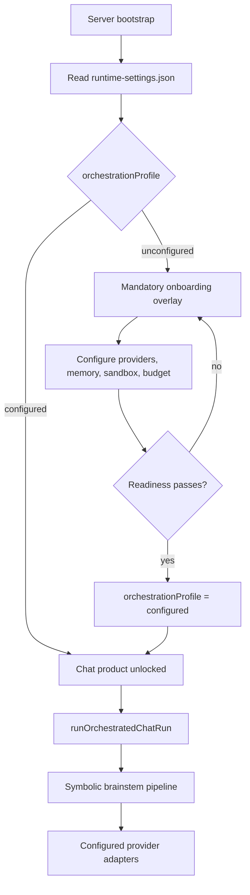

# Configured Product Architecture

> **Status:** Canonical architecture for Rector v0.3.0+ (`rector-0.3.0-configured-product`).  
> **Audience:** Implementors, reviewers, and contributors who need the authoritative product model.  
> **Runtime baseline:** Node.js `>=22.5.0`.

## 1. What Rector is

Rector is a **chat-first, self-healing AI engineering orchestration system**. Users interact like they would with Claude or ChatGPT. Hidden beneath chat, Rector runs a deterministic symbolic control plane: triage, context building, planning, skeptic review, crucible arbitration, DAG compilation, execution, validation, healing, and synthesis.

The product value is not raw LLM chat. It is the control plane around the model:

- schema-validated planner/skeptic/synthesizer outputs
- budget gates before provider calls
- redaction at persistence, streaming, API, and UI boundaries
- safe workspace execution
- bounded validation/healing loops
- append-only run events and trace UI
- durable persistence and assignment stores

## 2. Product model: unconfigured vs configured

Rector has **two orchestration profiles**, not two product modes.

| Profile | Meaning | User experience |
| --- | --- | --- |
| `unconfigured` | Fresh install; setup not complete | Mandatory first-run onboarding overlay; chat is gated |
| `configured` | At least one valid provider + readiness checks pass | Full chat product; live orchestration |

**Do not frame the product as `local` vs `external`.** Those legacy env knobs are implementation details for migration and advanced overrides only. The product speaks in terms of **unconfigured** and **configured**.



### Unconfigured product

- Default on first launch (`orchestrationProfile: "unconfigured"`).
- `requireProvidersForChat: true` — chat requests are rejected until setup completes.
- UI shows an **uncloseable first-run onboarding overlay** until readiness passes.
- No fake/demo chat path is presented as the product. There is no “try it without configuring anything.”

### Configured product

- User completes guided setup: provider credentials, model assignments, memory roles, sandbox policy, and budget.
- Readiness checks return `Ready` for required categories.
- `orchestrationProfile` is set to `configured`.
- Chat uses the **same orchestration path** as production — live adapters through the configured `ModelRouter`.

## 3. Source of truth: `runtime-settings.json`

The authoritative runtime product state is persisted at:

```text
.rector/runtime-settings.json
```

Written by the Settings API / setup UI. **Not** by hand-editing `.env` for normal use.

Schema (v1):

```json
{
  "schemaVersion": "rector.runtime.v1",
  "orchestrationProfile": "unconfigured",
  "activeTemplateId": "optional-template-id",
  "requireProvidersForChat": true,
  "updatedAt": "2026-06-12T00:00:00.000Z"
}
```

| Field | Role |
| --- | --- |
| `orchestrationProfile` | `unconfigured` or `configured` — master product gate |
| `activeTemplateId` | Optional preset template applied during setup |
| `requireProvidersForChat` | When true, chat is blocked until configured |
| `updatedAt` | Last mutation timestamp |

Related persisted stores (also UI-managed, non-secret where possible):

| Store | Path | Purpose |
| --- | --- | --- |
| Provider configs | `.rector/providers.json` | BYOK provider records (no secrets) |
| Secrets | `.rector/secrets.enc` | Encrypted provider secrets |
| Orchestration assignments | `.rector/orchestration-assignments.json` | Per-role model routing |
| Memory assignments | `.rector/memory-assignments.json` | Per-role memory providers |
| Persistence | env or UI | SQLite default for real installs; in-memory for tests |

`ORCHESTRATOR_MODE` is **deprecated**. It exists only for one-time migration (`migrateRuntimeSettingsFromEnv`) and advanced operator overrides. New work must not treat it as the product configuration surface.

## 4. Mandatory first-run onboarding

Until readiness passes, the web UI enforces setup:

1. **Overlay is uncloseable** — no dismiss, no “skip for now,” no chat behind a dimmed scrim.
2. **Categories checked:** provider, persistence, workspace/sandbox, memory, budget (as applicable).
3. **Connection tests** validate provider and memory wiring before marking ready.
4. **Template selection** (optional) applies a preset such as “BYOK Starter” or “Local SQLite + Together.”
5. On success, the UI patches `runtime-settings.json` to `configured` and removes the overlay.

Readiness is computed server-side (`setupStatus`, deployment readiness) and returned redacted to the client. Secret values never appear in API responses.

## 5. Single orchestration path

The product runs **one** chat orchestration entry point:

```text
runOrchestratedChatRun(store, args, deps)
```

This function (target name; consolidates today’s `runChat` dispatch) always executes the **full symbolic brainstem** with configured provider adapters. There is no parallel “fake chat” product path.

| Concern | Rule |
| --- | --- |
| Product chat | Always `runOrchestratedChatRun` with a real `ModelRouter` built from UI config |
| Fake/deterministic pipeline | **Not** exposed as product behavior |
| `runFakeChatRun` / `createFakePlan` | Retained only as internal test/CI helpers until fully absorbed into spy-injected orchestration |
| Mode switch in chat UI | Removed; profile is `unconfigured` or `configured`, not `local` vs `external` |

Pipeline phases (unchanged symbolic core):

```text
TRIAGE → CONTEXT_BUILDING → PLANNING → SKEPTIC_REVIEW → CRUCIBLE
  → DAG_COMPILE → EXECUTING → VALIDATION/HEALING → SYNTHESIZING
```

External-mode features (live planner, live skeptic, live synthesizer, safe executor, E2B sandbox) are **on** when configured. Deterministic fallbacks exist only as **degraded behavior** inside configured runs (e.g., synthesizer fallback on provider failure), not as a separate product mode.

## 6. Test doubles: CI only

Deterministic behavior is for **automated tests**, not for end users.

| Double | Location | Use |
| --- | --- | --- |
| `SpyLLMProvider` | `tests/support/byokArbitraries.ts` | Scripted LLM responses; counts invocations; zero network |
| In-memory stores | `createInMemoryRuntimeSettingsStore`, memory/provider test stores | Hermetic unit/property tests |
| Injectable `fetchImpl`, `commandRunner`, `fsImpl` | Provider/sandbox seams | Observable zero-network invariants |

**CI contract:**

- `npm test` uses `SpyLLMProvider` and in-memory persistence.
- No real API keys, no live network, no E2B/Mem0/TiDB unless explicitly opted into a separate live test suite.
- Tests validate orchestration logic and invariants; they do **not** prove the unconfigured product is usable without setup.

Future benchmark naming: `configured_spy_pipeline` (replacing `local_fake_pipeline` in performance docs) for the spy-injected orchestration timing baseline.

## 7. What stays unchanged

These subsystems are **not** removed by the configured-product transition:

| Subsystem | Notes |
| --- | --- |
| Symbolic brainstem | Triage, context, crucible, DAG compiler, state machine, validation/healing |
| SQLite / memory persistence | `SqlRectorStore`, memory providers, assignment resolution |
| Assignment stores | Orchestration role → provider/model; memory role → provider |
| Provider adapter layer | `ModelRouter`, discovery, config bridge, budget enforcement |
| Redaction | Universal secret confinement at every boundary |
| Module registry | Neuro-symbolic modules remain opt-in / capability-gated |
| Audit log | Commercial readiness path |

## 8. Migration from legacy local/external framing

| Legacy concept | v0.3.0 replacement |
| --- | --- |
| `ORCHESTRATOR_MODE=local` | `orchestrationProfile: "unconfigured"` (until setup) or test-only spy path |
| `ORCHESTRATOR_MODE=external` | `orchestrationProfile: "configured"` |
| Provider-free quickstart as product | `docs/getting-started/first-run-setup.md` |
| Local mode as contributor default | CI spy doubles; contributors configure via UI for manual testing |
| `runFakeChatRun` as default chat | `runOrchestratedChatRun` with `SpyLLMProvider` in tests only |

One-time boot migration (`migrateRuntimeSettingsFromEnv`) maps legacy env to `runtime-settings.json` and emits a deprecation warning.

## 9. Security invariants (unchanged)

1. **Secret confinement** — no secret value in logs, traces, API responses, or UI egress.
2. **Budget preflight** — provider calls blocked when budget exhausted.
3. **Sandbox boundaries** — workspace root, allowlists, approvals, capture limits.
4. **Auth/RBAC** — hosted deployments gate settings and operator APIs.

## 10. Related documents

| Document | Status |
| --- | --- |
| This file | **Canonical** |
| `docs/getting-started/first-run-setup.md` | User onboarding guide |
| `.kiro/specs/cloud-capable-transition/` | Active implementation spec (aligned to this architecture) |
| `docs/architecture/current-rector-byok-architecture.md` | **Stale** — pre-v0.3.0 local/external model |
| `docs/architecture/rector-0.1.0-architecture.md` | **Historical** — alpha prototype |

When documents conflict, **configured-product-architecture.md** wins.