# Current Rector BYOK Architecture

> Status: current architecture guide after BYOK Alpha Phase 3 and the budget/sandbox hardening pass.  
> Audience: humans and implementing agents who need to understand what Rector is now.  
> Runtime baseline: Node.js `>=22.5.0`.

## 1. What Rector is now

Rector is a **local-first BYOK neuro-symbolic AI coding/orchestration agent**.

The short version:

```text
LLMs propose.
Rector validates, budgets, routes, executes, heals, records evidence, and refuses unsafe work.
```

Rector is not meant to be a plain LLM chat wrapper. Its product value is the control plane around the model:

- deterministic run state machine
- schema-validated planner/skeptic/synthesizer outputs
- budget gates before provider calls
- redaction at persistence/streaming/UI boundaries
- safe workspace executor
- validation/healing loop
- event log + trace UI
- persistence options for local and hosted alpha use

## 2. Current product modes

Rector has two orchestration modes.

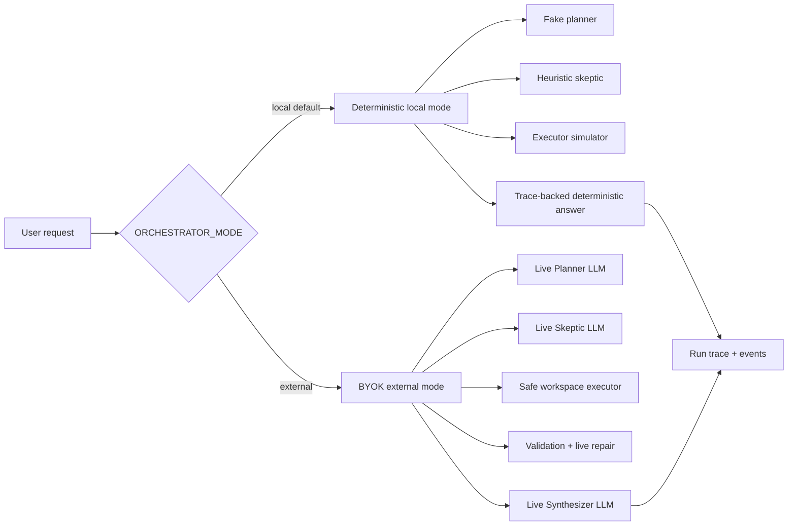

### `ORCHESTRATOR_MODE=local`

Local mode is the **provider-free regression baseline**.

Properties:

- default mode
- no API keys
- no provider network calls
- deterministic outputs
- all-zero cost
- safest mode for tests, docs, and local UI checks

This path should not be deleted yet. It is not dead code; it is the baseline that proves the symbolic control plane still works without paid providers.

### `ORCHESTRATOR_MODE=external`

External mode is the **real BYOK product path**.

Properties:

- requires at least one valid configured provider
- calls live model adapters through `ModelRouter`
- accumulates cost/tokens across planner, skeptic, repair, and synthesizer calls
- executes workspace operations through safe sandbox boundaries
- streams run progress to the UI
- can persist runs with memory, SQLite, or TiDB-backed storage

## 3. Should we remove the fake/local path?

No — not yet.

Rename the mental model from **fake path** to **local deterministic baseline**.

Reasons to keep it:

1. **Regression safety.** It proves the symbolic brainstem, state transitions, event log, trace UI, and docs still work without provider drift.
2. **Open-source onboarding.** Contributors can run tests and explore Rector with no paid keys.
3. **Debugging isolation.** When external mode fails, local mode tells us whether the bug is in Rector's control plane or a provider/model boundary.
4. **Cost control.** CI and normal tests remain zero-cost.
5. **Offline fallback.** It gives a reliable behavior when users have invalid keys or are offline.

When to remove or shrink it later:

- external mode is stable across real tasks
- there are golden tests proving the same contracts without local simulator internals
- users no longer rely on provider-free mode for onboarding
- the deterministic path becomes a maintenance burden

Near-term recommendation: keep it, but label it clearly as **local simulation/regression mode** in UI/docs.

## 4. High-level system map

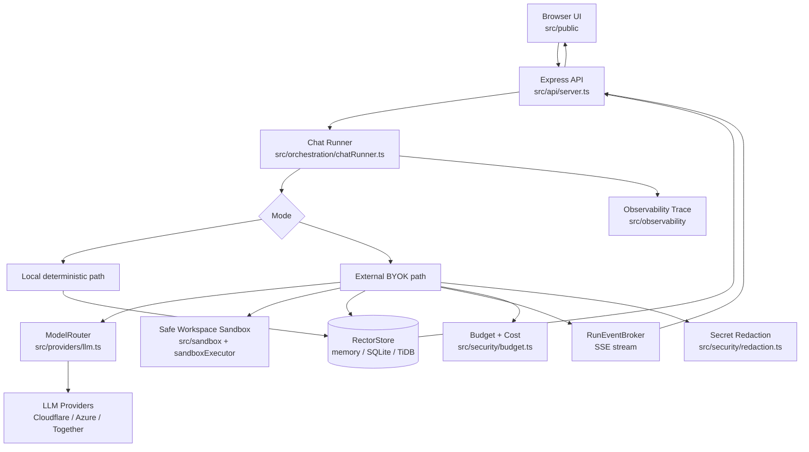

## 5. Runtime boot sequence

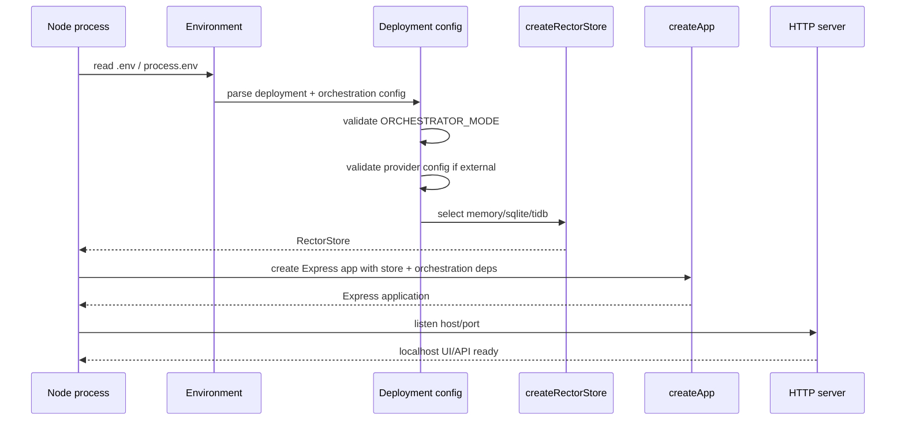

Key files:

| Concern | File |
|---|---|
| executable bootstrap | `src/bin/server.ts` |
| config parsing | `src/deployment/index.ts` |
| setup checklist | `src/setupChecklist.ts` |
| app/API routes | `src/api/server.ts` |
| store factory | `src/store/index.ts` |

## 6. Request lifecycle: local mode

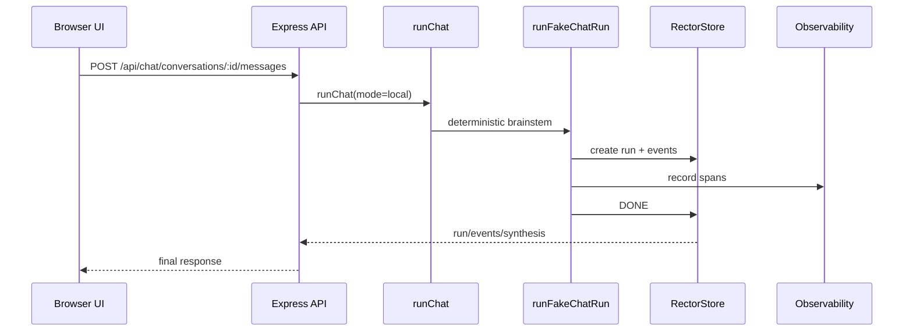

Local mode exists to keep the control plane testable without model calls.

## 7. Request lifecycle: external BYOK mode

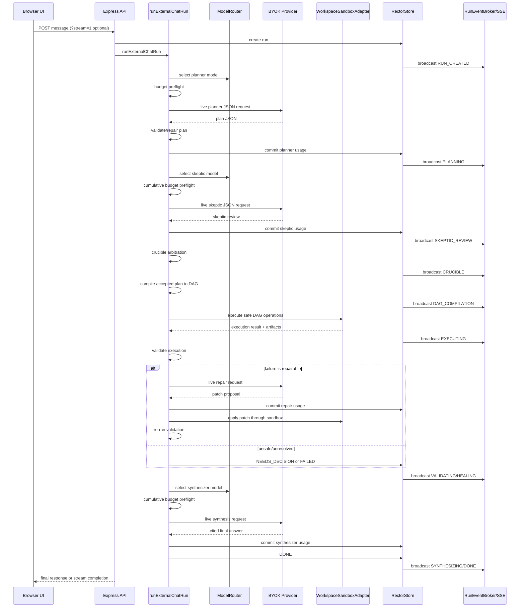

## 8. Neuro-symbolic brainstem phases

Rector's brainstem is a fixed symbolic phase sequence. LLM calls happen inside selected phases, but phase transitions and safety gates are deterministic.

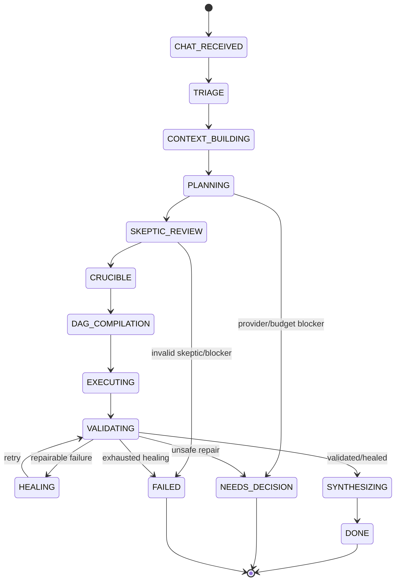

Important files:

| Phase | Local implementation | External implementation |
|---|---|---|
| triage | deterministic | deterministic |
| context | deterministic | deterministic |
| planning | `createFakePlan` | `runLivePlanner` |
| skeptic | `reviewPlanWithSkeptic` | `runLiveSkeptic` |
| crucible | deterministic | deterministic |
| DAG compile | deterministic | deterministic |
| execution | simulator | safe workspace executor |
| validation/healing | deterministic replay | bounded live repair |
| synthesis | deterministic trace summary | live cited synthesis + fallback |

## 9. Live agents

```mermaid
flowchart LR
  Context[ContextPack + user message + run state] --> PlannerPrompt[Planner prompt]
  PlannerPrompt --> PlannerLLM[Live Planner]
  PlannerLLM --> PlanJSON[Planner JSON]
  PlanJSON --> PlanSchema[Zod schema validation]
  PlanSchema -->|valid| SkepticPrompt[Skeptic prompt]
  PlanSchema -->|invalid| PlanRepair[one repair prompt]
  PlanRepair --> PlanSchema

  SkepticPrompt --> SkepticLLM[Live Skeptic]
  SkepticLLM --> SkepticJSON[Skeptic JSON]
  SkepticJSON --> SkepticSchema[Zod schema validation]
  SkepticSchema --> Crucible[Crucible arbitration]

  Crucible --> DAG[DAG]
  DAG --> Execution[Sandbox execution]
  Execution --> Validation[Validation result]
  Validation --> SynthPrompt[Synthesizer prompt]
  SynthPrompt --> SynthLLM[Live Synthesizer]
  SynthLLM --> Answer[Evidence-cited final answer]
```

Design rules:

- live agents must return structured JSON where required
- all outputs are schema-validated
- malformed planner/skeptic/synthesizer outputs get bounded repair/fallback paths
- the model cannot set final safety verdicts by vibes; deterministic logic recomputes critical verdicts where needed
- final answer must be grounded in run evidence

## 10. Provider architecture

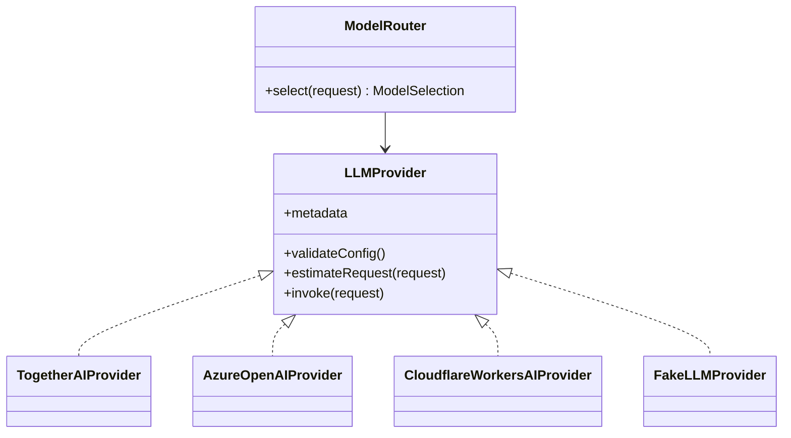

Provider responsibilities:

- validate config without leaking secrets
- estimate cost/tokens before network
- build provider-specific request payloads
- parse provider-specific responses into Rector's common shape
- throw structured `ProviderError` on provider failure

Rector responsibilities:

- choose provider/model through `ModelRouter`
- enforce budget before provider call
- redact provider errors before persistence/UI
- persist cost/tokens after every provider call
- record provider metadata in run events

## 11. Budget and cost flow

The latest hardening pass made budget enforcement cumulative across live provider calls.

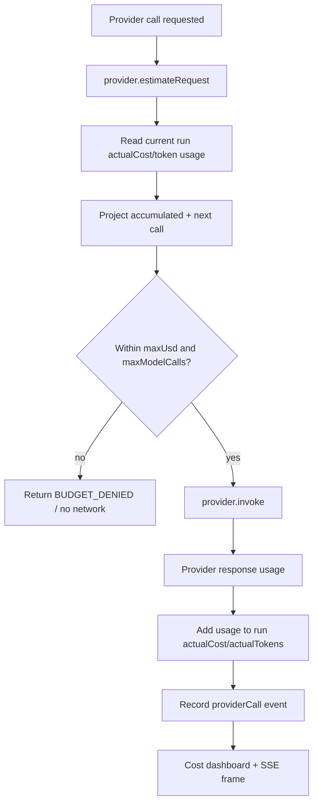

Why this matters:

- planner cost counts
- skeptic cost counts
- repair cost counts
- synthesizer cost counts
- next provider preflight sees all prior spend

## 12. Safe workspace execution

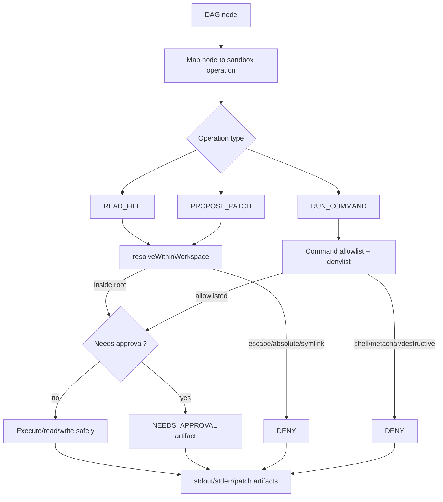

Safety properties:

- no absolute paths
- no `..` traversal
- symlink escape detection
- destructive command denylist
- arbitrary shell disabled by default
- stdout/stderr truncation
- writes go through patch proposal / approval flow
- executor output becomes artifacts/events

Recently hardened destructive command examples:

```bash
rm -rf .
rm -r -f .
rm -f -r .
rm --recursive --force .
rm -r --force .
```

## 13. Persistence architecture

Persistence is selected independently from orchestration mode.

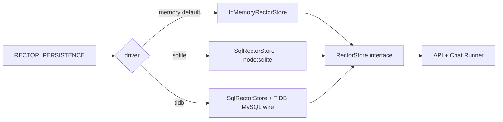

| Driver | Purpose | Notes |
|---|---|---|
| `memory` | default regression/dev mode | lost on restart |
| `sqlite` | local durable desktop/dev persistence | uses `node:sqlite`; requires Node `>=22.5.0` |
| `tidb` | hosted alpha persistence path | optional; config must be complete before connection |

Data stored:

- conversations
- messages
- runs
- run events
- artifacts
- cost/provider metadata

## 14. Streaming architecture

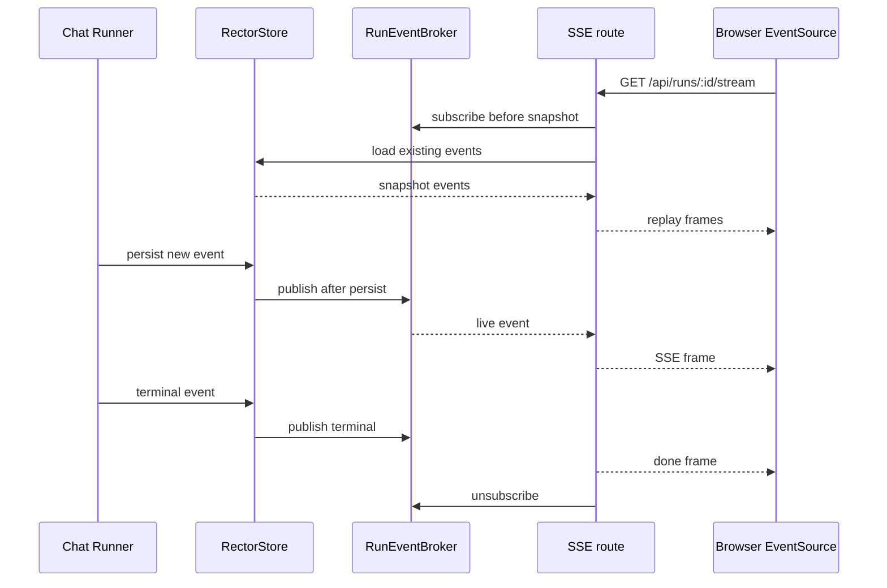

Design details:

- subscribe before snapshot to avoid race gaps
- dedupe replay/live frames by event ID
- heartbeat keeps stream alive
- terminal phase closes stream
- UI has polling fallback
- cost frames update cost dashboard live

## 15. API surface

Current major route groups:

```mermaid
flowchart TB
  API[Express API] --> Chat[/api/chat]
  API --> Runs[/api/runs]
  API --> Operator[/api/operator]
  API --> Setup[/api/setup]
  API --> Static[Static UI]

  Chat --> Conversations[conversations/messages]
  Runs --> Events[events]
  Runs --> Stream[SSE stream]
  Runs --> Cost[run cost]
  Operator --> Trace[operator run/artifact inspection]
  Setup --> TestConnection[test-connection]
```

## 16. Browser UI architecture

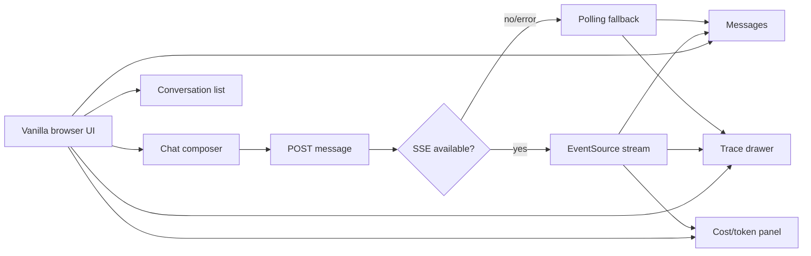

The current UI is still a local web app, not yet a packaged desktop app.

## 17. Security and redaction boundaries

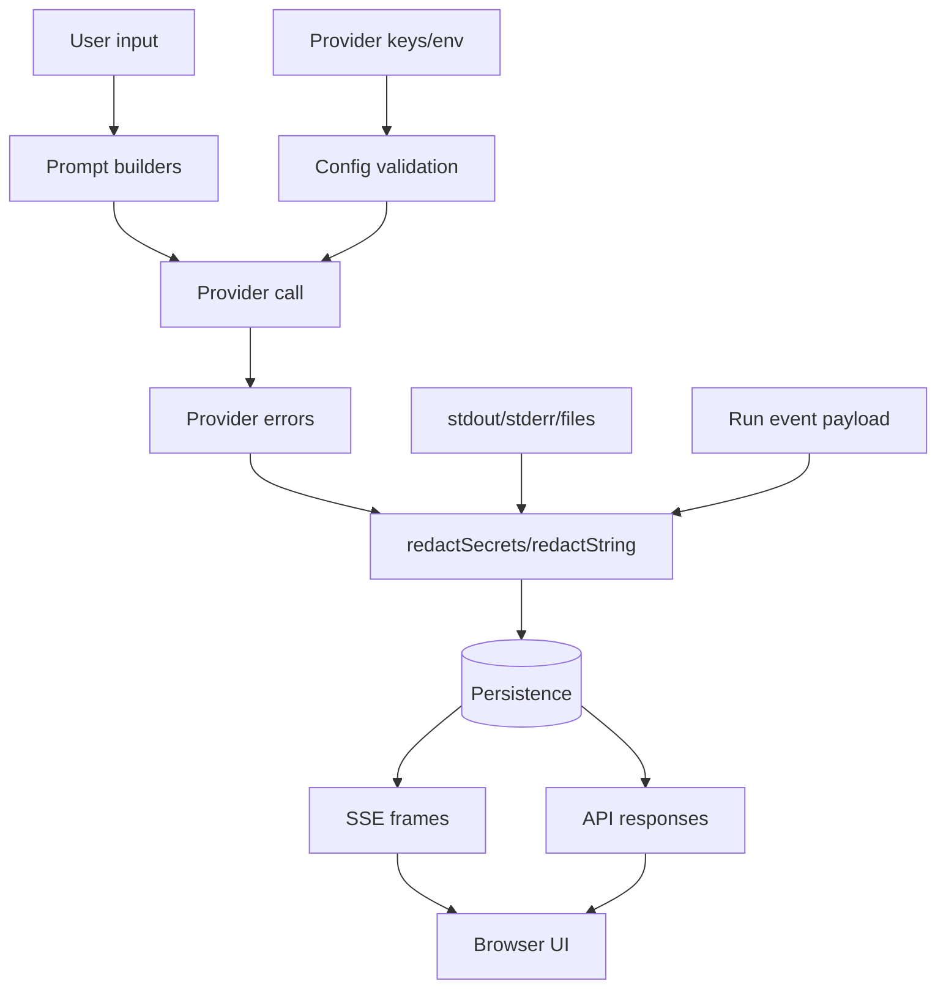

Rules:

- no secrets in stored events
- no secrets in SSE frames
- no secrets in API errors
- no secrets in final synthesis
- no raw provider errors to user
- setup checklist masks sensitive values

## 18. Test architecture

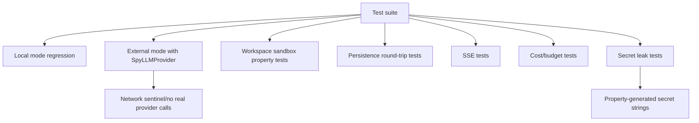

Current verification gates:

```bash
npm test
npm run build
npm run check
node scripts/generate-roadmap-issues.js --check
node scripts/export-linear-issues.js --check
```

## 19. Desktop/web/mobile target architecture

The current app is a local web app. A hassle-free product should package the same backend + UI into a desktop shell first, then add hosted/mobile control later.

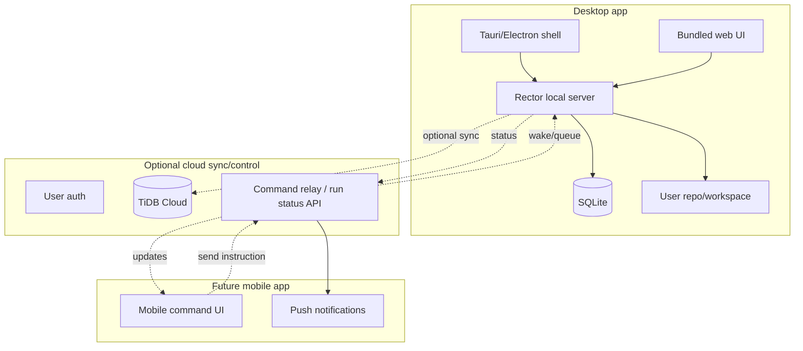

Recommended order:

1. stabilize local web app
2. package desktop app
3. add authenticated cloud relay/sync
4. add mobile companion app

## 20. Next product milestones

### Milestone A — Make BYOK local UX painless

Goal: a user can run Rector locally without reading architecture docs.

Work:

- setup wizard in UI
- provider key test UI
- workspace picker
- mode/persistence selector
- readable setup errors
- one-click local SQLite persistence

### Milestone B — Real coding task benchmark

Goal: prove Rector can do useful repo work.

Work:

- define 10 representative coding tasks
- run external mode against fixture repos
- measure success/failure/cost/time
- capture traces and patches
- improve prompts/executor based on failures

### Milestone C — Desktop shell

Goal: installable local desktop product.

Work:

- choose Tauri or Electron
- bundle local server
- manage background process lifecycle
- native workspace folder picker
- secure local secret storage
- auto-update story later

Recommended: **Tauri** if Windows/macOS/Linux desktop with smaller footprint matters. Electron if faster web-stack packaging matters more.

### Milestone D — Hosted persistence / TiDB path

Goal: hosted alpha state survives and can sync.

Work:

- validate TiDB driver against real TiDB Cloud
- migration/version table
- backup/export
- encryption/redaction review
- hosted deployment smoke test

### Milestone E — Mobile companion later

Goal: phone can instruct and monitor agents.

Do **not** start with full mobile execution. Start with companion control:

- send instruction to desktop/cloud relay
- see run status
- approve/deny risky action
- get completion notification
- read final summary

Mobile should not directly run local workspace code. It should talk to a trusted desktop agent or hosted worker.

## 21. Current module responsibility map

| Module | Responsibility |
|---|---|
| `src/api/server.ts` | Express routes, static UI, streaming, setup/test endpoints |
| `src/bin/server.ts` | process bootstrap/listen |
| `src/deployment/index.ts` | env/config parsing |
| `src/orchestration/chatRunner.ts` | local/external orchestration coordinator |
| `src/orchestration/planner.ts` | fake + live planner |
| `src/orchestration/skeptic.ts` | heuristic + live skeptic |
| `src/orchestration/crucible.ts` | deterministic arbitration |
| `src/orchestration/dagCompiler.ts` | accepted plan → executable DAG |
| `src/orchestration/sandboxExecutor.ts` | DAG → sandbox operations |
| `src/orchestration/validationHealing.ts` | validation + bounded repair loop |
| `src/orchestration/synthesizer.ts` | deterministic + live final response |
| `src/providers/llm.ts` | provider adapters + router |
| `src/security/budget.ts` | budget/cost gates |
| `src/security/redaction.ts` | secret scrubbing |
| `src/sandbox/index.ts` | path/command containment, sandbox operations |
| `src/store/index.ts` | store interface/factory |
| `src/store/inMemoryRectorStore.ts` | provider-free in-memory store |
| `src/store/sqlRectorStore.ts` | SQLite/MySQL-ish SQL store |
| `src/store/tidbRectorStore.ts` | TiDB driver path |
| `src/observability/index.ts` | traces, spans, cost aggregation |
| `src/public/*` | browser chat UI |

## 22. What to do next

Recommended next Linear project: **Rector Productization Alpha**.

Issue set:

1. **Setup wizard UI** — configure mode, provider, persistence, workspace root.
2. **Provider key test UI** — call `/api/setup/test-connection` from browser.
3. **Workspace picker + safety display** — show selected root and allowed commands.
4. **Real task benchmark harness** — fixture repos + expected outcomes.
5. **Prompt hardening pass** — improve planner/skeptic/repair outputs from benchmark failures.
6. **Desktop shell spike** — Tauri vs Electron decision with working prototype.
7. **Local secret storage** — avoid `.env` for desktop users.
8. **TiDB Cloud smoke test** — validate hosted persistence path.
9. **Run approval UX** — approve/deny writes/commands in UI.
10. **Mobile companion design doc** — defer implementation, define relay/auth/approval model.

## 23. Key takeaways

- Keep local mode for now.
- External mode is the real product path.
- Rector's value is the deterministic control plane around live models.
- Desktop should come before mobile.
- Mobile should start as a companion/control surface, not a full executor.
- TiDB is useful for hosted persistence, but SQLite is still the right local default.
