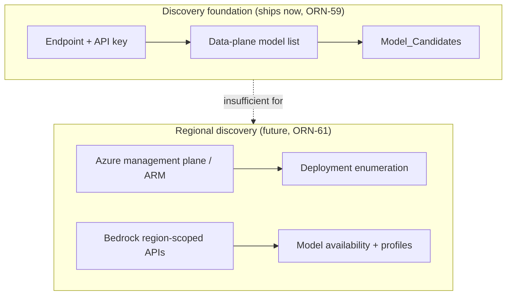
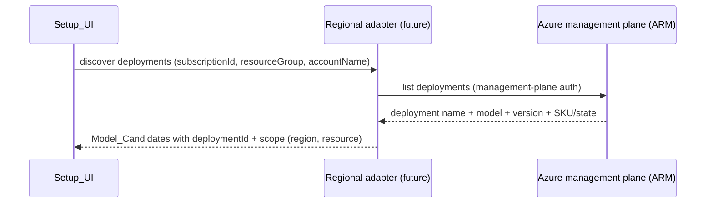
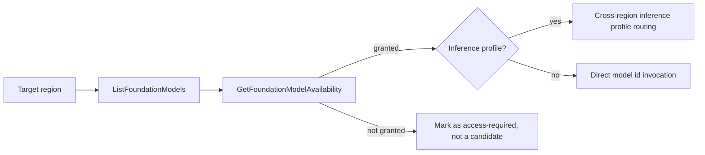

# Regional Discovery Architecture (Azure Management-Plane and AWS Bedrock)

> Status: design + scaffolding deliverable for ORN-61 (part of ORN-56, "BYOK chat UX and model
> discovery"). This document is the precise follow-up design for cloud-provider regional discovery.
> Audience: maintainers and implementing agents who will build the regional adapters later.
> Scope note: this is documentation and scaffolding only. It does **not** block the discovery
> foundation (ORN-59) or the setup UI model picker (ORN-60).

## 1. Why regional discovery is a separate problem

The Model_Discovery_Service foundation (ORN-59) assumes that an **endpoint plus an API key** is
enough to enumerate a provider's usable models. That assumption holds for Together AI, Cloudflare
Workers AI, and any OpenAI-compatible endpoint, and it holds for the **data-plane** model catalog of
Azure OpenAI.

It does **not** hold for the two cloud cases this document covers:

- **Azure OpenAI deployment discovery**, which lives on the Azure **management plane** (Azure
  Resource Manager / ARM) and needs management-plane authentication and resource coordinates, not
  just a data-plane endpoint and key.
- **AWS Bedrock model availability**, which is region-scoped, gated by per-account model access
  grants, and routed through inference profiles for cross-region inference.

Both need more configuration and more credentials than the foundation's adapter contract carries, so
they are designed here and delivered as scaffolding rather than wired into the shipping foundation.

## 2. Azure: data plane vs management plane

This is the core distinction for Azure.

| Concern | Data plane | Management plane (ARM) |
|---|---|---|
| What it answers | "Which base models does this resource's catalog list?" | "Which deployments exist, in which region, with what SKU/state?" |
| Endpoint | `{endpoint}/openai/models?api-version=2024-10-21` | Azure Resource Manager (`management.azure.com`) |
| Auth | Resource endpoint + API key | Management-plane auth (Entra ID / AAD token, RBAC) |
| Returns | Catalog model ids | Concrete `deploymentId`s the user actually calls |
| Used by foundation | Yes (Azure adapter, Req 15) | No — reported as out of scope |

### 2.1 What the foundation Azure adapter does today

The shipping Azure Discovery_Adapter (Req 15) requests the **data-plane** list at
`{endpoint}/openai/models?api-version=2024-10-21`. It sets `requiresDeployment: true` on every
returned candidate and **never** fabricates or returns a `deploymentId`, because an endpoint plus an
API key cannot enumerate deployments. When a caller asks for deployment enumeration, the adapter
reports `requires_management_plane` rather than guessing.

### 2.2 What management-plane deployment discovery requires

Real deployment enumeration (mapping a catalog model to the deployment name a user must pass at
inference time) requires the **Azure management plane**. The future Regional_Discovery design must
capture and persist the following management-plane configuration fields:

- `subscriptionId` — the Azure subscription that owns the resource.
- `resourceGroup` — the resource group containing the Azure OpenAI account.
- `accountName` — the Azure OpenAI (Cognitive Services) account/resource name.
- `location` — the Azure region of the account (for example `eastus`).
- deployment name — the user-facing name that inference calls target (distinct from the model id).
- model name and version — the underlying base model and its version bound to the deployment.
- SKU or provisioning state — the deployment SKU (for example `Standard`, `GlobalStandard`,
  `ProvisionedManaged`) and/or its provisioning state.

These map onto the optional `Model_Candidate.scope` sub-fields already reserved in the foundation
(`subscriptionId`, `resourceGroup`, `azureResource`, `region`), so a future management-plane adapter
can populate them without a schema change. Management-plane calls additionally require an Entra ID
(AAD) token with appropriate RBAC over the resource — this is a different credential than the
data-plane API key and must never be conflated with it.

## 3. AWS Bedrock discovery design notes

AWS Bedrock discovery is **region-first** and access-gated. The future Bedrock design must follow
this sequence:

1. **`ListFoundationModels` (region-scoped).** Enumerate the foundation models the account can see
   in a specific region. The model set differs per region, so discovery must be run per target
   region rather than once globally.
2. **`GetFoundationModelAvailability` (readiness check).** A model appearing in the list does not
   mean the account may invoke it. This readiness check distinguishes models the account has been
   granted access to from models that still require a model-access agreement or are not authorized
   in that region.
3. **Inference-profile cross-region routing.** Many newer Bedrock models are invoked through
   **inference profiles** rather than a bare model id. An inference profile can route a request
   across multiple regions for capacity. Discovery must record whether a candidate is invoked via a
   plain model id or via an inference profile, and which regions a profile can route to.

### 3.1 Data-residency and IAM warning

**Data-residency / IAM warning.** Bedrock cross-region inference profiles can route a single request
to a region other than the one the user configured. This has two consequences the design must
surface clearly to the user before enabling such routing:

- **Data residency.** A prompt and its response may be processed in a different AWS region than the
  one the user selected. For workloads with data-residency, sovereignty, or compliance constraints,
  cross-region routing may move regulated data across a boundary the user did not intend. The UI and
  documentation must warn about this before a cross-region inference profile is used.
- **IAM.** Cross-region inference requires IAM permissions in **every** region the inference profile
  can route to, not only the user's primary region. An IAM policy scoped to a single region will
  fail unpredictably when a profile fails over. The design must call out that IAM grants have to
  cover all profile member regions.

### 3.2 Separate-adapter note

**Separate Discovery_Adapter note.** Bedrock's region-first enumeration, access-readiness checks,
inference-profile routing, and AWS SigV4 / IAM credential model differ enough from the existing
endpoint-plus-key adapter contract that Bedrock may require a **separate future Discovery_Adapter**
rather than an extension of the OpenAI-compatible or Azure adapters. The foundation should not be
contorted to fit Bedrock; a dedicated adapter is the expected path.

## 4. Scaffolding and delivery boundary

Per Req 26, the regional work ships as design plus optional, mockable scaffolding:

- The optional scaffold lives at `src/providers/discovery/adapters/regional.ts`. Any runtime code it
  contains must distinguish an **invalid key** from a **region, deployment, or model
  unavailability** failure (Req 26.2), so users can tell a credential problem apart from an
  availability problem.
- All cloud APIs the scaffold touches must be **injected and mocked in tests** — no live Azure
  management-plane or AWS Bedrock call occurs in the suite (Req 26.3), preserving the hermetic-test
  guarantee.
- This deliverable must not block Requirements 10–24 (Req 26.1): the discovery foundation and the
  setup UI ship without full Azure management auth or a Bedrock adapter.

## 5. Summary

- Azure has a hard split between the **data plane** (catalog models, endpoint + key, shipped) and the
  **management plane** (deployment enumeration, ARM auth, future). Deployment discovery needs
  `subscriptionId`, `resourceGroup`, `accountName`, `location`, deployment name, model name and
  version, and SKU or provisioning state.
- AWS Bedrock is region-first: `ListFoundationModels` then `GetFoundationModelAvailability`, with
  inference-profile cross-region routing for many models.
- Cross-region inference profiles carry a **data-residency and IAM warning** that must be surfaced
  before use.
- Bedrock likely needs a **separate future Discovery_Adapter** rather than reusing the existing
  endpoint-plus-key adapters.
