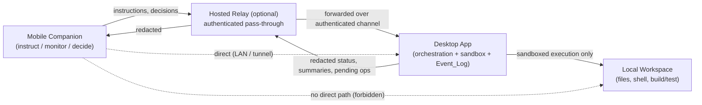

# Mobile Companion Design (design-only)

This is a **design-only** document. It describes a future mobile companion control
surface for Rector and its security model. **No mobile client code is built or
shipped by this document**, and nothing here changes the existing control plane,
sandbox, redaction layer, or verification gates.

The mobile companion is a **thin control surface**: it lets a user instruct and
monitor Rector agents and make approval decisions from a phone, while every piece of
real work — orchestration, file-system writes, shell commands, build/test execution —
stays on the desktop application (or a hosted relay that fronts it). The phone never
touches the user's workspace.

> Source of truth: this design composes over the existing `Approval_Flow`
> (`NEEDS_APPROVAL` / `NEEDS_DECISION` states), the `Event_Log` (`RunEvent` record),
> the SSE run stream, and the `Redaction_Layer`. It introduces no new execution
> capability on the workspace.

## Control-surface capabilities

The companion exposes exactly these five control-surface capabilities, and nothing
that executes local workspace code:

1. **Send instructions to an agent.** The user can start a run or send a chat-style
   instruction to an existing run. The instruction is transmitted to the desktop app
   (or relay), which performs the actual orchestration. The phone only composes and
   submits text.
2. **Monitor run status.** The companion subscribes to the existing run event /
   SSE stream (proxied through the desktop app or relay) and renders live phase
   transitions (triage → context → planner → skeptic → crucible → DAG → executor →
   validation/healing → synthesis) and current run state. It is a read-only view of
   state the desktop already produces.
3. **Approve or deny risky operations.** When a run reaches `NEEDS_APPROVAL` or
   `NEEDS_DECISION`, the companion presents the pending operation (redacted diff,
   command, and target path) and lets the user approve or deny it. The decision is
   routed back through the `Approval_Flow` (see
   [Approval routing](#approval-routing-through-the-approval_flow-and-event_log)).
4. **Receive run-completion notifications.** The companion receives a push or polled
   notification when a run reaches a terminal state (completed, failed, or denied to
   completion), so the user does not have to keep the app open.
5. **Read run summaries.** After a run completes, the companion can fetch and display
   a redacted run summary (final answer, executed commands, cost estimate, duration,
   and final status) assembled from the existing run record and `Event_Log`.

All five capabilities are **status and decision** surfaces only. None of them runs
code on the workspace.

## No local execution

The mobile client **executes no local workspace code directly**. Specifically, the
mobile client:

- runs **no shell commands** against the user's workspace,
- performs **no file-system writes** to the user's workspace,
- triggers **no build or test execution** on the user's workspace, and
- holds **no copy of the workspace** and has no path or command-execution capability.

Every operation that would touch the workspace is performed by the desktop
application's existing sandboxed executor. The phone can only **request** (instruct)
and **decide** (approve/deny); it can never **execute**. A compromised or malicious
mobile client therefore cannot run anything on the workspace — it can at most submit
instructions and decisions that the desktop app still gates through the existing
sandbox and approval rules.

## Communication boundary (desktop / relay only)

The mobile client communicates **only** with:

- the **desktop application** (directly, e.g. on the same LAN or via an
  authenticated tunnel), or
- a **hosted relay** that fronts the desktop application.

The mobile client **never communicates directly with the local workspace** and has
no direct access to the file system, the sandbox, or the command runner. The desktop
app (or relay) is the single trust boundary between the phone and the workspace.

All content leaving the desktop app toward the relay or phone — run status, pending
operation details, run summaries, and errors — passes through the existing
`Redaction_Layer` first, so no secret substring is transmitted to the mobile channel.

## Security risks and mitigations

Each named risk is documented with a description and at least one mitigation or an
explicit residual-risk statement.

### Risk: Stolen device

- **Description.** A lost or stolen phone could let an attacker instruct agents,
  read run summaries, or approve risky operations as the legitimate user.
- **Mitigations.**
  - Require device-level authentication (biometric / passcode) and a per-session
    token that expires; do not persist long-lived credentials in plaintext on the
    device.
  - Require re-authentication (step-up auth) before an approval decision can be
    submitted, so a momentarily unlocked device cannot approve a risky operation.
  - Support remote session revocation from the desktop app so a stolen device's
    sessions can be invalidated immediately.
  - Store no provider secrets and no workspace contents on the device (see
    [No local execution](#no-local-execution)); a stolen device exposes session
    access, not secrets or source.
- **Residual risk.** If the device is unlocked, authenticated, and within an active
  step-up window when stolen, an attacker could submit instructions or decisions
  until the session is revoked. This residual risk is bounded by session expiry and
  remote revocation.

### Risk: Relay compromise

- **Description.** A compromised hosted relay could attempt to read, alter, replay,
  or inject instructions, status, or approval decisions in transit.
- **Mitigations.**
  - Treat the relay as **untrusted transport**: use end-to-end authentication between
    the phone and the desktop app so the relay cannot forge instructions or
    decisions on either party's behalf.
  - Sign and bind approval decisions to a specific run, operation id, and nonce so a
    compromised relay cannot replay or retarget a decision to a different operation.
  - Rely on the `Redaction_Layer` so the relay only ever sees already-redacted
    content; secrets and unredacted workspace data never transit the relay.
  - The desktop app remains the enforcement point — even a malicious relay cannot
    cause workspace execution without a valid, sandbox-gated, recorded decision.
- **Residual risk.** A compromised relay can still drop or delay messages (denial of
  service / availability impact). It cannot cause unauthorized execution or leak
  secrets, but availability over a compromised relay is not guaranteed.

### Risk: Prompt injection over the mobile channel

- **Description.** Instructions submitted from the phone (or content surfaced into a
  run) could attempt to manipulate the agent into unsafe actions, e.g. coaxing it to
  bypass approval or exfiltrate data.
- **Mitigations.**
  - Mobile-submitted instructions are treated as **untrusted user input** and flow
    through the same orchestration safety constraints as desktop input — the hardened
    `PLANNER` / `SKEPTIC` / `SYNTHESIZER` / `REPAIR` prompt safety lines and the
    sandbox approval gates still apply.
  - Risky operations still require an explicit recorded approval regardless of how the
    instruction arrived, so injection cannot self-approve a risky command (see
    [Risk: Approval spoofing](#risk-approval-spoofing)).
  - All agent output surfaced back to the phone is redacted, so an injection attempt
    cannot exfiltrate secrets through the mobile channel.
- **Residual risk.** Prompt injection mitigation depends on the strength of the
  existing prompt-hardening and sandbox gates; novel injection phrasing that does not
  trip a safety constraint but stays within sandbox limits remains a residual risk
  shared with the desktop surface, not unique to mobile.

### Risk: Approval spoofing

- **Description.** An attacker could try to fabricate or replay an approval decision
  to make a risky operation execute without the real user's consent.
- **Mitigations.**
  - Approval decisions are authenticated to the user's session and bound to a specific
    `runId` + `operationId` + nonce, then recorded in the `Event_Log` **before** the
    operation executes (see
    [Approval routing](#approval-routing-through-the-approval_flow-and-event_log)).
  - The desktop app verifies the decision's authenticity and binding before acting; an
    unbound, unauthenticated, or replayed decision is rejected and the run stays
    pending.
  - Require step-up authentication before an approval can be submitted from the phone.
- **Residual risk.** If both the user's authenticated session and step-up factor are
  fully compromised at the same time, a spoofed approval is possible. This is the same
  trust assumption as the desktop approval surface and is bounded by session expiry
  and revocation.

## Approval routing (through the Approval_Flow and Event_Log)

When the mobile client approves or denies a risky operation, the decision is **not**
acted on by the phone. Instead:

1. The phone submits an authenticated, run/operation-bound decision to the desktop app
   (directly or via the relay).
2. The desktop app routes the decision through the existing **`Approval_Flow`** —
   the same `createDecisionRequest` / `resumeFromDecision` path used by the desktop
   UI — binding the existing `NEEDS_APPROVAL` / `NEEDS_DECISION` state.
3. The decision, the deciding user identity, and a timestamp are recorded in the
   **`Event_Log`** as a `RunEvent` **before** the operation is executed or cancelled.
4. Only after the decision is recorded does the desktop app execute (on approve) or
   cancel and continue the run excluding the operation (on deny). A denial leaves the
   affected files and targets unchanged, exactly as the desktop approval flow already
   guarantees.
5. If the decision cannot be recorded, the operation does not execute and the run
   stays in its pending-decision state.

In short: the mobile companion is one more **client** of the existing approval and
event spine. It adds no new decision-recording or execution path of its own.

## Non-goals

The following are explicit, enumerated non-goals for the mobile companion:

1. **No local execution on the phone.** The companion will not run shell commands,
   write files, or run builds/tests on any workspace from the device.
2. **No direct workspace access.** The companion will not connect directly to the
   user's file system, sandbox, or command runner; it talks only to the desktop app
   or relay.
3. **No secret entry or storage on the phone.** The companion is not a place to enter,
   store, or manage provider API keys or environment secrets; secret management stays
   in the desktop secret store.
4. **No standalone orchestration.** The companion will not host the planner, skeptic,
   synthesizer, executor, or any part of the control plane; it cannot run agents
   without a desktop app (or relay-fronted desktop) behind it.
5. **No offline operation.** The companion is not designed to function while
   disconnected from the desktop app or relay; it is a remote control surface, not an
   offline client.
6. **No new persistence of record.** The companion is not a system of record; the
   authoritative run state, events, and summaries live in the desktop `Event_Log` and
   store, not on the device.
7. **No bypass of existing safety gates.** The companion will not introduce any path
   that bypasses the sandbox containment, approval gates, prompt safety constraints,
   or redaction layer.

## Relationship to the verification gates

This document is design-only and adds no code, no dependency, and no test wiring. The
existing Node web application remains runnable and all five verification gates
(`npm test`, `npm run build`, `npm run check`,
`node scripts/generate-roadmap-issues.js --check`,
`node scripts/export-linear-issues.js --check`) continue to pass unchanged, and the
Local_Mode regression baseline is untouched.
