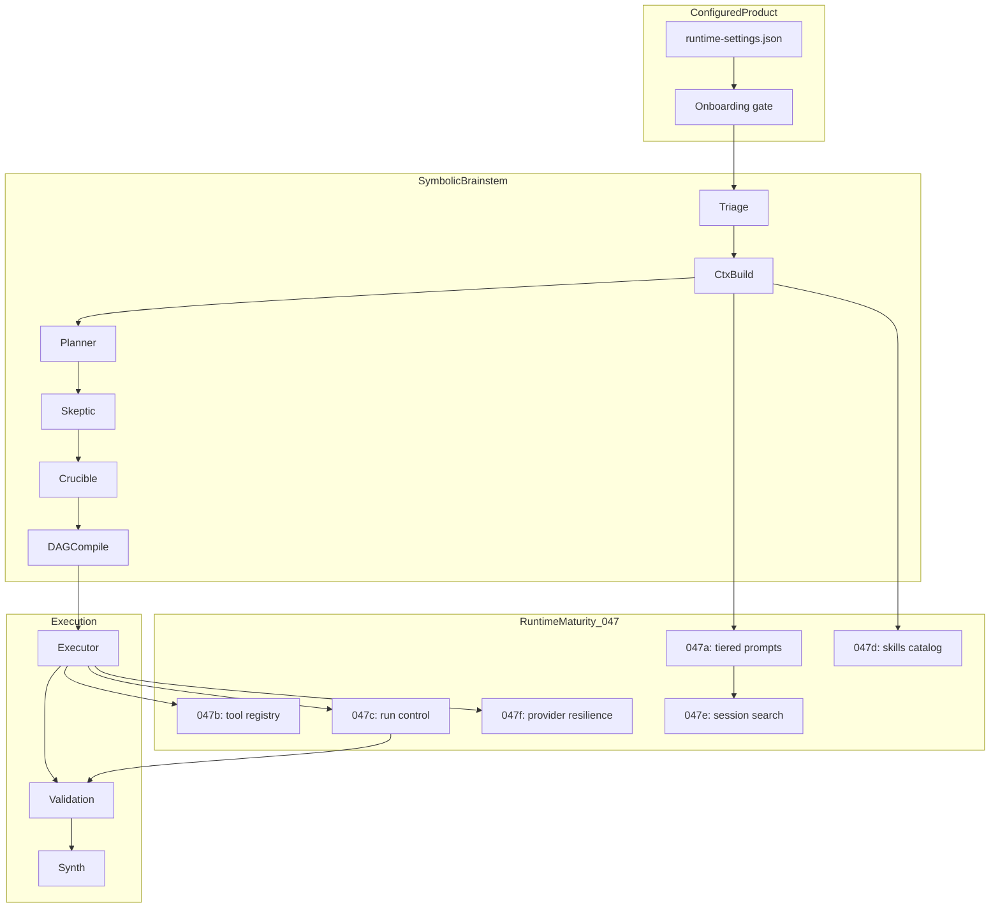
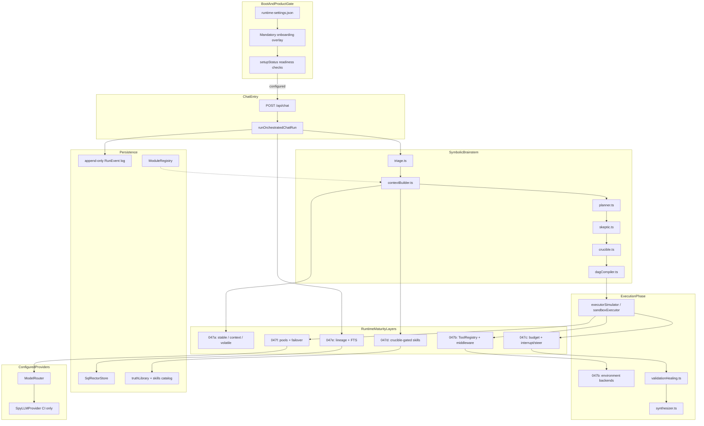

# Chunk 047 — Runtime Maturity Master Plan

> **Created:** 2026-06-12
> **Branch:** `rector-0.3.0-configured-product`
> **Depends on:** Chunk 042a (orchestration core hardening), Chunk 042b (orchestration execution hardening)
> **Goal:** Add production-grade operational seams around the symbolic brainstem — tiered prompts, tool registry, run control, procedural memory, session search, and provider resilience — without introducing a second orchestration loop.

## Why This Exists

Chunks 0–41 built the symbolic control plane (triage → crucible → DAG → executor). Chunks 042a/042b harden that pipeline. Chunk 047 closes operational gaps that block a credible configured product:

| Gap today | 047 chunk | User-visible outcome |
|-----------|-----------|----------------------|
| Context is a flat pack with one budget object | 047a | Stable system contract + compression lineage |
| Executor maps DAG nodes ad hoc | 047b | Registry + middleware + environment backends |
| Runs cannot be stopped mid-flight | 047c | Stop button + steer guidance |
| Truth library has no procedural skill folders | 047d | `.rector/skills/` catalog with governance |
| No conversation search | 047e | Sidebar FTS search + forked compression history |
| Provider failure ends the run | 047f | Fallback chains + credential pools |

## Architectural Constraint

Rector **keeps** `runOrchestratedChatRun` and the symbolic brainstem phase order. Chunk 047 adds **runtime maturity layers** at existing seams only. No reactive-only single-loop orchestration replaces triage/planner/crucible.



## Phase Table

| Phase | Chunk | Focus | Primary files | Est. commits |
|-------|-------|-------|---------------|--------------|
| 1 | [047a](./047a-tiered-prompt-assembly.md) | Tiered prompt assembly + compression lineage | `contextBuilder.ts`, `prompts.ts`, `schemas.ts` | 1 |
| 2 | [047d](./047d-procedural-memory-skills.md) | Procedural memory / skills catalog | `skillsCatalog.ts`, `truthLibrary.ts`, `crucible.ts` | 1 |
| 3 | [047b](./047b-tool-registry-executor.md) | Tool registry + executor middleware | `src/tools/*`, `sandboxExecutor.ts` | 1 |
| 4 | [047c](./047c-run-control-budget.md) | Interrupt, steer, iteration budget | `runStateMachine.ts`, `turnBudget.ts`, `operator.ts` | 1 |
| 5 | [047e](./047e-session-search-lineage.md) | Session FTS + conversation lineage | `sqlRectorStore.ts`, `sessionSearch.ts` | 1 |
| 6 | [047f](./047f-provider-resilience.md) | Credential pools + failover | `configBridge.ts`, `credentialPool.ts` | 1 |

Phases 1 and 2 may run in parallel after 042a. Phase 3 requires 042b. Phases 4–6 depend on prior 047 chunks as noted in each sub-plan.

## Target-State Architecture



## Explicitly Out of Scope (v0.3.0)

- Multi-platform messaging gateway or channel adapters
- Reactive-only single-loop orchestration replacing the brainstem
- Desktop/TUI/Electron native shells
- Bulk import of external skill libraries (schema + 2–3 bundled reference skills only)
- Implicit in-tool child-agent delegation (Rector uses DAG task decomposition)
- Scheduled autonomous cron runs
- Distributed FTS or multi-tenant session isolation beyond workspace scoping

## Global Design Principles

1. **Configured product only.** Features gate on `orchestrationProfile: configured` and readiness; no fake-chat bypass.
2. **Spy CI contract preserved.** `npm test` uses `SpyLLMProvider` and in-memory stores; zero real network.
3. **Symbolic phase order immutable.** TRIAGE → … → SYNTHESIZING unchanged; 047 hooks attach inside phases.
4. **Evidence and traceability.** Every new decision (compression fork, skill gate, failover, interrupt) emits a `RunEvent` with reason codes.
5. **Redaction at every boundary.** FTS index, steer messages, tool results, provider errors pass through `redactString` / `redactSecrets`.
6. **No env-var product configuration.** Runtime behavior reads UI-persisted settings (`runtime-settings.json`, assignment stores).

## Global Acceptance Gates

After each 047 sub-chunk:

```bash
npm test
npm run build
npm audit
```

Additional invariants:

- `runOrchestratedChatRun` remains the sole product chat entry (see `configured-product-architecture.md`)
- Local/spy runs remain deterministic where applicable
- `docs/plans/concerns-and-vulnerabilities.md` updated with new risks/limitations
- One commit per sub-chunk on `rector-0.3.0-configured-product`

## Suggested Commit Sequence

```text
docs: add chunk 047 runtime maturity master plan
feat(chunk-047a): tiered prompt assembly and compression lineage
feat(chunk-047d): procedural memory skills catalog
feat(chunk-047b): tool registry and executor middleware
feat(chunk-047c): run control interrupt steer and turn budget
feat(chunk-047e): session search and conversation lineage
feat(chunk-047f): provider resilience pools and failover
```

## Sub-Chunk Index

| Doc | Title |
|-----|-------|
| [047a-tiered-prompt-assembly.md](./047a-tiered-prompt-assembly.md) | Tiered prompt assembly & compression lineage |
| [047b-tool-registry-executor.md](./047b-tool-registry-executor.md) | Tool registry & executor middleware |
| [047c-run-control-budget.md](./047c-run-control-budget.md) | Run control: interrupt, steer & turn budget |
| [047d-procedural-memory-skills.md](./047d-procedural-memory-skills.md) | Procedural memory & skills catalog |
| [047e-session-search-lineage.md](./047e-session-search-lineage.md) | Session search & conversation lineage |
| [047f-provider-resilience.md](./047f-provider-resilience.md) | Provider resilience: pools & failover |