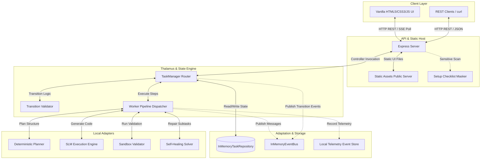
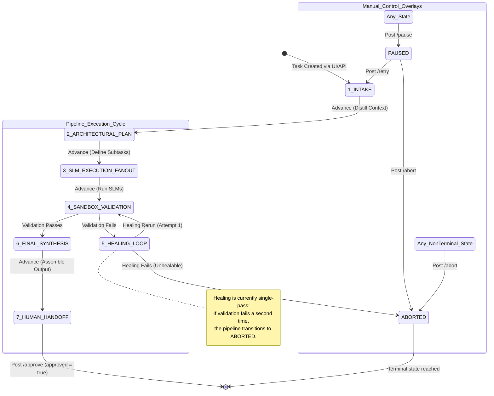
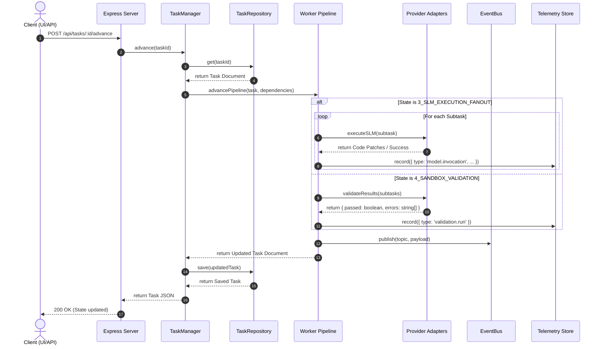
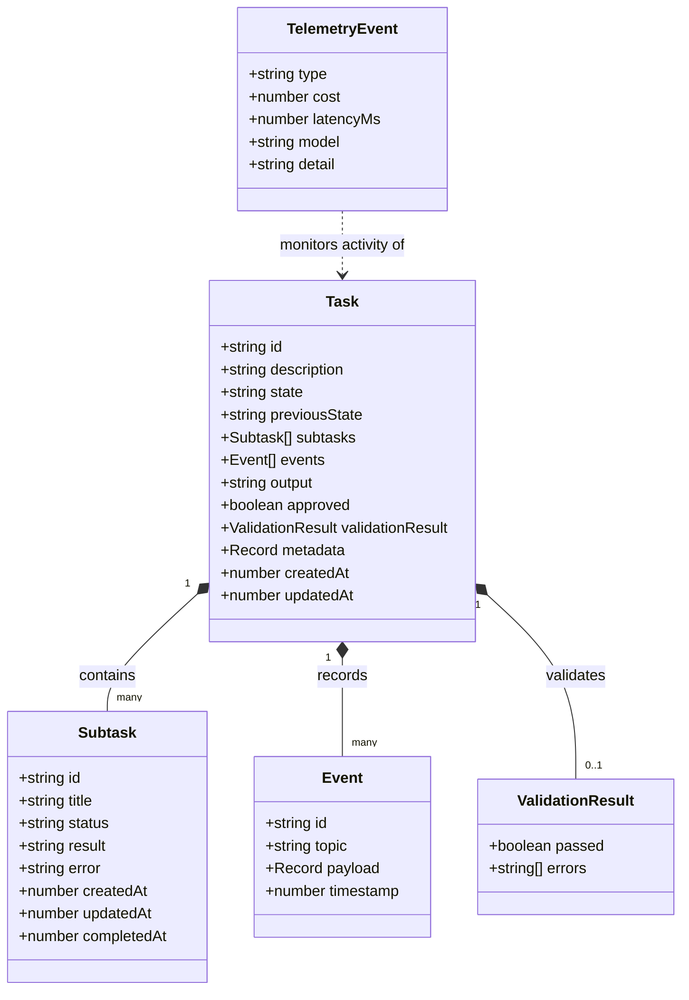
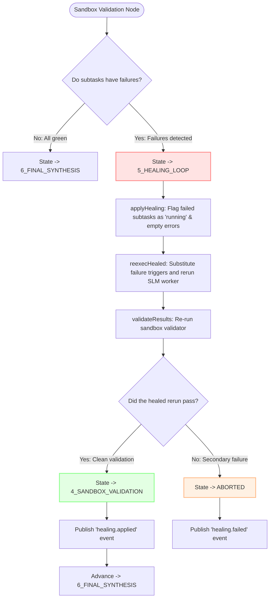

# Rector System Specification & Architectural Diagrams (Rector-Specs-1)

This document contains high-fidelity visual and technical specifications for the local-first **Rector** MVP. It outlines the overall system architecture, state transition lifecycle, operational event flows, data models, and the internal mechanics of the validation and self-healing subsystem.

---

## 1. High-Level System Architecture

The Rector MVP is a modular, single-node application written in Node.js/TypeScript. It decouples the core state machine orchestration (`TaskManager` / `Thalamus Router`) from external systems using clean provider boundaries.

---

## 2. Deterministic State Machine Transition Lifecycle

Rector coordinates all build loops using a strict, single-step deterministic state machine. Manual interventions can pause or abort running tasks, and paused tasks can be retried starting from the intake state.

---

## 3. Sequential Event & Pipeline Processing Loop

Every call to `/api/tasks/:id/advance` triggers an atomic, non-overlapping step forward. The diagram below illustrates the exact orchestration sequence between the client, router, workers, memory adapters, and event systems.

---

## 4. Logical Data Schemas & Model Relations

The task document contains nested subtask states and a complete appended array of transition and execution events. Local telemetry aggregates metrics separately.

---

## 5. Inner Mechanics of Validation & Healing

The healing subsystem acts as a localized feedback loop to automatically rectify test or compilation failures before final synthesis.

